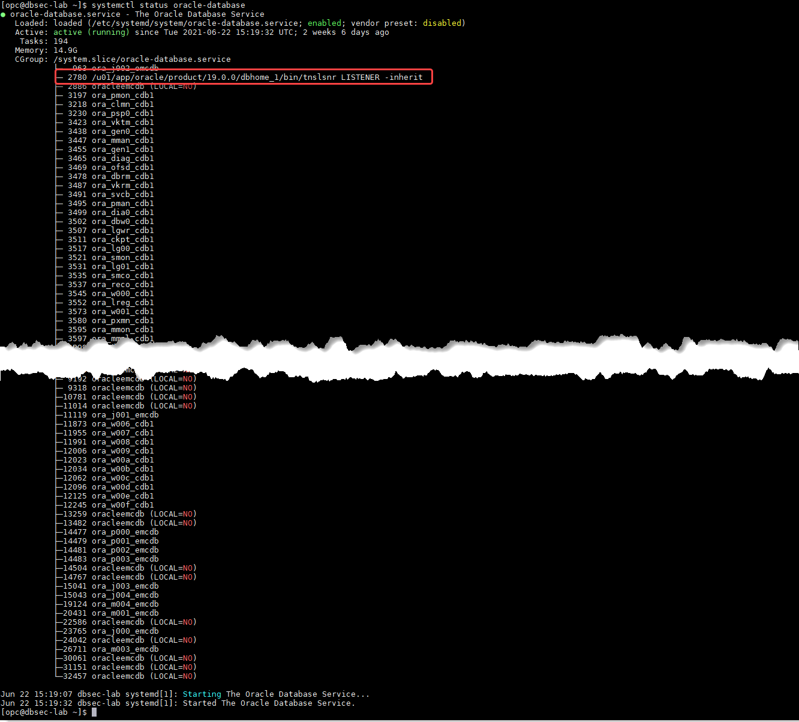
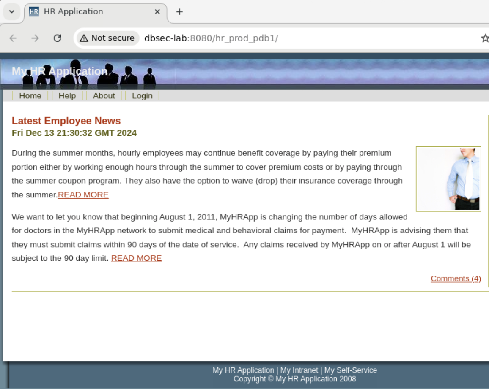

# Initialize Environment

## Introduction

In this lab we will review and startup all components required to successfully run this workshop.

Estimated Time: 10 minutes maximum.

### Objectives
- Initialize the workshop environment.

### Prerequisites
This lab assumes you have:
<if type="brown">
- A Free Tier, Paid or LiveLabs Oracle Cloud account
- You have completed:
    - Lab: Prepare Setup (*Free-tier* and *Paid Tenants* only)
    - Lab: Environment Setup
</if>
<if type="green">
- An Oracle Cloud account
- You have completed:
    - Introduction Tasks
</if>

## Task 1: Check that the databases are up and running

1. Now with access to your remote desktop session, proceed as indicated below to validate your environment before you start executing the subsequent labs. The following Processes should be up and running:

    - Database Listener
    - Database Servers (emcdb and cdb1)

2. Proceed as indicated below to validate the services

    <if type="brown">
    - Open a terminal session with your SSH client on **DBSec-Lab** VM as OS user *oracle*

        ````
        <copy>sudo su - oracle</copy>
        ````

        **Note**:
        - Only **if you are using a remote desktop session**, just double-click on the Terminal icon on the desktop to launch a session directly as oracle.
        - So, in that case **you don't need to execute this command**!
    </if>

    <if type="green">
    - Open a terminal session on **DBSec-Lab** VM as OS user *oracle*

        **Note**: Just double-click on the Terminal icon on the desktop to launch a session directly as oracle!
    </if>

    - Check the Database services status (All databases and Standard Listener)

        ```
        <copy>
        sudo systemctl status oracle-database
        </copy>
        ```

        

3. If you see questionable output(s), failure or down component(s), restart the corresponding service(s) accordingly

    - Database and Listener

        ```
        <copy>
        sudo systemctl restart oracle-database
        </copy>
        ```

 
## Task 2: Validate That Required Processes are Up and Running

1. Now with access to your remote desktop session, proceed as indicated below to validate your environment before you start executing the subsequent labs. The following Processes should be up and running:

    - My HR Applications on Glassfish

2. In the browser on the right-hand side, make you can load the following URL (*http://dbsec-lab:8080/hr_prod_pdb1* may already be open for you):
    
    ```
    HR Application URL: <copy>http://dbsec-lab:8080/hr_prod_pdb1</copy>
    ```

    


4. If you are still unable to get the link above to render successfully, open a terminal session and proceed as indicated below to validate the services.

    - Database services (All databases and Standard Listener)

        ```
        <copy>
        sudo systemctl status oracle-database
        </copy>
        ```

        

    - DBSec-lab Service (My HR Applications on Glassfish)

        ```
        <copy>
        sudo systemctl status oracle-dbsec-lab
        </copy>
        ```

        

5. If you see questionable output(s), failure or down component(s), restart the corresponding service(s) accordingly

    - Database and Listener

        ```
        <copy>
        sudo systemctl restart oracle-database
        </copy>
        ```

    - DBSec-lab Service

        ```
        <copy>
        sudo systemctl restart oracle-dbsec-lab
        </copy>
        ```

You may now **proceed to the next lab**.

<!--
Task 2 - Set Glassfish to use pdb1 database in the dbseclab VM

Here, we will modify the default Glassfish connection to target an Oracle Database 19c, so we can monitor, and block, SQL commands

1. Open a Terminal session on your **DBSec-Lab** VM as OS user *oracle*

    ```
    <copy>sudo su - oracle</copy>
    ```

    **Note**: If you are using a remote desktop session, double-click on the *Terminal* icon on the desktop to launch a session

2. Go to the scripts directory

    ```
    <copy>cd $DBSEC_LABS/sqlfw</copy>
    ```

3. Migrate the Glassfish Application connection string in order to target the 19c database

    ```
    <copy>./sqlfw_glassfish_stop_db23c.sh</copy>
    ```

    **Note**: Here, we connect Glassfish to the database **`PDB1`** on **`dbsec-lab`** VM

4. Next, verify the application functions as expected

    - Open a Web Browser at the URL *`http://dbsec-lab:8080/hr_prod_pdb1`* to access to **your Glassfish App**

        **Notes:** If you are not using the remote desktop you can also access this page by going to *`http://<YOUR_DBSEC-LAB_VM_PUBLIC_IP>:8080/hr_prod_pdb1`*
    
    - Login to the application as *`hradmin`* with the password "*`Oracle123`*"

        ```
        <copy>hradmin</copy>
        ```

        ```
        <copy>Oracle123</copy>
        ```

        

        

    - In the top right hand corner of the App, click on the **Welcome HR Administrator** link and you will be sent to a page with session data

        

    - On the **Session Details** screen, you will see how the application is connected to the database. This information is taken from the **userenv** namespace by executing the `SYS_CONTEXT` function.

        

    - Now, you should see **PDB1** as the **`DB_NAME`** and **dbsec-lab** as the **HOST**

You may now **proceed to the next lab**.

Appendix 1: Managing Startup Services

1. Database services (All databases and Standard Listener)

    - Start

    ```
    <copy>sudo systemctl start oracle-database</copy>
    ```
    - Stop

    ```
    <copy>sudo systemctl stop oracle-database</copy>
    ```

    - Status

    ```
    <copy>sudo systemctl status oracle-database</copy>
    ```

    - Restart

    ```
    <copy>sudo systemctl restart oracle-database</copy>
    ```

2. DBSec-lab Service (Enterprise Manager 13c and My HR Applications on Glassfish)

    - Start

    ```
    <copy>sudo systemctl start oracle-dbsec-lab</copy>
    ```

    - Stop

    ```
    <copy>sudo systemctl stop oracle-dbsec-lab</copy>
    ```

    - Status

    ```
    <copy>sudo systemctl status oracle-dbsec-lab</copy>
    ```

    - Restart

    ```
    <copy>sudo systemctl restart oracle-dbsec-lab</copy>
    ```
-->

## Appendix: External Web Access

If for any reason you want to login from a location that is external to your remote desktop session such as your workstation/laptop, then refer to the details below.

1. My HR Applications on Glassfish

    - PDB1
      - Prod        : `http://<YOUR_DBSECLAB-VM_PUBLIC-IP>:8080/hr_prod_pdb1`

## Acknowledgements
- **Author** - Rene Fontcha, LiveLabs Platform Lead, NA Technology
- **Contributors** - Marion Smith, Hakim Loumi, Ethan Shmargad
- **Last Updated By/Date** - Ethan Shmargad, Database Security PM - December 2024