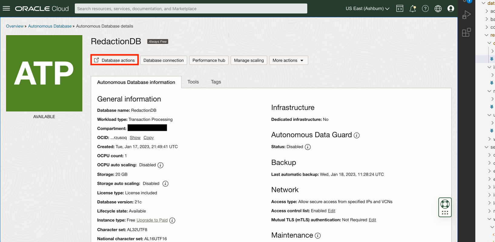
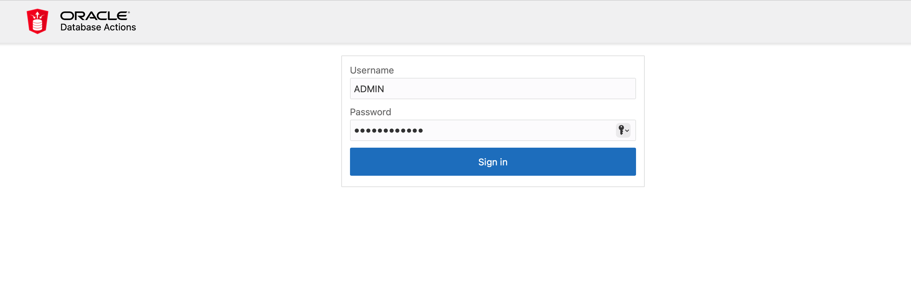
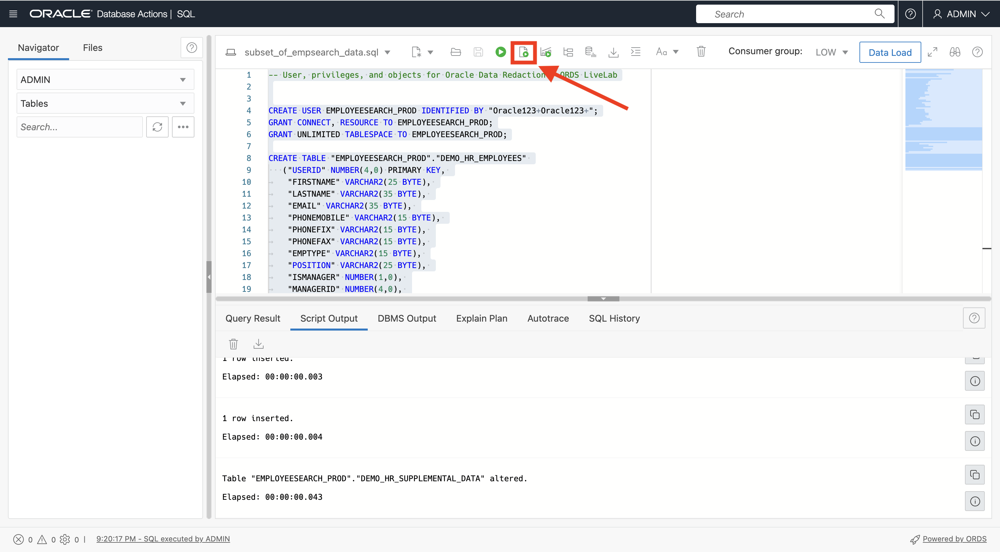
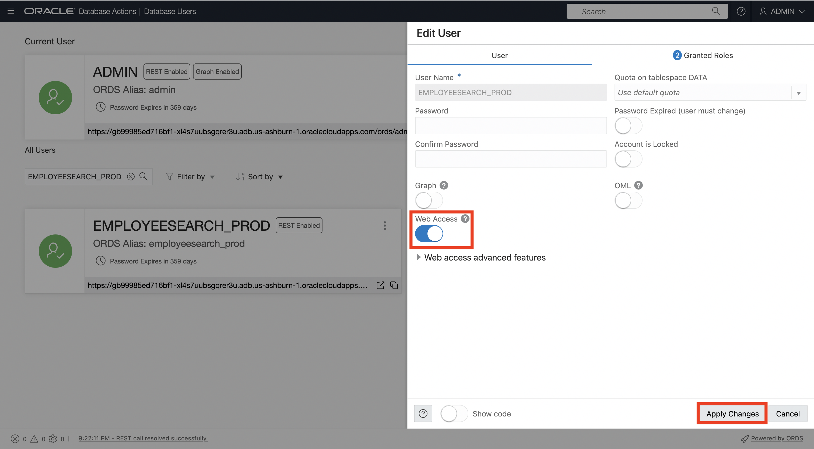
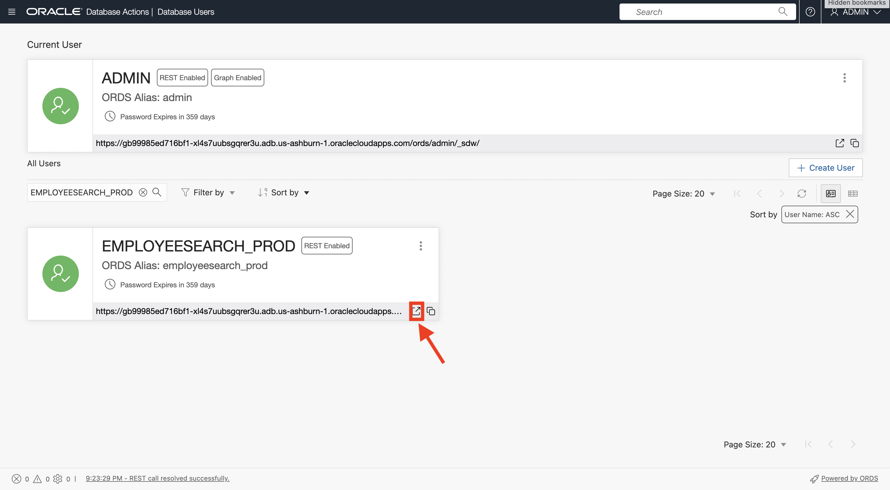

# Configure the Autonomous Database environment

## Introduction

In this lab, we will explore the Oracle Cloud Platform (OCI) and configure the Autonomous Transaction Processing database instance (ATP). After that, using the `employee_data_load.sql` script, we will create the `EMPLOYEESEARCH_PROD` user, then populate that database schema with HR employee data using **Oracle Database Actions**.

For more information on the Autonomous Transaction Processing database click [here](https://www.oracle.com/autonomous-database/autonomous-transaction-processing/).

For more information on the OCI Database Actions click [here](https://www.oracle.com/database/sqldeveloper/technologies/db-actions/).

Estimated Time: 10 minutes

### Objectives

In this lab, you will complete the following tasks:

- Create an ATP database instance.
- Use the `employee_data_load.sql` script to create the `EMPLOYEESEARCH_PROD` user and upload data.

### Prerequisites

This lab assumes you have:
- Oracle Cloud Infrastructure (OCI) tenancy account

## Task 1: Create an ATP database instance.

1. With OCI open, navigate to the ATP portal by selecting the hamburger menu in the top left corner, which will allow for you to select **Oracle Database** and then, **Autonomous Transaction Processing.**

     

2. Select **Create Autonomous Database.**

     

3. Use a compartment of your choice and enter a display name and database name of **RedactionDB**.  

     

4. Create a password for the **ADMIN** credentials.

     

5. Change network access to **allowed IPs and VCNs only** and change IP notation type to **CIDR Block. Input the CIDR value of 0.0.0.0/0 into the blank field.** Make sure that the option for **requiring mutual TLS (mTLS) authentication remains unchecked**.

     

6. Select the licensing option of your choosing, then select **Create Autonomous Database** at the bottom.

    

    *Note: Spinning up the ADB can take a couple of minutes.*

## Task 2: Use the `employee_data_load.sql` script to create the `EMPLOYEESEARCH_PROD` user and upload data.

1. Once the Autonomous Database is green and available, navigate to top menu bar of the Autonomous Database dashboard and select **Database Actions**.

    

2. Login to **Database Actions** using the **ADMIN** credentials you created.

    

3. Under the **Development** section, select **SQL**.

    

4. Use the following URL to download and save the `employee_data_load.sql` script:

    ```
    <copy>https://objectstorage.us-ashburn-1.oraclecloud.com/p/VEKec7t0mGwBkJX92Jn0nMptuXIlEpJ5XJA-A6C9PymRgY2LhKbjWqHeB5rVBbaV/n/c4u04/b/livelabsfiles/o/data-management-library-files/employee_data_load.sql</copy>   
    ```

5. At the top of the menu bar, select the folder icon to open a file.

    

6. Select **Open file** and upload the `employee_data_load.sql` script

    

7. Once the script is loaded into the **SQL worksheet**, select the script icon to run the SQL script. Check the script output at the bottom to make sure no errors were received.

    

8. Return back to the **Database Actions** main dashboard by selecting the **Oracle** logo at the top left of the screen

    

9. Scroll down. Under **Administration**, select **DATABASE USERS**.

    

10. Under the user `EMPLOYEESEARCH_PROD`, select the elipsis then click **Edit User**.

    

11. Under **User**, make sure **Web Access** is toggled **on** the select **Apply Changes** on the bottom right of the pop-up menu.

    

12. Open the **Database Actions** portal for `EMPLOYEESEARCH_PROD`.

    

13. Login into **Database Actions** as `EMPLOYEESEARCH_PROD` using the following credentials:

    ```
    Username:<copy>EMPLOYEESEARCH_PROD</copy>   
    ```

    ```
    Password:<copy>Oracle123+Oracle123+</copy>
    ```

You may now **proceed to the next lab.**

## Acknowledgements

- **Authors** - Alpha Diallo & Ethan Shmargad, North America Specialists Hub
- **Creator** - Pedro Lopes, Database Security Product Manager
- **Last Updated By/Date** - Alpha Diallo & Ethan Shmargad, January 2023