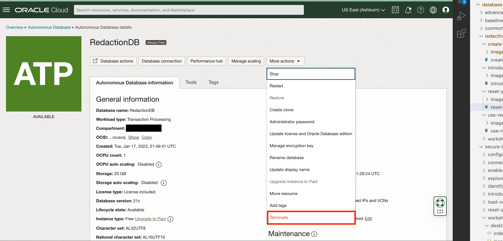

# Reset your environment

## Introduction

In this lab, we will show you how to teardown your Autonomous Database instance. This will reset your environment to as it was before.

Estimated Time: 2 minutes

### Objectives

In this lab, you will complete the following tasks:

- Terminate the Autonomous Database instance.

### Prerequisites

This lab assumes you have:
- An Oracle Cloud Infrastructure (OCI) tenancy account
- Completed all the previous labs in the **Redacting restcalls with ORDS** LiveLab workshop

*Warning: Terminating resources may take a few minutes*

## Task 1: Terminate the Autonomous Database instance

1. Navigate back to your **Autonomous Database** instance page on OCI.

    

2. At the top menu bar, under **More Actions**, select **Terminate**.

    

3. In the pop-up window, type in the name of your database, then select **Terminate Autonomous Database**.

    

## Acknowledgements

- **Authors** - Alpha Diallo & Ethan Shmargad, North America Specialists Hub
- **Creator** - Pedro Lopes, Database Security Product Manager
- **Last Updated By/Date** - Alpha Diallo & Ethan Shmargad, January 2023