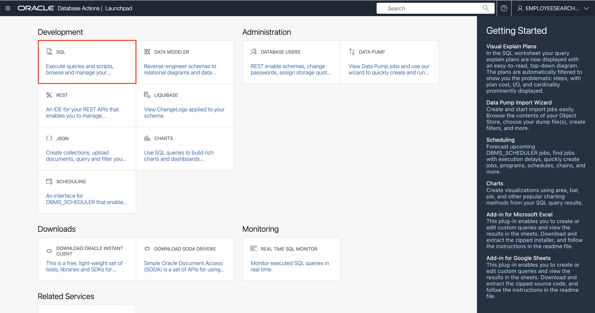
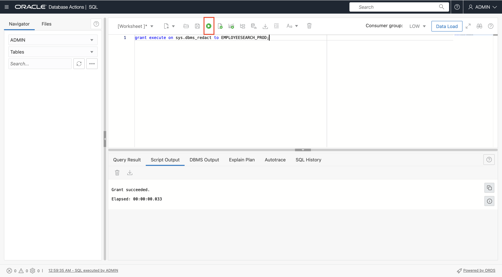
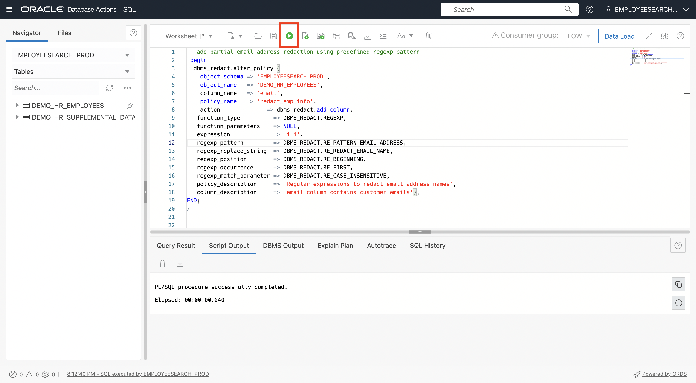
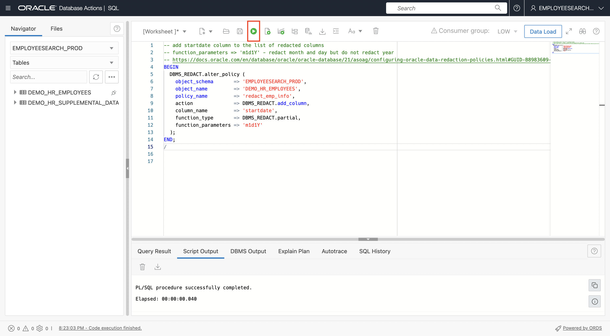
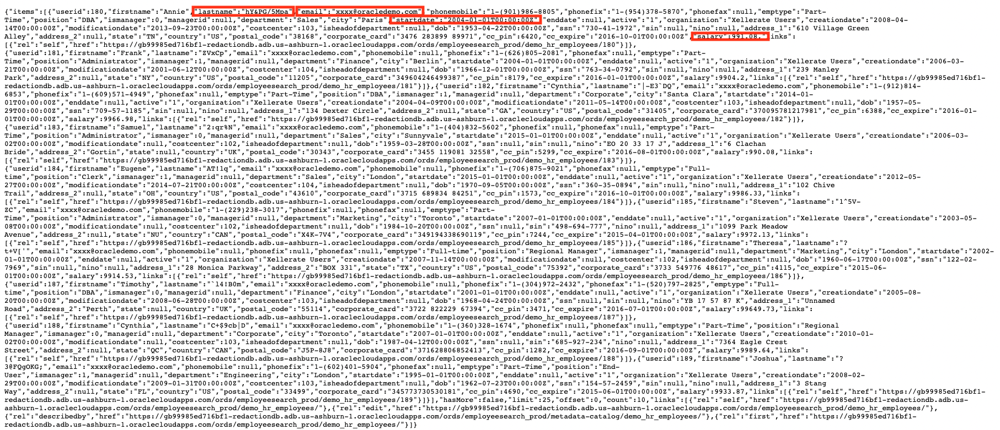

# Use Redaction to Anonymize All REST calls and Queries

## Introduction

In this lab, we will demonstrate an application of Oracle Data Redaction using REST Get Calls to view Employee table data before and after applying a redaction policy.

Estimated Time: 15 minutes

### Objectives

In this lab, you will complete the following tasks:

- REST enable the table.
- Apply the Data Redaction Policy to the Table.
- See data come redacted from the REST Get call.

### Prerequisites

This lab assumes you have:
- An Oracle Cloud Infrastructure (OCI) tenancy account
- Completed all the previous labs in the **Redacting restcalls with ORDS** LiveLab workshop

*Warning: Terminating resources may take a few minutes*

## Task 1: REST enable the table

1. From the Database Actions Launchpad for `EMPLOYEESEARCH_PROD` navigate to **SQL** under the **Development section**.

     

2. **REST enabling the table** is simple. To do this, find the table we just created named `DEMO_HR_EMPLOYEES` in the **navigator** on the left of the **SQL Worksheet**. Right click on the table name and select **REST** in the pop up menu then Enable.

    

3. The **REST Enable Object slider** will appear from the right side of the page. We are going to use the defaults for this page but take note and **copy** the Preview URL to a clipboard of your choice. This is the URL we will use to **access the REST enabled table**. This process will also enable ORDS for the table, select the show code option to view the code for this action.

    

When ready, click the **Enable button** in the lower right of the slider.
*Warning: Do not enable Require Authentication. This will require that users go through an additional authentication process.*

3. That's it! Your table is **REST enabled**. Open a new browser window or tab and enter **URL** that was copied in the previous step.


    

## Task 2: Apply the Data Redaction policy to the table

1. Navigate back to the **Database Actions** SQL Development page for `ADMIN`. Grant access for `EMPLOYEESEARCH_PROD` to the `DBMS_REDACT` package by pasting the text below in the worksheet.

    ```
    <copy>grant execute on sys.dbms_redact to EMPLOYEESEARCH_PROD</copy>   
    ```

    

2. Return to the **Database Actions** SQL Development page for `EMPLOYEESEARCH_PROD` and run the **first query**. View the unredacted results under query results at the **bottom of the page**.
    
    ```
    <copy>SELECT
        USERID,
        FIRSTNAME,   
        LASTNAME,  --redact
        EMAIL, --redact
        PHONEMOBILE,
        STARTDATE, --redact
        SALARY, --redact
        MANAGERID,
        DEPARTMENT
    FROM
        DEMO_HR_EMPLOYEES;</copy>   
    ```

    
    
    Also review the table data in our browser window from the previous task.

    This is how our data looks before any redaction policy is applied.

3. Add a **redaction policy** to run last name with random chars.
    
    ```
    <copy>begin
            dbms_redact.add_policy(
                object_schema => 'EMPLOYEESEARCH_PROD',
                object_name   => 'demo_hr_employees',
                column_name   => 'lastname',
                policy_name   => 'redact_emp_info',
                function_type => dbms_redact.random,
                expression    => '1=1'
            );
    end;
    /</copy>   
    ```
    

4. Add an **email column** to the redaction policy and redact it using default **regex patterns** that anonymize it with `X`

    ```
    <copy>begin
            dbms_redact.alter_policy (
            object_schema => 'EMPLOYEESEARCH_PROD',
            object_name   => 'DEMO_HR_EMPLOYEES',
            column_name   => 'email',
            policy_name   => 'redact_emp_info',
            action              => dbms_redact.add_column,
            function_type          => DBMS_REDACT.REGEXP,
            function_parameters    => NULL,
            expression             => '1=1',
            regexp_pattern         => DBMS_REDACT.RE_PATTERN_EMAIL_ADDRESS,
            regexp_replace_string  => DBMS_REDACT.RE_REDACT_EMAIL_NAME,
            regexp_position        => DBMS_REDACT.RE_BEGINNING,
            regexp_occurrence      => DBMS_REDACT.RE_FIRST,
            regexp_match_parameter => DBMS_REDACT.RE_CASE_INSENSITIVE,
            policy_description     => 'Regular expressions to redact email address names',
            column_description     => 'email column contains customer emails');
        END;
    /</copy>   
    ```
    

5. Add the **start date column** to the redaction policy, redacting the day and month.
    
    ```
    <copy>BEGIN
            DBMS_REDACT.alter_policy (
            object_schema       => 'EMPLOYEESEARCH_PROD',
            object_name         => 'DEMO_HR_EMPLOYEES',
            policy_name         => 'redact_emp_info',
            action              => DBMS_REDACT.add_column,
            column_name         => 'startdate',
            function_type       => DBMS_REDACT.partial,
            function_parameters => 'm1d1Y'
            );
        END;
    /</copy>   
    ```
    

6. Add the **Salary column** to the redaction policy and redact the first two digits making it 99.
    
    ```
    <copy>BEGIN
            DBMS_REDACT.alter_policy (
            object_schema          => 'EMPLOYEESEARCH_PROD', 
            object_name            => 'DEMO_HR_EMPLOYEES', 
            column_name            => 'salary',
            column_description     => 'holds employee salaries',
            policy_name            => 'redact_emp_info', 
            policy_description     => 'Partially redacts the salary column',
            function_type          => DBMS_REDACT.PARTIAL,
            function_parameters    => '9,1,2',
            expression             => '1=1');
        END;
    /</copy>   
    ```
    

## Task 3: See the data come redacted from the REST Get call

1. View the changes to the table by **reloading the browser** window.
    
    

2. Run the **first query from the previous task** and view the redacted data at the **bottom of the page**.
    
    

Congratulations, You have successfully redacted REST calls using ORDS!

## Acknowledgements

- **Authors** - Alpha Diallo & Ethan Shmargad, North America Specialists Hub
- **Creator** - Pedro Lopes, Database Security Product Manager
- **Last Updated By/Date** - Alpha Diallo & Ethan Shmargad, February 2023
