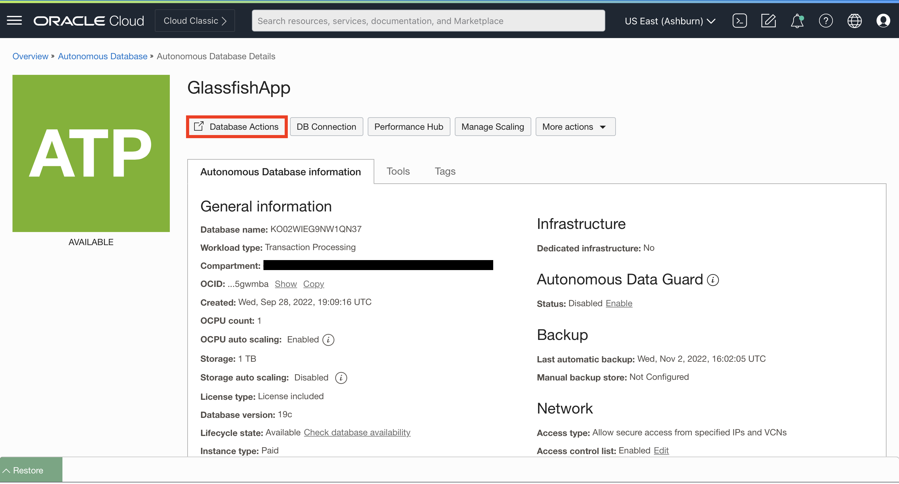
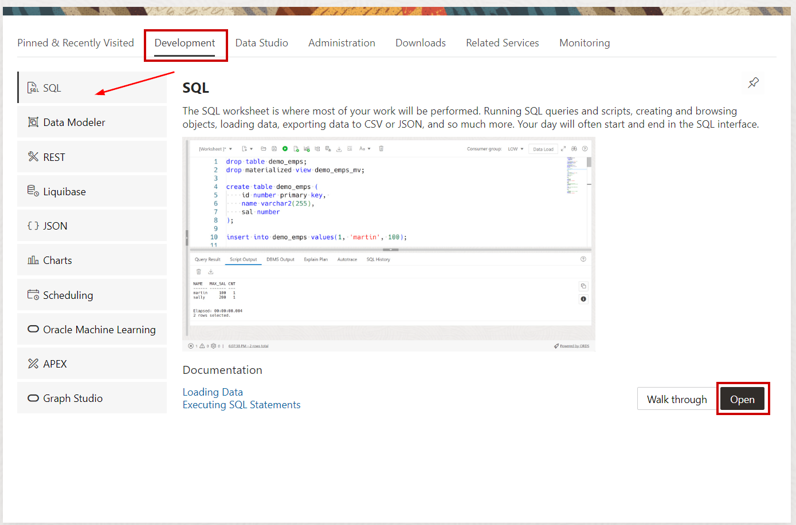
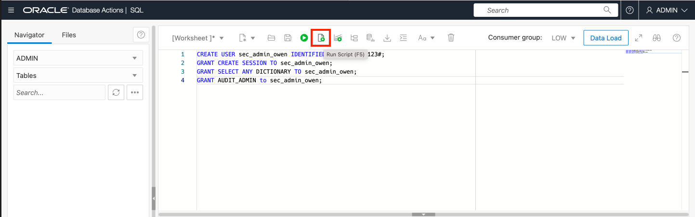
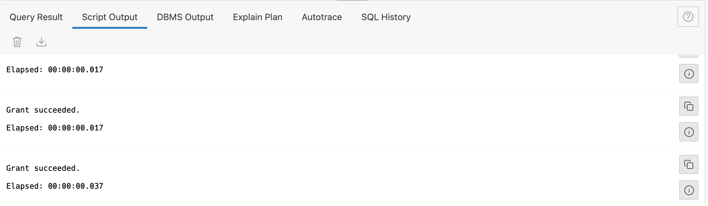
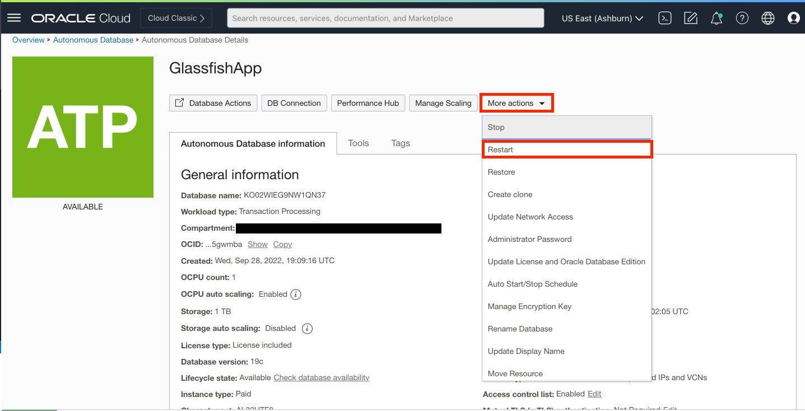

# Enable Database Vault and verify the HR application

## Introduction

In this lab, we will enable Database Vault on our ATP instance and reboot the ATP instance to reflect that change. Then, we will take another look at the Glassfish application and verify everything is still working accoridngly.


### Objectives

In this lab, you will complete the following tasks:

- Enable Database Vault on the ATP instance **(reboot required)**.
- Verify that the HR application still functions.
  
### Prerequisites

This lab assumes you have:
- Oracle Cloud Infrastructure (OCI) tenancy account
- Completion of the following previous labs: Configure the Autonomous Database instance, Connect to the legacy Glassfish HR application, Load and verify the data in the Glassfish application

## Task 1: Enable Database Vault on the ATP instance

1. Minimize your Cloud Shell console. Using the hamburger menu at the top right, navigate to **Oracle Database>Autonomous Database**. Within the correct compartment, Select the ATP instance you created for the Glassfish application.

2. Select **Database Actions**.

   

3. Login to Database Actions using the **ADMIN** credentials you created when provisioning the ATP Instance.

   

4. Under the **Development** section, select **SQL**.

   

5. Under the **ADMIN** schema, copy and paste the following commands to create the **Database Vault owner**. Select the button **Run Script** to execute the statements. Check the **Script output** at the bottom of the page to make sure the statements executed successfully.

   ```
   <copy>
   CREATE USER sec_admin_owen IDENTIFIED BY WElcome_123#;
   GRANT CREATE SESSION TO sec_admin_owen;
   GRANT SELECT ANY DICTIONARY TO sec_admin_owen;
   GRANT AUDIT_ADMIN to sec_admin_owen;
   </copy>
   ```

   

   

6. Clear your worksheet. Under the **ADMIN** schema, copy and paste the following commands to create the **Database Vault Account Manager**. Select the button **Run Script** to execute the statements. Check the **Script output** at the bottom of the page to make sure the statements executed successfully.

   ```
   <copy>CREATE USER accts_admin_ace IDENTIFIED BY WElcome_123#;
   GRANT CREATE SESSION TO accts_admin_ace;
   GRANT AUDIT_ADMIN to accts_admin_ace;</copy>
   ```
7. Clear your worksheet. Under the **ADMIN** schema, copy and paste the following commands to create the DBA user, `dba_debra`. Select the button **Run Script** to execute the statements. Check the **Script output** at the bottom of the page to make sure the statements executed successfully.

   ```
   <copy>
   CREATE USER dba_debra IDENTIFIED by WElcome_123#;
   GRANT PDB_DBA to dba_debra;
   BEGIN
      ORDS_ADMIN.ENABLE_SCHEMA(p_enabled => TRUE, p_schema => UPPER('dba_debra'), p_url_mapping_type => 'BASE_PATH', p_url_mapping_pattern => LOWER('dba_debra'), p_auto_rest_auth => TRUE);
   END;
   /
   </copy>
   ```

8. Enable **SQL Worksheet** privileges for the users that were just created. Clear your worksheet after executing each of the following commands and check to make sure the statements were executed properly.

   ```
   <copy>
   BEGIN
      ORDS_ADMIN.ENABLE_SCHEMA(p_enabled => TRUE, p_schema => UPPER('sec_admin_owen'), p_url_mapping_type => 'BASE_PATH', p_url_mapping_pattern => LOWER('sec_admin_owen'), p_auto_rest_auth => TRUE);
      ORDS_ADMIN.ENABLE_SCHEMA(p_enabled => TRUE, p_schema => UPPER('accts_admin_ace'), p_url_mapping_type => 'BASE_PATH', p_url_mapping_pattern => LOWER('accts_admin_ace'), p_auto_rest_auth => TRUE);
      ORDS_ADMIN.ENABLE_SCHEMA(p_enabled => TRUE, p_schema => UPPER('employeesearch_prod'), p_url_mapping_type => 'BASE_PATH', p_url_mapping_pattern => LOWER('employeesearch_prod'), p_auto_rest_auth => TRUE)
   END;
   /
   </copy>
   ```

9. Clear your worksheet. Now you will execute the configure and enable procedures for Oracle Database Vault. This steps adds DV-related roles to your database, grants sec_admin_owen the DV_OWNER role, and grants accts_admin_ace the DV_ACCTMGR role.  For more information on the changes Database Vault configuration and enablement makes to your ADB instance, please see visit the **Learn more** section at the bottom of this lab.

   ```
   <copy>EXEC DBMS_CLOUD_MACADM.CONFIGURE_DATABASE_VAULT('sec_admin_owen', 'accts_admin_ace');</copy>
   ```

   ```
   <copy>EXEC DBMS_CLOUD_MACADM.ENABLE_DATABASE_VAULT;</copy>
   ```

10. Check to make sure Database Vault configure status is **true but not enabled** by querying the `DBA_DV_STATUS` table. Make sure your worksheet is clear, then copy and paste the following query into the worksheet. Run the command and make sure you received an appropriate output.

   ```
   <copy>SELECT * FROM DBA_DV_STATUS;</copy>
   ```

11. Navigate back to the **Autonomous Database Details** page. Under **More actions**, select **Restart** (This may take a few minutes).

   

12. Navigate back to the **Database Actions SQL Worksheet** and refresh the page. Make sure your worksheet is clear and copy/paste the query below. Check your script output to make sure that both `DV_CONFIGURE_STATUS` and `DV_ENABLE_STATUS` are now **TRUE**.

   ```
   <copy>SELECT * FROM DBA_DV_STATUS;</copy>
   ```

## Task 2: Verify that the HR application still functions

1. Using your web browser, navigate back to the Glassfish App and refresh **both the production and development pages** to verify it functions without issue. 

   

   


You may now **proceed to the next lab.**

## Learn more
- [Oracle Database Vault Landing Page](https://www.oracle.com/security/database-security/database-vault/)
- [Use Oracle Database Vault with Autonomous Database](https://docs.oracle.com/en/cloud/paas/autonomous-database/adbsa/autonomous-database-vault.html)

## Acknowledgements

- **Author**- Ethan Shmargad, North America Specialists Hub
- **Creator**- Richard Evans, Senior Principle Product Manager
- **Last Updated By/Date** - Ethan Shmargad, September 2022
