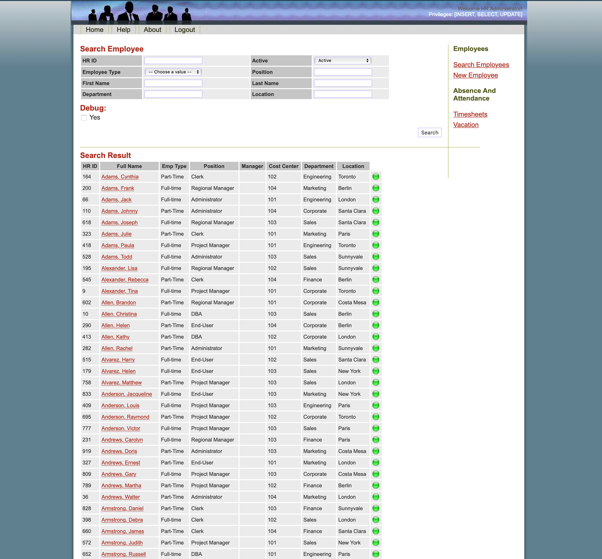
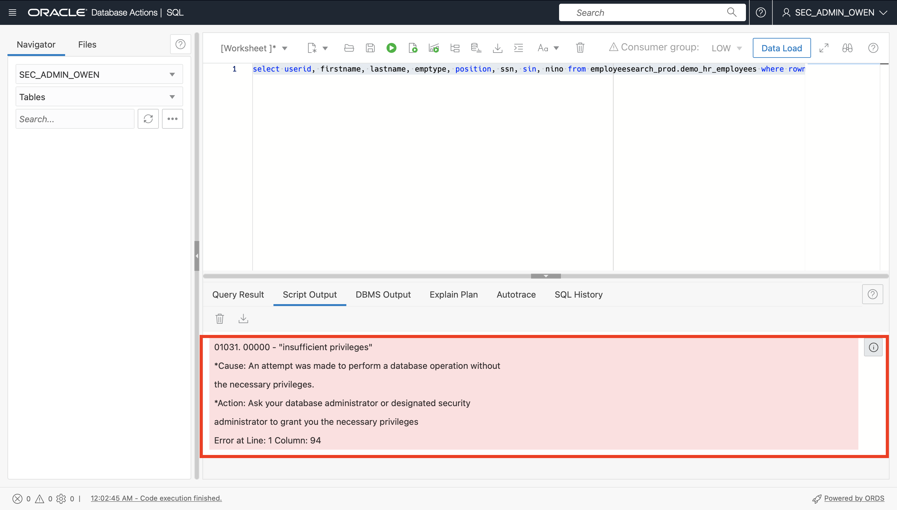

# Explore the Glassfish HR application functions with Database Vault enabled 

## Introduction

In this lab, we will now flip our Database Vault Realm from **simulation** to **enforcement** mode. This will commit our realm into production. Then, we will put our realm to the test and demonstrate the inability to query the application data under a particular user.

### Objectives

In this lab, you will complete the following tasks:

- Explore the production HR application before enforcing Database Vault
- Flip the Database Vault realm from **simulation** to **enforcement** mode
- Demonstrate the inability to view data on the HR application and query the data in `EMPLOYEESEARCH_PROD` through Database Actions.

### Prerequisites

This lab assumes you have:
- Oracle Cloud Infrastructure (OCI) Tenancy Account
- Completion of the following previous labs: Configure the Autonomous Database instance, Connect to the Glassfish legacy HR application, Load and verify the data in the Glassfish application, Enable Database Vault and verify the HR application, Identify the connections to the EMPLOYEESEARCH_PROD schema

## Task 1: Explore the production HR application before enforcing Database Vault

1. Navigate back to the **production** HR application environment and sign back in if you are logged out. Locate the **Search Employees Option** and under **Active** drop down menu, select **Active** then **Search**.

	

    

    


Notice that the data is viewable and accessible. Next, we will switch the Database Vault realm from **simulation** to **enforcement** mode and restrict that data from being queried or viewed in the application.

## Task 2: Flip the Database Vault realm from simulation to enforcement mode

1. Navigate back to the **DBA Actions** page. Under the menu bar for `DBA_DEBRA` at the top right select **Sign out**. Sign back into Database Actions under the user `sec_admin_owen` and select **SQL** under **Development**. Make sure the worksheet is clear and your schema is updated to `SEC_ADMIN_OWEN*`.

2. Copy and paste the following script to switch the Database Vault realm from **simulation** to **enforcement** mode. Run the script and check the output to see that the procedure was completed successfully.

	```
	<copy>BEGIN
		DVSYS.DBMS_MACADM.UPDATE_REALM(
			realm_name => 'PROTECT_MYHRAPP'
			,description => 'A mandatory realm, in simulation mode, to show how EMPLOYEESEARCH_PROD would be protected'
			,enabled => DBMS_MACUTL.G_YES
			,audit_options => DBMS_MACUTL.G_REALM_AUDIT_FAIL
			,realm_type => 1); 
	END;
	/</copy>
	```

	

*Note*: It may take a few minutes for the update to take into effect.

## Task 3: Demonstrate the inability to view data on the HR application and query the data in `EMPLOYEESEARCH_PROD` through Database Actions.

1. Navigate back to the **production** HR application. Under **Search Employees**, select **Search** again and check the results.

	

Notice how the application was locked out of the `EMPLOYEESEARCH_PROD` schema due to insufficient priveledges, and as a result, the employee data is no longer accessible.

2. Navigate back to **Database Actions** and clear the SQL worksheet. Cope and paste the following query into the work sheet and run the script.

	```
	<copy>select userid, firstname, lastname, emptype, position, ssn, sin, nino from employeesearch_prod.demo_hr_employees where rownum < 10;</copy>
	```

	

Notice how `sec_admin_owen` is no longer able to query data in the `EMPLOYEESEARCH_PROD` schema. We have now succesfully moved and secured our legacy application in Oracle Cloud!

You may now **proceed to the next lab.**

## Acknowledgements

- **Author**- Ethan Shmargad, North America Specialists Hub
- **Creator**- Richard Evans, Senior Principle Product Manager
- **Last Updated By/Date** - Ethan Shmargad, September 2022
