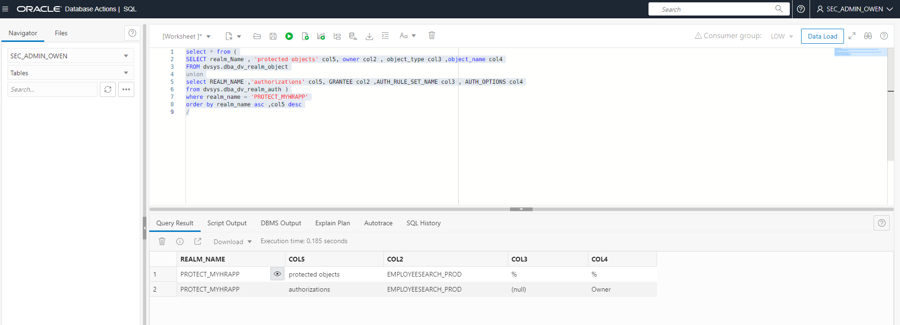
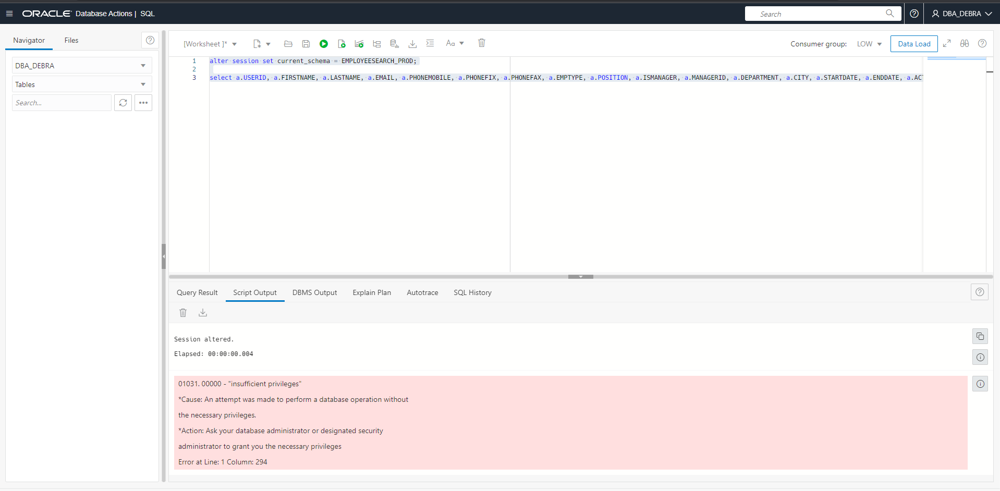
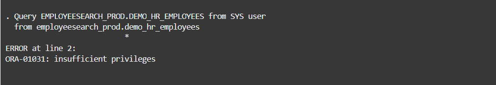
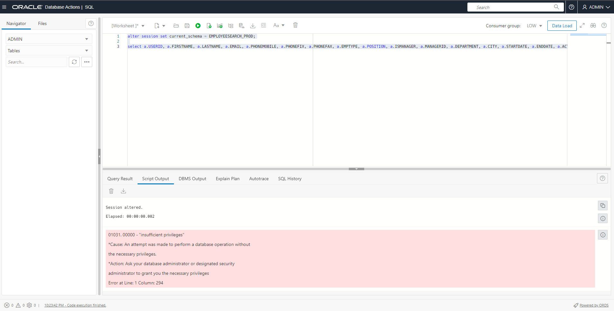

# Explore the Glassfish HR application functions with Database Vault enabled 

## Introduction

In this lab, we will now flip our Database Vault Realm from **simulation** to **enforcement** mode. This will commit our realm into production. Then, we will put our realm to the test and demonstrate the inability to query the application data under a particular user.

### Objectives

In this lab, you will complete the following tasks:

- Flip the Database Vault realm from **simulation** to **enforcement** mode
- Demonstrate the inability to query the data in `EMPLOYEESEARCH_PROD` with DBA_DEBRA and ADMIN.

### Prerequisites

This lab assumes you have:
- Oracle Cloud Infrastructure (OCI) tenancy account
- Completion of the following previous labs: Configure the Autonomous Database instance, Connect to the Glassfish legacy HR application, Load and verify the data in the Glassfish application, Enable Database Vault and verify the HR application, Identify the connections to the EMPLOYEESEARCH_PROD schema

## Task 1: Flip the Database Vault realm from simulation to enforcement mode

1. Within **Database Actions** as **sec_admin_owen**, run the following query the `dvsys.dba_dv_realm_auth` table. 

	```
	<copy>select * from (
	SELECT realm_Name , 'protected objects' col5, owner col2 , object_type col3 object_name col4
	FROM dvsys.dba_dv_realm_object
	union
	select REALM_NAME ,'authorizations' col5, GRANTEE col2 ,AUTH_RULE_SET_NAME col3 , AUTH_OPTIONS col4 from dvsys.dba_dv_realm_auth )
	where realm_name = 'PROTECT_MYHRAPP'
	order by realm_name asc ,col5 desc
	/</copy>
	```

	

	This shows a final verification that the realm is protecting `EMPLOYEESEARCH_PROD` and that `EMPLOYEESEARCH_PROD` is authorized as the **realm owner** without any rule sets (null).

2. As **sec_admin_owen**, copy and paste the following command to switch the Database Vault realm from **simulation** to **enforcement** mode. Check the output to see that the procedure was completed successfully.

	```
	<copy>BEGIN
		DVSYS.DBMS_MACADM.UPDATE_REALM(
			realm_name => 'PROTECT_MYHRAPP'
			,description => 'A mandatory realm, in simulation mode, to show how EMPLOYEESEARCH_PROD would be protected'
			,enabled => DBMS_MACUTL.G_YES
			,audit_options => DBMS_MACUTL.G_REALM_AUDIT_FAIL
			,realm_type => 1); 
	END;
	/</copy>
	```

	

*Note*: It may take a few minutes for the update to take into effect.

## Task 2: Demonstrate the inability to query the data in `EMPLOYEESEARCH_PROD` with DBA_DEBRA and ADMIN.

1. Log out of database actions and log back in as **DBA_DEBRA**. Copy and paste the following commands to query objects in `EMPLOYEESEARCH_PROD`.

	```
	<copy>alter session set current_schema = EMPLOYEESEARCH_PROD;</copy>
	```

	```
	<copy>select a.USERID, a.FIRSTNAME, a.LASTNAME, a.EMAIL, a.PHONEMOBILE, a.PHONEFIX, a.PHONEFAX, a.EMPTYPE, a.POSITION, a.ISMANAGER, a.MANAGERID, a.DEPARTMENT, a.CITY, a.STARTDATE, a.ENDDATE, a.ACTIVE, a.COSTCENTER, b.FIRSTNAME as MGR_FIRSTNAME, b.LASTNAME as MGR_LASTNAME, b.USERID as MGR_USERID from DEMO_HR_EMPLOYEES a left outer join DEMO_HR_EMPLOYEES b on a.MANAGERID = b.USERID where 1=1 order by a.LASTNAME, a.FIRSTNAME</copy>
	```

	

	Notice how now **DBA_DEBRA** no longer has authorization to query database objects protected by the realm and owned by `EMPLOYEESEARCH_PROD`.

2. Open up Cloud Shell. Use te following commands to run the `dv_query_employee_search.sh` script as **ADMIN**.

	*Note: If you have been logged out of your Glassfish instance due to inactivity, use the following command to log back in. Public IP address can be found on the instance details dashboard on Oracle Cloud:*

	```
	<copy>chmod 600 myhrappkey</copy>
	```

	```
    <copy>ssh -i myhrappkey opc@<PASTE INSTANCE PUBLIC IP ADDRESS HERE></copy>
    ```

	*Here are the commands for running dv_query_employee_search.sh:*

	```
	<copy>cd lab_02</copy>
	```

	```
	<copy>./dv_query_employee_search.sh</copy>
	```

	

	Notice how **ADMIN** also now no longer has authorization to query database objects protected by the realm and owned by `EMPLOYEESEARCH_PROD`.

3. Minimize Cloud Shell. Locate **Database Actions** and log out of **DBA_DEBRA**. Log back in as **ADMIN**, then copy and paste the following commands to query objects in `EMPLOYEESEARCH_PROD`.

	```
	<copy>alter session set current_schema = EMPLOYEESEARCH_PROD;</copy>
	```

	```
	<copy>select a.USERID, a.FIRSTNAME, a.LASTNAME, a.EMAIL, a.PHONEMOBILE, a.PHONEFIX, a.PHONEFAX, a.EMPTYPE, a.POSITION, a.ISMANAGER, a.MANAGERID, a.DEPARTMENT, a.CITY, a.STARTDATE, a.ENDDATE, a.ACTIVE, a.COSTCENTER, b.FIRSTNAME as MGR_FIRSTNAME, b.LASTNAME as MGR_LASTNAME, b.USERID as MGR_USERID from DEMO_HR_EMPLOYEES a left outer join DEMO_HR_EMPLOYEES b on a.MANAGERID = b.USERID where 1=1 order by a.LASTNAME, a.FIRSTNAME</copy>
	```

	

	**ADMIN** now also has the inability to query objects protected by `EMPLOYEESEARCH_PROD` within **Database Actions** as well.


Congratulations! You have now succesfully moved and secured a legacy HR application in Oracle Cloud!

You may now **proceed to the next lab.**

## Acknowledgements

- **Author**- Ethan Shmargad, North America Specialists Hub
- **Creator**- Richard Evans, Senior Principle Product Manager
- **Last Updated By/Date** - Ethan Shmargad, September 2022
