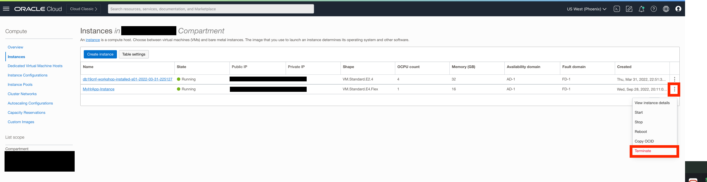
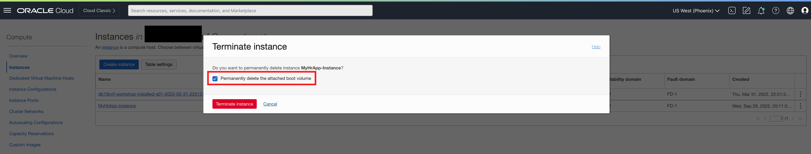
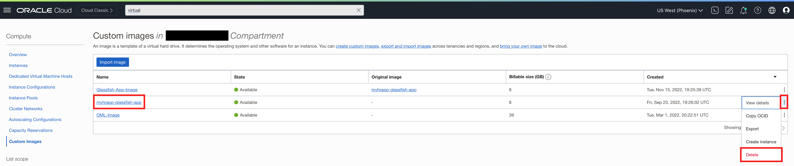
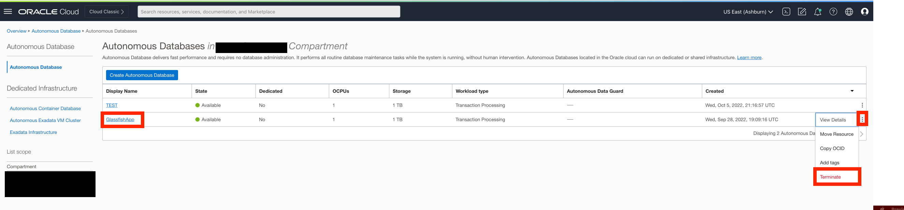
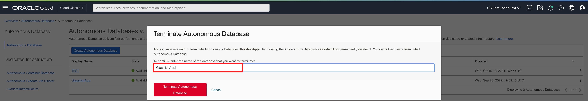
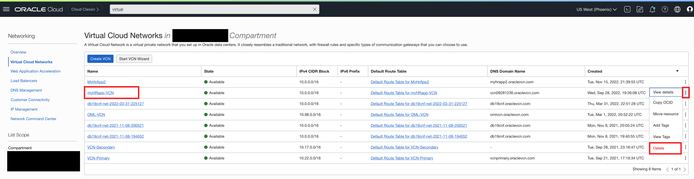

# Reset your environment

## Introduction

In this lab, we will show you how to teardown your Glassfish HR application and terminate the ATP instance. This will reset your environment to as it was before.

### Objectives

In this lab, you will complete the following tasks:

- Terminate the Glassfish HR application.
- Delete the Glassfish custom image
- Terminate the ATP instance.
- Delete the associated Virtual Cloud Network (VCN)

### Prerequisites

This lab assumes you have:
- An Oracle Cloud Infrastructure (OCI) tenancy account
- Completed all the previous labs in the **Securing a legacy application using Oracle Database Vault on Oracle Autonomous Database** LiveLab workshop

*Warning: Terminating resources may take a few minutes*

## Task 1: Terminate the Glassfish HR application

1. In OCI, use the hamburger menu to navigate to **Compute>Instances**. 

2. Select the ellipsis at the right of the screen associated with the `MyHrApp` instance that you created then **Terminate**. 

    

    *Note*: If you cannot locate your resources, make sure to check that you are in the correct **compartment** and **region**.

3. Check the box that says **Permanently delete the attached boot volume** and select **Terminate instance**.

    

## Task 2: Delete the Glassfish custom image

1. Use the hamburger menu to navigate to **Compute>Custom Images**.

2. Select the ellipsis at the right of the screen associated with the custom image you created then **Delete**. 

    

## Task 3: Terminate the ATP instance

1. Use the hamburger menu to navigate to **Oracle Database>Autonomous Database**.

2. Select the ellipsis at the right of the screen associated with the database you created for `MyHrApp` then **Terminate**. 

    

3. Enter the **Database Name** you gave to your ATP and select **Terminate Autonomous Database**.

    

## Task 4: Delete the associated Virtual Cloud Network (VCN)

1. Use the hamburger menu to navigate to **Networking>Virtual Cloud Networks**.

2. Select the ellipsis at the right of the screen associated with the Virtual Cloud Network you created for the workshop then **Delete**.

    

## Acknowledgements

- **Author**- Ethan Shmargad, North America Specialists Hub
- **Creator**- Richard Evans, Senior Principle Product Manager
- **Last Updated By/Date** - Ethan Shmargad, September 2022