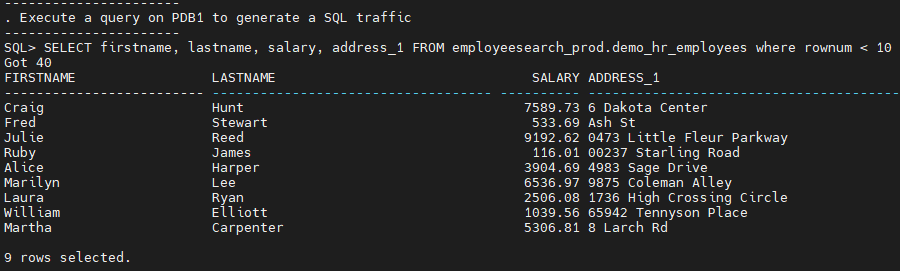
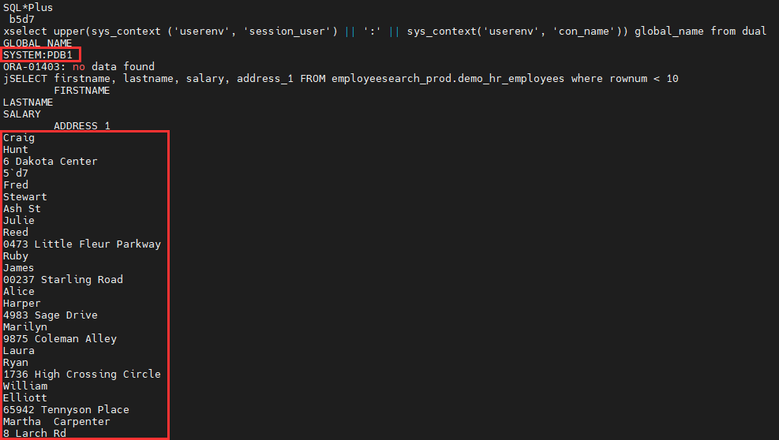
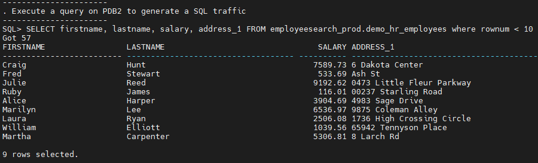
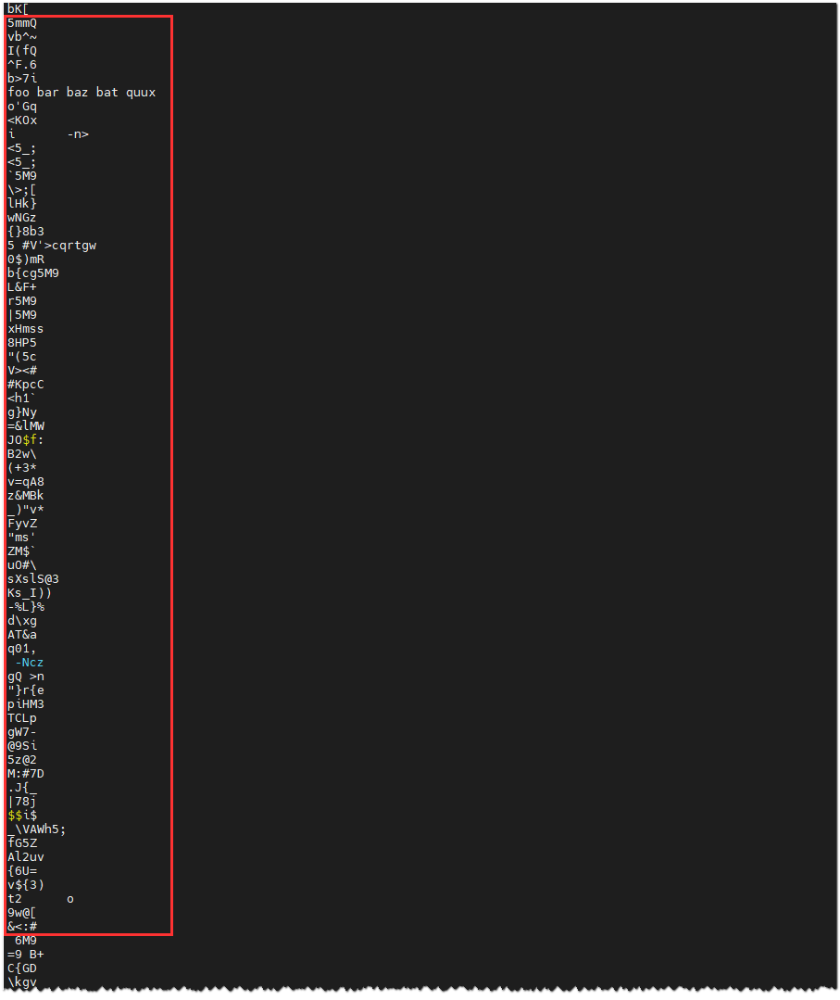
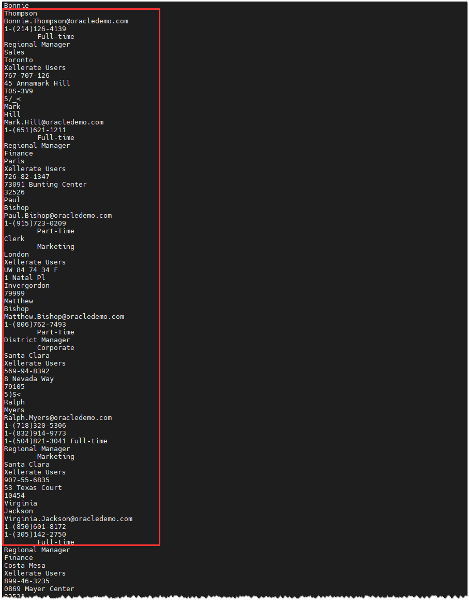
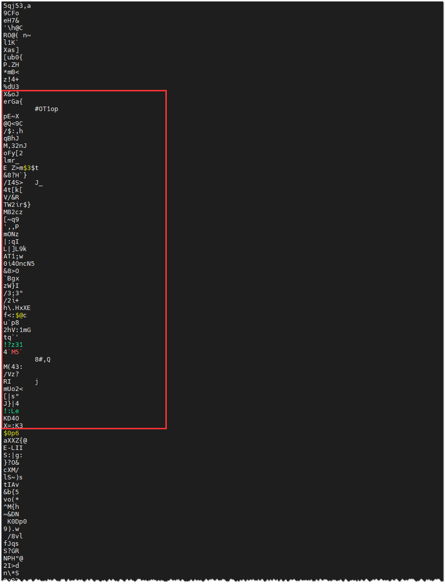
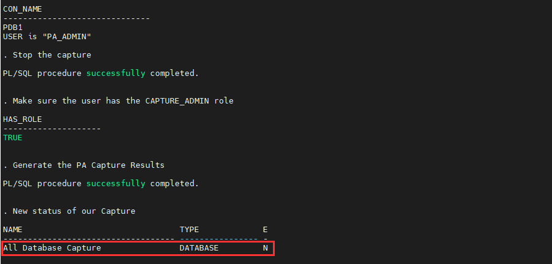
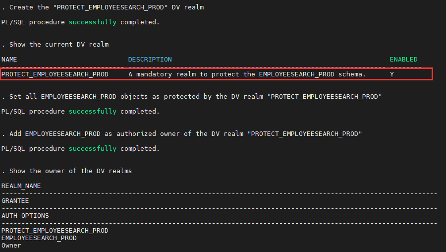

# Oracle DB Security - Story of a hack

## Introduction
In this lab, let's walk through the techniques that attackers use to break into your database and exfiltrate your data.

You will perform different scenarios:
- **as an attacker** - your main objective will be to exfiltrate sensitive data from the target database before encrypting the database as part of a ransomware attack
- **as a defender** - your main objective will be to prevent, detect and mitigate these attacks


*Estimated Time:* 40 minutes

Watch the video below for a quick walk-through of the lab.
[Oracle facing a Ransomware attack](videohub:1_n8s28bsk)

### Objectives
You will learn how to:
- Prevent, detect and mitigate data exfiltration
- Prevent and detect privileges escalation and abuse
- Prevent and mitigate exploitation of vulnerabilities

### Prerequisites
This lab assumes you have:
- A Free Tier, Paid or LiveLabs Oracle Cloud account
- You have completed:
    - Lab: Prepare Setup (*Free-tier* and *Paid Tenants* only)
    - Lab: Environment Setup
    - Lab: Initialize Environment

### Lab Timing (estimated)

| Task No. | Feature                                                 | Approx. Time | Details |
| -------- | ------------------------------------------------------- | ------------ | ------- |
| 1        | Data exfiltration by bypassing database access controls | <15 minutes  |         |
| 2        | Data exfiltration through an application                | <15 minutes  |         |
| 3        | Data exfiltration from the database                     | <15 minutes  |         |

## Task 1: Data exfiltration by bypassing database access controls

Acting while remaining silent is a golden rule for any good attacker. Anything that can be done far away from the target is preferred because the closer the attacker gets to the target, the greater their risk of being caught.

Databases are protected by access controls designed to limit the scope of data access, and audit controls that detect improper activity. The attackers try to avoid those access and audit controls. Once they are on a system and have decided to launch their attack to exfiltrate sensitive data, they first attempt to obtain as much sensitive information as possible without trying to connect to the database.

Several options are available in this case. From the farthest to the closest to the database, here is the collection:
- **From the network** (data-in-transit)
- **From inert and residual files** (backups and exports)
- **From Database data files** (data-at-rest)


## Task 1a: Prevent data exfiltration from the network (data-in-transit)

The attacker can use a packet analyzer, also known as packet sniffer, protocol analyzer, or network analyzer. The best known are **tcpdump** or **Wireshark** (tcpdump with a graphical front-end and integrated sorting and filtering options).

These tools allow an attacker to read or record data passing through a local network. They allow to capture each packet of the Data flowing through the network and to analyze its content.

Tools like tcpdump see everything that passes through the network interface, whether it is the SQL flow between the server and the client. That includes extremely sensitive information like passwords that pass in clear text or any other unencrypted information.

The solution to this problem is to encrypt the network and use secure communication protocols, such as SSH (SFTP, SCP), TLS (HTTPS or FTPS). Unfortunately, all too often internal company networks are not secured and the staff is not sufficiently trained in security aspects. Worse, the network is sometime voluntarily not encrypted because after purchasing some very expensive network probes, these would become useless with an encrypted network and the administrators would no longer be able to carry out their investigations in case of a failure!

<!--  -->

To see how easy it is to exfiltrate data from an unencrypted network, let's run a simple SQL query on PDB1 (unsecured database) and run tcpdump to analyze its traffic.

1. Open a terminal session on your **DBSec-Lab** VM as OS user *oracle*

    ````
    <copy>sudo su - oracle</copy>
    ````

    **Note**: If you are using your remote desktop session, double-click on the *Terminal* icon on the desktop to launch a session already logged on as *oracle* user

2. Go to the scripts directory

    ````
    <copy>cd $DBSEC_LABS/story-hack</copy>
    ````

3. Execute a SQL query **on PDB1** and run tcpdump to capture and analyze the packets in transit on the network (wait for the end of the execution)

    ````
    <copy>./sh_extract_data_from_network.sh pdb1</copy>
    ````

    ")

    **Note**:
    - The script output shows you that unencrypted data is flowing over the network! Even if native network encryption is NOT in use the banner entries still include entries for the available security services. Notice that "`Encryption service for Linux`" is available, indicating that the connection COULD be encrypted; however, there is no entry indicating the specific algorithms used by the session. When we look at an encrypted session, the difference will become more evident.

        

    - The script executes the following SQL query on PDB1: `SELECT firstname, lastname, salary, address_1 FROM employeesearch_prod.demo_hr_employees`

        

    - It captures and analyzes the traffic network generated
    - It displays the result of the analysis

4. Scroll up from the tcpdump output until the SQL Query `SELECT firstname, lastname, salary, address_1 FROM employeesearch_prod.demo_hr_employees`

    

    **Note**: Because the session is unencrypted, the query results appear in clear-text on the network. It is easy for an attacker to capture and exfiltrate the sensitive data-in-transit!

5. Now, let's have a look at what happens with an encrypted session. We run the same SQL query on PDB2 (the secured database). Again, we will use tcpdump to analyze the session traffic.

6. Execute an SQL query on PDB2 and run tcpdump to capture and analyze the packets in transit on the network (wait for the end of the execution)

    ````
    <copy>./sh_extract_data_from_network.sh pdb2</copy>
    ````

    **Note**:
    - The script checks if the SQL traffic is encrypted. You can see the connection is encrypted because an encryption algorithm was selected for the session. You can still see the default banner information for the available encryption service and the crypto-checksumming (integrity) service. Now, you can also see the algorithm used is "`AES256 Encryption service adapter for Linux`".

        

    - The script executes the following SQL query on PDB2: `SELECT firstname, lastname, salary, address_1 FROM employeesearch_prod.demo_hr_employees`

        

    - It captures and analyzes the traffic network generated
    - It displays the result of the analysis

7. Scroll up from the tcpdump output and confirm that you can't find the SQL Query `SELECT firstname, lastname, salary, address_1 FROM employeesearch_prod.demo_hr_employees`!

    

    **Note**:
    - The `DEMO_HR_EMPLOYEES` table data is still queryable but when it shows up in the tcpdump, the data is unreadable because the session is encrypted!
    - Even with a compromised network, the SQL workflow is secured with no code updates, no application changes, and no network architecture changes! Your sensitive data is protected in transit!
    - Network administrators can continue to use their existing probes to analyze events while being sure that they can't read the data-in-transit

8. Encrypting the SQL traffic for an Oracle Database is fast and easy! It works immediately, with no downtime, application changes, or complex command lines, so why are you waiting to implement it?

9. We protected the SQL traffic using an encryption feature provided natively by the Oracle database, called **Native Network Encryption (NNE)**. Another option for encrypting network traffic would be Transport Layer Security (TLS). We chose NNE because, unlike TLS, NNE doesn't require any changes in the application.

    > To learn more about how to enable NNE, please refer to the "[DB Security - Native Network Encryption] (https://livelabs.oracle.com/pls/apex/dbpm/r/livelabs/view-workshop?wid=700)" workshop

## Task 1b: Prevent data exfiltration from inert and residual files (backups and exports)

Although stealing unencrypted data over the network is very easy for the attacker, the data available to steal is limited to only what is traveling over the network. The attacker is passive – and this type of theft does not reveal the underlying data model, making it difficult for the attacker to know what else is available within the database.

The attacker will naturally move closer to the database to get a better idea of what data is available, but always being careful not to set off any alarms. The attacker shifts their focus to inert files of the database. Whether they are backups or export files, they are copied outside the database servers and frequently proliferate throughout the organization. They are almost always unattended or without protective security controls. These files are a real goldmine for attackers because they can contain sensitive data, the structure of the database, and other valuable information.

The attacker may be able to retrieve these files from file shares or backup servers, as email attachments, from tapes, or even from service providers who may have little regard for good security practices or the security implications of these types of files falling into the wrong hands. The attacker can then read the content of those files at their leisure.

<!--  -->

Let's see how this type of attack could focus on an export file, but keep in mind that it would work the same way with a backup file.

1. Let's say that while performing a search, the attacker finds an old, insecure PDB1 export file (`employeesearch_data_PDB1_20220505.dmp`) that was generated for use by a development or support team. The attacker tries to read the file contents

    ````
    <copy>./sh_extract_data_from_file.sh employeesearch_data_PDB1_20220505.dmp</copy>
    ````

    

    **Note**:
    - By scrolling the output, you can see that all the schema data and metadata are readable!
    - Because this file wasn't encrypted when it was generated, it's possible to extract its entire content by simply reading it

2. And if the attacker tries to exfiltrate all the email addresses for example, nothing could be easier with the right command line

    ````
    <copy>./sh_extract_data_from_file.sh employeesearch_data_PDB1_20220505.dmp |grep -o '[[:alnum:]+\.\_\-]*@[[:alnum:]+\.\_\-]*' | sort | uniq -i</copy>
    ````

    

3. Now, do the same thing on export file from PDB2 (`employeesearch_data_PDB2_20220506.dmp`). Unlike the export from PDB1, this export was encrypted.

    ````
    <copy>./sh_extract_data_from_file.sh employeesearch_data_PDB2_20220506.dmp</copy>
    ````

    

    **Note**:
    - The output is unreadable!
    - Because this file was encrypted when it was generated, it's impossible to extract usable content

4. And if the attacker tries to exfiltrate all the email addresses, there's nothing but unusable data

    ````
    <copy>./sh_extract_data_from_file.sh employeesearch_data_PDB2_20220506.dmp |grep -o '[[:alnum:]+\.\_\-]*@[[:alnum:]+\.\_\-]*' | sort | uniq -i</copy>
    ````

    

5. Here, we have used Data Pump Encryption, one of the database encryption features provide by the **Oracle Advanced Security Option (ASO)**

    ---

    SysAdmin might answer here that it's easy to secure an inert file to avoid this kind of attack and that it's enough to encrypt the export file with utilities like GnuGP or mCrypt - the most well-known file encryption utilities. Unfortunately, what seems to be a good solution in theory is not a good solution in practice.

    Think about it - every time you use these utilities, you will have to encrypt a file that is already in clear text. The risk of compromising the file between generation and encryption during the operation is very real, not to mention the added complexity from an operations standpoint.

    You'll also have to manually generate a unique encryption key that you'll have to store and manage to make sure you can restore the file someday or enter a password. That password becomes something that needs to be securely stored and managed. You can never forget it and will have to pass it on to the end-user who might want to open the file. All this is time-consuming and expensive to maintain and increases the risk of manipulation errors or compromise.

    So, in general, to avoid possible problems, the admins will either use the same password for all the encryptions or store it somewhere to avoid losing it. You'll need to work out procedures for changing the password when the teams change personnel over time. All this represents a heavy load in terms of time, resources, processes, and money. This manual process also represents a real security risk because anything perceived as an operational barrier is seldom maintained over time.

    We prefer to use the native encryption functionalities built into the Oracle Database, like Data Pump encryption for export files and RMAN backup encryption for Oracle Database backups.

    **Benefits of using database encryption**

    Compared to other solutions like GnuPG, mCrypt or third party encryption, database encryption offers multiple advantages:
    - it's native, so no other layer to install; ready-to-use and optimized for the Oracle Database
    - transparent, once initiated, you can automatically create an encrypted export file without the intervention of an Admin
    - non-intrusive, no code or architecture changes are required
    - secure, no password to use, a key is generated automatically
    - centralized for Data Pump, the key is generated by the Oracle Database and stored within the local keystore or in a key manager like Oracle Key Vault (OKV)
    - already encrypted for RMAN backup, no need to generate another key because all the encrypted database blocks are managed by RMAN during the backup process - advantage: the backup is already and automatically encrypted, and all the key are stored within the database keystore
    - Data Pump encryption happens during the export process, so there is no risk of data theft during the time between creating the export and encrypting it because there is no gap

    ---

## Task 1c: Prevent data exfiltration from Database data files (data-at-rest)

If the attacker wants to get MORE data (especially if the inert file breach was over a partial export), or if the prior attacks were blocked, then the attacker will need to start taking more risks. They will need to get closer to their target and remain under the radar of the database access and audit controls. To do this, they will now attack the active data files. These files contain all the data of the database.

Here they have two options:
- try to attack the production server directly
- or attempt to harvest data from non-production servers

Attacking the production server may seem riskier, but they will attack that target if they don't have enough time or think they can get away with it. Suppose the attackers are not in a hurry. In that case, they can take time to explore non-production servers, which are generally less complete and less up-to-date but have the advantage of being little monitored and rarely with the same level of security as production servers.

<!--  -->

The technique remains the same in production or development, so let's take a look at how they might go about it on the production server. We'll see later how to secure the non-production data.

### **Option 1: The attacker targets the production server**

We will use a well-known Linux command "strings" to view data in the datafiles associated with the EMPDATA_PROD tablespace. Strings is an OS command that operates directly on the database files, bypassing database access and audit controls.

1. On PDB1, the `EMPDATA_PROD` tablespace is unsecured and its associated datafiles is named `empdata_prod.dbf`

    ````
    <copy>./sh_extract_data_from_file.sh ${DATA_DIR}/pdb1/empdata_prod.dbf</copy>
    ````

    

    **Note**:
    - By scrolling the output, you can see that all the schema data and metadata are visible!
    - Because this datafile is not encrypted, it's easy to extract its entire contents by simply reading it
    - Beware, even if this datafile is located on an encrypted disk array or encrypted by a third-tier software, the content of the file is still available to a privileged user like root or oracle

2. On PDB2, the `EMPDATA_PROD` tablespace is secured and its datafiles associated is named `empdata_prod_enc.dbf`

    ````
    <copy>./sh_extract_data_from_file.sh ${DATA_DIR}/pdb2/empdata_prod_enc.dbf</copy>
    ````

    

    **Note**:
    - The output is unreadable!
    - Because this datafile is encrypted at the database block level it's impossible to extract its content without going through an authorized, audited, database session

3. This time, we have used another database encryption feature provide natively by the Oracle database called **Transparent Data Encryption (TDE)**. TDE is included with all Oracle Database cloud services and is available with Oracle Enterprise Edition databases.

    ---

    **Benefits of using Oracle Transparent Data Encryption (TDE)**
    - As a security administrator, you have peace of mind knowing that sensitive data is secured in the event that the storage media or data file is stolen - Data is encrypted within the database and therefore safe everywhere in Oracle Database ecosystem the data is copied to (including clones of the database, backups, etc)
    - Using TDE helps you address encryption-related regulatory compliance issues
    - You don't need to modify applications to use TDE. Data is transparently encrypted as it is added to the database, and transparently decrypted for authorized database sessions
    - You can encrypt data with zero downtime on production systems by using "Online Table Redefinition," or you can encrypt it offline during maintenance periods (see "Oracle Database Administrator's Guide" for more information about "Online Table Redefinition")
    - Oracle Database automates TDE master encryption key and keystore management operations. The user or application does not need to manage TDE master encryption keys and the keys are never exposed to the clients, reducing the chances for loss or theft of the keys

    > To learn more about how to use TDE, please refer to the "[DB Security - ASO (Transparent Data Encryption & Data Redaction)] (https://livelabs.oracle.com/pls/apex/dbpm/r/livelabs/view-workshop?wid=703)" workshop

    ---

### **Option 2: The attacker focuses on the non-production (test or development) database servers**

If the attacker has more time, they will avoid attacking the production database in order to reduce their risk of discovery. Hackers often focus on non-production systems because those usually have fewer active security controls and less stringent monitoring. For each production database, we see an average of four non-production databases (development, test, integration, UAT, validation, stage, support, etc). In many cases, the test databases are just production clones and contain the same data. Because developers must be close to actual production conditions, they require non-production environments to be as faithful as possible to the production database.

Applying production-quality levels of security to non-production databases is unworkable in many cases. In addition to the additional cost to secure these extra environments, developers frequently require full access to the system during the development and testing process.

The simplest and safest solution is to implement a good baseline level of security, including auditing and assessment. And then work to make the content of these databases functional, so that the teams can work correctly, but without any sensitive information so that you are not worried about data compromise. We will use data masking to remove the security risk from these non-production clones. Masking is cheaper than implementing production-quality controls. Masking allows you to invest the minimum security resources in these databases without risk of disclosing your sensitive data.


Imagine that you decide to refresh your development database every Monday from the production database. That means that your development database will become as sensitive as your production environment as soon as it is refreshed. Your datafiles are exposed to exactly the same attack that we saw earlier.

1. Let's **refresh the development from production on PDB1 with no masking script**

    ````
    <copy>./sh_refresh_dev_from_prod.sh pdb1 nomasking</copy>
    ````

    

    **Note**: Because the data is not masked in development, you can see the same sensitive data that is in production!

2. Next, for example, **extract only the email of the User 73** (`Craig.Hunt@oracledemo.com`) from the development datafile `empdata_dev.dbf` **on PDB1**, as seen in the previous attack

    ````
    <copy>./sh_extract_data_from_file.sh ${DATA_DIR}/pdb1/empdata_dev.dbf |grep -o 'Craig.Hunt@oracledemo.com'</copy>
    ````

    

    **Note**:
    - The database file is readable as expected, and you can see the email address. Hence, production-sensitive data is vulnerable in the development environment!
    - Of course, here, you exfiltrated only a single email address, but an attacker could exfiltrate any other dataset they wanted by using the same method
    - To be secured, you would need to implement, maintain, and monitor strong security solutions in the development environment

3. Now, let's see what happens if you **mask the sensitive data during the duplication process in Dev on PDB2**

    ````
    <copy>./sh_refresh_dev_from_prod.sh pdb2 masking</copy>
    ````

    

    **Note**:
    - Here, we apply a masking script during the data refresh process that removes risk from sensitive data by replacing it with non-sensitive, usually artificial, data:
        - Set a new value to `CREATIONDATE` from a specific date range
        - Apply the format "xxxxx@email.com" to EMAIL
        - Set random values to `PHONEMOBILE` by preserving the original format (3 digits - 3 digits - 4 digits)
        - Hide `SALARY`
        - Set random values to `SSN` by preserving the original format (3 digits - 2 digits - 4 digits)
        - Set a realistic new value to `CORPORATE_CARD` from credit card number library
    - Now, the **data is masked in development and is different from what is in production**!

4. Next, try again to **extract only the email of the user 73** (`Craig.Hunt@oracledemo.com`) from the development datafile `empdata_dev.dbf` **on PDB2**

    ````
    <copy>./sh_extract_data_from_file.sh ${DATA_DIR}/pdb2/empdata_dev.dbf |grep -o 'Craig.Hunt@oracledemo.com'</copy>
    ````

    

    **Note**:
    - **There's no result!**
    - Although the datafile is still readable as expected - remember, we didn't encrypt the development env - but now, because the data is masked in development, even if the attacker actually connects to the database, there's no longer sensitive data to be stolen!

5. Here, we have used the data masking capability provided by the Oracle Database, called **Data Masking and Subsetting (DMS)**.

    ---

    Oracle Data Masking and Subsetting (DMS) generates a scalable masking script with a highly efficient and robust mechanism for creating consistent and realistic masked data. No need to manually create a complex masking script to maintain, just define the masking rules and DMS generates the masking script for you.

    **Benefits of using DMS**
    - Maximize the business value of data by masking sensitive information
    - Minimize the compliance boundary by not proliferating the sensitive production information
    - Lower the storage costs on test and development environments by subsetting data
    - Automate the discovery of sensitive data and parent-child relationships
    - Provide a comprehensive library of masking formats, masking transformations, subsetting techniques, and select application templates
    - Maintain your masking script easily over time according to the evolution of the schemas structures
    - Mask and subset data in-Database or on-the-file by extracting the data from a source database
    - Mask and subset Oracle Databases hosted on-premises, in the Oracle Cloud, and in third-party clouds
    - Preserve data integrity during masking and subsetting and offers many more unique features
    - Integrate with select Oracle testing, security, and integration products

    > To know more about DMS, please refer to the "[DB Security - Data Masking and Subsetting] (https://livelabs.oracle.com/pls/apex/dbpm/r/livelabs/view-workshop?wid=704)" workshop. The Oracle Data Safe cloud service also provides Data Masking capability. If you'd like more information on using Oracle Data Safe please refer to the "[Get Started with Oracle Data Safe Fundamentals] (https://livelabs.oracle.com/pls/apex/dbpm/r/livelabs/view-workshop?wid=598)" workshop

    ---

## Task 2: Data exfiltration through an application

Next, our attackers will attempt to indirectly retrieve data from the database by attacking an application connected to the database. Their risk of detection goes up because (hopefully) the application is being monitored for this type of attack using tools like Web Application Firewall (WAF).


Possibly the attacker has access to your application, even with a simple user account. Or they may not even have that – if the application developers did not do a good job of securely coding their application it's possible that the attacker can steal data from the login screen without ever actually completing an application authentication.

Hackers use two common techniques when attacking the database through an application:
- **SQL Injection**
- **Sensitive data harvesting**

## Task 2a: Detect and mitigate a SQL Injection

SQL Injection (SQLi) is a code injection technique used to attack data-driven applications by inserting malicious SQL statements into entry fields.

SQLi is a well-known cyber attack representing one of the most commonly used attack techniques. SQLi's ability to exploit security holes can be potent if properly used. SQLi exploits security holes in an application that interacts with a database. The SQL injection attack consists of tricking the application into modifying a valid SQL query by injecting an unanticipated response to an input variable, often through a form. The hacker can thus retrieve data from the database that the application developer never intended to expose. In some cases, the attacker can even update or delete data, create new user accounts, or escalate privileges, thus compromising the system's security.

Every day someone discovers a new SQLi vulnerability - even in some of the most well-known applications. Secure coding practices, periodic developer training, and comprehensive code audits can prevent new applications from being released with SQLi vulnerabilities. Many older applications contain unpatched SQLi vulnerabilities.

In this lab, you will perform a "UNION-based" SQL injection attack on an application that is NOT securely developed! You'll see how a SQLi attack works and then see how to block it.

1. First, open 2 Web browser tabs and launch the HR app using these URLs:
    - If you are working from a remote desktop (usually the case for this lab):
        - **On PDB1** (unsecured) to this URL: *`http://dbsec-lab:8080/hr_prod_pdb1`*
        - **On PDB2** (secured) to this URL: *`http://dbsec-lab:8080/hr_prod_pdb2`*
    - If you are working through a public IP address (often the case if you launched this lab in your own tenancy):
        - **On PDB1**: *`http://<YOUR_DBSEC-LAB_VM_PUBLIC_IP>:8080/hr_prod_pdb1`*
        - **On PDB2**: *`http://<YOUR_DBSEC-LAB_VM_PUBLIC_IP>:8080/hr_prod_pdb2`*
    - To help you differentiate between the two applications, the HR App menu is grey on PDB1 and in red on PDB2. Remember, this application is deliberately poorly developed to allow attacks such as SQL injection attacks

2. Login to these 2 applications as *`hradmin`* with the password "*`Oracle123`*"

    ````
    <copy>hradmin</copy>
    ````

    ````
    <copy>Oracle123</copy>
    ````

    

    

3. Click **Search Employees**

4. Click [**Search**]

    

    **Note**: All rows are returned because, remember, you allowed everything!

5. Now, tick the **checkbox "Debug"** to see the SQL query behind this form

    

6. Click [**Search**] again

    

    **Note:**
    - Now, you can see the SQL query executed by this form which displays the results
    - This query gives you the information of the number of columns requested, their name, the tables in use, and their relationship. That information helps you know what database columns relate to which columns in the application's user interface.

7. Now, based on this information, you can use a "UNION-based" SQL injection query to display sensitive data you want to extract. Here, we will use this query to extract `USER_ID, MEMBER_ID, PAYMENT_ACCT_NO` and `ROUTING_NUMBER` from the `DEMO_HR_SUPPLEMENTAL_DATA` table.

    ````
    <copy>
    ' UNION SELECT userid, ' ID: '|| member_id, 'SQLi', '1', '1', '1', '1', '1', '1', 0, 0, payment_acct_no, routing_number, sysdate, sysdate, '0', 1, '1', '1', 1 FROM demo_hr_supplemental_data --
    </copy>
    ````

8. Copy the SQL Injection query, **paste it directly into the field "Position"** on the Search form on both Web App and tick the "Debug" checkbox

    

    **Note:**
    - Don't forget the "`'`" before the UNION key word to close the SQL clause "LIKE"
    - Don't forget the "`--`" at the end to disable rest of the application's original query

9. Click [**Search**]

    - **On PDB1** (unsecured)

        

        **Note:**
        - Now, because the source code of the app is exposed to this kind of attack, instead of the results as usual, you can see sensitive information that the application developer never intended to expose to you!
        - Of course, you can modify this UNION query and extract different columns if you want. The key is to ensure the number of returned values continues to match the original source query

    - **On PDB2** (secured)

        

        **Note**:
        - The output returns "**no rows**"
        - The SQL injection attack was blocked by the Database Firewall mechanisms configured specifically to protect this database from SQLi attacks!
        - Even with a poorly developed application, your data is still protected

10. Here, we have used the SQL Firewalling feature provide by **Oracle Audit Vault and Database Firewall (AVDF)**

    > To learn more about how to use the Database Firewall to protect against SQL injection, please refer to the "[DB Security - Audit Vault and DB Firewall] (https://livelabs.oracle.com/pls/apex/dbpm/r/livelabs/view-workshop?wid=711)" workshop


## Task 2b: Detect and mitigate the sensitive data harvesting

Many older applications expose data to the user that is no longer appropriate. Older applications were often developed when privacy concerns were not as important as they are now and when privacy regulations were not as stringent. It may not be practical to modify the applications, but you can still control the display of sensitive data within those applications.

1. Go back to your HR App on both env (PDB1 and PDB2) and click on **Search Employees**

    

2. We'll filter on the employee "Alice HARPER" for example by entering **77 as HR ID** value and click [**Search**]

    

3. Now, click on the **Full Name** link of this employee to see her details

    

    - **On PDB1** (unsecured), as you can see, sensitive data like the `SSN` or `SIN` is readable by an authorized user. Or by a user the application THINKS is authorized (perhaps this session is a hacker using compromised account credentials)!

        

    - **On PDB2** (secured), even with the same user, the same privileges, the same application, from the same server, the column `SIN` is no longer available!

        

4. Here, we have used the data redaction feature provide natively by the Oracle database, called **Data Redaction**

    **Note**:
    - Because we've decided that application users have no need to view extremely sensitive information like `SSN`/`SIN`, we placed a redaction policy on the database table that controls the conditions under which the data is allowed to leave the database
    - Because Data Redaction is part of the database, there is no need to modify the application to hide this sensitive data. Just create a Data Redaction policy on the table that holds your sensitive column and refresh the application screen to see the effects

    ---

    **Benefits of Using Oracle Data Redaction**
    - You have different styles of redaction from which to choose
    - Because the data is redacted at runtime, Data Redaction is well suited to environments in which data is constantly changing
    - You can create the Data Redaction policies in one central location and easily manage them from there
    - The Data Redaction policies enable you to create a wide variety of policy conditions based on `SYS_CONTEXT` values, which can be used at runtime to decide when the Data Redaction policies will apply to the results of the application user's query

    > To learn more about how to use Data Redaction, please refer to the "[DB Security - ASO (Transparent Data Encryption & Data Redaction)] (https://livelabs.oracle.com/pls/apex/dbpm/r/livelabs/view-workshop?wid=703)" workshop

    ---

## Task 3: Data exfiltration from the database

Our attacker now switches their attention to a direct attack on the database.


Hackers use four common techniques when attacking the database directly:
- **Exploiting known vulnerabilities in the database**
- **Abusing existing privileges**
- **Taking advantage of insufficient or permissive access controls**
- **Acting as an Admin (privilege escalation or abuse of power)**

Because the database is directly attacked, this type of attack exposes the hacker to the highest level of detection risk!

## Task 3a: Prevent and mitigate exploit known vulnerabilities of the database

A missing patch, a known security issue not fixed, a too permissive configuration, poorly managed users, default passwords that were never changed, users with too many rights - the number of potential vulnerabilities can be intimidating.

Good security requires periodic evaluation of the vulnerabilities to which your database is exposed. Failure to periodically validate that your database is securely configured usually exposes you to configuration drift, which may expose you to increased risk.

As the number of databases you are responsible for grows, the complexity of validating and tracking that configuration also grows. A set of tools that continuously assess your databases can help you deal with rising complexity and scale.

Oracle provides you with several easy-to-use and efficient tools that allow you to identify risks to which your databases are exposed and make recommendations on how to remediate those risks:
- One such tool is **Oracle Data Safe** (a hybrid Cloud service included at no additional cost with all Oracle Database services in the Oracle Cloud)
- Another is **Oracle Database Security Assessment Tool (DBSAT)** available to all Oracle customers (on-premises and in the cloud) through My Oracle Support note 2138254.1.

1. These tools assess your databases to inform you of your risk level

    

    

2. They generate complete and intuitive reports based on color codes and quick and easy-to-use graphs

3. They also alert you to configuration drift by comparing current configuration with your established security and user baseline.

    

4. You are thus quickly and efficiently informed of any risk to be remedied without wasting time and without the risk of forgetting. These assessment tools also help with compliance requirements for safeguarding data privacy and protecting data.

    

    ---

    **Benefits of Using Oracle DBSAT**
    - Quickly identify sensitive data
    - Scan for security configuration issues in your databases
    - Promote security best practices
    - Improve the security posture of your Oracle Databases
    - Reduce the attack surface and exposure to risk
    - Provide input to auditors

    **Benefits of Using Oracle Data Safe**
    - All the DBSAT benefits
    - Configuration drift detection
    - Multi-cloud and hybrid global overview (all your Oracle databases located on-premises, on the Oracle Cloud or third-party clouds)
    - User assessment and user account drift detection
    - Data Masking capacity
    - Audit collection, including reporting, analysis, and alerting

    > To learn more about how to use Data Safe and the Database Security Assessment Tool, please refer to the "[Get Started with Oracle Data Safe Fundamentals] (https://livelabs.oracle.com/pls/apex/dbpm/r/livelabs/workshop-attendee-2?p210_workshop_id=598)" or "[DB Security - Database Security Assessment Tool] (https://livelabs.oracle.com/pls/apex/dbpm/r/livelabs/workshop-attendee-2?p210_workshop_id=699)" workshops

    ---

## Task 3b: Detect and prevent abuses of existing privileges

Most database attacks involve using compromised account credentials – the attacker just logs into the database with a stolen username and password. The hacker can leverage whatever privileges are granted to that account to steal data – which means that over-privileged accounts are a serious security risk. In far too many situations, administrators grant users privileges they do not need because no one is quite sure what privileges are required. A hacker abuses those additional privileges to access data or perform activity that the account would never usually need to do.

Let's see how this risk could be avoided. Rather than try to guess what privileges an account needs or doesn't need, we will monitor the account's use of privileges to know what unnecessary privileges were granted to the account.

1. Go back to your terminal session on your **DBSec-Lab** VM as OS user *oracle*

2. Start a privilege analysis capture **on PDB1**

    ````
    <copy>./sh_pa_start_capture.sh pdb1</copy>
    ````

    

    **Note**:
    - "Y" means the capture is started, and EVERY database sessions will be analyzed until the capture ends
    - The database will record which privileges are used during each session

3. Now, let's generate a workload with HR App on PDB1

    - Go back to your HR web application

    - Login as *`hradmin`* with the password "*`Oracle123`*"

        ````
        <copy>hradmin</copy>
        ````

        ````
        <copy>Oracle123</copy>
        ````

        

        

    - Click **Search Employees**

    - Click [**Search**]

        

4. Go back to your terminal session to stop the capture to generate a report

    ````
    <copy>./sh_pa_stop_capture.sh pdb1</copy>
    ````

    

    **Note**: You generated a report named "**All database Capture**"

5. Now, open the DB Admin Console (OEM Cloud Control) to view the report

    - Open a Web Browser at the URL *`https://dbsec-lab:7803/em`*

        **Notes:** If you are not using the remote desktop you can also access this page by going to *`https://<YOUR_DBSEC-LAB_VM_PUBLIC_IP>:7803/em`*

    - Login to Oracle Enterprise Manager 13c Console as *`SYSMAN`* with the password "*`Oracle123`*"

        ````
        <copy>SYSMAN</copy>
        ````

        ````
        <copy>Oracle123</copy>
        ````

        

    - Expand all the databases and click on **cdb_PDB1**

        

    - In the menu, select **Security** and **Privileges Analysis**

        

    - Check "**Named**" and select "**PA_ADMIN**" as Credential Name

        

    - Click [**Login**]

    - Select our report generated during the capture (here "**All database Capture**") and click [**View Report**]

        

    - You can see all users that connected to the database during the capture period, along with the privileges used

        

    - Click on the "**Used**" tab to see all the privileges used during the capture and by whom

        

        **Note**: The Export to Spreadsheet button allows you to provide this information to persons who can make decisions about granting or revoking rights

    - You can also view unused privileges – these may be privileges the accounts don't need. If so, removing these unnecessary privileges is an excellent way to shrink the amount of damage these accounts could do if they were compromised. Click on the "**Unused**" tab to see all the privileges that were unused during the capture and by whom

        

        **Note**: We can clearly see if a user has too many rights, or rights that they don't need to perform their tasks

    - Drop the capture **on PDB1**

        ````
        <copy>./sh_pa_drop_capture.sh pdb1</copy>
        ````

        


6. In this exercise, we have used a feature provided natively in the Oracle Database, called **Privilege Analysis**

    > To learn more about how to use Privilege Analysis, please refer to the "[DB Security - Privilege Analysis] (https://livelabs.oracle.com/pls/apex/dbpm/r/livelabs/view-workshop?wid=701)" workshop


## Task 3c: Prevent insufficient or permissive access controls

Another way to steal data is to connect directly to the database without going through an approved application. In some cases, business users will request the ability to login to the database to see data that is too difficult to extract from the application – a legitimate business need. Each of these accounts becomes another point of vulnerability for a hacker to exploit. In both cases (hacker and legitimate business user) the risk is increased if the database does not restrict access to data that the business users should not be able to view.

1. Go back to your terminal session and execute a query on sensitive data **on PDB1** with application User `EMPLOYEESEARCH_PROD`

    ````
    <copy>./sh_query_employee_data.sh pdb1 EMPLOYEESEARCH_PROD</copy>
    ````

    

    **Note**: As you can see, outside of the approved HR App, the sensitive data `BONUS_AMOUNT` is still readable!

2. Now, execute the same query **on PDB2**

    ````
    <copy>./sh_query_employee_data.sh pdb2 EMPLOYEESEARCH_PROD</copy>
    ````

    

    **Note**:
    - A trusted path has been created to be sure that the users will only use the official web app
    - Sensitive column `BONUS_AMOUNT` columns is invisible to adhoc query tools like SQL*Plus, even for the schema owner!
    - `SIN` is also redacted for this secured database, we did this earlier to help block the proliferation of sensitive data

3. To confirm that the `BONUS_AMOUNT` is still there, have a look on the **UserID 6 (Lillian)** and go back to your HR App **on PDB2**

    - Open a Web browser tabs to this URL: *`http://dbsec-lab:8080/hr_prod_pdb2`*

        **Notes:** if you are not using the remote desktop, use this URL *`http://<YOUR_DBSEC-LAB_VM_PUBLIC_IP>:8080/hr_prod_pdb2`*

    - Login as *`hradmin`* with the password "*`Oracle123`*"

        ````
        <copy>hradmin</copy>
        ````

        ````
        <copy>Oracle123</copy>
        ````

        

        

    - Click **Search Employees**

    - Enter **6** in the field **HR ID** and click [**Search**]

        

    - Click on the employee

        

        **Note**: Remember, `SIN` is unreadable because we blocked it earlier in this workshop

    - Open the "**Supplemental Data**" tab

        

        **Note**:
        - `BONUS_AMOUNT` is still readable from within the application because the redaction policy set up for this column displays the data only for the trusted path
        - Connections from outside of the trusted path (like our direct SQL login) are not allowed to see the sensitive data

4. Here again, we have used **Data Redaction**, a feature of Oracle Advanced Security (ASO)

    > To learn more about how to use Data Redaction, please refer to the "[DB Security - ASO (Transparent Data Encryption & Data Redaction)] (https://livelabs.oracle.com/pls/apex/dbpm/r/livelabs/view-workshop?wid=703)" workshop

## Task 3d: Detect and prevent abuse of power

Finally, the attackers will take the gloves off and will attack with heavy artillery, by acting directly on the database to increase their privileges and exfiltrate sensitive data. Their objective is simple, to obtain as many rights as possible to steal the most data possible. They may try to grant additional privileges to accounts they have compromised, or create new accounts to use in follow-on attacks.

### **Option 1: Escalation of privileges**

1. Go back to your terminal session and create/grant/drop users to check if you are informed about it

    - **On PDB1**

        ````
        <copy>./sh_create_users_alert.sh pdb1</copy>
        ````

        

    - **On PDB2**

        ````
        <copy>./sh_create_users_alert.sh pdb2</copy>
        ````

        

2. Next, open the Database Audit Console to check the alert messages

    - On the right web browser window on your remote desktop, switch to the tab preloaded with the Oracle Audit Vault Web Console. If you inadvertently closed it, open a new tab and go to *`https://av`*

        **Note**: If you are not using a remote desktop access the audit console by going to *`https://<YOUR_AVS_VM_PUBLIC_IP>`*

    - Login to Audit Vault Web Console as *`AVAUDITOR`* with the password "*`T06tron.`*" (note: the period at the end is part of the password)

        ````
        <copy>AVAUDITOR</copy>
        ````

        ````
        <copy>T06tron.</copy>
        ````

        

    - Click on the "**Alerts**" tab

        

    - As you can see, an alert called "USER CHANGES" has been activated

        

        **Note**:
        - But only the alerts are only available for the activity on PDB2 because PDB1 does not follow best practices and audit creation of, or changes to, user accounts
        - The alert page synchronizes at regular intervals, so if you don't see the alerts, please wait a moment and refresh your browser

3. Here, we have used the data auditing features provided by the Oracle Database, called **Unified Audit**, to create a record of the activity. We also collected the audit data using **Audit Vault and Database Firewall (AVDF)**, so that we can receive alerts, analyze activity, and run reports.

    ---
    
    In addition to being informed of significant activity in near real-time, AVDF allows you to move audit data from the database to a tamper-resistant repository that protects audit data from deletion or alteration. Having a single place to analyze activity across all databases greatly facilitates investigating an incident. AVDF makes it easier to provide reports demonstrating regulatory compliance or even just understanding what happened on the database.

    > To learn more about how to use the features used here, please refer to the "[DB Security - Audit Vault and DB Firewall] (https://livelabs.oracle.com/pls/apex/dbpm/r/livelabs/view-workshop?wid=711)" and "[DB Security - Unified Auditing] (https://livelabs.oracle.com/pls/apex/dbpm/r/livelabs/view-workshop?wid=702)" workshops

    ---

### **Option 2: Abuse of power**

Attackers want the broadest, most privileged access they can obtain. Database Administrator (DBA) accounts are usually the most privileged accounts in a database.

DBAs are human, and it is possible to compromise their accounts. Your planning should include how to react if that compromise happens. If you are not ready to detect or prevent the attack, then the game is already lost!

Fortunately, Oracle Database provides controls to prevent unauthorized privileged users from accessing sensitive data. Oracle Database can also prevent unauthorized database changes, even by the DBA!

1. If we take the example of exfiltrating data from the application user with SQL*Plus and let's see what happens with a super-user

    - **On PDB1**

        - **As an application user** (the schema owner `EMPLOYEESEARCH_PROD`)

            ````
            <copy>./sh_query_employee_data.sh pdb1 EMPLOYEESEARCH_PROD</copy>
            ````

            

        - **As DBA** (SYS as sysdba)

            ````
            <copy>./sh_query_employee_data.sh pdb1 SYS</copy>
            ````

            

        **Note**: Sensitive data is open for DBAs to view on this unsecured database!

    - **On PDB2**

        - **As application user** (the schema owner `EMPLOYEESEARCH_PROD`)

            ````
            <copy>./sh_query_employee_data.sh pdb2 EMPLOYEESEARCH_PROD</copy>
            ````

            

            **Note**: Remember that some sensitive data is redacted because the schema owner, `EMPLOYEESEARCH_PROD`, has not accessed the data using a trusted path

        - **As a DBA** (SYS as sysdba)

            ````
            <copy>./sh_query_employee_data.sh pdb2 SYS</copy>
            ````

            

        **Note**: DBAs are usually exempt from redaction policies – by default all DBAs have the `EXEMPT_REDACTION_POLICY` privilege. They can even see `SIN` (which we redacted to prevent sensitive data from being shown in an application earlier in this lab).

2. To prevent this attack, let's protect sensitive objects in the `EMPLOYEESEARCH_PROD` schema on PDB2 from malicious activity, even by privileged users like database administrators!

    ````
    <copy>./sh_dbv_start_realm.sh pdb2</copy>
    ````

    

    **Note**:
    - We’ve just enabled Database Vault, and a Database Vault security realm now protects all objects in the `EMPLOYEESEARCH_PROD` schema from unauthorized users, including the database administrators
    - Database Vault also implemented separation of duties, and DBAs can no longer create users or control security policies
    - Only authorized users can access application data, with their access controlled by Data Redaction policies and audited using Unified Auditing
    - Security realms can protect individual objects, commands, or entire schemas
    - With security realms, it is possible to leave the door open only for a trusted path (correct application, IP ranges, hours of the day, etc) and to close unacceptable access automatically or manually according

3. Execute the SQL query on PDB2 again. Remember that a security realm now protects the data

    - **As an application user** (the schema owner `EMPLOYEESEARCH_PROD`)

        ````
        <copy>./sh_query_employee_data.sh pdb2 EMPLOYEESEARCH_PROD</copy>
        ````

        

        **Note**: Redaction policies protect some of the sensitive data – we haven't changed how the application user sees the data

    - **As a DBA** (SYS as sysdba)

        ````
        <copy>./sh_query_employee_data.sh pdb2 SYS</copy>
        ````

        

    **Note**:
    - Access to sensitive data is controlled, even for database administrators
    - As long as the security realm is active, objects within the realm are invisible to any users not explicitly authorized to access the realm
    - Realms can be easily armed (enabled) or disarmed (disabled) automatically or manually by the security administrator - who is not the DBA

4. When you are ready to continue, you can drop the realm on PDB2

    ````
    <copy>./sh_dbv_drop_realm.sh pdb2</copy>
    ````

    

5. Here, we have used one of the advanced access control features provided by the Oracle Database, called **Database Vault**

    ---

    **Benefits of using Database Vault**
    - Addresses compliance regulations to secure data from misuse
    - Protects against inappropriate data access by privileged users
    - Implements a customizable separation of duty model
    - Helps you design flexible security policies for your database
    - Addresses database consolidation and cloud environment security concerns
    - Controls the exposure of sensitive application data to those without a true need-to-know
    - Works in a Multitenant Environment, increasing security for consolidation

    > To learn more about how to use Database Vault, please refer to the "[DB Security - Database Vault] (https://livelabs.oracle.com/pls/apex/dbpm/r/livelabs/view-workshop?wid=682)" workshop

    ---

**Now you have reached the end of this lab!**

We started with a fictitious attacker who planned to execute a ransomware attack on our organization. Ransomware attacks usually involve both data theft AND denial of service. The controls we've discussed in this lab are targeted at preventing data theft – and would hopefully give your organization enough confidence that stolen data was unusable by the attackers. That can make the difference between being forced to pay a ransom and being willing NOT to pay the ransom because the extortion component of the ransomware attack is gone. Read on to learn more about ransomware attacks, or if you aren't interested, feel free to proceed to the next lab.

## Learn More?
Read more about ransomware here:
- [US Cybersecurity and Infrastructure Security Agency (CISA)’s Stop Ransomware campaign] (https://www.cisa.gov/stopransomware)
- [European Union Agency for Cybersecurity (ENISA)] (https://www.enisa.europa.eu/topics/csirts-in-europe/glossary/ransomware)
- [CertNZ (New Zealand)] (https://www.cert.govt.nz/individuals/common-threats/ransomware/)

To learn more about the capabilities discussed in this workshop and to learn how to set them up, you visit these two comprehensive workshops:
- [DB Security Basics](https://livelabs.oracle.com/pls/apex/dbpm/r/livelabs/view-workshop?wid=698)
- [DB Security Advanced](https://livelabs.oracle.com/pls/apex/dbpm/r/livelabs/view-workshop?wid=726)

## Acknowledgements
- **Author** - Hakim Loumi, Database Security Senior Principal PM
- **Contributors** - Russ Lowenthal
- **Last Updated By/Date** - Hakim Loumi, Database Security PM - November 2023