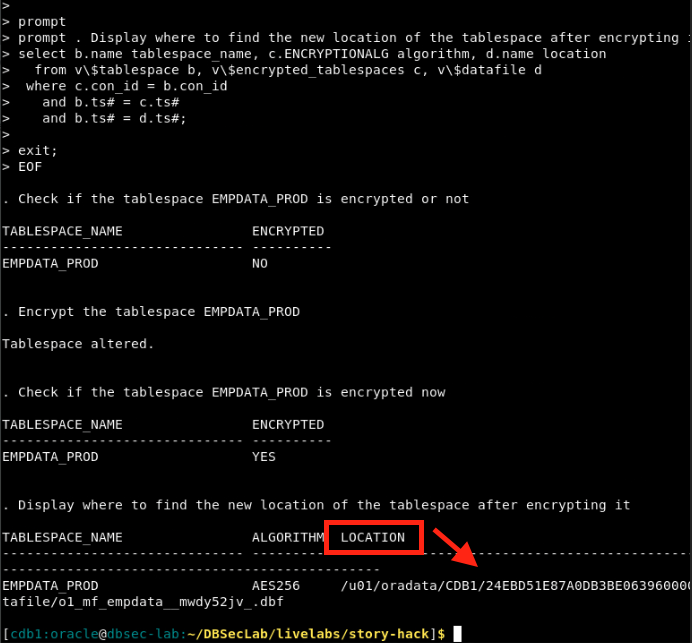
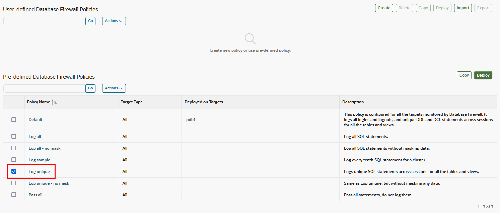
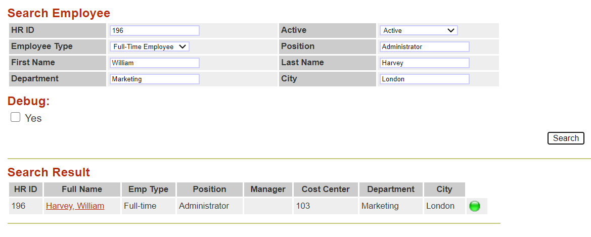

# Attack-Defense scenario

## Introduction
In this lab, let's walk through the techniques that attackers use to break into your database and exfiltrate your data.

You will perform different scenarios:
- **as an attacker** - your main objective will be to exfiltrate sensitive data from the target database before encrypting the database as part of a ransomware attack
- **as a defender** - your main objective will be to prevent, detect and mitigate these attacks


*Estimated Time:* 45 minutes

Watch the video below for a quick walk-through of the lab.
[Oracle facing a Ransomware attack](videohub:1_n8s28bsk)

### Objectives
You will learn how to:
- Prevent, detect and mitigate data exfiltration
- Prevent and detect privileges escalation and abuse
- Prevent and mitigate exploitation of vulnerabilities

### Prerequisites
This lab assumes you have:
<if type="brown">
- A Free Tier, Paid or LiveLabs Oracle Cloud account
- You have completed:
    - Lab: Prepare Setup (*Free-tier* and *Paid Tenants* only)
    - Lab: Environment Setup
    - Lab: Initialize Environment
</if>
<if type="green">
- An Oracle Cloud account
- You have completed:
    - Introduction Tasks
</if>

### Lab Timing (estimated)

| Task No. | Feature                                                 | Approx. Time | Details |
| -------- | ------------------------------------------------------- | ------------ | ------- |
| 1        | Data exfiltration by bypassing database access controls | <15 minutes  |         |
| 2        | Data exfiltration through an application                | <15 minutes  |         |
| 3        | Data exfiltration from the database                     | <15 minutes  |         |

## Task 1: Data exfiltration by bypassing database access controls

Acting while remaining silent is a golden rule for any good attacker. Anything that can be done far away from the target is preferred because the closer the attacker gets to the target, the greater their risk of being caught.

Databases are protected by access controls designed to limit the scope of data access, and audit controls that detect improper activity. The attackers try to avoid those access and audit controls. Once they are on a system and have decided to launch their attack to exfiltrate sensitive data, they first attempt to obtain as much sensitive information as possible without trying to connect to the database.

Several options are available in this case. From the farthest to the closest to the database, here is the collection:
- **From the network** (data-in-transit)
- **From inert and residual files** (backups and exports)
- **From Database data files** (data-at-rest)


1. If it is not open already, Open a terminal session on your **DBSec-Lab** VM as OS user *oracle*.

    

2. Navigate to the `livelabs` folder.

    ```
    <copy>cd livelabs</copy>
    ```

3. Remove the current `story-hack` lab directory.

    ```
    <copy>rm -rfv story-hack</copy>
    ```
4. Retrieve the new `story-hack` directory.

    ```
    <copy>wget https://objectstorage.us-ashburn-1.oraclecloud.com/p/wUCGLVTGIyezbgPkjf9GCU8v1vVNH8-bfQOve5X6GZr6xKSYO1NfWzgxHo2Lzb1K/n/oradbclouducm/b/LiveLabs-bucket-prod/o/story-hack.zip</copy>
    ```
5. Unzip the `story-hack.zip` file.

    ```
    <copy>unzip story-hack.zip</copy>
    ```
6. Navigate the new `story-hack` directory.

    ```
    <copy>cd story-hack</copy>
    ```

7. Ensure all scripts have the necessary execution privileges.

    ```
    <copy>chmod +x *.sh</copy>
    ```

## Task 1a: Prevent data exfiltration from the network (data-in-transit)

Attackers can use packet analyzers, also known as packet sniffers, protocol analyzers, or network analyzers, to intercept and inspect network traffic. Two of the most well-known tools for this purpose are **tcpdump** and **Wireshark**, which is a graphical version of tcpdump with advanced sorting and filtering capabilities.  

These tools allow attackers to capture and analyze every packet traveling through a local network. This includes monitoring the SQL traffic between a client and a server, potentially exposing highly sensitive data such as credentials transmitted in plaintext or other unencrypted information.  

The best defense against this type of attack is to encrypt network traffic and enforce secure communication protocols such as SSH, including SFTP and SCP, and TLS, including HTTPS and FTPS. Unfortunately, many internal company networks remain unprotected due to a lack of security awareness or training. Even worse, some organizations intentionally leave their networks unencrypted to maintain the functionality of expensive network monitoring tools. Since encryption would make these tools ineffective, administrators may resist securing the network, prioritizing convenience and troubleshooting over security.

In the following lab you will be working in two PDBs. **PDB1** represents a database that is not secure, whereas **PDB2** represents a Oracle database that follows secure standards and best practices utilizign Oracle database security technologies. You will be walking through these technologies and their impacts in the following lab:

To see how easy it is to exfiltrate data from an unencrypted network, let's run a simple SQL query on PDB1 (unsecured database) and run tcpdump to analyze its traffic.


1. Execute a SQL query **on PDB1** and run tcpdump to capture and analyze the packets in transit on the network (wait for the end of the execution).

    ```
    <copy>./sh_extract_data_from_network.sh pdb1</copy>
    ```

    ")

    **Note**:
    - The script output confirms that unencrypted data is being transmitted over the network. Even if native network encryption is not enabled, the output still lists available security services. For example, the presence of "Encryption service for Linux" indicates that encryption is supported and could be used, but the session itself remains unencrypted.
    - One key detail missing from the output is a reference to specific encryption algorithms, which would typically indicate that encryption is active. When we analyze an encrypted session, this distinction will become more apparent.
    - The script executes the following SQL query on PDB1: `SELECT firstname, lastname, salary, address_1 FROM employeesearch_prod.demo_hr_employees`
    - It captures and analyzes the traffic network generated
    - It displays the result of the analysis

        

    **Note**: Because the session is unencrypted, the query results appear in clear-text on the network. It is easy for an attacker to capture and exfiltrate the sensitive data-in-transit!

2. Now, let's have a look at what happens with an encrypted session. We run the same SQL query on PDB2 (the secured database). Again, we will use tcpdump to analyze the session traffic.

3. Execute an SQL query on PDB2 and run tcpdump to capture and analyze the packets in transit on the network (wait for the end of the execution).

    ```
    <copy>./sh_extract_data_from_network.sh pdb2</copy>
    ```

    **Note**:
    - The script verifies whether SQL traffic is encrypted. In this case, encryption is active because an algorithm has been selected for the session. The output still includes the default banner information for the available encryption and integrity services, but now it also specifies the encryption algorithm in use: `AES256 Encryption service adapter for Linux`.

    

    
4. Confirm that the tcpdump only returns back encrypted data.

    

    **Notes**:
    - The DEMO_HR_EMPLOYEES table can still be queried, but in the tcpdump output, the data appears unreadable because the session is encrypted.
    - Even if the network is compromised, SQL traffic remains secure without requiring code updates, application changes, or network modifications. Your sensitive data stays protected in transit.
    - Network administrators can still use their existing monitoring tools to analyze events, but they will not be able to read the encrypted data in transit.

    Encrypting SQL traffic for an Oracle Database is quick and straightforward. It takes effect immediately without downtime, application modifications, or complex configurations. There is no reason to delay implementation.

5. We protected the SQL traffic using an encryption feature provided natively by the Oracle database, called **Native Network Encryption (NNE)**. Another option for encrypting network traffic would be Transport Layer Security (TLS). We chose NNE because, unlike TLS, NNE doesn't require any changes in the application.

    > To learn more about how to enable NNE, please refer to the "[DB Security - Native Network Encryption] (https://livelabs.oracle.com/pls/apex/dbpm/r/livelabs/view-workshop?wid=700)" workshop

## Task 1b: Prevent data exfiltration from inert and residual files (backups and exports)

Stealing unencrypted data from network traffic is easy for an attacker, but it only provides access to data currently in transit. Since this method is passive, it does not expose the database structure, making it difficult for the attacker to determine what other valuable information exists.

To gain deeper access, the attacker moves closer to the database while avoiding detection. Their focus shifts to database-related files, such as backups and exports, which are often stored outside the database server and widely distributed across the organization. These files are rarely monitored or secured, making them a valuable target. They can contain sensitive data, database structures, and other critical information.

Attackers may retrieve these files from file shares, backup servers, email attachments, physical tapes, or service providers with weak security practices. Once obtained, they can analyze the data at their convenience without the risk of triggering security alerts.

Let's see how this type of attack could focus on an export file, but keep in mind that it would work the same way with a backup file.

1. Let's say that while performing a search, the attacker finds an old, insecure PDB1 export file (`employeesearch_data_PDB1_20241006.dmp`) that was generated for use by a development or support team. The attacker tries to read the file contents.

    ```
    <copy>./sh_extract_data_from_file.sh employeesearch_data_PDB1_20241006.dmp</copy>
    ```

    

    **Note**:
    - By scrolling through the output, you can see that all the schema data and metadata are readable!
    - Because this file wasn't encrypted when it was generated, it's possible to extract its entire content by simply reading it

2. If an attacker wants to steal all email addresses, they can do so effortlessly using the right command.

    ```
    <copy>./sh_extract_data_from_file.sh employeesearch_data_PDB1_20241006.dmp |grep -o '[[:alnum:]+\.\_\-]*@[[:alnum:]+\.\_\-]*' | sort | uniq -i</copy>
    ```

    

3. Now, do the same thing on export file from PDB2 (`employeesearch_data_PDB2_20241006.dmp`). Unlike the export from PDB1, this export was encrypted.

    ```
    <copy>./sh_extract_data_from_file.sh employeesearch_data_PDB2_20241006.dmp</copy>
    ```

    

    **Note**:
    - The output is unreadable!
    - Because this file was encrypted when it was generated, it is impossible to extract usable content

4. If the attacker tries to exfiltrate all the email addresses, there is nothing but unusable data.

    ```
    <copy>./sh_extract_data_from_file.sh employeesearch_data_PDB2_20241006.dmp |grep -o '[[:alnum:]+\.\_\-]*@[[:alnum:]+\.\_\-]*' | sort | uniq -i</copy>
    ```

    

5. Here, we have used Data Pump Encryption, one of the database encryption features provide by the **Oracle Advanced Security Option (ASO)**

    ---

    A system administrator might argue that securing an exported file is simple and that using encryption utilities like GnuPG or mCrypt is enough to prevent data theft. However, what seems like an effective solution in theory often falls short in practice.

    Each time these utilities are used, the file is initially created in plaintext before being encrypted. This exposes it to potential compromise during the brief but critical window between file generation and encryption. Additionally, managing encryption manually adds operational complexity.

    Users must generate and securely store unique encryption keys to ensure future access. Alternatively, they might use passwords, which also need secure storage and careful management. If a password is lost, the file becomes inaccessible. To make matters worse, operational inefficiencies often lead administrators to reuse passwords across multiple files or store them insecurely to avoid losing access. Over time, personnel changes require password updates, adding to the administrative burden.

    These challenges make manual encryption difficult to sustain. Anything perceived as an operational barrier is rarely maintained consistently, increasing the risk of security gaps.

    A more effective approach is to use Oracle Database’s native encryption features, such as Data Pump encryption for export files and RMAN backup encryption for database backups.

    **Benefits of using database encryption**

    Compared to third-party encryption solutions like GnuPG or mCrypt, database encryption provides several key advantages:
    - **Native Integration** – No additional software or layers are required. Encryption is built into the Oracle Database, optimized for performance, and ready to use.
    - **Automated and Transparent** – Once enabled, encryption happens automatically during the export process without requiring manual intervention from an administrator.
    - **Non-Intrusive** – No changes to application code or system architecture are needed.
    - **Secure Key Management** – No passwords to manage. Encryption keys are automatically generated and securely stored.
    - **Centralized Control** – For Data Pump exports, encryption keys are generated by the Oracle Database and stored in a local keystore or a centralized key manager like Oracle Key Vault (OKV).
    - **Built-in RMAN Encryption** – RMAN backups automatically encrypt database blocks without requiring additional key generation. Encryption is seamless, and all keys are securely stored in the database keystore.
    - **Reduced Exposure Window** – With Data Pump, encryption occurs during the export process, eliminating the risk of data exposure between file creation and encryption.

    ---

## Task 1c: Prevent data exfiltration from Database data files (data-at-rest)

If an attacker wants more data, especially if a previous breach only provided a partial export or if earlier attempts were blocked, they will need to take bigger risks. This means getting closer to the database while avoiding detection by access and audit controls. At this stage, they target active data files, which contain the entire database.

They have two main options:
 - attack the production server directly
 - extract data from non-production servers.

Attacking production is riskier, but if they have limited time or believe they can avoid detection, they will proceed. If they are not in a hurry, they may focus on non-production servers, which are often outdated or incomplete but tend to have weaker security and minimal monitoring.

The attack method is similar in both cases. First, we will examine how an attacker might compromise a production server. Later, we will look at how to secure non-production data.

### **Option 1: The attacker targets the production server**

We will use a well-known Linux command "strings" to view data in the datafiles associated with the EMPDATA_PROD tablespace. Strings is an OS command that operates directly on the database files, bypassing database access and audit controls.

1. On PDB1, the `EMPDATA_PROD` tablespace is unsecured and its associated datafiles is named `empdata_prod.dbf`

    ```
    <copy>./sh_extract_data_from_file.sh ${DATA_DIR}/pdb1/empdata_prod.dbf</copy>
    ```

    

    **Note**:
    - By scrolling through the output, you can see that all the schema data and metadata are visible!
    - Because this datafile is not encrypted, it's easy to extract its entire contents by simply reading it
    - **Notice**: Even if this datafile is located on an encrypted disk array or encrypted by a third-tier software, the content of the file is still available to a privileged user like root or oracle


2. On PDB2, encrypt the `EMPDATA_PROD` tablespace to secure it and execute the same extraction command on the datafile to see now if you can exfiltrate sensitive data

    ```
    <copy>
    sqlplus -s ${DBUSR_SYSTEM}/${DBUSR_PWD}@pdb2 <<EOF
    set lines 2000
    col algorithm       format a10
    col encrypted       format a10
    col file_name       format a45
    col pdb_name        format a20
    col online_status   format a15
    col tablespace_name format a30
    col location        format a100
    
    prompt
    prompt . Check if the tablespace EMPDATA_PROD is encrypted or not
    select tablespace_name, encrypted from dba_tablespaces where tablespace_name = 'EMPDATA_PROD';

    prompt
    prompt . Encrypt the tablespace EMPDATA_PROD
    ALTER TABLESPACE empdata_prod ENCRYPTION ONLINE ENCRYPT;

    prompt
    prompt . Check if the tablespace EMPDATA_PROD is encrypted now
    select tablespace_name, encrypted from dba_tablespaces where tablespace_name = 'EMPDATA_PROD';

    prompt
    prompt . Display where to find the new location of the tablespace after encrypting it
    select b.name tablespace_name, c.ENCRYPTIONALG algorithm, d.name location
      from v\$tablespace b, v\$encrypted_tablespaces c, v\$datafile d
     where c.con_id = b.con_id
       and b.ts# = c.ts#
       and b.ts# = d.ts#;

    exit;
    EOF
    </copy>
    ```
3. Copy the file location provided from the output of the previous command to a clip board. Enter and execute the following command. You will be prompted to provide that file location you copied from the previous command.

    
    

    ```
    <copy>
    read -p "File Location: " file_name && ./sh_extract_data_from_file.sh $file_name
    </copy>
    ```

    

    

    **Notes**:
    - The output appears unreadable because the datafile is encrypted at the database block level.
    - This encryption ensures that its contents cannot be accessed directly. The only way to read the data is through an authorized database session, which is subject to access controls and audit logging.

3. This time, we have used another database encryption feature provide natively by the Oracle database called **Transparent Data Encryption (TDE)**. TDE is included with all Oracle Database cloud services and is available with Oracle Enterprise Edition databases.

    ---

    **Benefits of using Oracle Transparent Data Encryption (TDE)**
    - As a security administrator, you have peace of mind knowing that sensitive data is secured in the event that the storage media or data file is stolen - Data is encrypted within the database and therefore safe everywhere in Oracle Database ecosystem the data is copied to (including clones of the database, backups, etc)
    - Using TDE helps you address encryption-related regulatory compliance issues
    - You don't need to modify applications to use TDE. Data is transparently encrypted as it is added to the database, and transparently decrypted for authorized database sessions
    - You can encrypt data with zero downtime on production systems by using "Online Table Redefinition," or you can encrypt it offline during maintenance periods (see "Oracle Database Administrator's Guide" for more information about "Online Table Redefinition")
    - Oracle Database automates TDE master encryption key and keystore management operations. The user or application does not need to manage TDE master encryption keys and the keys are never exposed to the clients, reducing the chances for loss or theft of the keys

    > To learn more about how to use TDE, please refer to the "[DB Security - ASO (Transparent Data Encryption & Data Redaction)] (https://livelabs.oracle.com/pls/apex/dbpm/r/livelabs/view-workshop?wid=703)" workshop

    ---

### **Option 2: The attacker focuses on the non-production (test or development) database servers**

If an attacker has more time, they will avoid targeting the production database to reduce the risk of detection. Instead, they often focus on non-production systems, which typically have fewer security controls and less monitoring. On average, for each production database, there are four non-production databases, such as development, testing, integration, and staging. Many of these are direct clones of production and contain the same sensitive data. Since developers need realistic environments to work effectively, non-production databases often mirror production closely.

Applying the same security measures to non-production databases is often impractical. The cost of securing multiple environments can be high, and developers frequently require full access to perform their tasks.

The best approach is to establish a strong baseline of security, including auditing and regular assessments. More importantly, non-production databases should remain functional for development and testing but should not contain real sensitive data. The safest and most cost-effective solution is data masking, which removes security risks from these database copies. Masking ensures that sensitive information is not exposed while allowing teams to work efficiently without the need for production-level security controls.


If you refresh your development database from the production database every Monday, it immediately becomes as sensitive as the production environment. This means your data files are just as vulnerable to the same attacks previously discussed.

1. Refresh **the development database from the production database on PDB1 without applying a masking script**.

    ```
    <copy>./sh_refresh_dev_from_prod.sh pdb1 nomasking</copy>
    ```

    

    **Note**: Because the data is not masked in development, you can see the same sensitive data that is in production!

2. Next, for example, **extract only the email of the User 73** (`Craig.Hunt@oracledemo.com`) from the development datafile `empdata_dev.dbf` **on PDB1**, as seen in the previous attack.

    ```
    <copy>strings ${DATA_DIR}/pdb1/empdata_dev.dbf |grep -o 'Craig.Hunt@oracledemo.com'</copy>
    ```

    

    **Note**:
    - The database file is readable as expected, and you can see the email address. Therefore, production-sensitive data is vulnerable in the development environment!
    - In this example, only a single email address was exfiltrated, but an attacker could use the same method to extract any dataset they wanted.
    - To prevent this, the development environment must have strong security measures in place. This includes implementing, maintaining, and continuously monitoring security controls to protect sensitive data from unauthorized access.

3. Now, let's see what happens if you **mask the sensitive data during the duplication process in Dev on PDB2**

    ```
    <copy>./sh_refresh_dev_from_prod.sh pdb2 masking</copy>
    ```

    

    **Note**:
    - Here, we apply a masking script during the data refresh process that removes risk from sensitive data by replacing it with non-sensitive, usually artificial, data:
        - Set a new value to `CREATIONDATE` from a specific date range
        - Apply the format "xxxxx@email.com" to EMAIL
        - Set random values to `PHONEMOBILE` by preserving the original format (3 digits - 3 digits - 4 digits)
        - Hide `SALARY`
        - Set random values to `SSN` by preserving the original format (3 digits - 2 digits - 4 digits)
        - Set a realistic new value to `CORPORATE_CARD` from credit card number library
    - Now, the **data is masked in development and is different from what is in production**!

4. Next, try again to **extract only the email of the user 73** (`Craig.Hunt@oracledemo.com`) from the development datafile `empdata_dev.dbf` **on PDB2**

    ```
    <copy>strings ${DATA_DIR}/pdb2/empdata_dev.dbf |grep -o 'Craig.Hunt@oracLedemo.com'</copy>
    ```

    

    **Note**:
    - **There's no result!**
    - Although the datafile is still readable as expected - remember, we didn't encrypt the development env - but now, because the data is masked in development, even if the attacker actually connects to the database, there's no longer sensitive data to be stolen!

<!--
    !!! BELOW, SECTION TO CHANGE ASAP !!!
    -----
    --
   
    <copy>./sh_extract_data_from_file.sh ${DATA_DIR}/pdb2/empdata_dev.dbf |grep -o 'Craig.Hunt@oracledemo.com'</copy>
    
    --
    -----
    !!! END OF CHANGE !!!
-->

5. Here, we have used the data masking capability provided by the Oracle Database, called **Data Masking and Subsetting (DMS)**.

    ---

    Oracle Data Masking and Subsetting (DMS) generates a scalable masking script with a highly efficient and robust mechanism for creating consistent and realistic masked data. No need to manually create a complex masking script to maintain, just define the masking rules and DMS generates the masking script for you.

    **Benefits of using DMS**
    - Maximize the business value of data by masking sensitive information
    - Minimize the compliance boundary by not proliferating the sensitive production information
    - Lower the storage costs on test and development environments by subsetting data
    - Automate the discovery of sensitive data and parent-child relationships
    - Provide a comprehensive library of masking formats, masking transformations, subsetting techniques, and select application templates
    - Maintain your masking script easily over time according to the evolution of the schemas structures
    - Mask and subset data in-Database or on-the-file by extracting the data from a source database
    - Mask and subset Oracle Databases hosted on-premises, in the Oracle Cloud, and in third-party clouds
    - Preserve data integrity during masking and subsetting and offers many more unique features
    - Integrate with select Oracle testing, security, and integration products

    > To know more about DMS, please refer to the "[DB Security - Data Masking and Subsetting] (https://livelabs.oracle.com/pls/apex/dbpm/r/livelabs/view-workshop?wid=704)" workshop. The Oracle Data Safe cloud service also provides Data Masking capability. If you'd like more information on using Oracle Data Safe please refer to the "[Get Started with Oracle Data Safe Fundamentals] (https://livelabs.oracle.com/pls/apex/dbpm/r/livelabs/view-workshop?wid=598)" workshop

    ---

## Task 2: Data exfiltration through an application

Next, the attacker will try to extract data indirectly by targeting an application that connects to the database. This increases their risk of detection, especially if security measures like a Web Application Firewall (WAF) are in place to monitor for such attacks.


The attacker may already have access to the application, even with a basic user account. However, they may not need any access at all. If the application is poorly coded, vulnerabilities could allow them to steal data directly from the login screen without ever successfully logging in.

Hackers use two common techniques when attacking the database through an application:
- **SQL Injection**
- **Sensitive data harvesting**

## Task 2a: Detect and mitigate a SQL Injection

SQL Injection (SQLi) is a code injection technique used to attack data-driven applications by inserting malicious SQL statements into entry fields.

SQL injection (SQLi) is one of the most common and powerful cyber attacks used to exploit vulnerabilities in applications that interact with databases. It works by manipulating an application's SQL queries through unexpected input, often via a form field, to gain unauthorized access to data. An attacker can extract sensitive information, modify or delete records, create new user accounts, or even escalate privileges, potentially compromising the entire system.

Despite widespread awareness, SQLi vulnerabilities continue to be discovered, even in well-known applications. Many older systems remain unpatched, while new ones can still be at risk if secure coding practices are not followed. Regular developer training, secure coding techniques, and thorough code audits are essential to preventing these vulnerabilities.

In this lab, you will perform a UNION-based SQL injection attack on an application that lacks proper security protections. You will see firsthand how an attacker can exploit SQLi and then learn how to defend against it effectively.

1. If not open already, open a new Web browser tab and launch the HR app **On PDB1** (unsecured):
    <if type="green">
    - **On PDB1** (unsecured) to this URL: *`http://dbsec-lab:8080/hr_prod_pdb1`*
    </if>
    <if type="brown">
    - If you are working from a remote desktop (usually the case for this lab):
        - **On PDB1** (unsecured) to this URL: *`http://dbsec-lab:8080/hr_prod_pdb1`*
    - If you are working through a public IP address (often the case if you launched this lab in your own tenancy):
        - **On PDB1**: *`http://<YOUR_DBSEC-LAB_VM_PUBLIC_IP>:8080/hr_prod_pdb1`*
    </if>
    
    **Note**: Remember, this application is deliberately poorly developed to allow attacks such as SQL injection attacks

2. Login to th application as *`hradmin`* with the password "*`Oracle123`*"

    ```
    <copy>hradmin</copy>
    ```

    ```
    <copy>Oracle123</copy>
    ```

    

    

3. Click **Search Employees**

4. Click [**Search**]

    

    **Note**: All rows are returned because, remember, you allowed everything!

5. Now, tick the **checkbox "Debug"** to see the SQL query behind this form

    

6. Click [**Search**] again

    

    **Note:**
    - Now, you can see the SQL query executed by this form which displays the results
    - This query gives you the information of the number of columns requested, their name, the tables in use, and their relationship. That information helps you know what database columns relate to which columns in the application's user interface.

7. Based on this information, you can use a "UNION-based" SQL injection query to display sensitive data you want to extract. Here, we will use this query to extract `USER_ID, MEMBER_ID, PAYMENT_ACCT_NO` and `ROUTING_NUMBER` from the `DEMO_HR_SUPPLEMENTAL_DATA` table.

    ```
    <copy>
    ' UNION SELECT userid, ' ID: '|| member_id, 'SQLi', '1', '1', '1', '1', '1', '1', 0, 0, payment_acct_no, routing_number, sysdate, sysdate, '0', 1, '1', '1', 1 FROM demo_hr_supplemental_data --
    </copy>
    ```

8. Copy the SQL Injection query, **paste it directly into the field "Position"** on the Search form on both Web App and tick the "Debug" checkbox.

    

    **Note:**
    - Don't forget the "`'`" before the UNION key word to close the SQL clause "LIKE"
    - Don't forget the "`--`" at the end to disable rest of the application's original query

9. Click [**Search**]

    

    **Note:**
    - Now, because the source code of the app is exposed to this kind of attack, instead of the results as usual, you can see sensitive information that the application developer never intended to expose to you!
    - Of course, you can modify this UNION query and extract different columns if you want.
    - The key is to ensure the number of returned values continues to match the original source query.


<!--
-----------------------------------------------------------------------------
--  !!! BELOW, SECTION TO CHANGE ASAP !!!
-----------------------------------------------------------------------------
-->  
10. Now, we will configure **PDB2** to prevent this kind of attack

11. Go back to your terminal session and configure a new Glassfish Application connection string for PDB2 to proxy through the Database Firewall

    ```
    <copy>
    sudo sed -i -e 's|pdb1|pdb2|g' /u01/app/glassfish/hr_prod_pdb2/WEB-INF/classes/hr.properties
    sudo sed -i -e 's|15223|15224|g' /u01/app/glassfish/hr_prod_pdb2/WEB-INF/classes/hr.properties.fw
    sudo sed -i -e 's|15223|15224|g' /home/oracle/DBSecLab/livelabs/story-hack/hr_prod_pdb2_dbfw.properties
    ./sh_start_proxy_glassfish.sh
    </copy>
    ```

    

12. If not already open, Use the guide or URL below to launch the HR app on **PDB2**.

    <if type="green">
    - **On PDB2** (secured) to this URL: *`http://dbsec-lab:8080/hr_prod_pdb2`*
    </if>
    <if type="brown">
    - If you are working from a remote desktop (usually the case for this lab):
        - **On PDB2** (secured) to this URL: *`http://dbsec-lab:8080/hr_prod_pdb2`*
    - If you are working through a public IP address (often the case if you launched this lab in your own tenancy):
        - **On PDB2**: *`http://<YOUR_DBSEC-LAB_VM_PUBLIC_IP>:8080/hr_prod_pdb2`*
    </if>
    
    **Note**:
    - To help you differentiate between the applications, the HR App menu is grey on PDB1 and in red on PDB2.
    - Remember, this application is deliberately poorly developed to allow attacks such as SQL injection attacks.

13. Verify the Glassfish Application connection string go through the Database Firewall
    - Login as *`hradmin`* with the password "*`Oracle123`*"

        

        

    - In the top right hand corner of the App, click on the **Weclome HR Administrator** link to view the **Session Details** page

        

    - You should see that the **IP Address** row has changed from **10.0.0.150** to **10.0.0.152**, which is the IP Address of the DB Firewall VM

        

14. Train the DB Firewall for Expected SQL Traffic (here, we will train the Oracle Database Firewall so we can monitor, and block, non-authorized SQL commands)

    - If not open already, use the guide or URL `https://av` to access to the Audit Vault Web Console.
    
        **Note**: If you are not using the remote desktop you can also access this page by going to *`https://<AVS-VM-Public-IP>`*
    
    - Login to Audit Vault Web Console as *`AVAUDITOR`* (use the new password you did reset in the "Initialize Environment" lab earlier)
    
        ````
        <copy>AVAUDITOR</copy>
        ````

         **Note**: If you have not retrieved the password for the `AVAUDITOR` user in the AVDF console, you can do so with the following command:

        ```
        <copy>echo $AVUSR_PWD</copy>
        ```
    
    - When you paste that default password into the AVDF console login, it will prompt you to reset your password

        

    - On top, click on the **Policies** tab

    - Click the **Database Firewall Policies** sub-menu on left

        

    - Check the **Log unique** option to enable the Database Firewall Policy, then click [**Deploy**]

        

        **Note:**
        - Log unique policies enable you to log statements for offline analysis that include each distinct source of SQL traffic. Be aware that if you apply this policy, even though it stores fewer statements than if you had chosen to log all statements, it can still use a significant amount of storage for the logged data.
        - Log unique policies log SQL traffic specifically for developing a new policy. The logged data enables the Analyzer to understand how client applications use the database and enables rapid development of a policy that reflects actual use of the database and its client applications.

    - Select the targets to be covered by this policy (here *pdb2*) and click [**Deploy**].

        

    - Refresh the page to see the "Log unique" policy deployed for the target pdb2.

        

    - Generate Glassfish Application Traffic.

        - Go back to your Glassfish App web page and **Logout** explicitly to train the DB Firewall.

            

        - Login as *`hradmin`* with the password "*`Oracle123`*".

            

        - Click **Search Employees**.

            

        - In the **HR ID** field enter "*`164`*" and click [**Search**].

            

        - Clear the **HR ID** field and click [**Search**] again to see all rows.

            

        - Enter the following information in the **Search Employee** fields.

            - HR ID: *`196`*
            - Active: *`Active`*
            - Employee Type: *`Full-Time Employee`*
            - Position: *`Administrator`*
            - First Name: *`William`*
            - Last Name: *`Harvey`*
            - Department: *`Marketing`*
            - City: *`London`*

                

        - Click [**Search**]

        - Click on "**Harvey, William**" to view the details of this employee

            

15. Now, build the DB Firewall Allow-List Policy

    - Go back to Audit Vault Web Console as *`AVAUDITOR`* to create a Database Firewall Policy

        

    - Click the **Policies** tab

    - Click the **Database Firewall Policies** sub-menu on left

    - Click [**Create**]

        

    - Create the Database Firewall Policy with the following information

        - Policy Name: *`HR Policy`*
        - Target Type: *`Oracle Database`*
        - Description: *`This policy will protect the My HR App`*

            

        - Click [**Save**]

    - Now, create the context of this policy by clicking [**Sets/Profiles**]

        

    - In the **SQL Cluster Sets** subtab, click [**Add**]

        

    - In the **Add SQL Cluster Set** screen, create the list of known queries as following

        - Name: *`HR SQL Cluster`*
        - Description: *`Known SQL statements for HR App`*
        - Target: *`pdb2`*
        - Show cluster for: *`Last 24 Hours`* (or make this `Last Week`)
        - Click [**Go**]

            

        - Click [**Actions**] and select "*`ALL`*" in **Row per page** option to display all the results

            

        - Check the **Select all** box next to the "**Cluster ID**" Header to add all "trained" queries into the SQL Clusters

            

        - Click [**Save**]

    - Click [**Back**]

        

    - Select the **SQL Statement** sub-tab and click [**Add**]

        

    - Complete the **SQL Statement** with the following information to allow the **HR SQL Cluster** created previoulsy (here we consider that these queries are official and can be executed)

        - Rule Name: *`Allows HR SQL`*
        - Description: *`Allowed SQL statements for HR App`*
        - Cluster Set(s): *`HR SQL Cluster`*
        - Action: *`Pass`*
        - Logging Level: *`Don't Log`*
        - Threat Severity: *`Minimal`*

            

        - Click [**Save**]

    - Finally, select the **Default** tab to specify what the DB Firewall policy has to do you if you are not in the context definied previously (here we will block all the "black-listed" queries and we will return a blank result)

        

        - Click on **Default Rule** under the Rule Name, to edit the Default rule, and enter the following information
            - Action: *`Block`*
            - Logging Level: *`One-Per-Session`*
            - Threat Severity: *`Moderate`*
            - Substitution SQL: *`SELECT 100 FROM dual WHERE 1=2`*

                

        - Click [**Save**]

    - Your HR Policy should look like this:

        

    - Click [**Save**]

    - Once created, the policy is **automatically published**, but now you have to deploy it

        

    - Check the **HR Policy** option, then click [**Deploy**]

        

    - Select the targets to be covered by this policy (here *pdb2*) and click [**Deploy**] 

        

    - Now, refresh the page to see the "HR Policy" policy deployed for the target pdb2

        

16. Once the DB Firewall Policy is enabled, we will validate the impact on the Glassfish App
    - Go back to your Glassfish App web page and logout

        

    - Login as *`hradmin`* with the password "*`Oracle123`*"

        

        

    - Click **Search Employees**

    - Click [**Search**]

        

        **Note**: All rows are returned... Remember, all "official" queries from the HR App have been allowed in **HR SQL Cluter** in your DB Firewall policy

    - Even if you add a search criteria and query again, you can access to the result (here we **filter by "HR ID = 196"** for example)

        

17. Block a SQL Injection Attack

    - Tick the **checkbox "Debug"** to see the SQL query behind this form

        

    - Click [**Search**] again

        

        **Note:**
        - Now, you can see the official SQL query executed by this form which displays the results
        - This query gives you the information of the number of columns requested, their name, their datatype and their relationship

    - Now, based on this information, you can create our "UNION-based" SQL Injection query to display all sensitive data you want extract directly from the form. Here, we will use this query to extract `USER_ID', 'MEMBER_ID', 'PAYMENT_ACCT_NO` and `ROUTING_NUMBER` from `DEMO_HR_SUPPLEMENTAL_DATA` table.

        ````
        <copy>
        ' UNION SELECT userid, ' ID: '|| member_id, 'SQLi', '1', '1', '1', '1', '1', '1', 0, 0, payment_acct_no, routing_number, sysdate, sysdate, '0', 1, '1', '1', 1 FROM demo_hr_supplemental_data --
        </copy>
        ````

    - Copy the SQL Injection query, **paste it directly into the field "Position"** on the Search form and **tick the "Debug" checkbox**

        

        **Note:**
        - Don't forget the "`'`" before the UNION key word to close the SQL clause "LIKE"
        - Don't forget the "`--`" at the end to disable rest of the query

    - Click [**Search**]

        

        **Note**:
        - Unlike PDB1, which returned all sensitive data from the UNION request, **PDB2 returns no rows**.
        - Remember, this is because the UNION query has not been added into the Allow-list in the DB Firewall policy... as simple as that!

18. Now, go back to your terminal session to restore the initial Glassfish Application connection string for PDB2 without DB Firewall

    ```
    <copy>
    ./sh_stop_proxy_glassfish.sh
    </copy>
    ```

    

19. Here, we have used the SQL Firewalling feature provide by **Oracle Audit Vault and Database Firewall (AVDF)** or **Oracle SQL Firewall**

    > To learn more about how to use the Database Firewall to protect against SQL injection, please refer to the "[DB Security - Audit Vault and DB Firewall] (https://livelabs.oracle.com/pls/apex/dbpm/r/livelabs/view-workshop?wid=711)" or "[DB Security - Oracle SQL Firewall] (https://livelabs.oracle.com/pls/apex/dbpm/r/livelabs/view-workshop?wid=3875)" workshops

<!--
-----------------------------------------------------------------------------
--                        END OF SECTION TO CHANGE                         --
-----------------------------------------------------------------------------
-->

## Task 2b: Detect and mitigate the sensitive data harvesting

Many older applications expose data to the user that is no longer appropriate. Older applications were often developed when privacy concerns were not as important as they are now and when privacy regulations were not as stringent. It may not be practical to modify the applications, but you can still control the display of sensitive data within those applications.

1. Go back to your HR App on both env (PDB1 and PDB2) and click on **Search Employees**

    

2. We'll filter on the employee "Alice HARPER" for example by entering **77 as HR ID** value and click [**Search**]

    

3. Now, click on the **Full Name** link of this employee to see her details

    

    - **On PDB1** (unsecured), as you can see, sensitive data like the `SSN` or `SIN` is readable by an authorized user. Or by a user the application THINKS is authorized (perhaps this session is a hacker using compromised account credentials)!

        

    - **On PDB2** (secured), even with the same user, the same privileges, the same application, from the same server, the column `SIN` is no longer available!

        - Create the policy
        
        ```
        <copy>./sh_create_redact_policy.sh</copy>
        ```
        

        **Note**: Here, we'll create a policy to prohibit all access to sensitive data for any connection that does not come from a private IP address

        - check the effect on the App
        
        

        **Note**: To see the effects, you need to connect to the App from the server's public IP address

4. Here, we have used the data redaction feature provide natively by the Oracle database, called **Data Redaction**

    **Note**:
    - Because we've decided that application users have no need to view extremely sensitive information like `SSN`/`SIN`, we placed a redaction policy on the database table that controls the conditions under which the data is allowed to leave the database
    - Because Data Redaction is part of the database, there is no need to modify the application to hide this sensitive data. Just create a Data Redaction policy on the table that holds your sensitive column and refresh the application screen to see the effects

    ---

    **Benefits of Using Oracle Data Redaction**
    - You have different styles of redaction from which to choose
    - Because the data is redacted at runtime, Data Redaction is well suited to environments in which data is constantly changing
    - You can create the Data Redaction policies in one central location and easily manage them from there
    - The Data Redaction policies enable you to create a wide variety of policy conditions based on `SYS_CONTEXT` values, which can be used at runtime to decide when the Data Redaction policies will apply to the results of the application user's query

    > To learn more about how to use Data Redaction, please refer to the "[DB Security - ASO (Transparent Data Encryption & Data Redaction)] (https://livelabs.oracle.com/pls/apex/dbpm/r/livelabs/view-workshop?wid=703)" workshop. If you want to get hands on with Data Redaction on **Autonomous Database**, please refer to "[Oracle Data Redaction for Oracle Autonomous Database] (https://livelabs.oracle.com/pls/apex/f?p=133:180:102750004961851::::wid:4061)"

    ---

## Task 3: Data exfiltration from the database

Our attacker now switches their attention to a direct attack on the database.


Hackers use four common techniques when attacking the database directly:
- **Exploiting known vulnerabilities in the database**
- **Abusing existing privileges**
- **Taking advantage of insufficient or permissive access controls**
- **Acting as an Admin (privilege escalation or abuse of power)**

Because the database is directly attacked, this type of attack exposes the hacker to the highest level of detection risk!

## Task 3a: Prevent and mitigate exploit known vulnerabilities of the database

A missing patch, a known security issue not fixed, a too permissive configuration, poorly managed users, default passwords that were never changed, users with too many rights - the number of potential vulnerabilities can be intimidating.

Good security requires periodic evaluation of the vulnerabilities to which your database is exposed. Failure to periodically validate that your database is securely configured usually exposes you to configuration drift, which may expose you to increased risk.

As the number of databases you are responsible for grows, the complexity of validating and tracking that configuration also grows. A set of tools that continuously assess your databases can help you deal with rising complexity and scale.

Oracle provides customers with several easy-to-use and efficient tools that allow users to identify risks to which your databases are exposed and make recommendations on how to remediate those risks:
- One such tool is **Oracle Data Safe** (a hybrid Cloud service included at no additional cost with all Oracle Database services in the Oracle Cloud)
- Another is **Oracle Database Security Assessment Tool (DBSAT)** available to all Oracle customers (on-premises and in the cloud) through My Oracle Support note 2138254.1.

1. These tools assess your databases to inform you of your risk level

    

    

2. These tools provide comprehensive, easy-to-understand reports with clear visualizations, including color-coded risk indicators and intuitive graphs for quick analysis.

3. They also alert you to configuration drift by comparing current configuration with your established security and user baseline.

    

4. These tools quickly and efficiently alert you to security risks that need attention, ensuring nothing is overlooked. They also support compliance efforts by helping safeguard data privacy and protect sensitive information.

    

    ---

    **Benefits of Using Oracle DBSAT**
    - Quickly identify sensitive data
    - Scan for security configuration issues in your databases
    - Promote security best practices
    - Improve the security posture of your Oracle Databases
    - Reduce the attack surface and exposure to risk
    - Provide input to auditors

    **Benefits of Using Oracle Data Safe**
    - All the DBSAT benefits
    - Configuration drift detection
    - Multi-cloud and hybrid global overview (all your Oracle databases located on-premises, on the Oracle Cloud or third-party clouds)
    - User assessment and user account drift detection
    - Data Masking capacity
    - Audit collection, including reporting, analysis, and alerting

    > To learn more about how to use Data Safe and the Database Security Assessment Tool, please refer to the "[Get Started with Oracle Data Safe Fundamentals] (https://livelabs.oracle.com/pls/apex/dbpm/r/livelabs/workshop-attendee-2?p210_workshop_id=598)" or "[DB Security - Database Security Assessment Tool] (https://livelabs.oracle.com/pls/apex/dbpm/r/livelabs/workshop-attendee-2?p210_workshop_id=699)" workshops

    ---

## Task 3b: Detect and prevent abuses of existing privileges

Most database attacks occur when an attacker gains access using stolen account credentials. Once logged in, they can exploit the account’s granted privileges to steal data. This makes over-privileged accounts a major security risk. In many cases, administrators assign excessive privileges simply because they are unsure of the exact requirements, creating opportunities for attackers to misuse them.

To mitigate this risk, instead of guessing which privileges an account needs, we will monitor its actual usage. This allows us to identify and remove unnecessary privileges, ensuring that accounts have only the access they truly require.

1. Go back to your terminal session on your **DBSec-Lab** VM as OS user *oracle*.

2. Start a privilege analysis capture **on PDB1**.

    ```
    <copy>./sh_pa_start_capture.sh pdb1</copy>
    ```

    

    **Note**:
    - "Y" means the capture is started, and EVERY database sessions will be analyzed until the capture ends
    - The database will record which privileges are used during each session

3. Now, let's generate a workload with HR App on PDB1.

    - Go back to your HR web application for **PDB1**

    - Login as *`hradmin`* with the password "*`Oracle123`*".

        ```
        <copy>hradmin</copy>
        ```

        ```
        <copy>Oracle123</copy>
        ```

        

        

    - Click **Search Employees**

    - Click [**Search**]

        

4. Go back to your terminal session to stop the capture to generate a report.

    ```
    <copy>./sh_pa_stop_capture.sh pdb1</copy>
    ```

    

    **Note**: You generated a report named "**All database Capture**"

5. Now, if not open already, use the HTML guide or URL below to launch the DB Admin Console (OEM Cloud Control) to view the report.

    <if type="green">
    - Open a Web Browser at the URL *`https://dbsec-lab:7803/em`*
    </if>

    <if type="brown">
    - Open a Web Browser at the URL *`https://dbsec-lab:7803/em`*

        **Notes:** If you are not using the remote desktop you can also access this page by going to *`https://<YOUR_DBSEC-LAB_VM_PUBLIC_IP>:7803/em`*
    </if>

    - Login to Oracle Enterprise Manager 13c Console as *`SYSMAN`* with the password "*`Oracle123`*".

        ```
        <copy>SYSMAN</copy>
        ```

        ```
        <copy>Oracle123</copy>
        ```

        

    - Expand all the databases and click on **cdb_PDB1**.

        

    - In the menu, select **Security** and **Privileges Analysis**.

        

    - Check "**Named**" and select "**PA_ADMIN**" as Credential Name.

        

    - Click [**Login**].

    - Select our report generated during the capture (here "**All database Capture**") and click [**View Report**].

        

    - You can see all users that connected to the database during the capture period, along with the privileges used.

        

    - Click on the "**Used**" tab to see all the privileges used during the capture and by whom.

        

        **Note**: The Export to Spreadsheet button allows you to provide this information to persons who can make decisions about granting or revoking rights.

    - You can also view unused privileges – these may be privileges the accounts don't need. If so, removing these unnecessary privileges is an excellent way to shrink the amount of damage these accounts could do if they were compromised. Click on the **Unused** tab to see all the privileges that were unused during the capture and by whom

        

        **Note**: We can clearly see if a user has too many rights, or rights that they don't need to perform their tasks.

    - Drop the capture **on PDB1**.

        ```
        <copy>./sh_pa_drop_capture.sh pdb1</copy>
        ```

        


6. In this exercise, we have used a feature provided natively in the Oracle Database, called **Privilege Analysis**.

    > To learn more about how to use Privilege Analysis, please refer to the "[DB Security - Privilege Analysis] (https://livelabs.oracle.com/pls/apex/dbpm/r/livelabs/view-workshop?wid=701)" workshop


## Task 3c: Prevent insufficient or permissive access controls

Data can also be stolen by connecting directly to the database instead of using an approved application. Sometimes, business users request direct database access to retrieve data that is difficult to extract through the application. While this may be a legitimate need, each of these accounts becomes a potential entry point for attackers.

Whether it is a hacker or a legitimate user, the risk increases if the database does not enforce strict access controls, allowing users to see data they should not have access to.

1. Go back to your terminal session and execute a query on sensitive data **on PDB1** with application User `EMPLOYEESEARCH_PROD`.

    ```
    <copy>./sh_query_employee_data.sh pdb1 EMPLOYEESEARCH_PROD</copy>
    ```

    

    **Note**: As you can see, outside of the approved HR App, the sensitive data `BONUS_AMOUNT` is still readable!

2. Now, create a policy to protect the sensitive data, then execute the same query **on PDB2**.

    - Create the policy
    
        ```
        <copy>./sh_create_redact_policy.sh</copy>
        ```

    

    **Note**: Here, we will create a policy to prohibit all access to sensitive data for any connection that does not come from a private IP address.

    - Check the effect on the App.
        
        ```
        <copy>./sh_query_employee_data.sh pdb2 EMPLOYEESEARCH_PROD</copy>
        ```

        

        **Note**:
        - A trusted path has been created to be sure that the users will only use the official web app.
        - Sensitive column `BONUS_AMOUNT` columns is invisible to adhoc query tools like SQL*Plus, even for the schema owner!
        - `SIN` is also redacted for this secured database, we did this earlier to help block the proliferation of sensitive data.

3. To confirm that the `BONUS_AMOUNT` is still there, have a look on the **UserID 6 (Lillian)** and go back to your HR App **on PDB2**

    <if type="green">
    - Open a Web Browser at the URL *`http://dbsec-lab:8080/hr_prod_pdb2`*
    </if>

    <if type="brown">
    - Open a Web Browser at the URL *`http://dbsec-lab:8080/hr_prod_pdb2`*

        **Notes:** If you are not using the remote desktop you can also access this page by going to *`http://<YOUR_DBSEC-LAB_VM_PUBLIC_IP>:8080/hr_prod_pdb2`*
    </if>

    - Login as *`hradmin`* with the password "*`Oracle123`*".

        ```
        <copy>hradmin</copy>
        ```

        ```
        <copy>Oracle123</copy>
        ```

        

        

    - Click **Search Employees**.

    - Enter **6** in the field **HR ID** and click [**Search**].

        

    - Click on the employee.

        

        **Note**: Remember, `SIN` is unreadable because we blocked it earlier in this workshop.

    - Open the "**Supplemental Data**" tab.

        

        **Note**:
        - `BONUS_AMOUNT` is still readable from within the application because the redaction policy set up for this column displays the data only for the trusted path.
        - Connections from outside of the trusted path (like our direct SQL login) are not allowed to see the sensitive data.

4. Here again, we have used **Data Redaction**, a feature of Oracle Advanced Security (ASO).

    > To learn more about how to use Data Redaction, please refer to the "[DB Security - ASO (Transparent Data Encryption & Data Redaction)] (https://livelabs.oracle.com/pls/apex/dbpm/r/livelabs/view-workshop?wid=703)" workshop

    ---

<!--
    !!! BELOW, SECTION TO CHANGE ASAP !!!
    -----
    --
   
Task 3d: Detect and prevent abuse of power

Finally, the attackers will take the gloves off and will attack with heavy artillery, by acting directly on the database to increase their privileges and exfiltrate sensitive data. Their objective is simple, to obtain as many rights as possible to steal the most data possible. They may try to grant additional privileges to accounts they have compromised, or create new accounts to use in follow-on attacks.

### **Option 1: Escalation of privileges**

1. Go back to your terminal session and create/grant/drop users to check if you are informed about it

    - **On PDB1**

        ```
        <copy>./sh_create_users_alert.sh pdb1</copy>
        ```

        

    - **On PDB2**

        ```
        <copy>./sh_create_users_alert.sh pdb2</copy>
        ```

        

2. Next, open the Database Audit Console to check the alert messages

    - On the right web browser window on your remote desktop, switch to the tab preloaded with the Oracle Audit Vault Web Console:
    
        <if type="green">
        - Open a Web Browser at the URL *`https://av`*
        </if>

        <if type="brown">
        - Open a Web Browser at the URL *`https://av`*

            **Notes:** If you are not using the remote desktop you can also access this page by going to *`http://<YOUR_AVS_VM_PUBLIC_IP>`*
        </if>

    - Login to Audit Vault Web Console as *`AVAUDITOR`* with your password set in the "**Initialize Environment**" steps

        ```
        <copy>AVAUDITOR</copy>
        ```

        

    - Click on the "**Alerts**" tab

        

    - As you can see, an alert called "USER CHANGES" has been activated

        

        **Note**:
        - But only the alerts are only available for the activity on PDB2 because PDB1 does not follow best practices and audit creation of, or changes to, user accounts
        - The alert page synchronizes at regular intervals, so if you don't see the alerts, please wait a moment and refresh your browser

3. Here, we have used the data auditing features provided by the Oracle Database, called **Unified Audit**, to create a record of the activity. We also collected the audit data using **Audit Vault and Database Firewall (AVDF)**, so that we can receive alerts, analyze activity, and run reports.

    ---
    
    In addition to being informed of significant activity in near real-time, AVDF allows you to move audit data from the database to a tamper-resistant repository that protects audit data from deletion or alteration. Having a single place to analyze activity across all databases greatly facilitates investigating an incident. AVDF makes it easier to provide reports demonstrating regulatory compliance or even just understanding what happened on the database.

    > To learn more about how to use the features used here, please refer to the "[DB Security - Audit Vault and DB Firewall] (https://livelabs.oracle.com/pls/apex/dbpm/r/livelabs/view-workshop?wid=711)" and "[DB Security - Unified Auditing] (https://livelabs.oracle.com/pls/apex/dbpm/r/livelabs/view-workshop?wid=702)" workshops

    ---


    --
    -----
    !!! END OF CHANGE !!!
-->

## Task 3d: Prevent abuse of power

<!-- **Option 2: Abuse of power** -->

Attackers seek the highest level of access possible, making Database Administrator (DBA) accounts prime targets due to their extensive privileges.

Since DBAs are human, their accounts can be compromised. It is essential to have a plan in place to detect and respond to such incidents. Without proper safeguards, a successful attack could go unnoticed, putting critical data at risk.

Oracle Database offers security controls to prevent unauthorized privileged users from accessing sensitive data. It can also block unauthorized database changes, even by a DBA.

1. If we take the example of exfiltrating data from the application user with SQL*Plus and let's see what happens with a super-user.

    - **On PDB1**.

        - **As an application user** (the schema owner `EMPLOYEESEARCH_PROD`).

            ```
            <copy>./sh_query_employee_data.sh pdb1 EMPLOYEESEARCH_PROD</copy>
            ```

            

        - **As DBA** (SYS as sysdba).

            ```
            <copy>./sh_query_employee_data.sh pdb1 SYS</copy>
            ```

            

        **Note**: Sensitive data is open for DBAs to view on this unsecured database!

    - **On PDB2**.

        - **As application user** (the schema owner `EMPLOYEESEARCH_PROD`).

            ```
            <copy>./sh_query_employee_data.sh pdb2 EMPLOYEESEARCH_PROD</copy>
            ```

            

            **Note**: Remember that some sensitive data is redacted because the schema owner, `EMPLOYEESEARCH_PROD`, has not accessed the data using a trusted path.

        - **As a DBA** (SYS as sysdba)

            ```
            <copy>./sh_query_employee_data.sh pdb2 SYS</copy>
            ```

            

        **Note**: DBAs are usually exempt from redaction policies – by default all DBAs have the `EXEMPT_REDACTION_POLICY` privilege. They can even see `SIN` (which we redacted to prevent sensitive data from being shown in an application earlier in this lab).

<!--
    !!! BELOW, SECTION TO CHANGE ASAP !!!
    -----
    --
   
    Enable and Start DB Vault automatically or in a script
    
    --
    -----
    !!! END OF CHANGE !!!
-->
2. To prevent this attack, let's protect sensitive objects in the `EMPLOYEESEARCH_PROD` schema on PDB2 from malicious activity, even by privileged users like database administrators!

    ```
    <copy>./sh_dbv_enable_cdb.sh</copy>
    ```

    

    ```
    <copy>./sh_dbv_start_realm.sh pdb2</copy>
    ```

    

    **Note**:
    - We’ve just enabled Database Vault, and a Database Vault security realm now protects all objects in the `EMPLOYEESEARCH_PROD` schema from unauthorized users, including the database administrators.
    - Database Vault also implemented separation of duties, and DBAs can no longer create users or control security policies
    - Only authorized users can access application data, with their access controlled by Data Redaction policies and audited using Unified Auditing.
    - Security realms can protect individual objects, commands, or entire schemas.
    - With security realms, it is possible to leave the door open only for a trusted path (correct application, IP ranges, hours of the day, etc) and to close unacceptable access automatically or manually according.

3. Execute the SQL query on PDB2 again. Remember that a security realm now protects the data.

    - **As an application user** (the schema owner `EMPLOYEESEARCH_PROD`).

        ```
        <copy>./sh_query_employee_data.sh pdb2 EMPLOYEESEARCH_PROD</copy>
        ```

        

        **Note**: Redaction policies protect some of the sensitive data – we haven't changed how the application user sees the data.

    - **As a DBA** (SYS as sysdba).

        ```
        <copy>./sh_query_employee_data.sh pdb2 SYS</copy>
        ```

        

    **Note**:
    - Access to sensitive data is controlled, even for database administrators.
    - As long as the security realm is active, objects within the realm are invisible to any users not explicitly authorized to access the realm.
    - Realms can be easily armed (enabled) or disarmed (disabled) automatically or manually by the security administrator - who is not the DBA.

4. When you are ready to continue, you can drop the realm on **PDB2**.

    ```
    <copy>./sh_dbv_drop_realm.sh pdb2</copy>
    ```

    

5. Here, we have used one of the advanced access control features provided by the Oracle Database, called **Database Vault**.

    ---

    **Benefits of using Database Vault**
    - Addresses compliance regulations to secure data from misuse
    - Protects against inappropriate data access by privileged users
    - Implements a customizable separation of duty model
    - Helps you design flexible security policies for your database
    - Addresses database consolidation and cloud environment security concerns
    - Controls the exposure of sensitive application data to those without a true need-to-know
    - Works in a Multitenant Environment, increasing security for consolidation

    > To learn more about how to use Database Vault, please refer to the "[DB Security - Database Vault] (https://livelabs.oracle.com/pls/apex/dbpm/r/livelabs/view-workshop?wid=682)" workshop

    ---

**Now you have reached the end of this lab!**

We began with a fictional attacker planning a ransomware attack, which typically involves both data theft and denial of service. The security controls discussed in this lab focus on preventing data theft, ensuring that any stolen data remains unusable to attackers. This can be the key factor in deciding whether to pay a ransom or confidently refuse, eliminating the extortion threat.

## Learn More?

Read more about ransomware here:
- [US Cybersecurity and Infrastructure Security Agency](https://www.cisa.gov/stopransomware)
- [European Union Agency for Cybersecurity (ENISA)](https://www.enisa.europa.eu/topics/cyber-threats)

To learn more about the capabilities discussed in this workshop and to learn how to set them up, you visit these two comprehensive workshops:

- [DB Security - ASO](https://livelabs.oracle.com/pls/apex/dbpm/r/livelabs/view-workshop?wid=698)
- [Data Redaction on Autonomous Database](https://livelabs.oracle.com/pls/apex/f?p=133:180:102750004961851::::wid:4061)
- [DB Security - Native Network Encryption](https://livelabs.oracle.com/pls/apex/f?p=133:180:102750004961851::::wid:700)
- [Data Safe Fundamentals](https://livelabs.oracle.com/pls/apex/f?p=133:180:102750004961851::::wid:598)
- [DB Security - Audit Vault & Database Firewall](https://livelabs.oracle.com/pls/apex/f?p=133:180:102750004961851::::wid:711)
- [Data Masking & Subsetting](https://livelabs.oracle.com/pls/apex/f?p=133:180:102750004961851::::wid:704)
- [DB Security - Database Vault](https://livelabs.oracle.com/pls/apex/f?p=133:180:102750004961851::::wid:682)

## Acknowledgements
- **Author** - Hakim Loumi, Database Security Senior Principal PM
- **Contributors** - Ethan Shmargad, Database Security PM, Russ Lowenthal, Database Security VP
- **Last Updated By/Date** - Ethan Shmargad, Database Security PM, March 2025