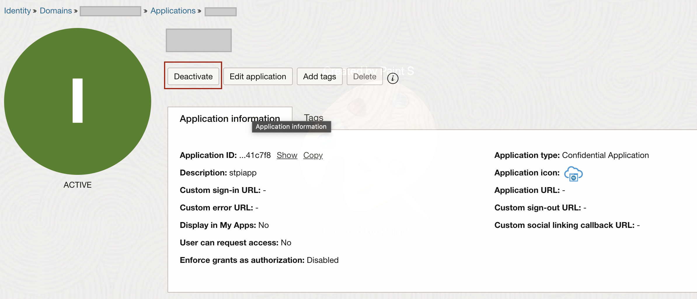
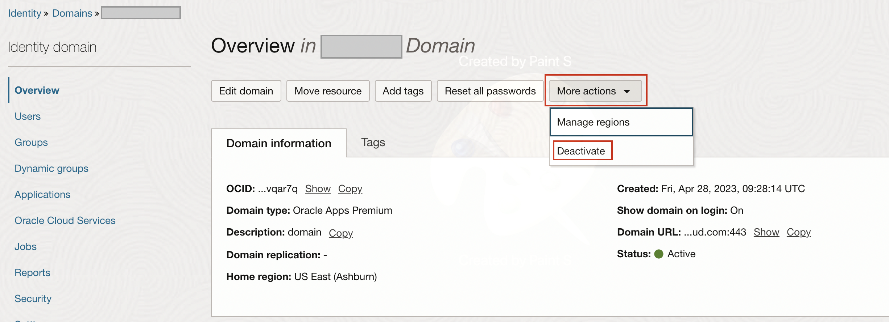
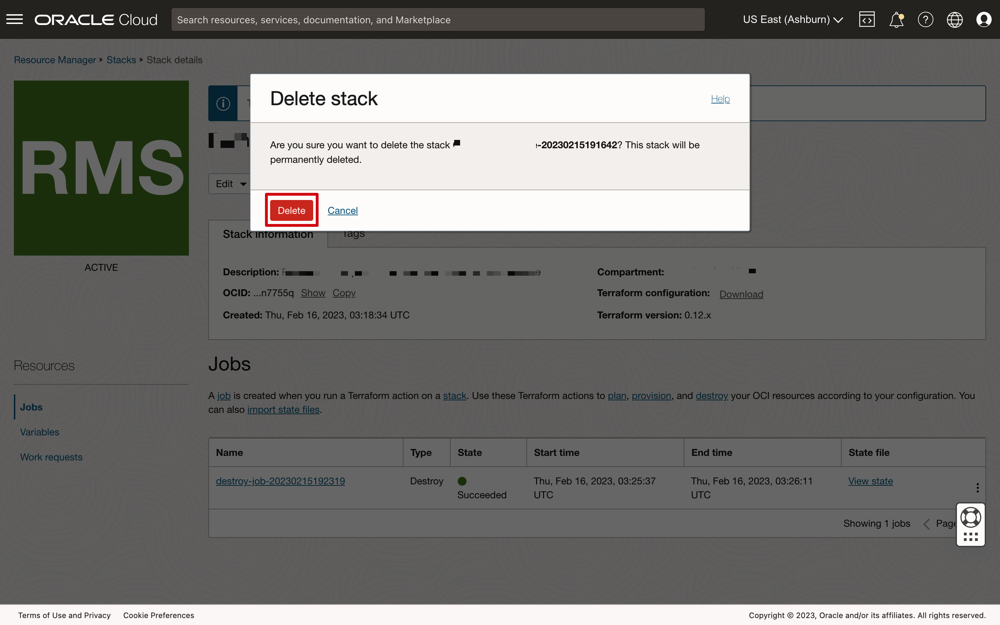

# Destroy

## Introduction

This lab will show you how you can carry out the cleanup activities for the entire Live Lab.

### Objectives

-   Manual deactivation of the Applications and the Identity Domain
-   Destroy the Stack 1 and 2 for performing the cleanup of the resources.

## Task 1: Deactivate the confidential applications and the Identity Domain

In this task you will be carrying out the prerequisites before destroying Stack 1 and 2. You will be *manually deactivating* the applications and Identity Domain on the OCI console.

		
## Task 2: Destroy the Stack 1 - Destroy for performing the cleanup of the resources.

With this task, we will be deleting all the resources that got created as part of **Deploy** lab.

1. Log in to Oracle Cloud
2. Open up the hamburger menu in the left-hand corner.  Click **Developer Services**, choose **Resource Manager > Stacks**.

  
3. Choose the compartment in which you created the **Stack 1- Deploy** and select it.  

4. Click on **Destroy** and confirm again as prompted on the lower-right.  

5. Wait for the job to complete and review the output.  

## Task 3: Destroy the Stack 2 - Configure for performing the cleanup of the resources.

Now that you have successfully destroyed all the resources provisioned for your workshop, you can now safely delete the **Stack -2 Configure** to return the environment to it original state.

1. Follow the breadcrumbs links in the upper-left and click on **Stack Details**, the **More Actions > Delete Stack**.  

This completes the workshop.

## Acknowledgements
* **Author** - Gautam Mishra, Aqib Bhat, Samratha S P
* **Contributor** - Chetan Soni, Sagar Takkar
* **Supported By** - Deepak Rao Narasimha Gajendragad
* **Lead By** - Deepthi Shetty 
* **Last Updated By/Date** - Gautam Mishra May 2023
