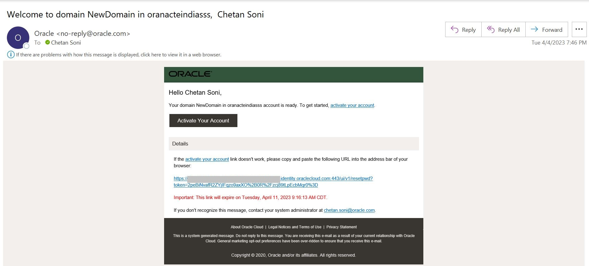
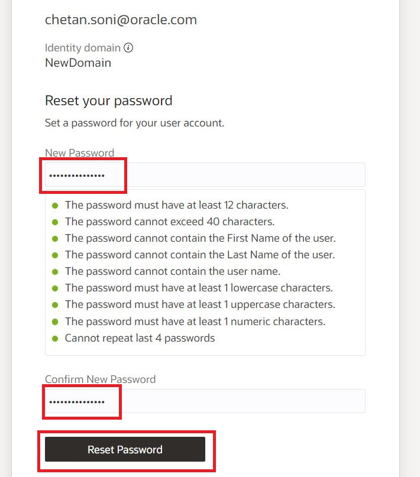
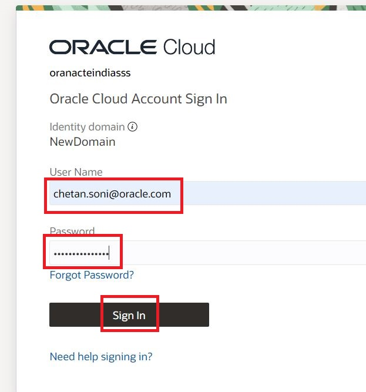
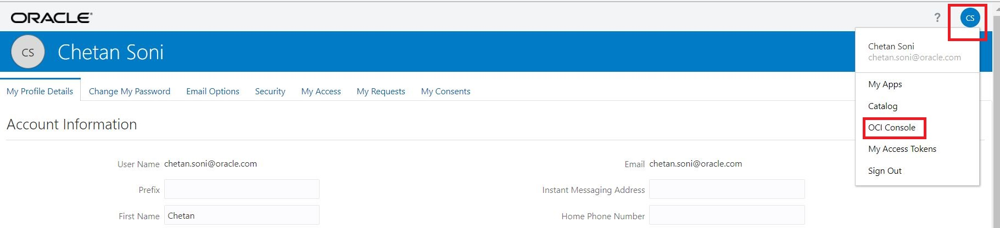
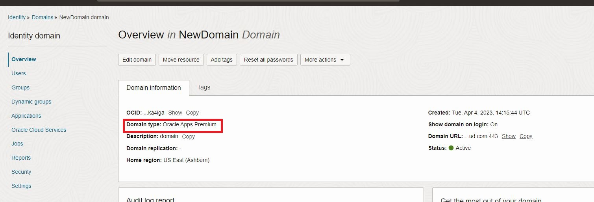

# Activation of the Identity Domain and Creating a Confidential App for REST API Calls

## Introduction

During the stack execution process, An Oracle Identity Domain of the type of **Oracle Apps Premium** is created. The administrator account you used will get an auto generated email for resetting the password for that respective user. In this module we will showcase the steps to reset the password for the admin users and the procedure to login into the newly created Oracle Apps Premium Domain. 

This module will also help you to create a confidential application under the newly created Identity Domain, which will be used for making REST API calls in the backend.

## Objectives

1.	**Reset** the password for the admin user and login into the newly created Identity Domain
2. 	Create a confidential application with the allowed grant type **Client Credentials**

## Task 1: Reset the password for the admin user and login into the newly created Domain

1. During the stack execution process you will get an autogenerated email which would have an **Activate your Account** Button. Please click on it.
 
	**Sample Email:**  
 
2. On the page that gets loaded, please **reset your password** for your admin account under your newly created Domain.

	
	
3. Now, please try to login into your new Domain with the admin account you just completed the password reset.

	
	
4. After successful authentication you will land on the **My Console** page, click on the **OCI Console** Option from the menu to go to your **Infrastructure Console** screen

	
	
5. You should land on the below mentioned screen which gives you the details about your newly created Domain of the type - **Oracle Apps Premium**

	

## Task 2: Create a confidential application 

We will register a Confidential Application under newly created OCI-IAM Domain with the allowed grants type **Client Credentials**

1. Under your newly created **Identity Domain**, Copy the **Identity Domain URL** from the **Domain Information** section. Click on **Applications** from the navigation menu.

	

	
	
**Note** Kindly exclude **:443** from the end of the **Domain URL**
 
2. Select **Confidential Application** and then click on **Launch Workflow**
 

3. Add the Name to your application and then click of **Next**

 
4. Select **Client Credentials** as the Grant Type and then click on **Next**

5. Select **Identity Domain Administrator** from **App Role** and **Add** it.

6. Finally click on **Finish** 

6. Click on **Activate Application**

8. Now grab the **Client ID** and **Secret** for using it in further configurations.

## Conclusion

In this Lab, we activated the Admin user under your newly created Identity Domain of the type- Oracle Apps Premium and then created a confidential application for REST API, which is to be used further in the Terraform scripts. 

 You may now **proceed to the next lab.**

## Acknowledgements
* **Author** - Gautam Mishra, Aqib Bhat, Samratha S P
* **Contributor** - Chetan Soni, Sagar Takkar
* **Supported By** - Deepak Rao Narasimha Gajendragad
* **Lead By** - Deepthi Shetty 
* **Last Updated By/Date** - Gautam Mishra May 2023