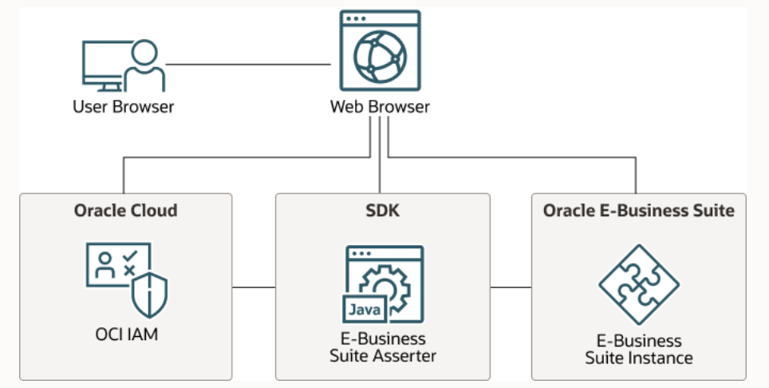
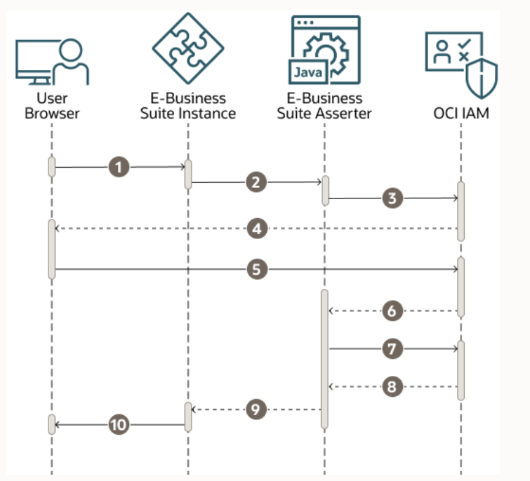

# Introduction

## About this Workshop

OCI IAM Identity Domains is a comprehensive identity-as-a-service (IDaaS) solution that can be used to address a variety of IAM use cases and scenarios. OCI IAM can be used to manage access for users across numerous cloud and on-premises applications, enabling secure authentication, easy management of entitlements, and seamless SSO for end users. In this workshop, we will deploy the EBS application, EBS Asserter server and OCI IAM Identity Domains on OCI using Terraform and then configure the deployed setup using Terraform to leverage the EBS Asserter feature of Identity Domains to achieve SSO to the EBS Application.

 The graphic below shows the high level architecture of E-Business Suite Asserter setup with OCI IAM.

  
  
 The following diagram shows the login flow when using the E-Business Suite Asserter to integrate Oracle E-Business Suite with OCI IAM. 
 
  

* The user requests access to an Oracle E-Business Suite protected resource.
* Oracle E-Business Suite redirects the user browser to the E-Business Suite Asserter application.
* The E-Business Suite Asserter uses an OCI IAM SDK to generate the authorization URL and then redirects the browser to OCI IAM.
* OCI IAM presents its sign in page to the user.
* The user submits credentials to OCI IAM.
* OCI IAM issues an authorization code and redirects the user's browser to the E-Business Suite Asserter.
* The E-Business Suite Asserter uses an OCI IAM SDK to communicate with OCI IAM to exchange the authorization code for an access token.
* OCI IAM issues an access token and an ID token to the E-Business Suite Asserter.
* The E-Business Suite Asserter creates an Oracle E-Business Suite cookie and redirects the user's browser to Oracle E-Business Suite.
* Oracle E-Business Suite presents the user requested protected resource.

This lab walks you through the steps to get started using **OCI IAM Identity Domains** with a popular use case - **Achieve EBS SSO using EBS Asserter**. In this workshop, we will follow the steps to deploy the **EBS** application on OCI using *Terraform* via **Resource Manager**. Same Stack will also deploy a **EBS Asserter Server** and an **OCI IAM Identity Domain**. Once deployed, we will also make some necessary configuration changes in the *EBS Asserter Server* and the *Identity Domain* using Terraform. We will carry out some *manual tasks* to complete the configuration at the EBS application as well as in Identity Domains before heading towards the validation of the entire flow. Once validation is done we will be going through the clean up activities/steps using the *Resource Manager*.

*Estimated Time:* 1 Hours

### Objectives

In this workshop, you will learn how to:

* Deploy a Terraform stack to create EBS application, EBS Asserter instance and OCI IAM Identity Domain on OCI via Resource manager.
* Create a confidential application in OCI IAM Identity Domain
* Deploy a Terraform stack to configure the deployed EBS Asserter Instance and OCI IAM Identity Domain
* Manually Update site profiles on EBS application to enable the SSO
* Validate the setup and test the SSO flow
* Clean up the deployed resources

### Prerequisites
This lab assumes you have:
* A Pay Go tenancy (Not Free) where you have administrative access

## Learn More

* [OCI IAM Identity Domains](https://docs.oracle.com/en-us/iaas/Content/Identity/home.htm)
* [E-Business Suite Asserter](https://docs.oracle.com/en/solutions/sso-oci-iam-ebs-asserter/index.html#GUID-9E74257D-396D-49E5-A2FD-6E59ACC48946)

## Acknowledgements
* **Author** - Gautam Mishra, Aqib Bhat, Samratha S P
* **Contributor** - Chetan Soni, Sagar Takkar
* **Supported By** - Deepak Rao Narasimha Gajendragad
* **Lead By** - Deepthi Shetty 
* **Last Updated By/Date** - Gautam Mishra May 2023
