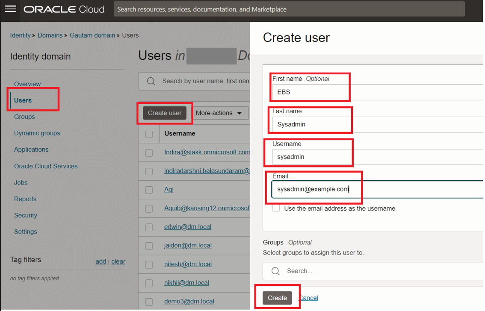
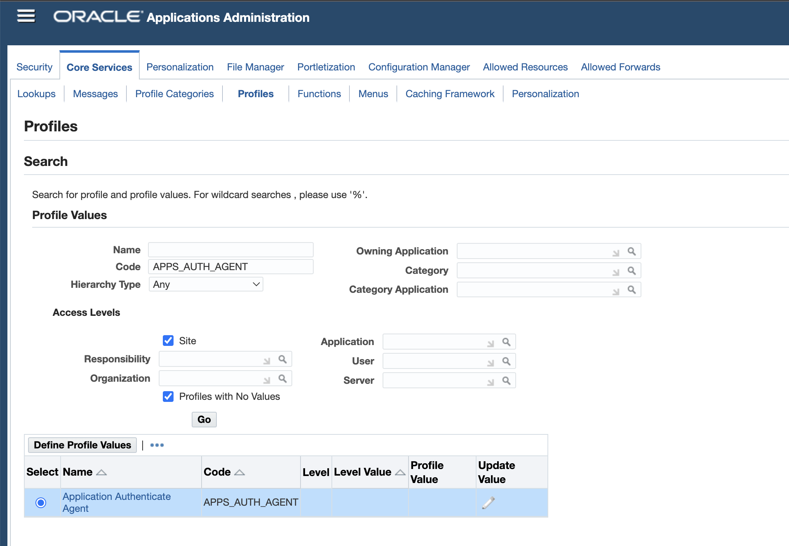
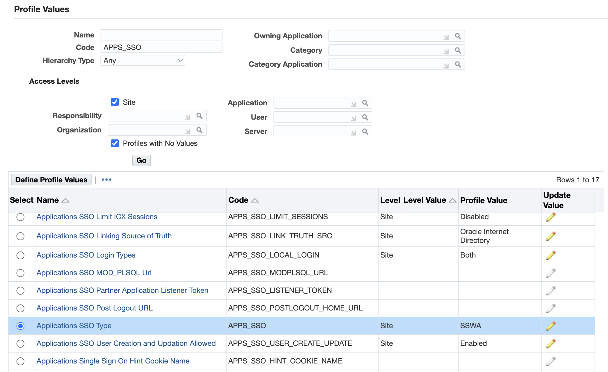
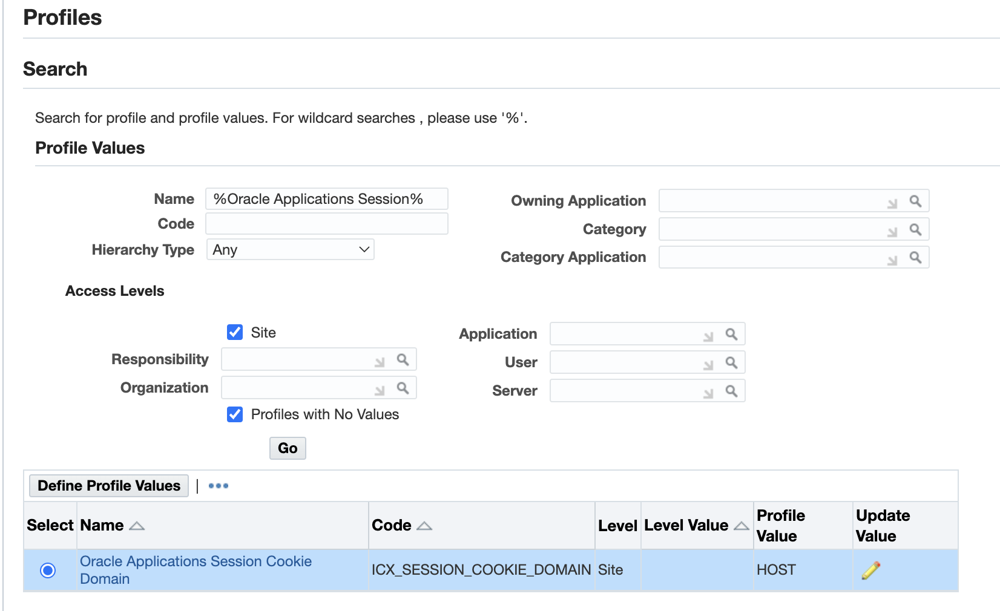

# Prepare Setup

## Introduction
This lab will show you how to make necessary changes in the EBS application to enable the Single Sign On feature. Also, we will be creating an Admin user in EBS application and on OCI Identity Domain, which will be used for testing the SSO flow.  

*Estimated Lab Time:* 20 minutes

### Objectives

-   Create Oracle E-Business Suite's System Administrator in OCI IAM Identity Domain
-	Update Oracle E-Business Suite's System Administrator Email Address
-	Update Oracle E-Business Suite Profiles
-	Restart EBS Application 

### Prerequisites
This lab assumes you have:
- You have successfully carried out the previous labs 
- JDK 8 or later installed on your local system 
		
## Task 1: Create Oracle E-Business Suite's System Administrator in OCI IAM Identity Domain

Create an user in Oracle IAM Identity Domain that corresponds to the System Administrator in your Oracle E-Business Suite (EBS), otherwise the system administrator won't be able to login to the EBS console after EBS configured to use OCI IAM Identity Domain for authentication.

1. Sign in to your OCI IAM Identity Domains to access the **OCI console**. Once logged in, **Navigate** to **Domains** under **Identity and Security**. Now select your **Identity Domain** provisioned previously.

	
	
2. Click on the **Users**, In the **Add User window**, provide the following values, and then click **Create**.
	1. **First Name**: EBS
	2. **Last Name**: Sysadmin
	3. Uncheck Use the email address as the user name.
	4. **User Name**: sysadmin
	5. **Email**: Provide the email address set to the SYSADMIN account in your Oracle E-Business Suite.
	
	


## Task 2: Update Oracle E-Business Suite's System Administrator Email Address

Update the email address of the SYSADMIN user in Oracle E-Business Suite to match the email address you provided to the corresponding user in Oracle Identity Cloud Service.

1. Login as administrator (for example, sysadmin) to the Oracle E-Business Suite application. 

2. In the Oracle E-Business Suite Home page, scroll down the **Navigator**, expand **User Management**, and then click **Users**.

3. In the **User Maintenance** page, search by User Name **SYSADMIN**, and click the **update icon** for the **SYSADMIN** user.

	
	
4. Update the **Email** field value with the same email address you provided during the creation of the system administrator user in OCI IAM Identity Domain, and then click **Apply**.

	
	
5. Close Oracle E-Business Suite application.

## Task 3: Update Oracle E-Business Suite Profiles

*Follow these steps to configure Oracle E-Business Suite to redirect non-E-Business-Suite-authenticated users to E-Business Suite Asserter instead of using the Oracle E-Business Suite local login page.*

1. In the Oracle E-Business Suite Home page, scroll down the Navigator, expand **Functional Administrator** click the **Core Services** tab, and then click **Profiles tab**.
	
2. Enter **App%Agent%** in the Search, Profile Values, Code field, and then click **Find**

	
	
3. 	On the Define Profile Values: **Application Authenticate Agent** page enter **E-Business Suite Asserter's URL- 		 https://ebsasserter.example.com:7004/ebs** in the Site Value field, and then **save it**.
	
4. Back to the **Profiles tab**, enter **%SSO%Type%** in the Search, update the **APPS_SSO** code entry from **SSWA to SSWAw/SSO**, and **save** the profile.

	
	
5 Back to the **Profiles tab**, enter **%Oracle Applications Session%** in the Search, update the value from **HOST** to **DOMAIN** and **save** the profile.



**Note** To run the EBS Application and update these Profile vaules you need to have JAVA installed on your Local System.

## Task 4: Restart Oracle E-Business Suite

Once the Profiles changes are done, SSH to the EBS Server and execute the below commands

```
$ sudo hostname demoebs.example.com
# sudo su - oracle
$ /u01/install/APPS/scripts/stopapps.sh
$ /u01/install/APPS/scripts/startapps.sh

```

**Note** Please use the above mentioned Hostname as wherever required.

 You may now **proceed to the next lab.**

## Acknowledgements
* **Author** - Gautam Mishra, Aqib Bhat, Samratha S P
* **Contributor** - Chetan Soni, Sagar Takkar
* **Supported By** - Deepak Rao Narasimha Gajendragad
* **Lead By** - Deepthi Shetty 
* **Last Updated By/Date** - Gautam Mishra May 2023

