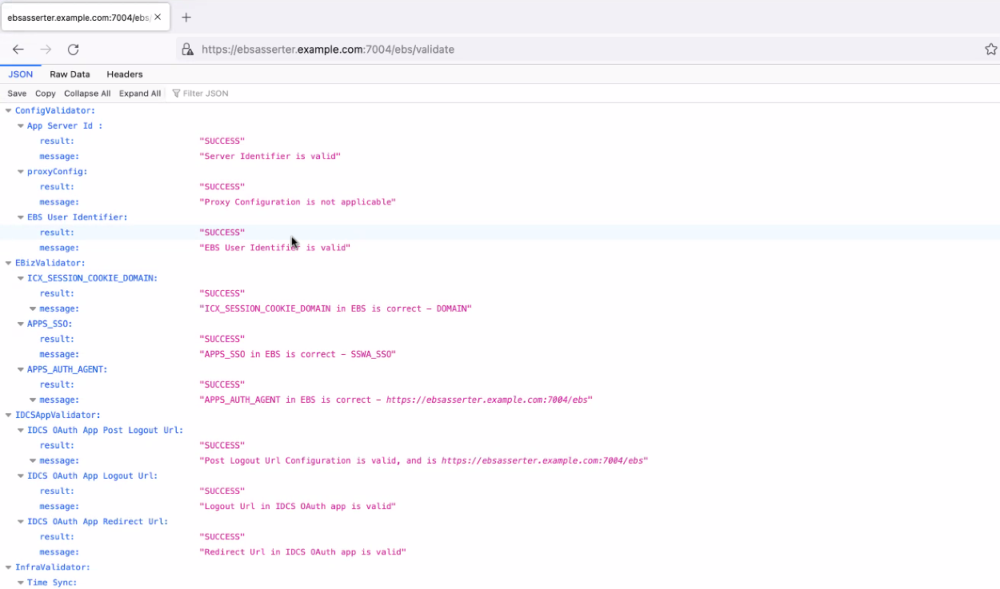
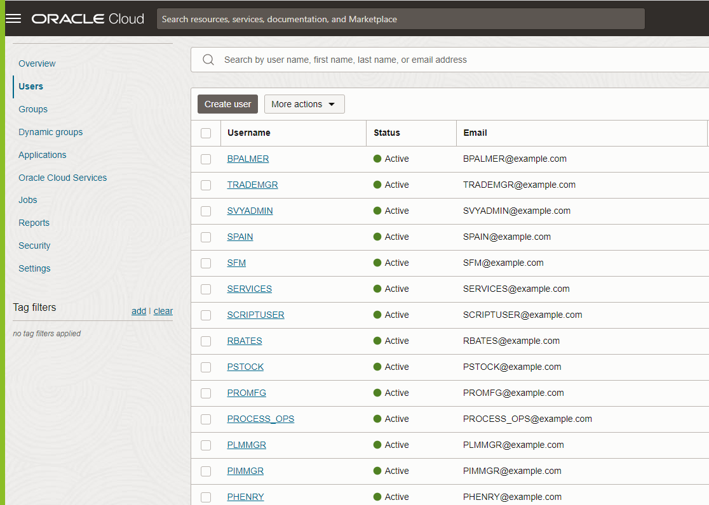
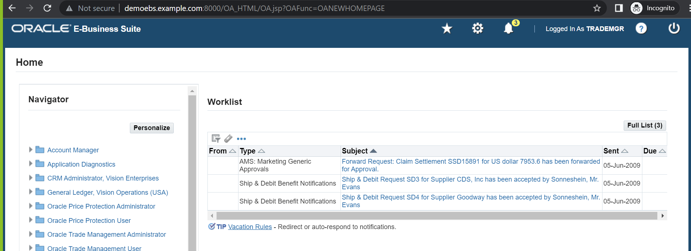

# Validate

## Introduction

This lab will show you how you can test the SSO flow to your EBS Application via **OCI IAM Identity Domains**

### Objectives

-   Validate the EBS Asserter Configuration
-   Test Single Sign-On with Oracle E-Business Suite

## Task 1: Validate the EBS Asserter Configuration

Once the **Stack 2- Configure** is successfully deployed and the EBS Profile changes are carried out, kindly access the EBS Asserter URL mentioned below.

- **https://ebsasserter.example.com:7004/ebs/validate**

The browser will display the result of the EBS Asserter configurations.

	
## Task 2: Change Default Password for the SSO test Users

Below are the users who were created as sample SSO test users. 

	
	**Default Password** - "Welcome@1234567890"
		
## Task 3: Test Single Sign-On with Oracle E-Business Suite

1. Test the SSO using the EBS Asserter direct URL link

	1. Open a browser window and enter the URL for the EBS Asserter - **https://ebsasserter.example.com:7004/ebs**
	2. The **OCI IAM Identity Domains Sign** In page appears. Use the **User Name and Password** of the previously created user to sign in.
	3. Upon successful authentication, the user is redirected to the **Oracle E-Business Suite** home page without having to enter **EBS credentials**.
	4. If the **Oracle EBS** home page appears, verify the **logged-in user name**.
	5. Log out from Oracle EBS. The browser is redirected to the **OCI IAM Identity Domains Sign** In page.

	
	
 You may now **proceed to the next lab.**

## Acknowledgements
* **Author** - Gautam Mishra, Aqib Bhat, Samratha S P
* **Contributor** - Chetan Soni, Sagar Takkar
* **Supported By** - Deepak Rao Narasimha Gajendragad
* **Lead By** - Deepthi Shetty 
* **Last Updated By/Date** - Gautam Mishra May 2023

