# Deploy Oracle Access Manager (OAM) Domain

## Introduction

This lab provides information about steps involved in deploying and running OAM domain in a Kubernetes cluster with the help of Oracle WebLogic Kubernetes Operator (3.1.0).

*Estimated Time:* 30 minutes

### About Product/Technology
Oracle Access Management provides innovative new services that complement traditional access management capabilities. It not only provides Web SSO with MFA, coarse grained authorization and session management but also provides standard SAML Federation and OAuth capabilities to enable secure access to external cloud and mobile applications. It can be easily integrated with the Oracle Identity Cloud Service to support hybrid access management capabilities that can help customers to seamlessly protect on-premise and cloud applications and workloads. The Oracle WebLogic Server Kubernetes Operator supports deployment of Oracle Access Management (OAM).

OAM domains are supported using the “domain on a persistent volume” model, where the domain home is located in a persistent volume (PV).

### Objectives

In this lab, you will:
* Deploy OAM in the kubernetes environment

### Prerequisites
This lab assumes you have:
- A Free Tier, Paid or LiveLabs Oracle Cloud account
- You have completed:
    - Lab: Prepare Setup (*Free-tier* and *Paid Tenants* only)
    - Lab: Environment Setup
    - Lab: Initialize Environment
    - Lab: Deploy Oracle Identity Governance(OIG) domain


## Task 1: Set up the code repository to deploy OAM domains

The components listed below were already installed during OIG deployment (under the directory /u01/k8siam), and hence we do not have to re-configure them. We can directly copy the OAM deployment scripts into the Kubernetes Operator samples location.
- Oracle WebLogic Server Kubernetes Operator Docker image
- WebLogic Kubernetes operator source code
- OAM deployment scripts from the FMW Kubernetes repository


1. Copy OAM deployment scripts in to the Oracle WebLogic Server Kubernetes Operator samples location.

	```
	<copy>cd /u01/k8siam</copy>
	```

	```
	<copy>cp -rf /u01/k8siam/fmw-kubernetes/OracleAccessManagement/kubernetes/create-access-domain  /u01/k8siam/weblogic-kubernetes-operator/kubernetes/samples/scripts/</copy>
	```

## Task 2: Install the Oracle WebLogic Server Kubernetes Operator

1. Run the following command to create a namespace for the operator:

	```
	<copy>kubectl create namespace opns</copy>
	```

2. Create a service account for the operator in the operator’s namespace by running the following command:

	```
	<copy>kubectl create serviceaccount -n opns op-sa</copy>
	```

3. Run the following helm command to install and start the operator:

	```
	<copy>cd /u01/k8siam/weblogic-kubernetes-operator</copy>
	```

	```
	<copy>helm install weblogic-kubernetes-operator kubernetes/charts/weblogic-operator \
	--namespace opns --set image=weblogic-kubernetes-operator:3.1.0 \
	--set serviceAccount=op-sa --set "domainNamespaces={}" --set "javaLoggingLevel=FINE" --wait</copy>
	```

	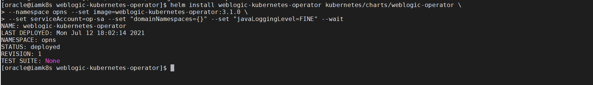


4. Verify that the operator’s pod and services are running

	```
	<copy>kubectl get all -n opns</copy>
	```

	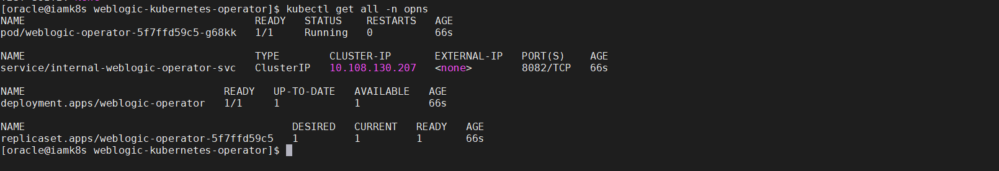


## Task 3: RCU schema creation

1. Create a namespace for the domain:

	```
	<copy>kubectl create namespace accessns</copy>
	```

2. Create a helper pod to run RCU:

	```
	<copy>kubectl run helperoam --image oracle/oam:12.2.1.4.0 -n accessns -- sleep infinity</copy>
	```

3. Check the pod is running:

	```
	<copy>kubectl get pods -n accessns</copy>
	```

4. Start a bash shell in the helper pod:

	```
	<copy>kubectl exec -it helperoam -n accessns -- /bin/bash</copy>
	```

5. Replace the *`<PRIVATE_IP>`* with the private IP of the instance (noted in Lab 1) and Run the following commands to set the environment:

	```
	<copy>export CONNECTION_STRING=<PRIVATE_IP>:1521/orcl.livelabs.oraclevcn.com
	export RCUPREFIX=OAMK8S
	echo -e Welcom#123"\n"Welcom#123 > /tmp/pwd.txt
	cat /tmp/pwd.txt</copy>
	```

	For example:

	```
	export CONNECTION_STRING=11.0.2.64:1521/orcl.livelabs.oraclevcn.com
	export RCUPREFIX=OAMK8S
	echo -e Welcom#123"\n"Welcom#123 > /tmp/pwd.txt
	cat /tmp/pwd.txt
	```

6. Create the RCU schemas in the database. This may take about 3-4 minutes.

	```
	<copy>/u01/oracle/oracle_common/bin/rcu -silent -createRepository -databaseType ORACLE -connectString \
	$CONNECTION_STRING -dbUser sys -dbRole sysdba -useSamePasswordForAllSchemaUsers true \
	-selectDependentsForComponents true -schemaPrefix $RCUPREFIX -component MDS -component IAU \
	-component IAU_APPEND -component IAU_VIEWER -component OPSS -component WLS -component STB -component OAM -f < /tmp/pwd.txt</copy>
	```

	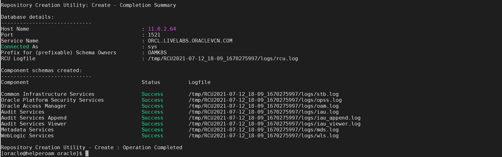


7. Exit the helper bash shell

	```
	<copy>exit</copy>
	```

## Task 4:Preparing the environment for domain creation

1. Configure the operator for the domain namespace

	```
	<copy>cd /u01/k8siam/weblogic-kubernetes-operator</copy>
	```

	```
	<copy>helm upgrade --reuse-values --namespace opns --set "domainNamespaces={accessns}" --wait weblogic-kubernetes-operator kubernetes/charts/weblogic-operator</copy>
	```

2. Create Kubernetes secrets for the domain

	```
	<copy>cd /u01/k8siam/weblogic-kubernetes-operator/kubernetes/samples/scripts/create-weblogic-domain-credentials</copy>
	```

	```
	<copy>./create-weblogic-credentials.sh -u weblogic -p Welcom@123 -n accessns -d accessinfra -s accessinfra-domain-credentials</copy>
	```

3. Verify the domain secret is created

	```
	<copy>kubectl get secret accessinfra-domain-credentials -o yaml -n accessns</copy>
	```

4. Creating Kubernetes secrets for the RCU

	```
	<copy>cd /u01/k8siam/weblogic-kubernetes-operator/kubernetes/samples/scripts/create-rcu-credentials</copy>
	```

	```
	<copy>./create-rcu-credentials.sh -u OAMK8S -p Welcom#123 -a sys -q Welcom#123 -d accessinfra -n accessns -s accessinfra-rcu-credentials</copy>
	```

5. Verify the RCU secret is created

	```
	<copy>kubectl get secret accessinfra-rcu-credentials -o yaml -n accessns</copy>
	```

## Task 5: Create a Kubernetes persistent volume and persistent volume claim

1. Create the required directory for persistent volume.

	```
	<copy>mkdir -p /u01/domains/accessdomainpv</copy>
	```

	```
	<copy>chmod 777 /u01/domains/accessdomainpv</copy>
	```

2. Make a backup copy of the create-pv-pvc-inputs.yaml file and Execute the script to create the PV and PVC configuration files:

	```
	<copy>cd /u01/k8siam/weblogic-kubernetes-operator/kubernetes/samples/scripts/create-weblogic-domain-pv-pvc</copy>
	```

	```
	<copy>mkdir output_access</copy>
	```

	```
	<copy>cp create-pv-pvc-inputs.yaml create-pv-pvc-inputs.yaml_OIG</copy>
	```

	```
	<copy>cp /u01/sampleFilesOAM/create-pv-pvc-inputs.yaml .</copy>
	```

	```
	<copy>./create-pv-pvc.sh -i create-pv-pvc-inputs.yaml -o output_access</copy>
	```

3. Run the following to show the files are created:

	```
	<copy>ls output_access/pv-pvcs</copy>
	```

4. Run the following kubectl command to create the PV and PVC in the domain namespace:

	```
	<copy>kubectl create -f output_access/pv-pvcs/accessinfra-domain-pv.yaml -n accessns</copy>
	```

	```
	<copy>kubectl create -f output_access/pv-pvcs/accessinfra-domain-pvc.yaml -n accessns</copy>
	```

5. Verify the created pv and pvc

	```
	<copy>kubectl describe pv accessinfra-domain-pv</copy>
	```

	```
	<copy>kubectl describe pvc accessinfra-domain-pvc -n accessns</copy>
	```

	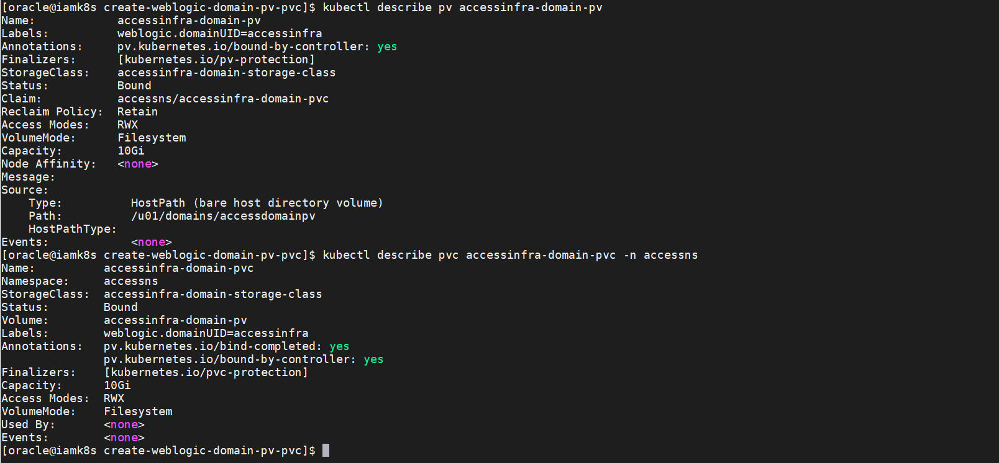

## Task 6: Create OAM domain Namespaces

1. Prepare the Create Domain Script

	```
	<copy>cd /u01/k8siam/weblogic-kubernetes-operator/kubernetes/samples/scripts/create-access-domain/domain-home-on-pv</copy>
	```

	```
	<copy>cp create-domain-inputs.yaml create-domain-inputs.yaml.orig</copy>
	```

	```
	<copy>mkdir output_access</copy>
	```

	```
	<copy>cp /u01/sampleFilesOAM/create-domain-inputs.yaml .</copy>
	```

2. Edit *create-domain-inputs.yaml* file to update the instance's private IP	in 	*rcuDatabaseURL* parameter. The *rcuDatabaseURL* parameter is towards the end of the *create-domain-inputs.yaml* file. Navigate to the end of the file and update the parameter to the private IP of the instance.

	```
	<copy>vi create-domain-inputs.yaml</copy>
	```

	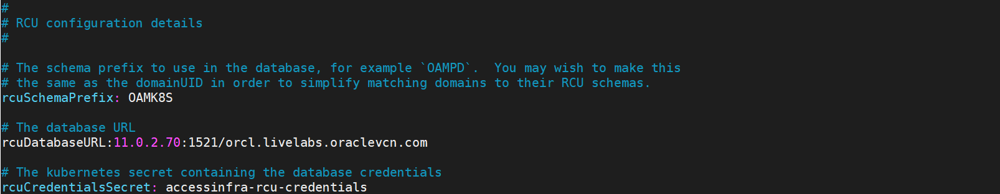

## Task 7: Run the create domain script to generate domain related kubernetes artifacts

1. Run the create domain script, specifying your inputs file and an output directory to store the generated artifacts:

	```
	<copy>./create-domain.sh -i create-domain-inputs.yaml -o output_access</copy>
	```

## Task 8: Create the Kubernetes resource

1. Create the Kubernetes resource using the following command:

	```
	<copy>cd  /u01/k8siam/weblogic-kubernetes-operator/kubernetes/samples/scripts/create-access-domain/domain-home-on-pv/output_access/weblogic-domains/accessinfra</copy>
	```

	```
	<copy>kubectl apply -f domain.yaml</copy>
	```

## Task 9: Verify the domain

1. Run the following command to view the status of the OAM pods.

	```
	<copy>kubectl get pods -n accessns</copy>
	```

	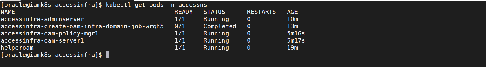


2. It will take around 10-15 minutes before all the services listed above show. When a pod has a STATUS of 0/1 the pod is started but the OAM server associated with it is currently starting. While the pods are starting you can check the startup status in the pod logs, by running the following command:

	```
	<copy>kubectl logs accessinfra-adminserver -n accessns</copy>
	```

	```
	<copy>kubectl logs accessinfra-oam-server1 -n accessns</copy>
	```

	The default domain created by the script has the following characteristics:

	An Administration Server named AdminServer listening on port 9001.

	A configured OAM cluster named oam_cluster of size 3.

	A configured Policy Manager cluster named policy_cluster of size 3.

	One started OAM managed Server, named oam_server1 listening on port 14100.

	One started Policy Manager managed server named oam-policy-mgr1, listening on port 15100.

	Log files are located in /u01/domains/accessdomainpv/logs/accessinfra


3. Describe the domain:

	```
	<copy>kubectl describe domain accessinfra -n accessns</copy>
	```

4. Verify the domain, servers pods and services are created and in the READY state with a status of 1/1

	```
	<copy>kubectl get all,domains -n accessns</copy>
	```

	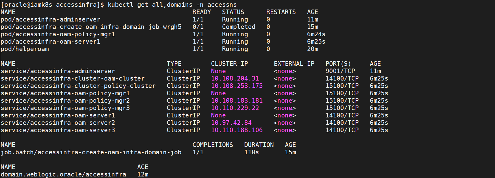


5. Verify the Pods. Copy the pod IP address of the adminserver

	```
	<copy>kubectl get pods -n accessns -owide</copy>
	```

	For example:

	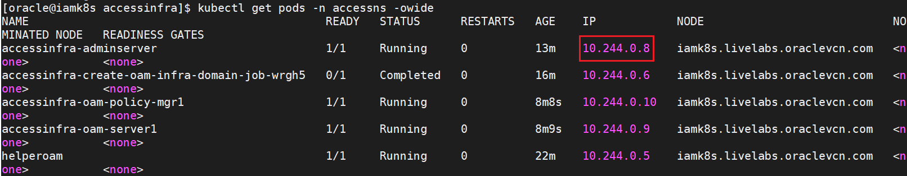

7. Open a browser window to access the weblogic console using the adminserver pod IP using the following URL.

	```
	<copy><ADMIN_IP>:9001/console</copy>
	```

	where *`<ADMIN_IP>`* is the adminserver pod IP

	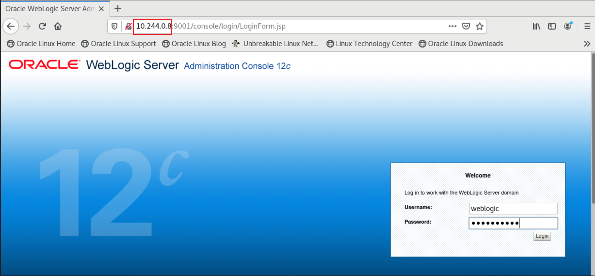

	Login to the console using the following credentials:

	Username:

	```
	<copy>weblogic</copy>
	```

	Password:

	```
	<copy>Welcom@123</copy>
	```

	Click and *Servers* under *Environment* and verify that OAM server is running.

	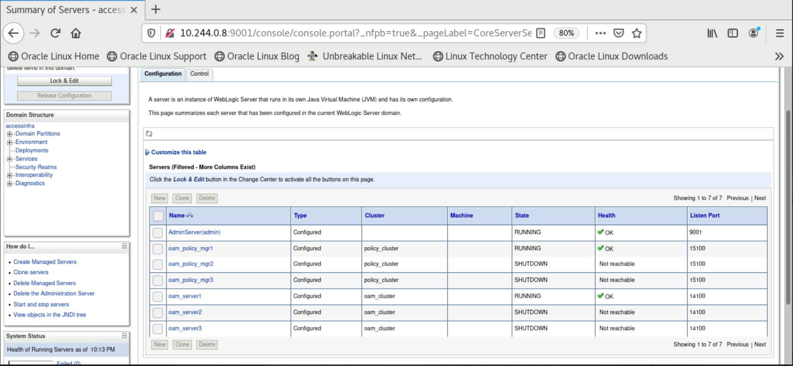


*Note: The OAM Managed server may be displayed in Warning state due to limited heap size. The heap size can be extended by updating the generated domain yaml files.*


8. Open a browser tab to access the OAM console using the adminserver pod IP using the the following URL.

	```
	<copy><ADMIN_IP>:9001/oamconsole</copy>
	```

	where *`<ADMIN_IP>`* is the adminserver pod IP

	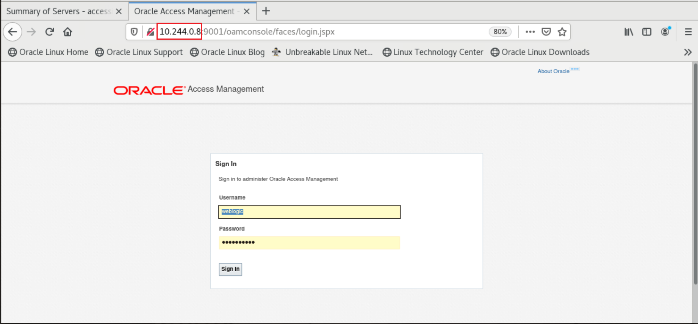

	Login to the console using the following credentials:

	Username:

	```
	<copy>weblogic</copy>
	```

	Password:

	```
	<copy>Welcom@123</copy>
	```

	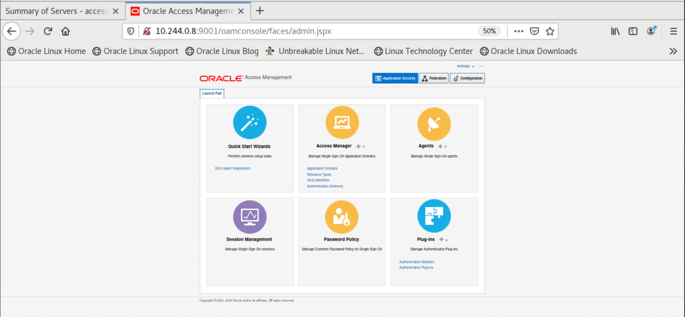


You may now proceed to the next lab.

## Learn More

* [Reference for Oracle Access Management on Docker and Kubernetes](https://docs.oracle.com/en/middleware/idm/access-manager/12.2.1.4/oamkd/overview.html#GUID-38F207C8-E648-4A79-8205-942DAD5F674A)

## Acknowledgements
* **Author** - Keerti R, Brijith TG, Anuj Tripathi, NATD Solution Engineering
* **Contributors** -  Keerti R, Brijith TG, Anuj Tripathi
* **Last Updated By/Date** - Keerti R, NATD Solution Engineering, January 2022
