# Deploy Oracle Identity Governance (OIG) Domain

## Introduction

This lab provides information about steps involved in deploying and running OIG domain in a kubernetes cluster with the help of Oracle WebLogic Kubernetes Operator (3.1.0)

*Estimated Time:* 30 minutes

### About Product/Technology
Oracle Identity Governance(OIG) is a powerful and flexible enterprise identity management system that automatically manages user's access privileges within enterprise IT resources. The Oracle WebLogic Kubernetes Operator supports deployment of Oracle Identity Governance (OIG). OIG domains are supported using the “domain on a persistent volume” model, where the domain home is located in a persistent volume (PV).

### Objectives

In this lab, you will:
* Deploy OIG in the kubernetes environment

### Prerequisites
This lab assumes you have:
- A Free Tier, Paid or LiveLabs Oracle Cloud account
- You have completed:
    - Lab: Prepare Setup (*Free-tier* and *Paid Tenants* only)
    - Lab: Environment Setup
    - Lab: Initialize Environment

## Task 1: Install and Run the Oracle WebLogic Server Kubernetes Operator Docker Image

The Oracle WebLogic Server Kubernetes Operator Docker image must be installed on the master node and each of the worker nodes in your Kubernetes cluster. Alternatively you can place the image in a Docker registry that your cluster can access.

1. Pull the Oracle WebLogic Server Kubernetes Operator image by running the following command on the master node.

	```
	<copy>docker pull ghcr.io/oracle/weblogic-kubernetes-operator:3.1.0</copy>
	```

2. Run the docker tag command as follows:

	```
	<copy>docker tag ghcr.io/oracle/weblogic-kubernetes-operator:3.1.0 weblogic-kubernetes-operator:3.1.0</copy>
	```
3. Verify the images for weblogic kubernetes operator.

	```
	<copy>docker images | grep operator</copy>
	```

## Task 2: Setup the Code Repository to Deploy Oracle Identity Governance Domains

1. Create a working directory to setup the source code.

	```
	<copy>mkdir -p /u01/k8siam</copy>
	```

2. Download the Oracle WebLogic Kubernetes Operator 3.1.0 source code from the operator github project

	```
	<copy>cd /u01/k8siam</copy>
	```

	```
	<copy>git clone https://github.com/oracle/weblogic-kubernetes-operator.git --branch release/3.1.0</copy>
	```

3. Clone the Oracle Identity Governance deployment scripts from the OIG repository and copy them into the WebLogic operator samples location

	```
	<copy>git clone https://github.com/oracle/fmw-kubernetes.git</copy>
	```

	```
	<copy>cp -rf /u01/k8siam/fmw-kubernetes/OracleIdentityGovernance/kubernetes/create-oim-domain  /u01/k8siam/weblogic-kubernetes-operator/kubernetes/samples/scripts/</copy>
	```

## Task 3: Install the Oracle WebLogic Kubernetes Operator

1. Run the following command to create a namespace for the operator

	```
	<copy>kubectl create namespace operator</copy>
	```

2. Create a service account for the operator in the operator’s namespace

	```
	<copy>kubectl create serviceaccount -n operator operator-serviceaccount</copy>
	```

3. Run the following helm command to install and start the operator:

	```
	<copy>cd weblogic-kubernetes-operator/</copy>
	```

	```
	<copy>helm install weblogic-kubernetes-operator kubernetes/charts/weblogic-operator \
	--namespace operator \
	--set image=weblogic-kubernetes-operator:3.1.0 \
	--set serviceAccount=operator-serviceaccount \
	--set "domainNamespaces={}"</copy>
	```

	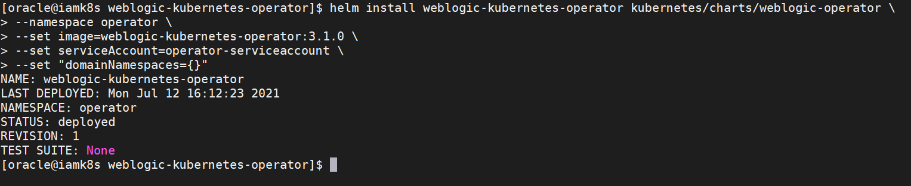

4. Verify the helm install for the operator

	```
	<copy>helm ls -n operator</copy>
	```

5. Verify that the operator’s pod is running with the 1/1 READY state

	```
	<copy>kubectl get all -n operator</copy>
	```

	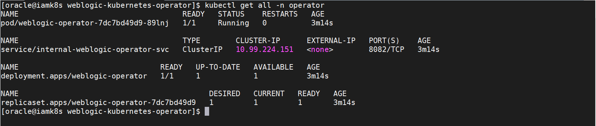

## Task 4: RCU schema creation

1. Run the following command to create a namespace for the domain:

	```
	<copy>kubectl create namespace oimcluster</copy>
	```

2. Run the following command to create a helper pod:

	```
	<copy>kubectl run helper --image oracle/oig:12.2.1.4.0 -n oimcluster -- sleep infinity</copy>
	```

3. Verify the helper pod

	```
	<copy>kubectl get pods -n oimcluster</copy>
	```

4. Start a bash shell in the helper pod. This will take you into a bash shell in the running rcu pod:

	```
	<copy>kubectl exec -it helper -n oimcluster -- /bin/bash</copy>
	```

5. In the helper bash shell run the following commands to set the environment. Replace the *`<PRIVATE_IP>`* parameter copied in step 2.1 (instance private IP).

	```
	<copy>
	export DB_HOST=<PRIVATE_IP>
	</copy>
	```

	```
	<copy>
	export DB_PORT=1521
	export DB_SERVICE=orcl.livelabs.oraclevcn.com
	export RCUPREFIX=OIGK8S
	export RCU_SCHEMA_PWD=Welcom#123
	echo -e Welcom#123"\n"Welcom#123 > /tmp/pwd.txt
	cat /tmp/pwd.txt
	export RCU_SCHEMA_PWD=Welcom#123
	</copy>
	```

	For example:

	```
	export DB_HOST=11.0.2.64
  ```
  ```
	export DB_PORT=1521
	export DB_SERVICE=orcl.livelabs.oraclevcn.com
	export RCUPREFIX=OIGK8S
	export RCU_SCHEMA_PWD=Welcom#123
	echo -e Welcom#123"\n"Welcom#123 > /tmp/pwd.txt
	cat /tmp/pwd.txt
	export RCU_SCHEMA_PWD=Welcom#123
	```

6. In the helper bash shell run the following commands to create the RCU schemas in the database:

	```
	<copy>/u01/oracle/oracle_common/bin/rcu -silent -createRepository -databaseType ORACLE -connectString \
	$DB_HOST:$DB_PORT/$DB_SERVICE -dbUser sys -dbRole sysdba -useSamePasswordForAllSchemaUsers true \
	-selectDependentsForComponents true -schemaPrefix $RCUPREFIX -component OIM -component MDS -component SOAINFRA -component OPSS \
	-f < /tmp/pwd.txt</copy>
	```

	It may take about 5-8 minutes for the RCU schemas to be created.

	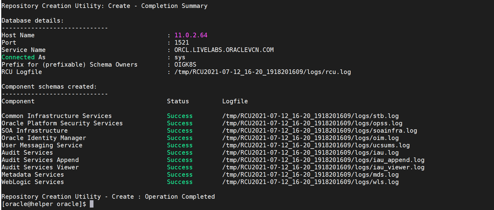

7. Exit the helper bash shell

	```
	<copy>exit</copy>
	```

## Task 5: Prepare the environment for domain creation

1. Configure the Oracle WebLogic Kubernetes Operator to manage the domain in the domain namespace

	```
	<copy>helm upgrade --reuse-values --namespace operator --set "domainNamespaces={oimcluster}" --wait weblogic-kubernetes-operator kubernetes/charts/weblogic-operator</copy>
	```

2. Create a Kubernetes secret for the domain using the create-weblogic-credentials script in the same Kubernetes namespace as the domain:

	```
	<copy>cd /u01/k8siam/weblogic-kubernetes-operator/kubernetes/samples/scripts/create-weblogic-domain-credentials</copy>
	```

	```
	<copy>./create-weblogic-credentials.sh -u weblogic -p Welcom@123 -n oimcluster -d oimcluster -s oimcluster-domain-credentials</copy>
	```

	where:

	-u weblogic is the WebLogic username

	-p <pwd> is the password for the WebLogic user

	-n <domain_namespace> is the domain namespace

	-d <domain_uid> is the domain UID to be created. The default is domain1 if not specified

	-s <kubernetes_domain_secret> is the name you want to create for the secret for this namespace. The default is to use the domainUID if not specified

3. Verify the domain secret is created

	```
	<copy>kubectl get secret oimcluster-domain-credentials -o yaml -n oimcluster</copy>
	```

	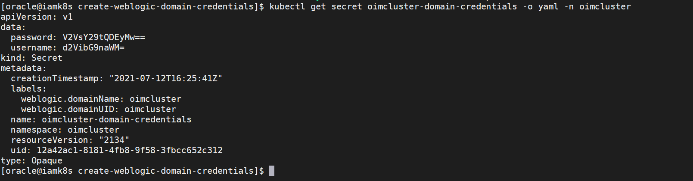

4. Create a Kubernetes secret for RCU in the same Kubernetes namespace as the domain, using the create-weblogic-credentials.sh script:

	```
	<copy>cd /u01/k8siam/weblogic-kubernetes-operator/kubernetes/samples/scripts/create-rcu-credentials</copy>
	```

	```
	<copy>./create-rcu-credentials.sh -u OIGK8S -p Welcom#123 -a sys -q Welcom#123 -d oimcluster -n oimcluster -s oimcluster-rcu-credentials</copy>
	```

	where:

	-u <rcu_prefix> is the name of the RCU schema prefix created previously

	-p <rcu_schema_pwd> is the password for the RCU schema prefix

	-q <sys_db_pwd> is the sys database password

	-d <domain_uid> is the domain_uid that you created earlier

	-n <domain_namespace> is the domain namespace

	-s <kubernetes_rcu_secret> is the name of the rcu secret to create

5. Verify the RCU secret is created

	```
	<copy>kubectl get secret oimcluster-rcu-credentials -o yaml -n oimcluster</copy>
	```

	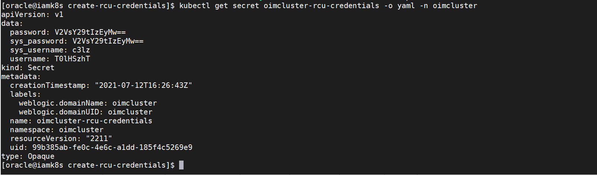


## Task 6: Create a Kubernetes persistent volume and persistent volume claim

1. Create the required directory for persistent volume.

	```
	<copy>mkdir -p /u01/domains/oimclusterdomainpv</copy>
	```

	```
	<copy>chmod 777 /u01/domains/oimclusterdomainpv</copy>
	```

2. Make a backup copy of the create-pv-pvc-inputs.yaml file and Execute the create-pv-pvc.sh script to create the PV and PVC configuration files:

	```
	<copy>cd /u01/k8siam/weblogic-kubernetes-operator/kubernetes/samples/scripts/create-weblogic-domain-pv-pvc</copy>
	```

	```
	<copy>cp create-pv-pvc-inputs.yaml create-pv-pvc-inputs.yaml.orig</copy>
	```

	```
	<copy>mkdir output_oimcluster</copy>
	```

	```
	<copy>cp /u01/sampleFilesOIG/create-pv-pvc-inputs.yaml .</copy>
	```

	```
	<copy>./create-pv-pvc.sh -i create-pv-pvc-inputs.yaml -o output_oimcluster</copy>
	```

	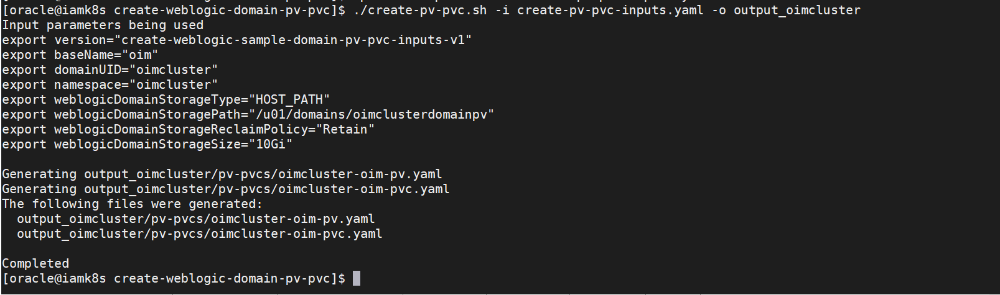

3. Run the following to show the files are created:

	```
	<copy>ls output_oimcluster/pv-pvcs</copy>
	```

4. Run the following kubectl command to create the PV and PVC in the domain namespace:

	```
	<copy>kubectl create -f output_oimcluster/pv-pvcs/oimcluster-oim-pv.yaml -n oimcluster</copy>
	```

	```
	<copy>kubectl create -f output_oimcluster/pv-pvcs/oimcluster-oim-pvc.yaml -n oimcluster</copy>
	```

5. Verify the created pv and pvc

	```
	<copy>kubectl describe pv oimcluster-oim-pv -n oimcluster</copy>
	```

	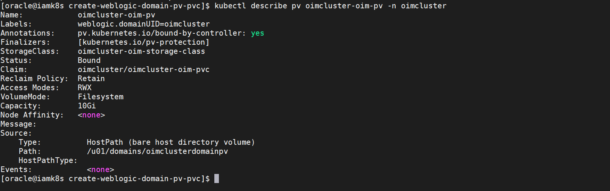


	```
	<copy>kubectl describe pvc oimcluster-oim-pvc -n oimcluster</copy>
	```

	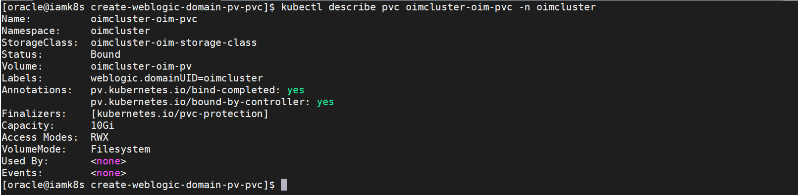


## Task 7: Create OIG Domains

1. Make a copy of the create-domain-inputs.yaml file:

	```
	<copy>cd /u01/k8siam/weblogic-kubernetes-operator/kubernetes/samples/scripts/create-oim-domain/domain-home-on-pv</copy>
	```

	```
	<copy>cp create-domain-inputs.yaml create-domain-inputs.yaml.orig</copy>
	```

	```
	<copy>mkdir output_oimcluster</copy>
	```

	```
	<copy>cp /u01/sampleFilesOIG/create-domain-inputs.yaml .</copy>
	```

3. Edit the *rcuDatabaseURL* parameter to include the private IP of your instance (noted in Step 2.2). Alternatively, you can also get the private IP by giving the command *cat /etc/hosts*. The *rcuDatabaseURL* parameter is towards the end of the *create-domain-inputs.yaml* file. Navigate to the end of the file and update the parameter to the private IP of the instance.

  *Note: To edit a file, use the command 'vi <file name>', after which you can use arrow keys to move to the location where changes need to be made in the file (As a shortcut, you can use 'Shift + G' to directly go to the end of file). Press 'i' on the keyboard to switch to insert mode. You can type your required changes OR if you want to paste copied content, simply do a Right Click by first ensuring the cursor be at the exact place. Once done, press 'Esc' to exit out of Insert mode. Finally, press ':wq' to save the changes and quit the vi editor.*

  *Note: The parameter frontEndHost need not be updated from its default value. We have added a sample value that is required to run the script and this should not be used to access weblogic/oim console in the further steps.*

	```
	<copy>vi create-domain-inputs.yaml</copy>
	```

	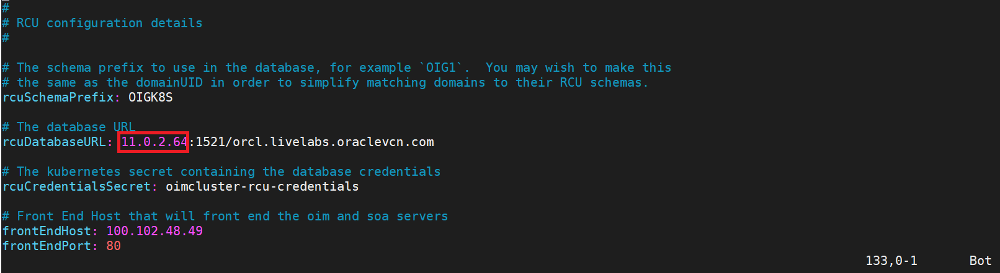

## Task 8: Run the create domain script to generate domain related kubernetes artifacts

1. Run the create domain script, specifying your inputs file and an output directory to store the generated artifacts. This may take about 6-7 minutes.

	```
	<copy>./create-domain.sh -i create-domain-inputs.yaml -o output_oimcluster</copy>
	```

## Task 9: Create Docker Registry Secret and Kubernetes resource

1. Create a Docker Registry Secret with the name oig-docker.


	*Note: The weblogic operator validates the presence of this secret. The OIG image has already been loaded in the VM. So you can run this command as is. The presence of the secret is sufficient for creating the Kubernetes resource in the next step.*

	```
	<copy>kubectl create secret docker-registry oig-docker -n oimcluster --docker-username='<user_name>' --docker-password='<password>' --docker-server='<docker_registry_url>' --docker-email='<email_address>'</copy>
	```

2. Create the Kubernetes resource using the following command:

	```
	<copy>cd output_oimcluster/weblogic-domains/oimcluster/</copy>
	```

	```
	<copy>kubectl apply -f domain.yaml</copy>
	```

3. Run the following command to view the status of the OIG pods:

	```
	<copy>kubectl get pods -n oimcluster</copy>
	```

	The introspect-domain-job pod will be displayed first. Run the command again after 5-10 minutes and check to see that the AdminServer and SOA Server are both started. When started they should have STATUS = Running and READY = 1/1

	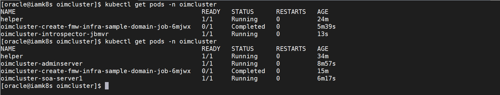

4. It will take several minutes before all the pods listed above show. When a pod has a STATUS of 0/1 the pod is started but the OIG server associated with it is currently starting. While the pods are starting you can check the startup status in the pod logs, by running the following commands:

	```
	<copy>kubectl logs oimcluster-adminserver -n oimcluster</copy>
	```

	```
	<copy>kubectl logs oimcluster-soa-server1 -n oimcluster</copy>
	```

5. Once both pods are running, start the OIM Server using the following command:

	```
	<copy>kubectl apply -f domain_oim_soa.yaml</copy>
	```

	```
	<copy>kubectl get pods -n oimcluster -o wide</copy>
	```

	It may take about 6-7 minutes for all the pods to be in the RUNNING state. While the pods are starting you can check the startup status in the pod logs.

	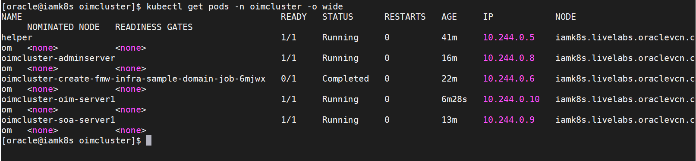

	```
	<copy>kubectl logs oimcluster-oim-server1 -n oimcluster</copy>
	```

## Task 10: Verify the Domain, Pods and Services

1. Verify the domain, servers pods and services are created and in the READY state with a STATUS of 1/1, by running the following command:

	```
	<copy>kubectl get all,domains -n oimcluster -o wide</copy>
	```

	The default domain created by the script has the following characteristics:

	An Administration Server named AdminServer listening on port 7001.

	A configured OIG cluster named oig_cluster of size 3.

	A configured SOA cluster named soa_cluster of size 3.

	One started OIG managed Server, named oim_server1, listening on port 14000.

	One started SOA managed Server, named soa_server1, listening on port 8001.

	Log files are located in /u01/domains/oimclusterdomainpv/logs/oimcluster.

	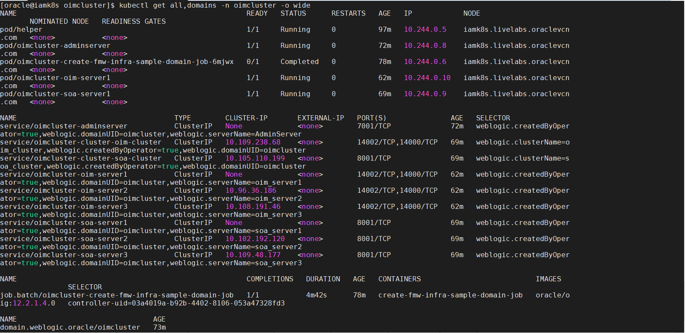


2. Verify the Domain

	```
	<copy>kubectl describe domain oimcluster -n oimcluster</copy>
	```

	In the Status section of the output, the available servers and clusters are listed.


5. Verify the Pods. Note the pod IP address of the adminserver and oim_server1 from the IP column.

	```
	<copy>kubectl get pods -n oimcluster -o wide</copy>
	```

	For example:

	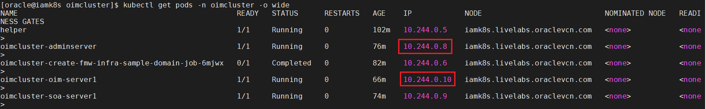

6. Open a browser window to access the weblogic console using the adminserver pod IP using the following URL.

	```
	<copy><ADMIN_IP>:7001/console</copy>
	```

	where *`<ADMIN_IP>`* is the adminserver pod IP noted in the previous step.

	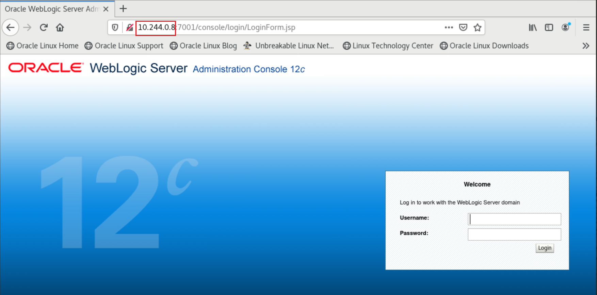

	Login to the console using the following credentials:

	Username:

	```
	<copy>weblogic</copy>
	```

	Password:

	```
	<copy>Welcom@123</copy>
	```

	Click on *Servers* under *Environment* and verify that the SOA and OIM servers are running.

	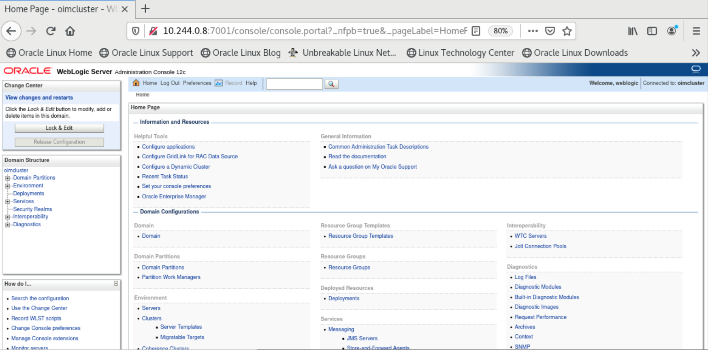

	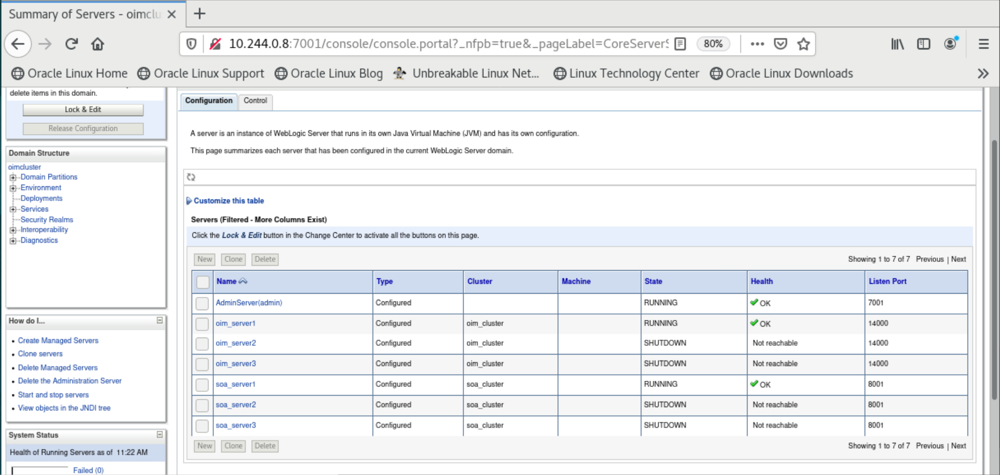


8. Open a browser tab to access the OIM console using the oim_server1 pod IP using the following URL.

	```
	<copy><OIM_IP>:14000/identity</copy>
	```

	where *`<OIM_IP>`* is the oim_server1 pod IP noted in the previous step.

	Login to the console using the following credentials:

	Username:

	```
	<copy>xelsysadm</copy>
	```

	Password:

	```
	<copy>Welcom@123</copy>
	```

	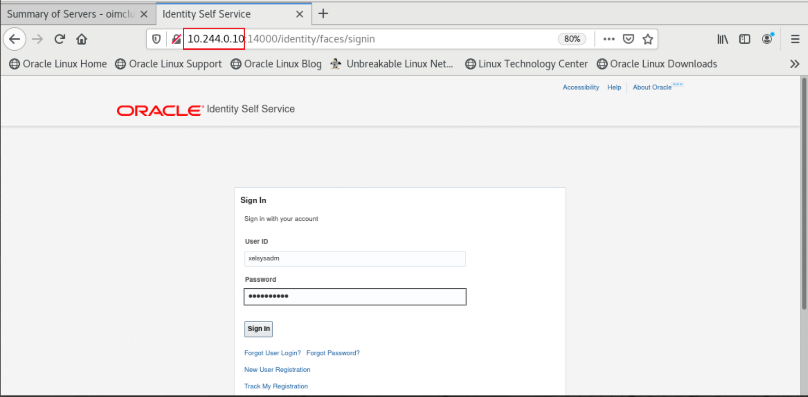

	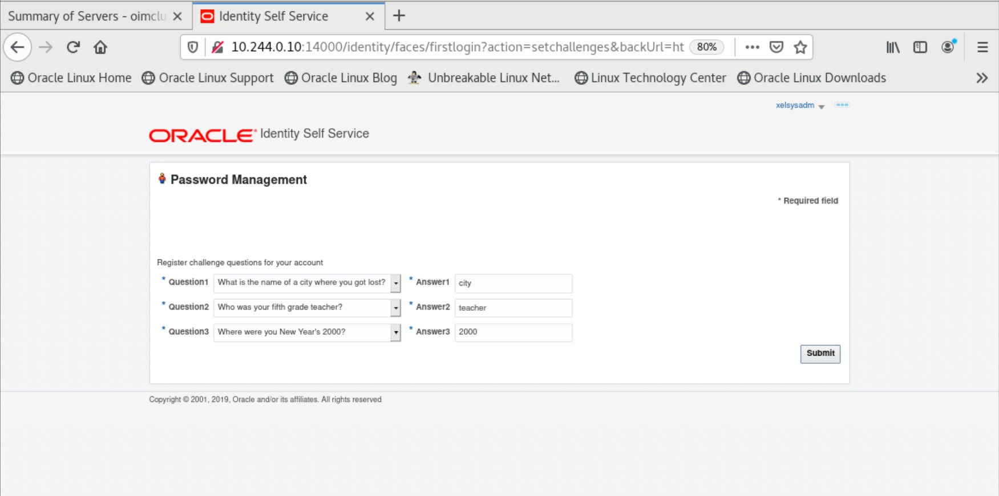

	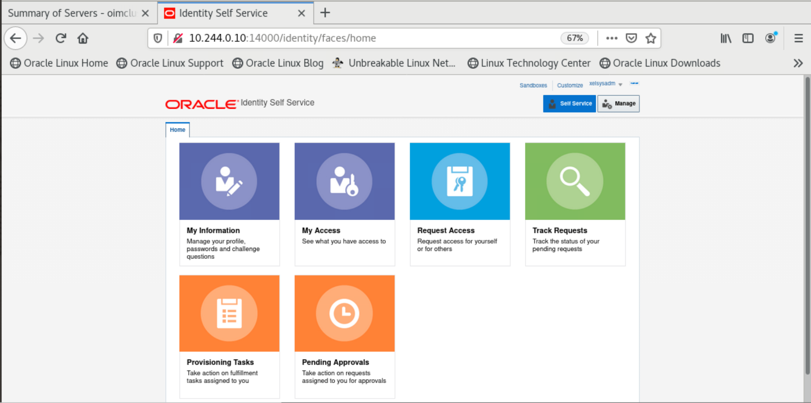


*Note: OIM and SOA server consoles can also be accessed using their respective cluster IPs*

You may now proceed to the next lab.

## Learn More

* [Reference for Oracle Identity Governance on Docker and Kubernetes](https://docs.oracle.com/en/middleware/idm/identity-governance/12.2.1.4/oigdk/overview.html#GUID-1BA2B257-ED5A-4606-B833-C40B2F36F35F)

## Acknowledgements
* **Author** - Keerti R, Anuj Tripathi, NATD Solution Engineering
* **Contributors** -  Keerti R, Anuj Tripathi
* **Last Updated By/Date** - Keerti R, NATD Solution Engineering, January 2022
