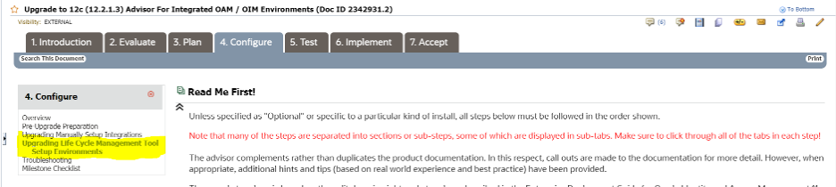
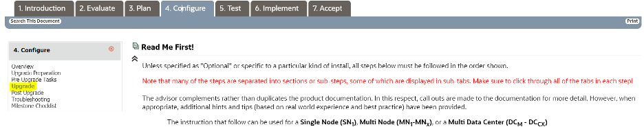
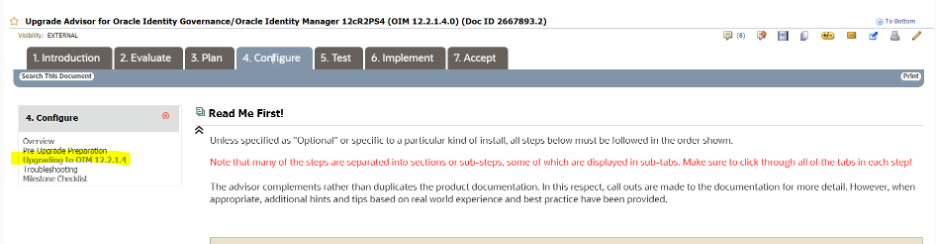

# Oracle IAM 11.1.2.3 to 12.2.1.4 In-Place Upgrade

## Introduction

This section guides you through the steps to upgrade 11.1.2.3 LCM based OIM-OAM integrated environment with OUD as backend Directory Server &amp; OHS as webserver to 12.2.1.4.

*Estimated Lab Time*:  48-72 Hours

### About Oracle IAM Upgrade Strategies
An Oracle Identity and Access Management (IAM) deployment consists of a number of different components:
- A database
- An LDAP directory to store user information
- Oracle Access Manager for Authentication
- Oracle Identity Governance (formally Oracle Identity Manager) for provisioning
- Optionally, Oracle HTTP Server and Webgate securing access to Oracle Access Manager and Oracle Identity Governance

There are different upgrade strategies that you can employ for an upgrade of Oracle Internet Directory, Oracle Unified Directory, and Oracle Identity and Access Management. The strategy you choose will depend mainly on your business needs. This lab uses a Multi-hop in-place upgrade outlined in the Upgrade strategies document :
[Oracle IAM Upgrade Strategies](https://docs.oracle.com/en/middleware/fusion-middleware/iamus/place-upgrade-strategies.html#GUID-9F906AE2-5BDF-426D-A97C-AC546ABFBD28)

The in-place upgrade allows you to take your existing deployment and upgrade it in place.
- When performing an upgrade, you should make as few changes as possible in each stage to ensure that the upgrade is successful.
- For example, it is not recommended to perform multiple upgrade activities such as upgrading Oracle Identity and Access Management, changing the directory, updating the operating system, and so on, all at the same time.
- If you want to perform such an upgrade, you must do it in stages. You must validate each stage before moving on to the next. The benefit of this approach is that it helps you to identify precisely where the issue occurred, and correct it or undo it before you continue the exercise.

### Objectives
In this lab, you will:
* Become familiar with the in-place upgrade process for Oracle IAM 11.1.2.3 to Oracle IAM 12.2.1.4

### Prerequisites

This lab assumes you have:
- A Paid or LiveLabs Oracle Cloud account
- You have completed:
    - Lab: Prepare Setup (*Free-tier* and *Paid Tenants* only)
    - Lab: Environment Setup
    - Lab: Initialize Environment
- As part of pre-upgrade steps, customers have to delete any 10g agents in oamconsole. If they fail to do this UA readiness check will fail indicating presence of 10g agents. As part of pre-upgrade steps for OAM, delete any 10g agents in oamconsole.  UA readiness check will fail if 10g agents exist
- UA readiness check with fail at System Components Infrastructure with the error "OHS\_managed\_template.jar" missing. This can be ignored as we are not upgrading OHS

##  **STEP 1**: Upgrade IAM Components from 11.1.2.3 to 12.2.1.3

1. Upgrade OUD 11.1.2.3 to OUD 12.2.1.3

  * Perform all steps outlined in *section 6.6* of Upgrading Oracle Unified Directory guide - [6.6 Upgrading an Existing Oracle Unified Directory Server Instance](https://docs.oracle.com/en/middleware/idm/unified-directory/12.2.1.3/oudig/updating-oracle-unified-directory-software.html#GUID-506B9DAC-2FDB-47C9-8E00-CC1F99215E81)

  * Update the keystore encryption strength using the steps below to update keystore encryption strength and change the password for 12c upgrade
      List current keystore contents and enter the keystore password
        ```
        <copy>keytool -list -v -keystore /u01/app/oracle/config/domains/IAMGovernanceDomain/config/fmwconfig/default-keystore.jks -storepass IAMUpgrade12c##</copy>
        ```

  * •	Create a temporary folder called /tmp/keystore and then generate new keys using the keytool command
        ```
        <copy>
        keytool -genkeypair -keystore /tmp/keystore/default-keystore.jks -keyalg RSA -validity 3600 -alias xell -dname "CN=wsidmhost.idm.oracle.com, OU=Identity, O=Oracle, C=US" -keysize 2048 -storepass IAMUpgrade12c## -keypass IAMUpgrade12c##
        </copy>
        ```

  * Generate Signing Certificate
    ```
    <copy>
    keytool -certreq -alias xell -file /tmp/keystore/xell.csr -keypass IAMUpgrade12c## -keystore /tmp/keystore/default-keystore.jks -storepass IAMUpgrade12c## -storetype jks
    </copy>
    ```

  * Export the Certificate
    ```
    <copy>
    keytool -export -alias xell -file /tmp/keystore/xlserver.cert -keypass IAMUpgrade12c## -keystore /tmp/keystore/default-keystore.jks -storepass IAMUpgrade12c## -storetype jks
    </copy>
    ```

  * Trust the Certificate
    ```
    <copy>
    keytool -import -trustcacerts -alias xeltrusted -noprompt -file /tmp/keystore/xlserver.cert -keystore /tmp/keystore/default-keystore.jks -storepass IAMUpgrade12c##
    </copy>
    ```

  * Import Certificate
    ```
    <copy>
    keytool -importkeystore -srckeystore /tmp/keystore/default-keystore.jks -destkeystore /u01/app/oracle/config/domains/IAMGovernanceDomain/config/fmwconfig/default-keystore.jks -srcstorepass IAMUpgrade12c## -deststorepass IAMUpgrade12c## -noprompt
    </copy>
    ```

  * Move .cert and .csr
    ```
    <copy>
    cp /tmp/keystore/x*.* /u01/app/oracle/config/domains/IAMGovernanceDomain/config/fmwconfig/
    </copy>
    ```

  * Confirm keystore
    ```
    <copy>
    keytool -list -v -keystore /u01/app/oracle/config/domains/IAMGovernanceDomain/config/fmwconfig/default-keystore.jks -storepass IAMUpgrade12c##
    </copy>
    ```

    Update password for xell in EM to "IAMUpgrade12c##"
      * Open EM console
      * Navigate to Weblogic Domain > IAMGovernanceDomain
      * Right click IAMGovernanceDomain
      * Select Security > Credentials
      * Expand the oim entry
      * Highlight xell row
      * Click Edit
      * Update password
      * Click OK

2. Upgrade OIM/OAM from 11.1.2.3 to OIG/OAM 12.2.1.3

    Use the Upgrade Advisor to upgrade OAM and OIM integrated environment. You will need to login with your Oracle support login credentials. The link to the MOS document is provided below:
    - [Upgrade to 12c (12.2.1.3) Advisor For Integrated OAM / OIM Environments](https://support.oracle.com/epmos/faces/DocumentDisplay?_afrLoop=318814815527407&id=2342931.2&_adf.ctrl-state=13r3ivrcxc_57)
    - Navigate to *Step 4: configure*
    - Navigate to *Upgrading Life Cycle Management Tool Setup Environments*
    - Perform all the steps listed in the section to upgrade OAM
    - Please note that *step 4*, needs to be done once for OIM and once for OAM

  

3. Apply 12.2.1.3 patches mentioned in the Stack Patch Bundle:
    Apply Stack Patch Bundle for Oracle Identity Management Products using the MOS document link provided below:
      - [Stack Patch Bundle Page for OIG](https://support.oracle.com/epmos/faces/DocumentDisplay?_afrLoop=320313382903924&id=2657920.1&_adf.ctrl-state=13r3ivrcxc_110)
      - [Download and Apply SPB for 12.2.1.3](https://support.oracle.com/epmos/faces/PatchSearchResults?_adf.ctrl-state=r390fd14k_135&_afrLoop=321341144687003)

##  **STEP 2**: Upgrade IAM Components from 12.2.1.3 to 12.2.1.4

1. Upgrade OUD from 12.2.1.3 to 12.2.1.4
    Upgrade OUD using the instructions in *section 6.4* of the documentation below
    - [Upgrade OUD 12.2.1.3 to 12.2.1.4](https://docs.oracle.com/en/middleware/idm/unified-directory/12.2.1.4/oudig/updating-oracle-unified-directory-software.html#GUID-506B9DAC-2FDB-47C9-8E00-CC1F99215E81)

2. Upgrade OAM 12.2.1.3 to 12.2.1.4:
    Upgrade OAM using the Upgrade Advisor for OAM 12cR2 PS4 (OAM 12.2.1.4.0)
    - [Upgrade to Oracle Access Manager 12cR2 PS4](https://support.oracle.com/epmos/faces/DocumentDisplay?_afrLoop=320632596387945&id=2564763.2&_adf.ctrl-state=13r3ivrcxc_167)
    - Navigate to *step 4: Configure* and select *Upgrade*

    

3. Upgrade OIG 12.2.1.3 to 12.2.1.4
    Upgrade OIG using the Upgrade Advisor for OIG 12cR2 PS4 (OAM 12.2.1.4.0)
    - [Upgrade Advisor for Oracle Identity Governance/Oracle Identity Manager 12cR2 PS4](https://support.oracle.com/epmos/faces/DocumentDisplay?_afrLoop=320673956019924&id=2667893.2&_adf.ctrl-state=13r3ivrcxc_220)
     - Navigate to *step 4: Configure/Upgrade*

    

4. Apply 12.2.1.4 patches mentioned in stack patch Bundle:
    Apply Stack Patch Bundle for Oracle Identity Management Products using the MOS document link provided below:
    - [Apply Stack Patch Bundle for Oracle Identity Management Products](https://support.oracle.com/epmos/faces/DocumentDisplay?_afrLoop=320313382903924&id=2657920.1&_adf.ctrl-state=13r3ivrcxc_110)
    - [Download and Apply 12.2.1.4 SPB](https://support.oracle.com/epmos/faces/ui/patch/PatchDetail.jspx?parent=DOCUMENT&sourceId=2657920.1&patchId=32395452)

##  **STEP 3**: Integrate OIG and OAM using LDAP Connector

  Configure OIG and OAM integration using the step by step instructions in *section 2.3* of the below documentation:
  - [Configuring Oracle Identity Governance and Oracle Access Manager Integration](https://docs.oracle.com/en/middleware/idm/suite/12.2.1.4/idmig/integrating-oracle-identity-governance-and-oracle-access-manager-using-ldap-connectors.html#GUID-9FD153DD-1497-4846-8D39-813B20E29B40)

##  **STEP 4**: Transition OHS to 12.2.1.4:
1. Follow the steps below to install and configure OHS:
    - [Prepare and install OHS](https://docs.oracle.com/en/middleware/fusion-middleware/12.2.1.4/wtins/preparing-install-and-configure-product.html#GUID-16F78BFD-4095-45EE-9C3B-DB49AD5CBAAD)

2. Configure OAM WebGate:
  Complete all 6 steps under *Configuring Oracle HTTP Server WebGate* in the following document.
    - [Configure WebGate](https://docs.oracle.com/en/middleware/fusion-middleware/12.2.1.4/wgins/configuring-oracle-http-server-webgate-oracle-access-manager.html#GUID-79326DB8-CCB1-47F6-8CC2-80B6402C13FC)
    - We will use the same agent profile as used in 11.1.2.3 - Webgate\_IDM\_11g
    - Copy all the artifacts under *OAM\_DOMAIN\_HOME/output/OAM\_Webgate\_IDM11g* directory over to *OHSDOMAIN\_HOME/config/fmwconfig/components/OHS/ohs1/webgate/config* directory
    - After the copy command, *OHSDOMAIN\_HOME/config/fmwconfig/components/OHS/ohs1/webgate/config* directory should have the following files and directories
        - aaa_cert.pem
        - aaa_key.pem
        - cwallet.sso
        - ObAccessClient.xml
        - oblog_config_wg.xml
        - password.xml
        - wallet directory with cwallet.sso file
        - Simple directory with aaa_cert.pem and aaa_key.pem
    - If simple directory doesn't exist, create one and copy the \*.pem files over
    - Navigate to oamconsole: Configuration/Settings/Access Manager Settings/Webgate Traffic Load Balancer/OAM Server port
      - Change the port to OAM server port 14100
    - Navigate to Oamconsole: Application Security/Agents/Webgate_IDM_11g
      - Replace the existing User Defined Parameter contents with the below list:
          - maxSessionTimeUnits=minutes
          - OAMRestEndPointHostName=wsidmhost.idm.oracle.com
          - client_request_retry_attempts=1
          - proxySSLHeaderVar=IS_SSL
          - inactiveReconfigPeriod=10
          - OAMRestEndPointPort=14100
          - URLInUTF8Format=true
          - OAMServerCommunicationMode=HTTP

3. Increase Header size in OHS using this MOS documentation
      - [How to Increase HTTP Header Size to Prevent Server Limit Errors](https://support.oracle.com/epmos/faces/DocumentDisplay?_afrLoop=321479834906018&id=819301.1&_adf.ctrl-state=13r3ivrcxc_273)
    - Add LimitRequestFieldSize 16380 to httpd.conf file after global server directive "KeepAlive"

4. Start OHS server

##  **STEP 5**: Validate the IAM 12.2.1.4 Integrated environment

1. Test OAM and OIG using the steps in *section 2.4.7* in the documentation below
    - [Functionally Testing the Access Manager and Oracle Identity Governance Integration](https://docs.oracle.com/en/middleware/idm/suite/12.2.1.4/idmig/integrating-oracle-identity-governance-and-oracle-access-manager-using-ldap-connectors.html#GUID-3803AA41-A882-41C9-B1E8-0BBCBD581CE9)

2. Validate OAM:
    - Access [OAM Admin Server Console](http://wsidmhost.idm.oracle.com:7001/oamconsole) and login as *oamadmin*
        - Validates OAM Admin Server is functioning properly
    - Access [OAM Server Console](http://wsidmhost.idm.oracle.com:14100/oam/server/logout)
        - Validates OAM server is running and successfully listening in HTTP port
    - Access [OAM Server Console](http://wsidmhost.idm.oracle.com:7777/oam/server/logout)
        - Validates OHS proxy configuration to OAM server is working and also Webgate is functioning
    - Run ```Netstat -a -n | grep 5575```
        - It should return LISTEN
        - Validates OAM server is listening on OAP port

3. Validate OIG:
    - Access the Oracle Identity Governance pagees with the following URL:
        - [Oracle Identity Self Service](http://wsidmhost.idm.oracle.com:7778/identity)
        - [Oracle Identity System Administration](http://wsidmhost.idm.oracle.com:7778/sysadmin)
    - Verify the links for "Forgot Password", "Register New Account" and "Track User Registration" features appear in the login page and that they work.
    - Log in to [Oracle Identity Self Service](http://wsidmhost.idm.oracle.com:7778/identity) as *xelsysadm*
    - Create a new user
    - Logout as *xelsysadm* and login as the user created in *step 4*.
          - When prompted for login, provide valid credentials for the newly-created user.
    - Provide a new password and select three challenge question and answers.
          - The new user should now be logged in.
    - Verify the lock/disable feature works by opening a new private browser and logging in as a *xelsysadm*
          - Now lock or disable the user account created in step 4.
    - Now back in the broswer where the new user is logged try clicking on any new links, user should be redirected back to the login page.
    - Verify the SSO logout feature works by logging out Oracle Identity Self Service page where *xelsysadm* is still logged out.
          - Upon logout from the page, you are redirected to the SSO logout page.

**Congratulations! You have completed this workshop!**

## Learn More
- You can find more information about the latest version of Oracle IAM [here](https://docs.oracle.com/en/middleware/idm/suite/12.2.1.4/index.html)
- You can find more information about the upgrade strategies [here](https://docs.oracle.com/en/middleware/fusion-middleware/iamus/place-upgrade-strategies.html#GUID-9F906AE2-5BDF-426D-A97C-AC546ABFBD28)

## Acknowledgements
* **Author** - Anbu Anbarasu, Director, Cloud Platform COE
* **Contributors** -  Eric Pollard - Sustaining Engineering, Ajith Puthan - IAM Support, Rene Fontcha
* **Last Updated By/Date** - Sahaana Manavalan, LiveLabs Developer, NA Technology, May 2022
