# Setup the Environment

## Introduction

Oracle Identity Cloud Service (IDCS) provides integration with any service that can be integrated via *SAML* (Security Access Markup Language) protocol. Administrations will be able to manage users into various applications via single control panel and end users will be able get to applications via single click.

IDCS provides support for standard SAML 2.0 Browser POST Login & Logout Profiles.

Please note, that though IDCS supports SAML and OpenID Connect/OAuth, there are many times when a non-SAML enabled system requires SSO.  IDCS App Gate provides support for non-SAML systems that use header-based, cookie-based or form-fill SSO. App Gate is a Nginx-based, software appliance deployed in a proxy configuration that can be deployed on AWS, OCI, OCI-C or on-premises in VMWare or Oracle Virtualbox.  It is delivered via Identity Cloud Service and available for IDCS Standard customers.  

This lab is intended to demonstrate federated Single Sign-on (SSO) with a 3rd party SaaS application. The purpose is to illustrate the business value of having IDCS as a central Identity Provider for your growing portfolio of Oracle and non-Oracle products and services.


Estimated Lab Time: 90 minutes

### Objectives

In this lab, you will:
* configure Salesforce Application
*	assign Apps to Group
*	request Group Access
*	verify SSO Configuration
*	configure Provisioning and Synchronization


### Prerequisites

* An Oracle Free Tier or Paid Account
* A Google Account
* A Salesforce Developer Account

## Task 1: Configure Salesforce Application

* *Personas*:
    - Administrator

In this hands-on exercise, we will setup integration with *Salesforce* using SAML. IDCS will act as *IdP* (Identity Provider) and Salesforce org as *SP* (Service Provider also known as a Relying Party)

1. Download IDCS Metadata to a local XML file. Metadata is available from the following location:

    ```
    https://<your tenant>/fed/v1/metadata
    ```

    Depending on the browser you are using, the simplest way of doing this is to right click anywhere on the page and chose “Save as” option, provide a name and save it as XML file. Try not to use the copy / paste option as the xml file may be altered.

    

**Steps 2-8 below were covered in the workshop prerequisites section**

2.	Register for a [Salesforce developer account](https://developer.salesforce.com).

    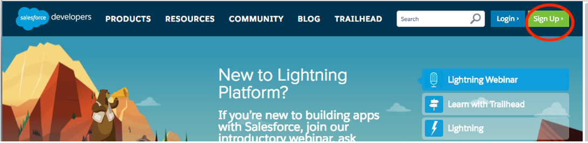


    Once registered, check your email and verify the account registration and then log into Salesforce. Note that you may have to select “Switch to Salesforce Classic”.

3.	Access Salesforce application using the URL provided after registration, click on the profile menu as per below print screen and select the option: *Switch to Salesforce Classic*.

    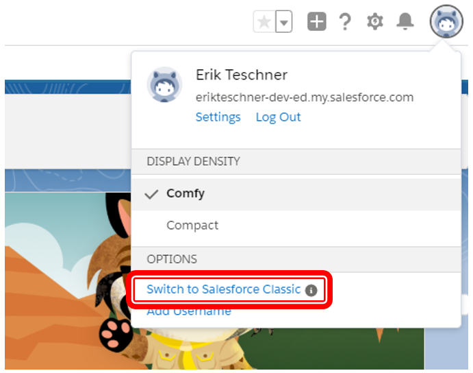

4.	Go to *Setup* into the upper tab menu, near the profile.

    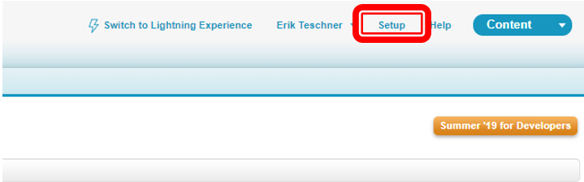

5.	Register a custom Domain.   Go to *Domain Management* and select *My Domain* and register a domain of your choosing. This is to have a custom application URL dedicate for our use case.

6.	*Check availability* for your new domain.

7.	*Register* your new domain.

    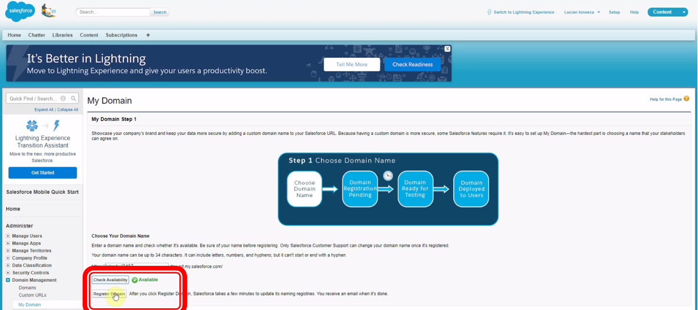

8. Salesforce updates its domain registries with your new one. When it’s done, you receive a confirmation email. It can take a few minutes before your domain is available.

9.	Under Domain Management, click on Domains and click on your newly created Domain.

    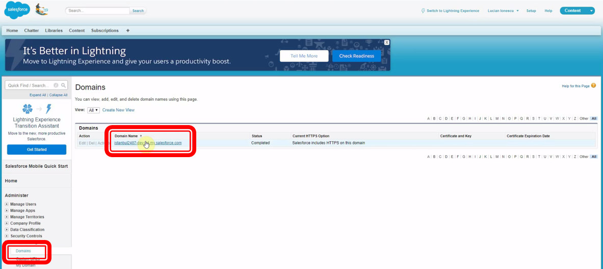

10.	When your new domain is registered, note your domain URL

    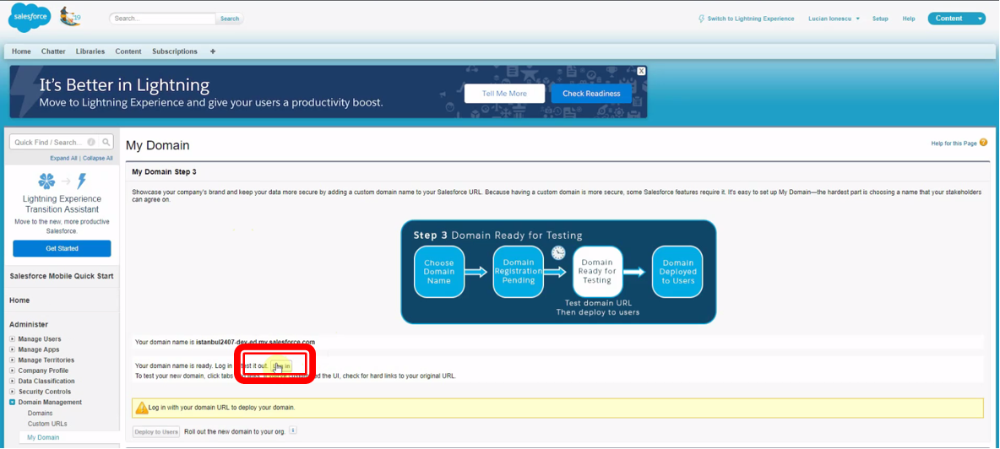

11. Login with the new domain using the URL above, then go back to *Domain Management*, click on *Domains* then and click on the recently created domain.

12.	Click on *Deploy to Users*. When the pop-up window shows up, click *OK*.

    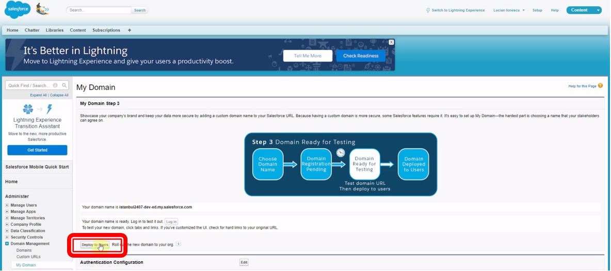

13.	Your domain is now setup and deployed to users. Make sure that you can see under My Domain that Step 4 is complete and it shows *Domain Deployed to Users*.

14.	From the side menu bar, go to *Security Controls* and select *Single Sign-On Settings*.

15.	Click on *Edit* and enable *Federated Single Sign-On Using SAML* option. Click *Save*.

    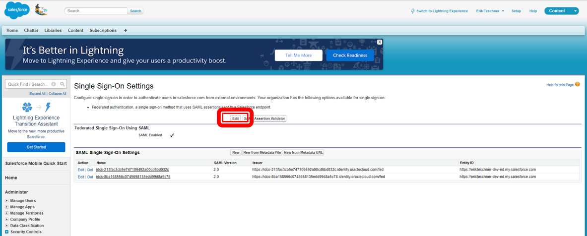

    ```
    We need to activate the SAML option on Salesforce in order to be able to integrate with IDCS via these open standards.  Also, the SAML metadata needs to be exchanged between IDCS and Salesforce
    ```

16.	Click on *New from Metadata File* button to import IDCS metadata.  Select the downloaded metadata file from step 1 using *Choose File* button. Click on *Create*.

    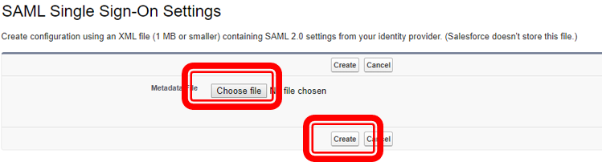

    ```
    IDCS metadata file contains information about IDCS endpoints for SSO, single logout, Entity ID, Issuer details, IDCS signing certificate etc which are needed by Salesforce in order to establish a federated trust with IDCS.
    ```


17.	Keep all the default information and click on *Save*.

    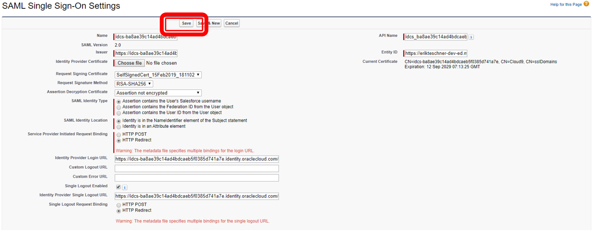

    Below are the details for this example.  Note that your URLs and domain information will be different.

    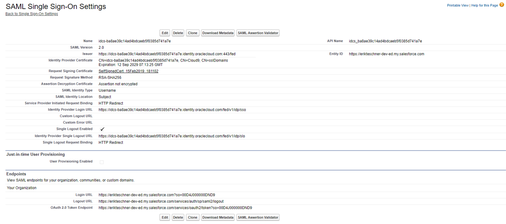

18.	Make note of the following:
*	Domain Name value, for example: prodsys-dev-ed
*	(Optionally) Organization ID value, for example: 00D4J000000DND9

    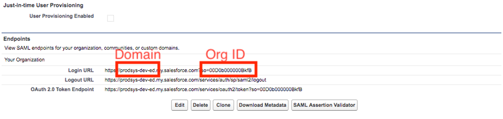

Note: Please see the step below in case the Org ID value is not shown in the Login URL field.

19.	In case the organization ID is not displayed in the Login URL, click on *Company Profile* and then on *Company Information* to retrieve the *Org ID*.

    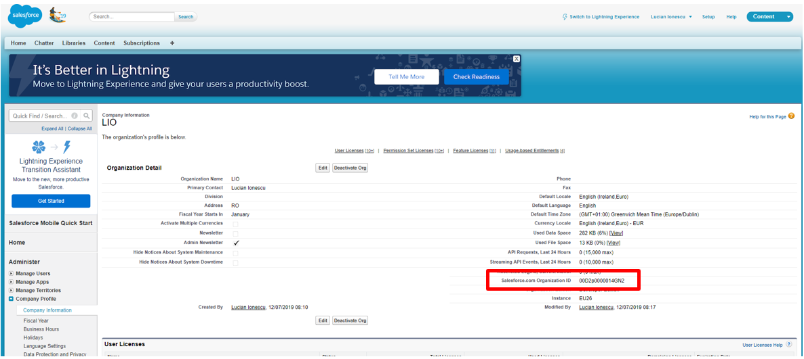

Salesforce has been configured successfully. The next step is to configure IDCS.


## Task 2: Create Salesforce IDCS Application

* *Personas*:
    - Administrator

1. Login to your IDCS Admin Console as an administrator:

    ```
    https://<your tenant>/ui/v1/adminconsole
    ```

    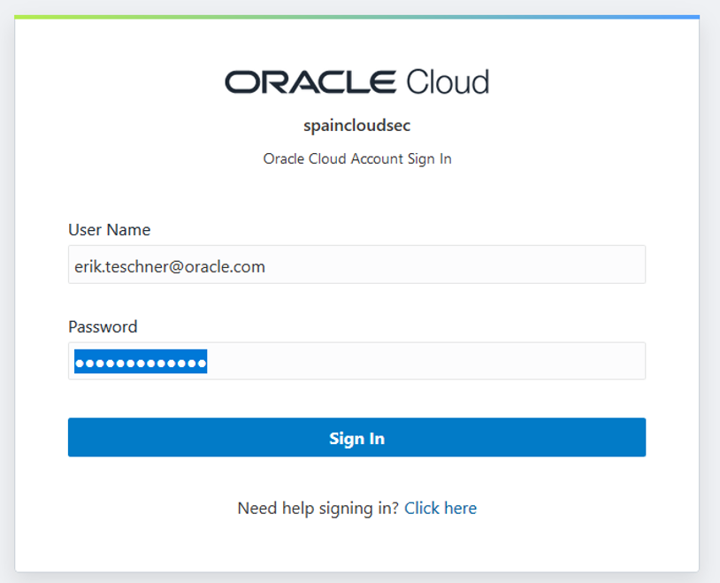

2.	Select the Applications tab from the IDCS dashboard presented after log in.

    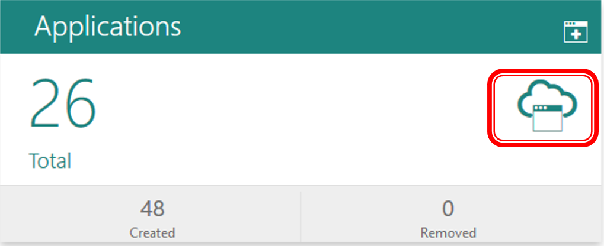

3.	Click the *Add* button to create a new application.

    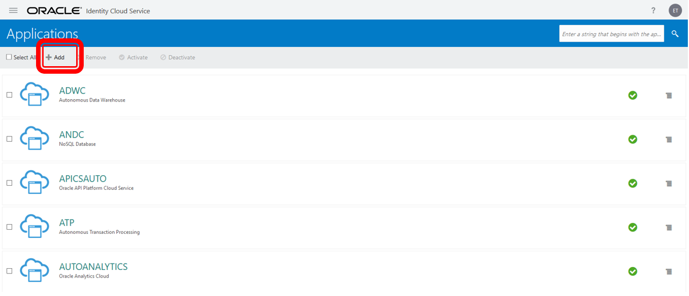

4.	Select *App Catalog*.

    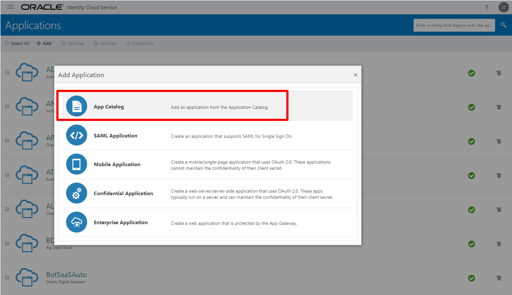

    ```
    Note that IDCS provides an application template for Salesforce.
    The App Catalog is a collection of partially configured application templates that Oracle creates and maintains for you. You can use the templates to define the application, configure Single Sign-On, and enable and configure provisioning and synchronization. The App Catalog templates allow you to onboard applications quickly and securely.

    App templates simplify adding a new application by prepopulating all common attributes and values so that you just have to enter your tenant specific details.
    ```

5.	Inside the *App Catalog*, search for *Salesforce*. Click on *Add*.

    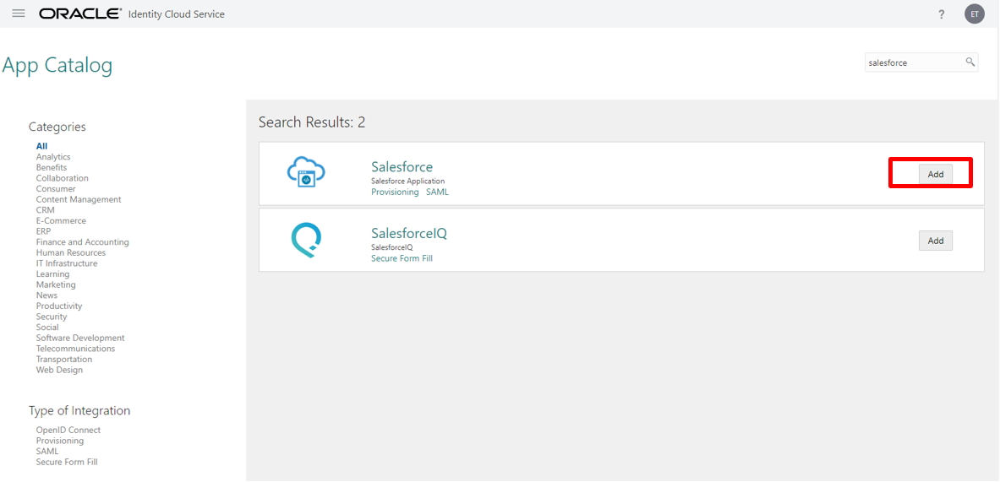

6.	On the first page of configuration screen provide the *Domain Name* value that you made note of from within Salesforce. Optionally, you can add the *Organization ID*. Click *Next*.

7.	Click *Next* again when you are in the *SSO Configuration* screen.

    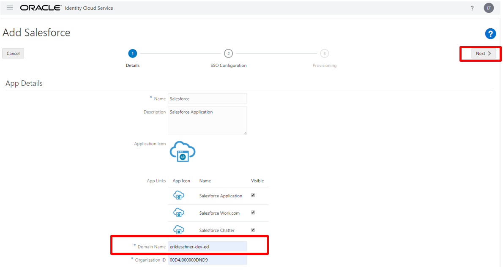

8.	Click *Finish*

    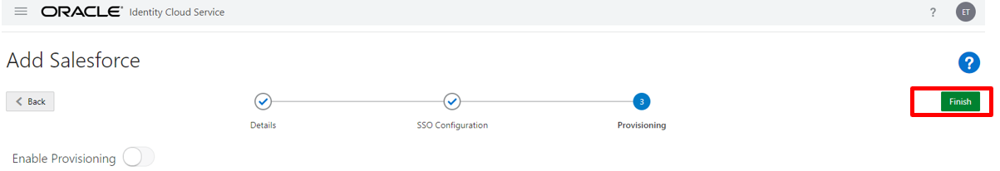

9.	 Activate the application

    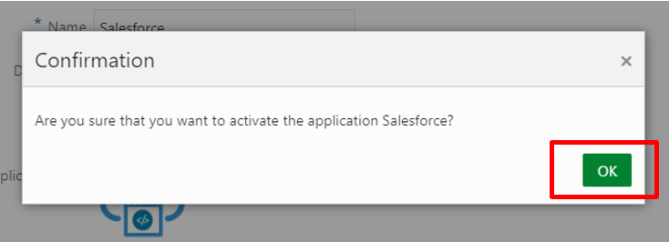


## Task 3: Assign Apps to Group

* *Personas*:
    - Administrator

In IDCS you have the option to assign access to users directly, by direct assignment to a specific application, or indirectly using dedicated groups. For the purpose of the use case we’ll be using groups to provide users access to Salesforce application.

1.	Click on the Navigation drawer and select *Groups*.

2.	Add a group labeled *Employee*. Check the box *User can request access*.  

    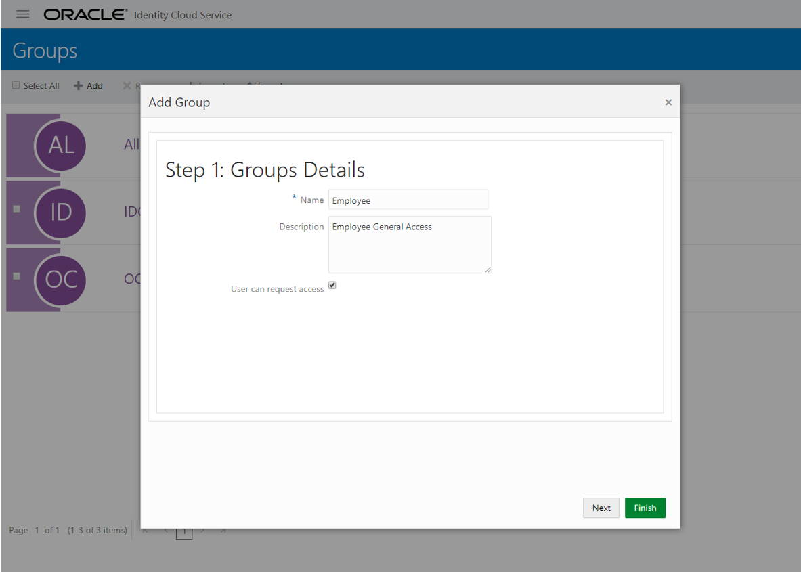

3.	Click on *Finish*

4.	Go to the *Access* tab.  Click on *Assign*.

5.	Select the *Assign* button in line with the *Salesforce* application and click on *OK*.

    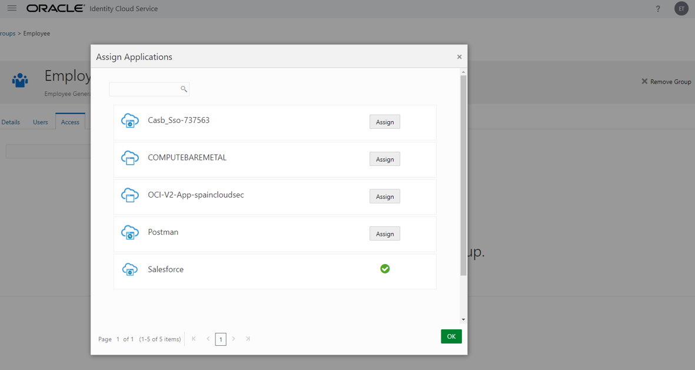

    ```
    Note: you need to add a corresponding account in Salesforce for Federation to work correctly.  How accounts may be created in production are out of scope for this workshop but can be accomplished in a number of methods.  
    ```

6.	Login to your [Salesforce developer account](https://developer.salesforce.com/) in order to create a corresponding account for one that we have into IDCS.

    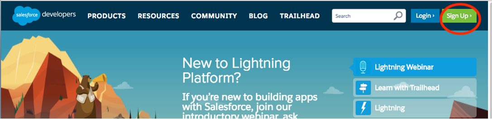

7.	In case you are not Salesforce Classic, click on the profile menu as per below print screen and select the option: *Switch to Salesforce Classic*.

    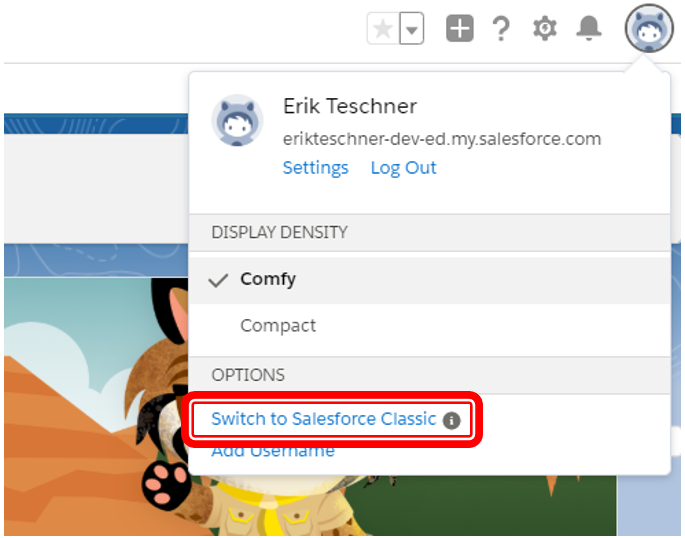

8.	Go to *Setup* into the upper tab menu, near the profile.

    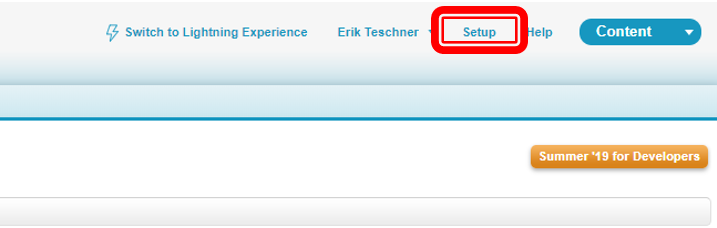

9.	On the left panel, click on *Manage Users*, then on *Users* and then on *New User*.

    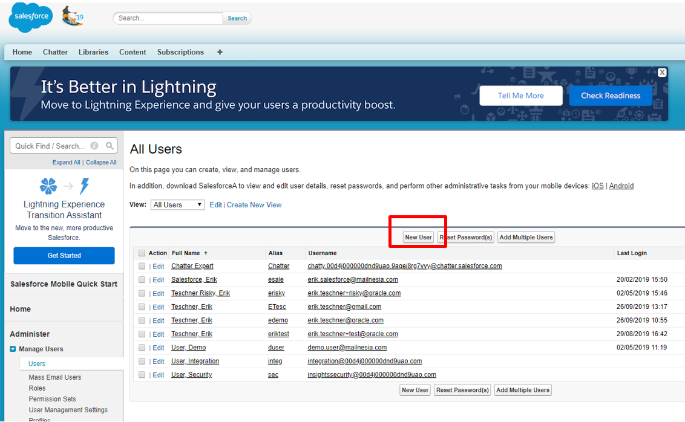

10.	Create a user as shown below.  Be sure to use the email address as the login and use one that matches an account in IDCS. Set the following parameters:

    | Parameter | Value |
    | --- | --- |
    | Role | e.g. Marketing Team |
    | User License | Salesforce Platform |
    | Profile | Standard Platform User |


    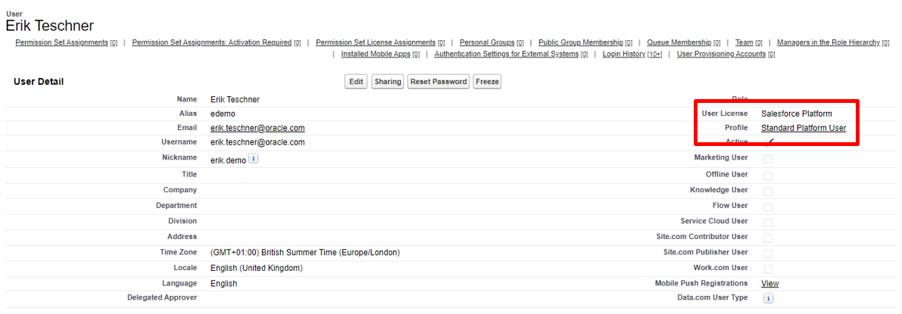

Now that the account is available in Salesforce and IDCS has the authenticated account you are ready to test.

## Task 4: Request Group Access

* *Personas*:
    - End User

Remember that we have created the *Employee* group into IDCS which is having access to Salesforce application but there is no user assigned yet to it. Since we chose the option *User can request access* at the creation of the group, now we should be able to request access to it and implicitly to the Salesforce application.  

1.	Close your browser to clear the cache and then login into IDCS console

    ```
    https://<yourtenant>/ui/v1/myconsole
    ```

    ```
    Please use the same user credentials that you have entered in the previous section in order to create a user account in Salesforce. If you have followed the conventions recommended by this guide this should be in the form of:     <username>+ui@<email_provider.com>
    ```

2. From *My Apps* page, click on *+ Add* access request button.

    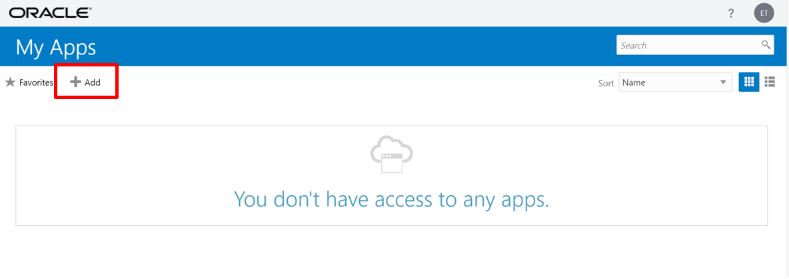

3.	From the *Groups* tab, select *Employee* group and select the *+* sign.

    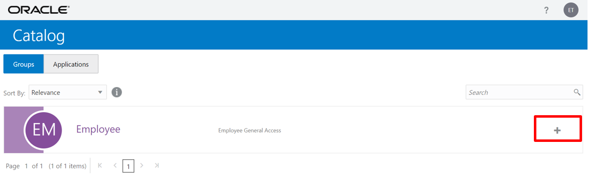

4.	Provide *justification* on the resulting popup page. Click on *OK*. This is an auto approved request and access should be granted immediately without the need of and administrator intervention.

    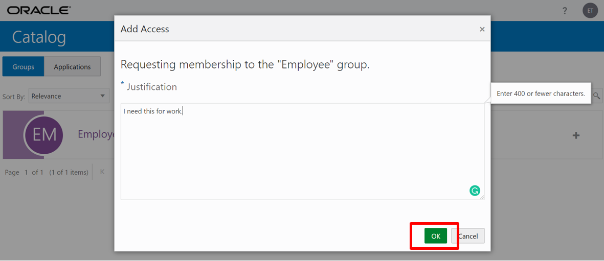

5.	Go to *My Access* section from menu located top-right.

    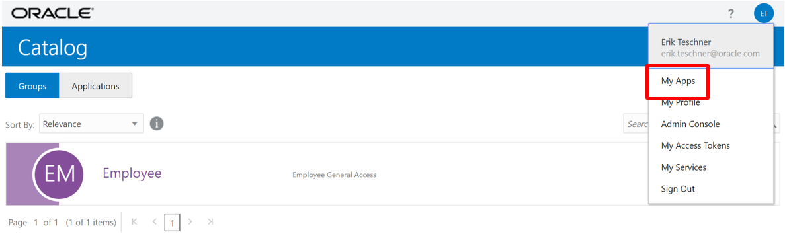

6.	Ensure that Salesforce applications are visible now on the *My Apps* page.

    


## Task 5: Verify SSO Configuration

* *Personas*:
    - End User

1.	In the IDCS console, click on the *Salesforce Chatter* app from *My Apps* page.

    Note: In case the Salesforce applications are not visible while your user is assigned to a group that gives access to Salesforce, a synchronization with your user in IDCS and Salesforce need to be configured first. Step 6 explains how to synchronize users between IDCS and Salesforce.

    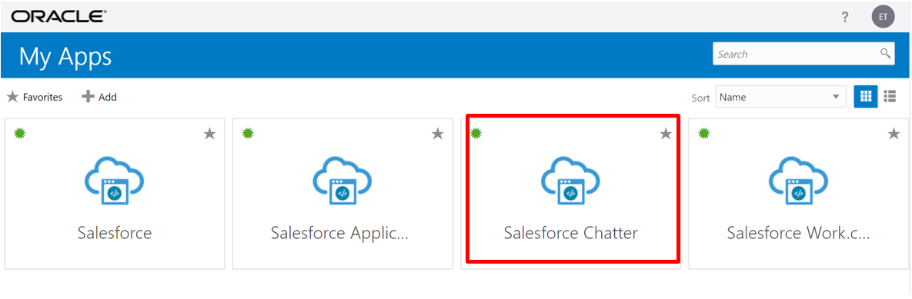

2.	Ensure that user is automatically logged into Salesforce Chatter (SSO).

    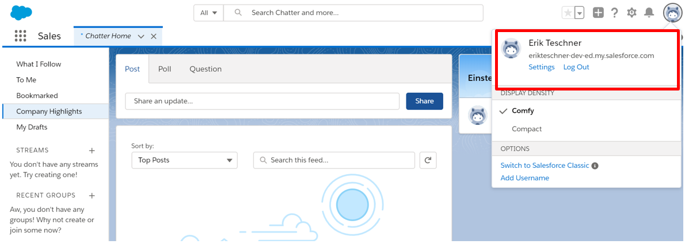

You should now see the same user profile information, that you started within IDCS, within Salesforce without having had to log into Salesforce.

```
When you submit your IDCS user login credentials, in the background, IDCS prepares a SAML assertion and redirects the user’s browser to the Salesforce SaaS application.

Salesforce consumes the SAML assertion and maps the user in its local identity store, based upon the federation agreements which had previously been configured.
```

## Task 6: Configure Provisioning and Synchronization

* *Personas*:
    - Administrator

### Obtaining Host Name, Organization ID, and Domain Name from Salesforce

A host name, organization ID, and a domain name are required before you can configure the Salesforce app in Oracle Identity Cloud Service. You obtain these values from Salesforce.

1.	In the left navigation menu of the home page, search and click *Single Sign-On Settings*. The Single Sign-On Settings page appears as the only valid link.

    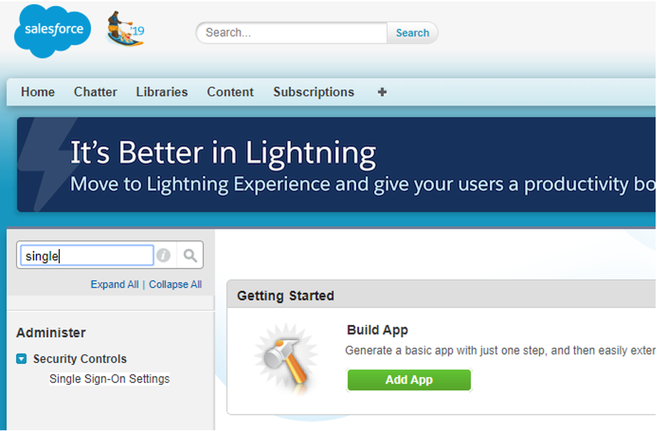

2.	Under the *Single Sign-On Settings* section, click the name that you provided for your identity provider in the *Single Sign-On Settings* page.

3.	Make note of the host name from the value given in the Entity ID field  and click on the corresponding instance name.

    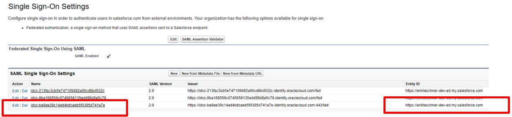

    ```
    Note: Use this host name value while enabling user provisioning for the Salesforce app in Oracle Identity Cloud Service in the "Enabling Provisioning" section, and while verifying the SSO initiated from Salesforce in the "Verifying Service Provider Initiated SSO from Salesforce" section.
    ```


4.	Under the *Endpoints* section, make note of the domain name and the organization ID from the Salesforce Login URL:

    ```
    https://<Domain_Name>.my.salesforce.com?so=<Organization_ID>
    or
    https://<Domain_Name>.my.salesforce.com
    ```

    The domain name appears at the beginning and the organization ID appears at the end of the URL.

    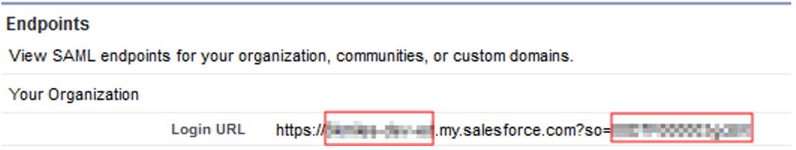


### Obtaining the Consumer Key and Consumer Secret from Salesforce

1.	Switch to *Lightning Experience* in Salesforce.

     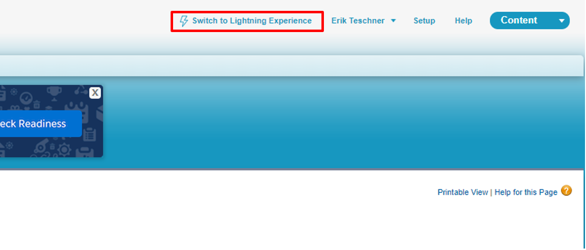

2.	Click the cogwheel on the top right corner of the page and select *Setup*.

    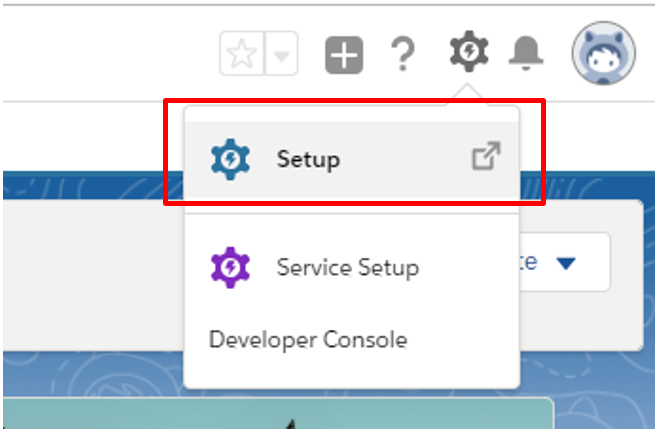


3.	In the left navigation menu of the home page, search and click App Manager. The Lightning Experience *App Manager* page appears.

    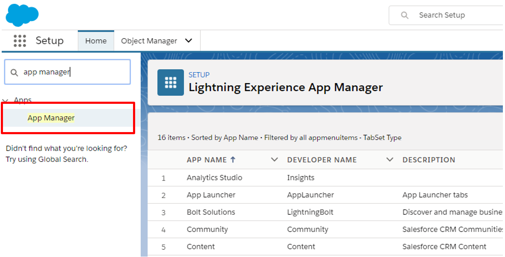

4.	In the right corner of the page, click *New Connected App*. The New Connected App page appears.

    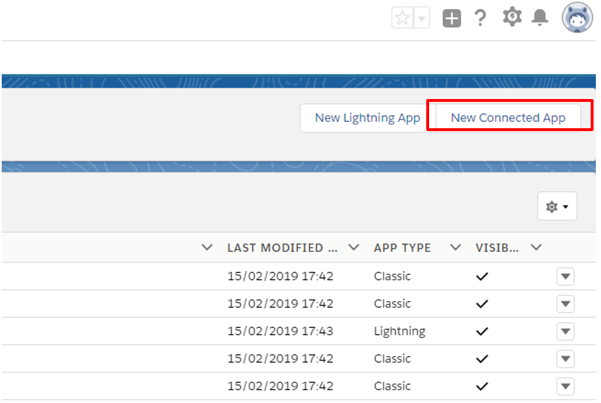

5.	Under the Basic Information section, enter the *Connected App Name* of the app that you want to connect.

6.	Enter the *Contact Email* of the administrator.

7.	Under the API (Enable OAuth Settings) section, select the *Enable OAuth Settings* check box.

8.	Enter any public domain URL that receives the access token from the authorization server in the *Callback URL* field. For example, https://login.salesforce.com.

9.	In the *Selected OAuth Scopes* field, select *Full access(full)* under the *Available OAuth Scopes* list, and then click *Add* to give full access to modify the OAuth.

    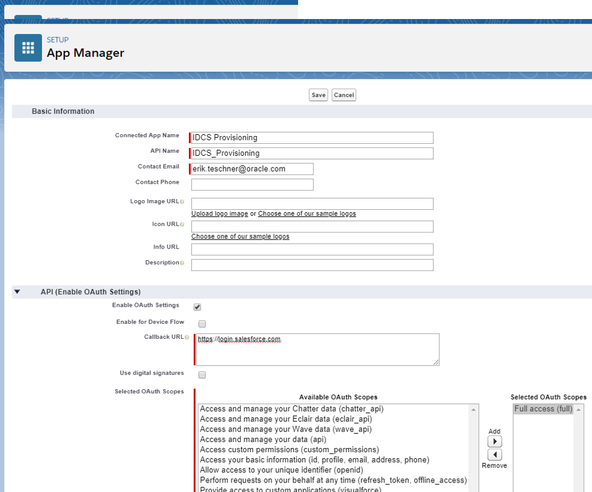

10.	Scroll down and click *Save*.

11.	Wait for 2-10 minutes for the changes to take effect on the server before using the connected app, and then click *Continue*.

12.	In most cases, the newly created app page appears automatically. In case, it does not appear please follow the following steps. In the left navigation menu of the home page, search and click *App Manager*. Search for the newly created app and click the small arrow on the right and select *View*.

    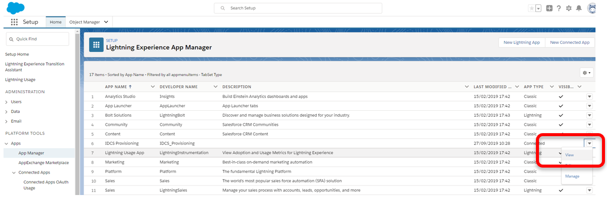   

13.	Under the API (Enable OAuth Settings) section, click *Click to reveal* next to the *Consumer Secret* field.

    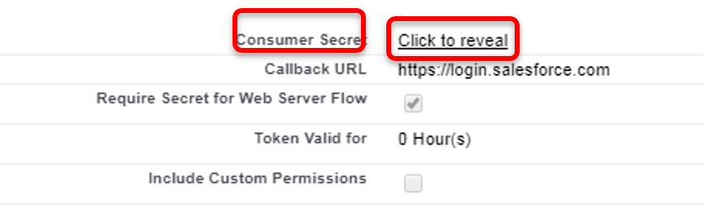  

14.	 Make note of the *Consumer Key* and *Consumer Secret* values.


###	Deriving the Administrator Password from Salesforce


**A security token must be appended to the administrator password** before you enable provisioning and synchronization for Salesforce app. You obtain the token value from Salesforce.

The final value will look like this:

```
<yourSalesforceAdminPassword + securityToken(ex: LKdMzECdjFKYSj028WJhU1GG)>
```

1.	In the upper-right corner of the Salesforce home page, click the user icon, and then click Settings from the drop-down list.

    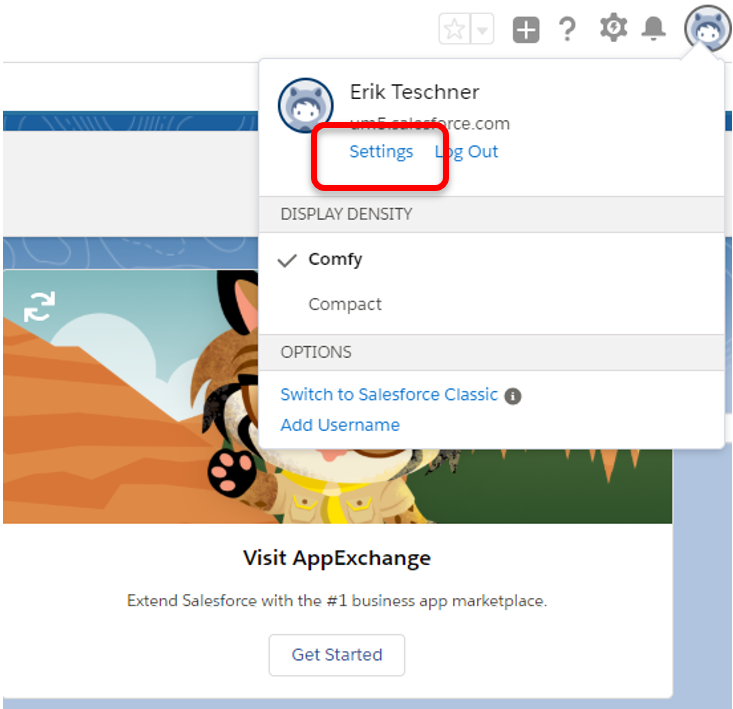  
 
2.	In the left navigation menu, search and click *Reset My Security Token*.

    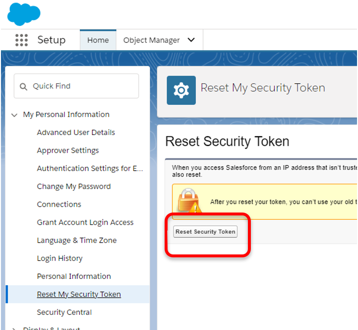  

3.	On the *Reset My Security Token* page, click *Reset My Security Token*. A security token is sent to the email address of the administrator.

4.	Make note of the security token, and append the security token to the administrator password.

    ```
    <yourSalesforceAdminPassword + securityToken(ex: LKdMzECdWJhU1GG)>
    ```
    ```
    NOTE: the <>, + and example must not be included
    ```


###	Retrieving the Salesforce Profile ID

The users created in Oracle Identity Cloud Service must be assigned to a Salesforce profile. The Profile ID value of this Salesforce profile must be captured from Salesforce before you enable user provisioning and synchronization for Salesforce app.

1.	Click on *Switch to Salesforce Classic*

    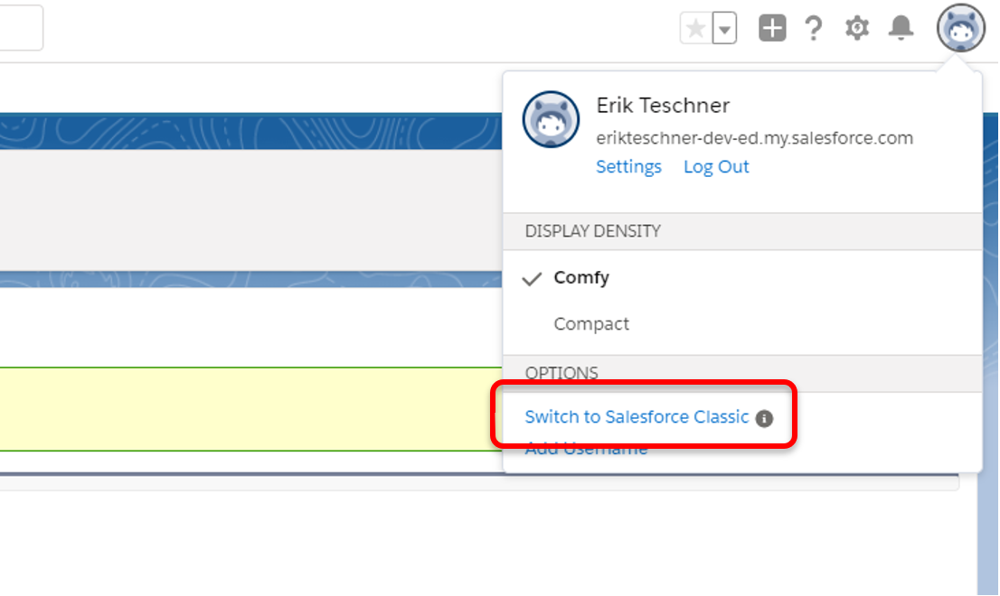

2.	Click on *Setup*.

    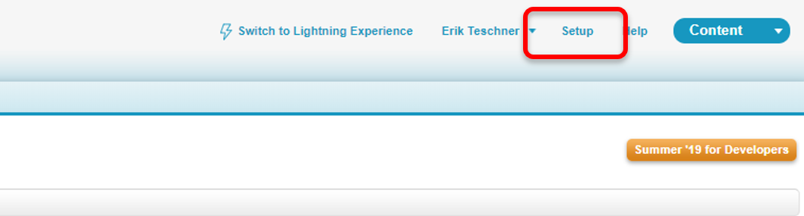

3.	Go to *Administer* and select *Manage Users and Profiles*.

    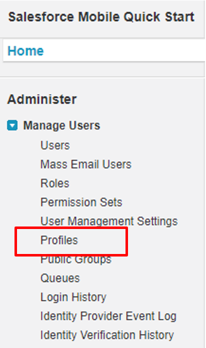


4.	On the second page, click on *Standard Platform User*.

    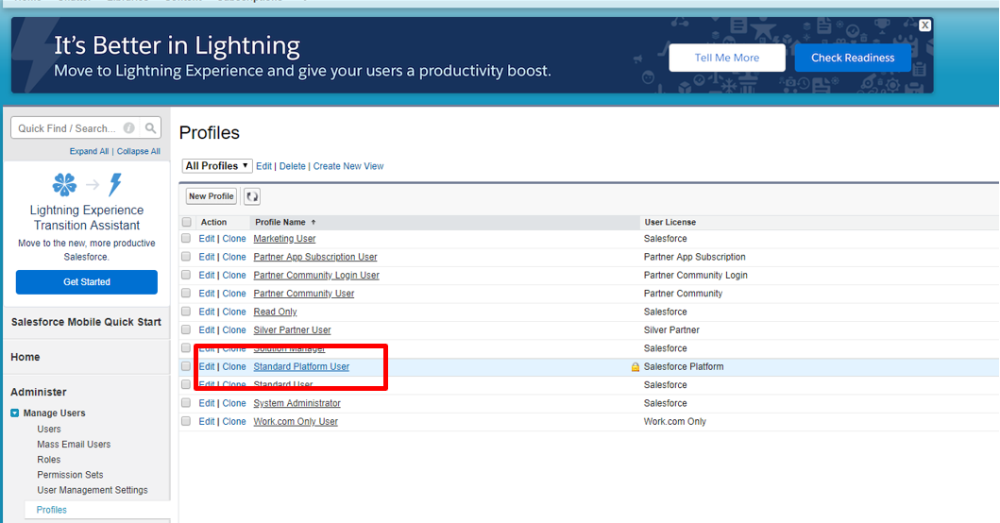

 
5.	Note the URL of the Profile. The *Profile ID* is the ID at the end of the URL.

    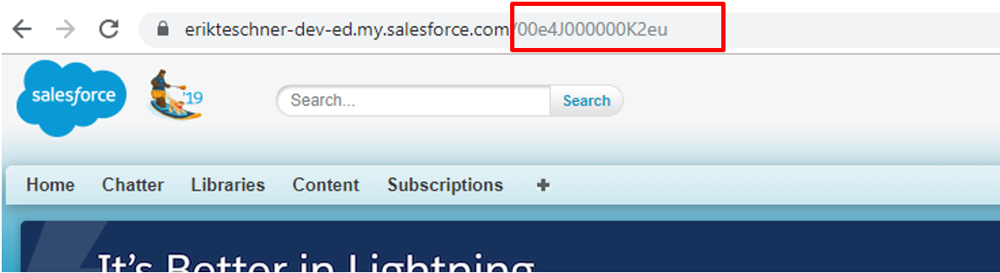

6.	Make note of the value, as we will use it later.

### Enabling Provisioning and Synchronization for Salesforce


Provisioning will provide you with the following available operations:
* *Create Account*: Automatically creates a Salesforce account when Salesforce access is granted to the corresponding user in Oracle Identity Cloud Service.
* *De-activate Account*: Automatically deactivates or activates a Salesforce account when the Salesforce access is deactivated or activated for the corresponding user in Oracle Identity Cloud Service.
* *Delete Account*: Automatically removes an account from Salesforce when Salesforce access is revoked from the corresponding user in Oracle Identity Cloud Service.

Beside this you have the ability to map attributes between the user account fields defined in Salesforce and the corresponding fields defined in Oracle Identity Cloud Service.

1.	Go to IDCS admin console and select the Salesforce applications that you have created previously.

2.	On the *Provisioning* page, select *Enable Provisioning*.

3.	A window will pop up. Click *Grant Consent*

4.	Fill in the following parameters with the values that you derived in the previous steps from Salesforce:

    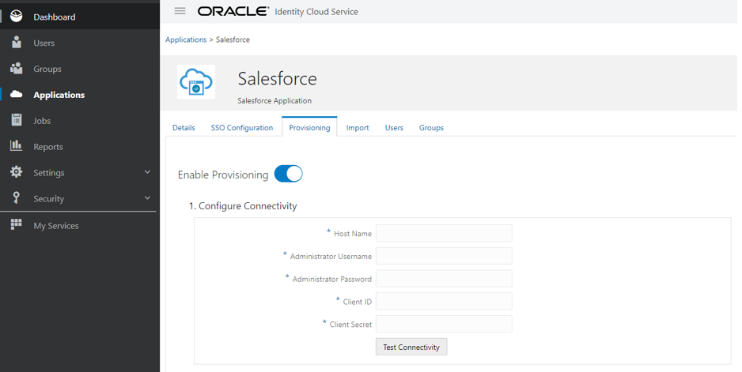


    | Parameter | Value |
    | --- | --- |
    | Host Name | Enter the Salesforce host name that you obtained by performing the steps in the Obtaining Host Name, Organization ID, and Domain Name from Salesforce" section.|
    | Administrator Username | Enter the administrator acount user name. |
    | Administrator Password | Enter the updated password that you derived by performing the steps in the "Deriving the Administrator Password from Salesforce" section. |
    | Client ID | Enter the Salesforce Consumer Key that you obtained by performing the steps in the "Obtaining the Consumer Key and Consumer Secret from Salesforce" section. |
    | Client Secret | Enter the Salesforce Consumer Secret that you obtained by performing the steps in the "Obtaining the Consumer Key and Consumer Secret from Salesforce" section. |


5.	Click *Test Connectivity* to verify the connection with Salesforce. Oracle Identity Cloud Service displays a confirmation message.

6.	Click *Attribute Mapping*

    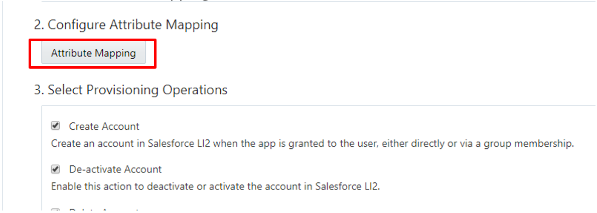

7.	Set the *Profile ID* to the value retrieved above.

    

 
8.	Scroll down on the *Provisioning* page, select *Enable Synchronization*.

    


This option will synchronize the existing account details from Salesforce and link them to the corresponding Oracle Identity Cloud Service users.
 

### Testing Synchronization in IDCS

1.	On the applications page, select *Import*.
2.	Click on *Import* and wait for a moment

    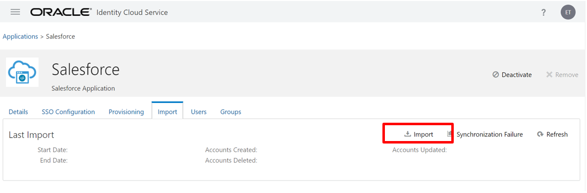

3.	Click *Refresh*

    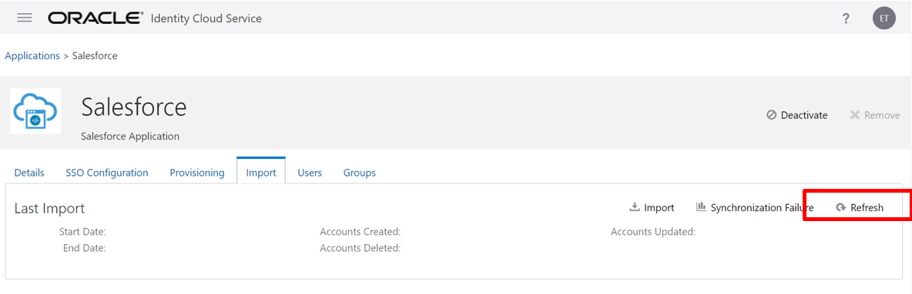

4.	The imported users that were imported from IDCS will be displayed.

    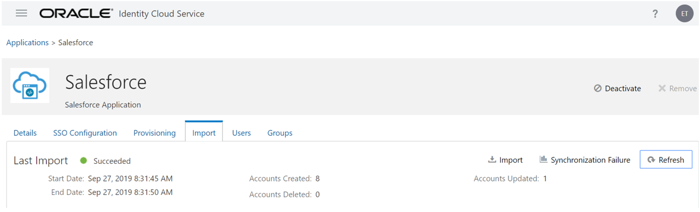

 
5.	The final step is to confirm the users you want to link between IDCS and Salesforce. Under Synchronization status, click *Confirm*. A successful link between a user in IDCS and Salesforce will lead to Synchronization status *Confirmed* .

    

```
Every user that has status Confirmed in the Synchronization Status has access to Salesforce in My Apps. Also, the application Salesforce will be visible to all users in My Apps that have status Confirmed.
```

You may now proceed to the next lab

 


## Acknowledgements
* **Author** - SEHub Security and Manageability Team
* **Last Updated By/Date** - Lucian Ionescu, Principal Solution Engineer, 15.09.2020


