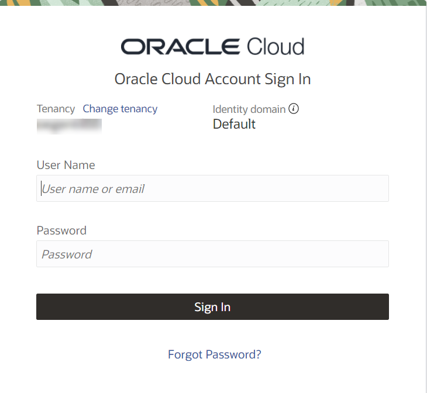
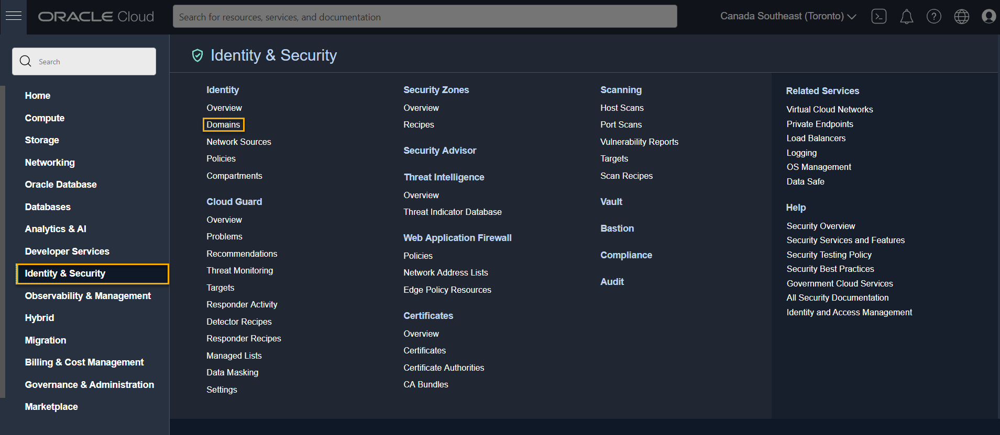

# Prerequisites for IAM

## Introduction

The following steps represents the prerequisites for the IAM Lab.

Estimated time: 5 minutes

### Objectives

- Log into OCI Tenancy.
- Create a compartment if not done yet.

### Prerequisites

- Your Oracle Cloud Trial Account

If your tenancy was created after November 2021, it is possible that it has Identity Domains enabled on it. you can check that if your login screen is like this:

or if you can find the **Domains** option after selecting **Identity and Security**

## Task 1: Create compartment

If you want to use an existing compartment, skip this step. Otherwise, click **Compartments** and then **Create Compartment**, to create a new compartment.

You may now [proceed to the next lab](#next).

Choose **Lab 1** if you are using **IAM without Identity Domains**

Choose **Lab 2** if you are using **IAM with Identity Domains**

## Acknowledgements

- **Author** - Rajeshwari Rai
- **Contributors** -  Rajeshwari Rai, Prasenjit Sarkar
- **Last Updated By/Date** - Rajeshwari Rai, January 2021

