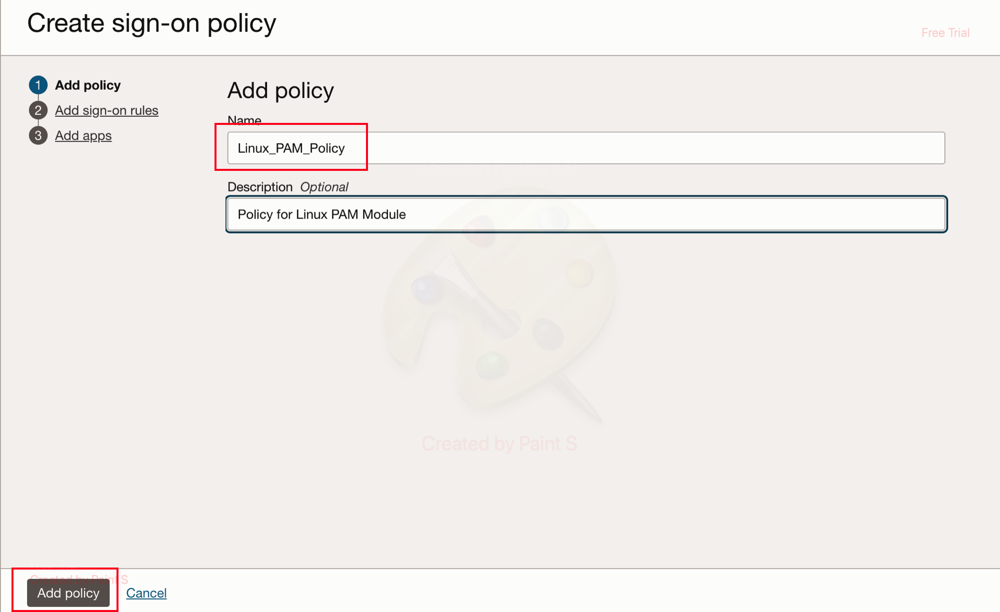

# Prepare Setup

## Introduction
This lab will show you how to add a Single Sign On Policy to include MFA in the rule.

*Estimated Lab Time:* 5 minutes

### Objectives

-   Create a Single Sign On (SSO) Policy.
-	Assign the confidential application to SSO policy.

		
## Task 1: Create a Single Sign On (SSO) Policy and Add the application

1. Sign in to your OCI IAM Identity Domains to access the **OCI console**. Once logged in, **Navigate** to **Domains** under **Identity and Security**. Now select your **Identity Domain** provisioned previously.

	

	
	
2. Click on the **Sign-on policies**, and then click **Create Sign-on policy**.
	
	

3. In the **Add Policy** section, provide a *name* of the policy. Provide an appropriate **RuleName** and then scroll down to the **Actions** section to select **Any Factor** and **Everytime** in the *Frequency* option.

	

	

	

4. Clieck Next to **Add Apps** section and select the *confidential app* which got created earlier by the *Stack2 -Deploy*. Once done, select **Close** and then **Activate Sign-on policy**.

	

	

	

 You may now **proceed to the next lab.**

## Acknowledgements
* **Author** - Gautam Mishra, Aqib Bhat
* **Lead By** - Deepthi Shetty 
* **Last Updated By/Date** - Gautam Mishra July 2023

