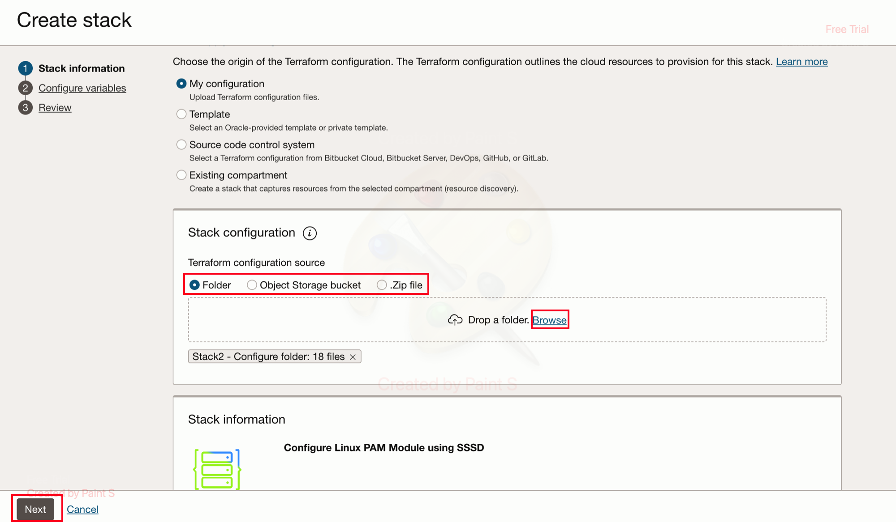
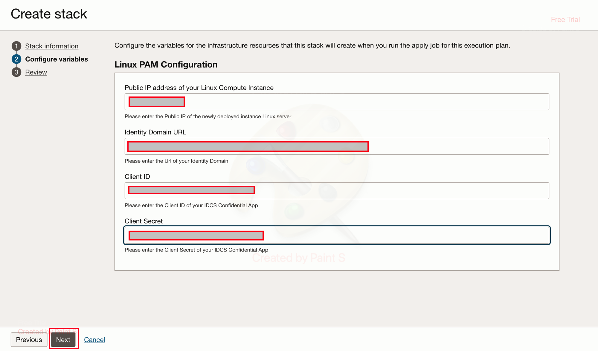
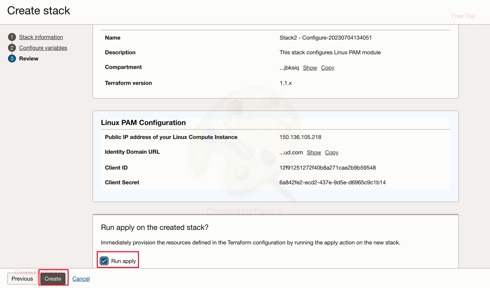

# Deploy ORM stack to configure the Linux PAM module and Identity Domain

## Introduction

Using this stack we will be able to configure **Linux Server and Identity Domain**. As part of this stack, a confidential application will be created under **Identity Domain** and sample users will be created.

*Estimated Time:* 20 minutes

### Objectives

*	Install and Configure **Linux-PAM using SSSD**
*	Create the **Confidential Application** under **Identity Domain** and create the sample *POSIX* users and a POSIX group.

### Prerequisites

*	Once the **Stack2- Configure.zip** is downloaded, use the updated **SSH.key** file, which was created while deploying the **Stack1- Deploy.zip**.

## Task 1: Deploy the Configuration Stack via Resource Manager

1. Once logged in to OCI Console, navigate to **Developer Services** then select **Stacks** under **Resource Manager**. Now click on **Create Stack**

	
	
	
 
2. On the Create Stack Wizard, select the **Stack 2- Configure.zip** option and then browse to upload the **Deploy** stack that you downloaded in the previous lab. Now click on **Next**

	

3. Now, on the **Configure variables** section, fill in the below mentioned values, then click on **Next**

	

	1. *Public IP address of the Linux Compute Instance* created earlier
    2. *Identity Domain URL* - Domain URL of the Deployed Domain . **Note** Remove **:443** from the end of the Domain URL.
    5. *Client ID* - Please enter the Client ID of your OCI IAM Confidential App
    6. *Client Secret* - Please enter the Client Secret of your OCI IAM Confidential App
	
	
4. Now on the **Review Details** check for the configurations and then click on **Create** . Make sure the **Run Apply** is selected.

	

**Note** The stack might take around 15 mins for completion. Please wait until the **job** succeeds.

	
## Conclusion
 
In this lab, we were able to successfully deploy and configure Linux Pluggable Authentication Module (PAM) on the Linux Server and configure the Identity Domain to create a confidential application and *POSIX* users and a *POSIX* group. 

 You may now **proceed to the next lab.**

## Acknowledgements
* **Author** - Gautam Mishra, Aqib Bhat
* **Contributor** - Deepthi Shetty
* **Last Updated By/Date** - Gautam Mishra July 2023

