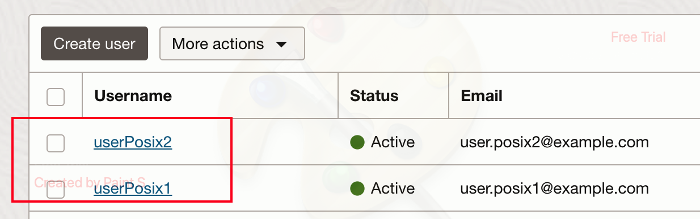
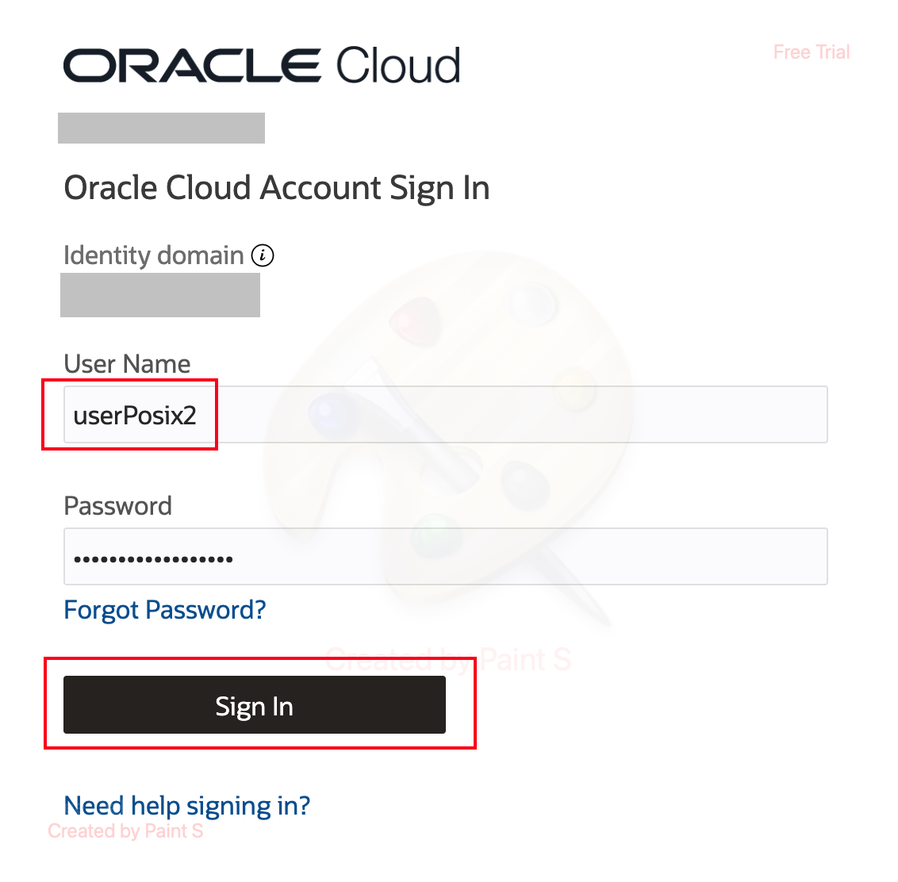
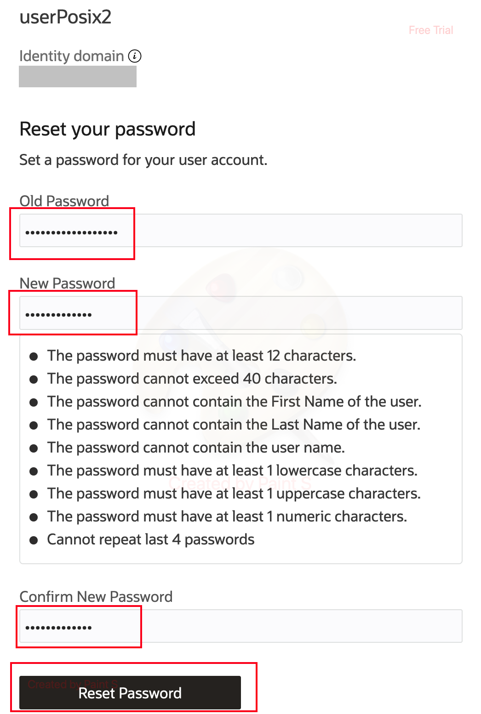
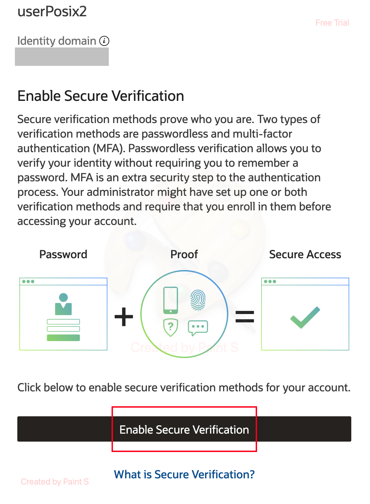
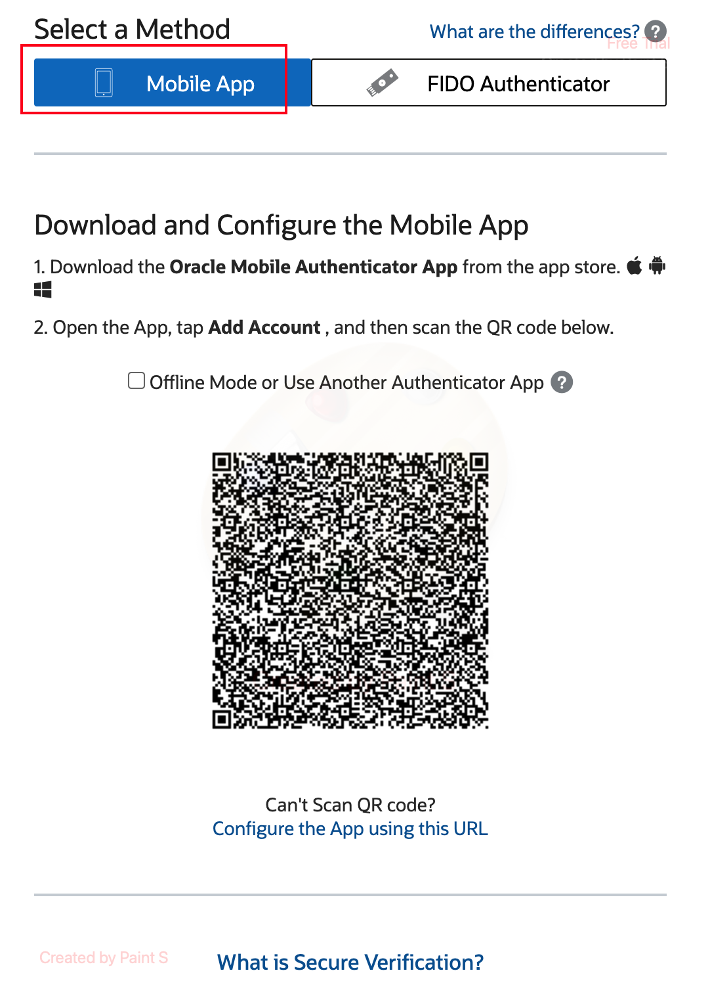
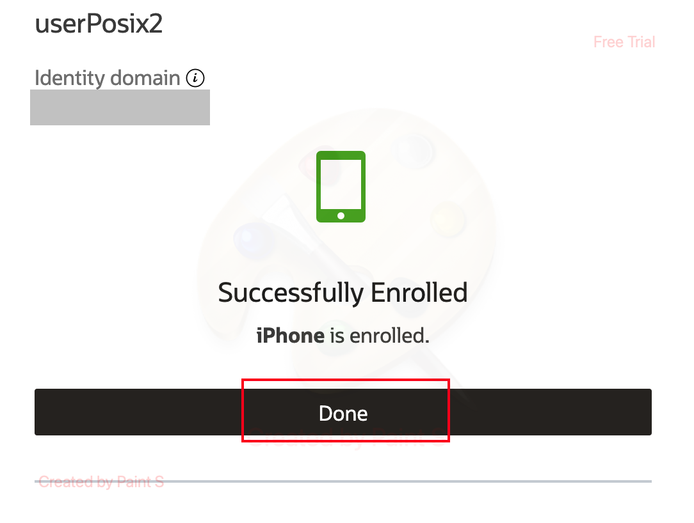
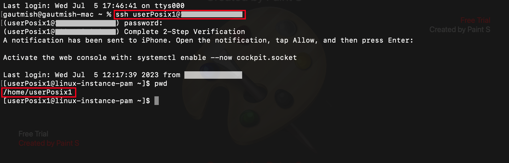

# Validate the Authentication flow

## Introduction

This lab will show you how you can test the Authentication into Linux Server Using OCI IAM.

*Estimated Time:* 5 minutes

### Objectives

-   Change the *default* password.
-	Validate the authentication into Linux Server Using OCI IAM using *second* factor.

## Task 1: Change Default Password for the OCI IAM POSIX Users

1. Below are the users who were created as sample SSO test users. 

	
	
	**Default Password** - "Welcome@1234567890"

2. Login to the OCI console using the newly created domain and enter the credentials of the *POSIX* user.
		
	

3. Reset the default password.

	

4. Enable *Secure Verification* and enroll your mobile device.

	

	

5. Click on **Done** and then proceed with *Task 2*.

	

## Task 2: Validate the Authentication with MFA

Once the **Stack 2- Configure** is successfully deployed, kindly carry out the steps mentioned below.

- SSH into your Linux environment where the OCI IAM Linux Pluggable Authentication Module (PAM) is installed.
- When prompted enter the password for the OCI IAM *POSIX* user. A *PUSH* notification is then sent to the enrolled mobile device. Tap **Allow** on the notification and then hit **Enter** on the screen.
	
	

## Conclusion

In this Lab, we were able to successfully change the password of the test user and validated user authentication along with a *Second* factor into the Linux Server using the Identity Domain. 

 You may now **proceed to the next lab.**

 
## Acknowledgements
* **Author** - Gautam Mishra, Aqib Bhat
* **Contributor** - Deepthi Shetty
* **Last Updated By/Date** - Gautam Mishra July 2023

