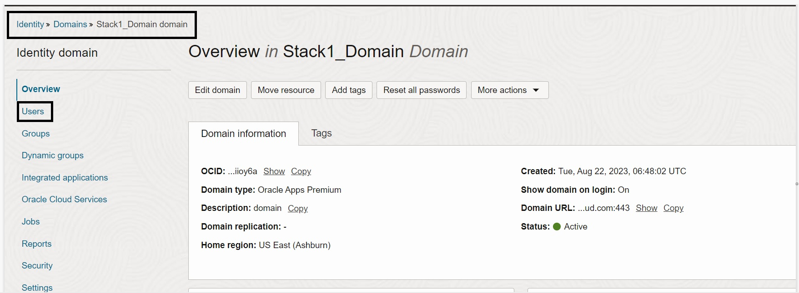
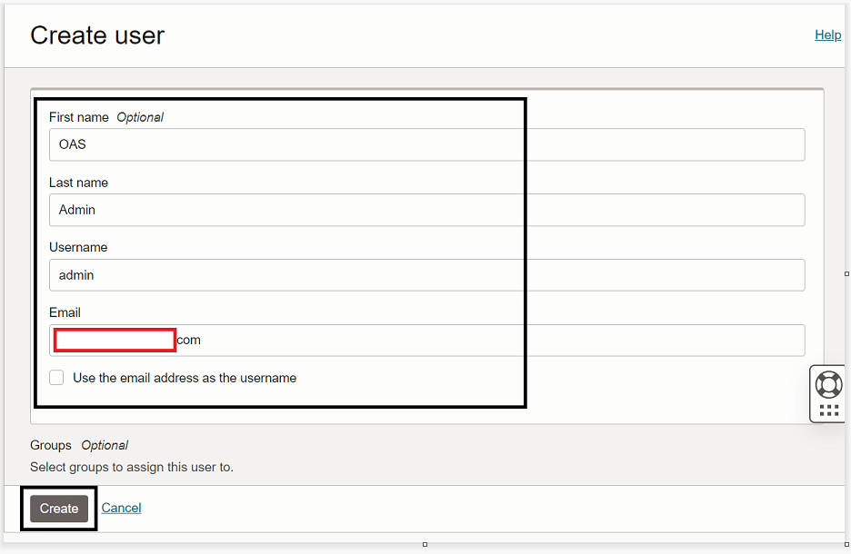
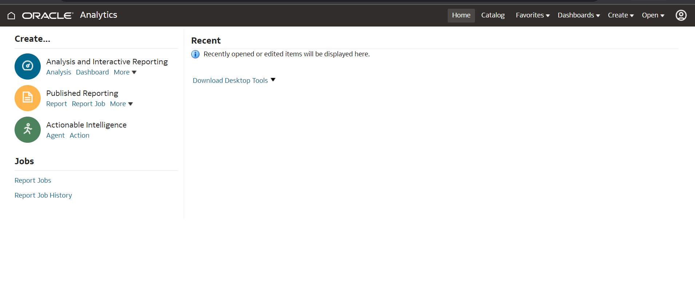
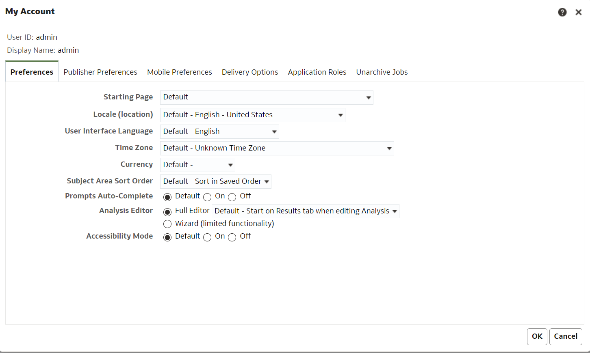

# Validate

## Introduction

This lab will show you how you can test the SSO flow to your OAS Application via **OCI IAM Identity Domains**

### Objectives

-   Create an **Analyitcs User** in the new created **Identity Domain** *For Example- weblogic admin user*
-   Validate the App Gateway Configuration
-   Test Single Sign-On with Oracle Analytics Server

## Task 1: Create an Admin User to Test the Single Sign On.

1. Navigate to newly created Identity Domain and click on **Users** option from the left hand menu

	

2. Now click on **Create User** and add the below details for the User and **Create** it.

	1. *First Name* - OAS
	2. *Last Name* - Admin
	3. Uncheck the **Use the email address as the username**
	4. *Username* - admin
	5. *Email* - Valid email to reset the password for this User
	
	

**Note** - The **Username** here should be the weblogic Admin User name that you created during the time of **Stack 1** Deployment.

3. You shloud get an email to **Activate** your Admin User. Activate the user by clicking on the **Reset Password** option from the email.

## Task 2: Validate the App Gateway Configuration

Once the **Stack 2- Configure** is successfully deployed and the **Admin User** is created and Activated, kindly access the App Gateway URL mentioned below.

- **https://publicIP_App Gateway:4443/analytics**

The browser should route you to the Identity Domains Login Page.

		
## Task 3: Test Single Sign-On with Oracle Analytics Server via App Gateway

1. Test the SSO using the App Gateway link

	1. Open a browser window and enter the URL for the App Gateway - **https://publicIP_App Gateway:4443/analytics**
	2. The **OCI IAM Identity Domains Sign** In page appears. Use the **User Name and Password** of the previously created user to sign in.
	3. Upon successful authentication, the user is redirected to the **Oracle Analyitcs Server** home page without having to enter **OAS Credentials**.
		
		
		
	4. If the **Oracle Analytics Server** home page appears, verify the **logged-in user name** by clicking on the **My Account** option.
	
		
	
	5. Log out from Oracle OAS. The browser is redirected to the **OCI IAM Identity Domains Sign** In page.

 You may now **proceed to the next lab.**

## Acknowledgements
* **Author** - Chetan Soni, Sagar Takkar
* **Lead By** - Deepthi Shetty 
* **Last Updated By/Date** - Chetan Soni August 2023

