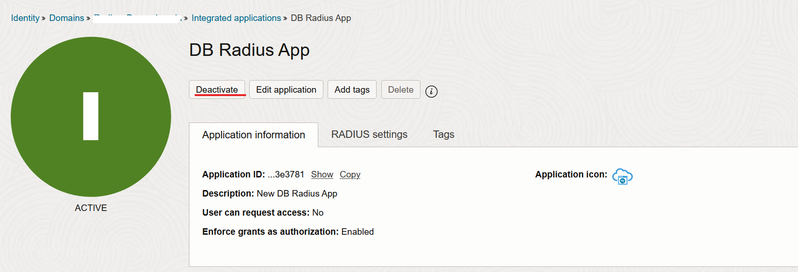
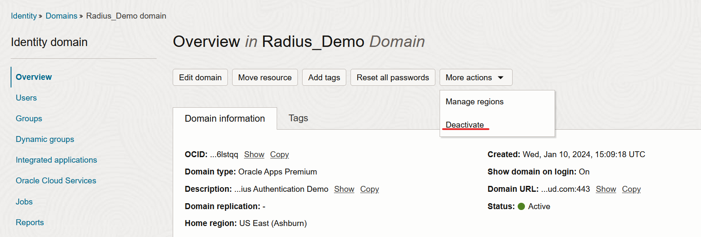
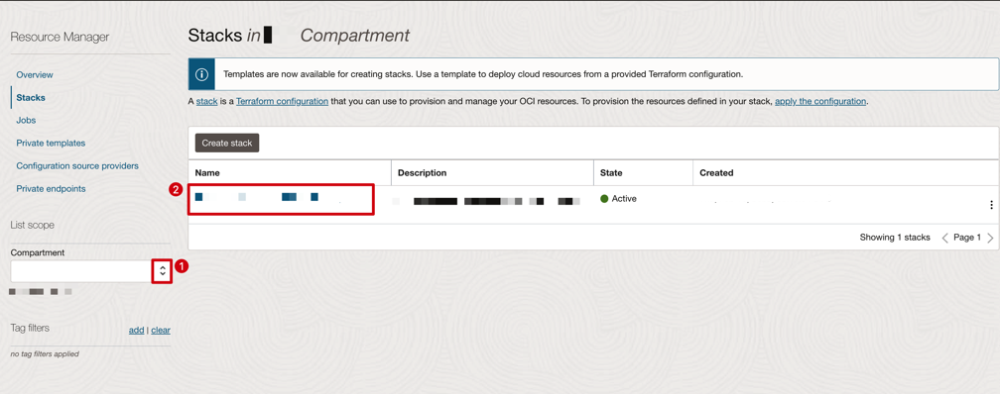
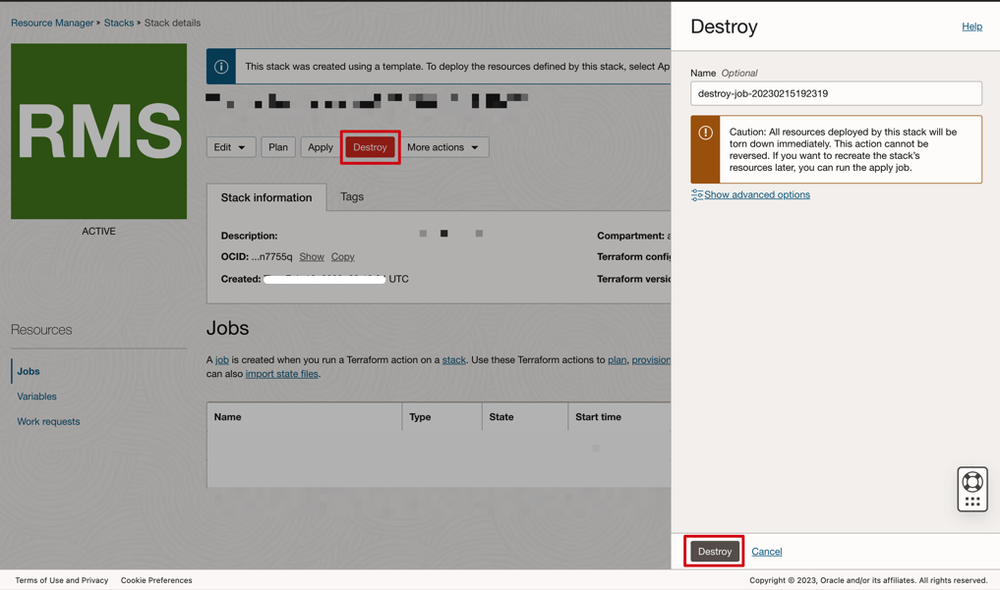
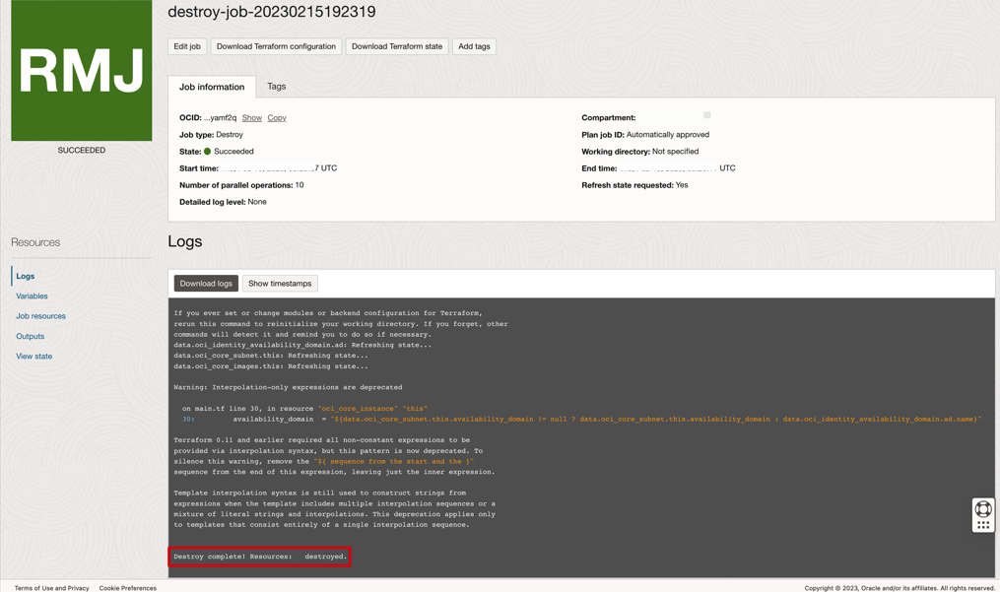
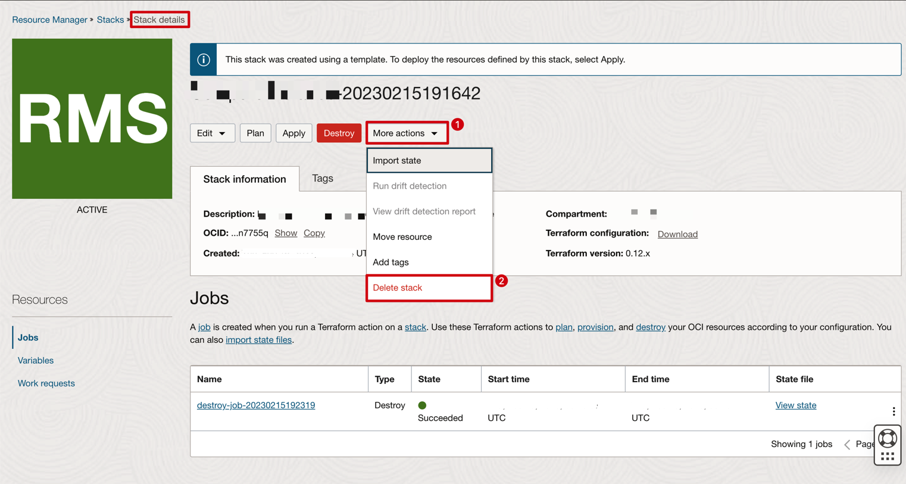

# Destroy

## Introduction

This lab will show you how you can carry out the cleanup activities for the entire Live Lab.


### Objectives

-   Manual deactivation of the Applications, Radius Proxy and the Identity Domain.
-   Destroy the Stack 1 and 2 for performing the cleanup of the resources.


## Task 1: Deactivate the applications, Radius Proxy and the Identity Domain

In this task you will be carrying out the prerequisites before destroying Stack 1 and 2. You will be *manually deactivating* the applications, radius Proxy and Identity Domain on the OCI console.

1. *Radius Proxy* : Make a use of client credential application client ID and client Sceret to deactivate the radius proxy. Below is the API to PATCH.
```
https://idcs-url/admin/v1/RadiusProxies/<RDIUSPROXY-ID>
```
You can get the IDCS url and Radius Proxy ID from the stack 2 logs with the Key word **iamurl** and **Radius Proxy created with ID** respectively.

Also below is the body to be used.
```
{
	"Operations":[
		{
			"op": "replace",
			"path": "active",
			"value": false
 		}
	],
    "schemas": [
        "urn:ietf:params:scim:api:messages:2.0:PatchOp"
    ]
}
```
You can use the Postman collection for the above process.

2. *Confidential application*

	
	
3. *DB Radius Application*

	 
	
4. *Identity Domain*

	
		
## Task 2: Destroy the Stack 1 - Destroy for performing the cleanup of the resources.

With this task, we will be deleting all the resources that got created as part of **Deploy** lab.

1. Log in to Oracle Cloud
2. Open up the hamburger menu in the left-hand corner.  Click **Developer Services**, choose **Resource Manager > Stacks**.

	
  
3. Choose the compartment in which you created the **Stack 1- Deploy** and select it.  

	

4. Click on **Destroy** and confirm again as prompted on the lower-right.  

	

5. Wait for the job to complete and review the output.  

    

## Task 3: Destroy the Stack 2 - Configure for performing the cleanup of the resources.

Now that you have successfully destroyed all the resources provisioned for your workshop, you can now safely delete the **Stack -2 Configure** to return the environment to it original state.

1. Follow the breadcrumbs links in the upper-left and click on **Stack Details**, the **More Actions > Delete Stack**.  

    

This completes the workshop.

## Acknowledgements
* **Author** - Sagar Takkar
* **Lead By** - Deepthi Shetty 
* **Last Updated By/Date** - Sagar Takkar April 2024
