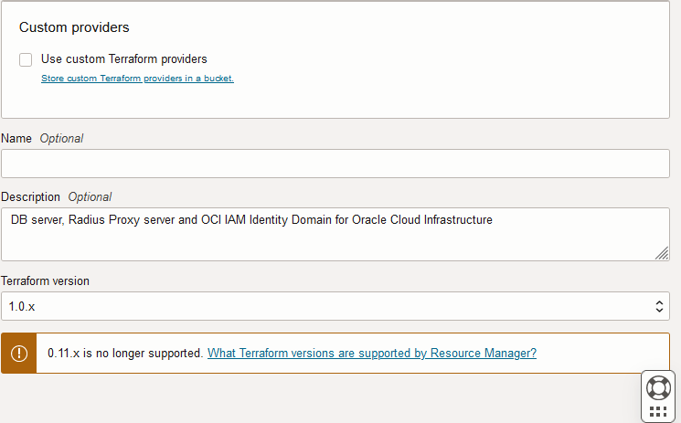
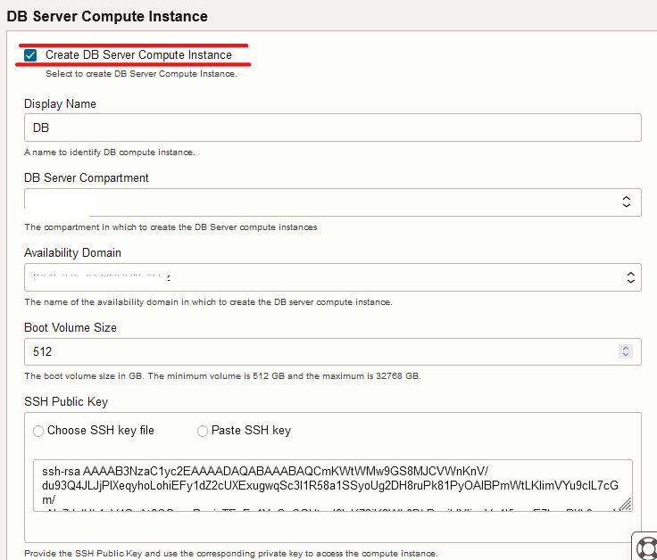
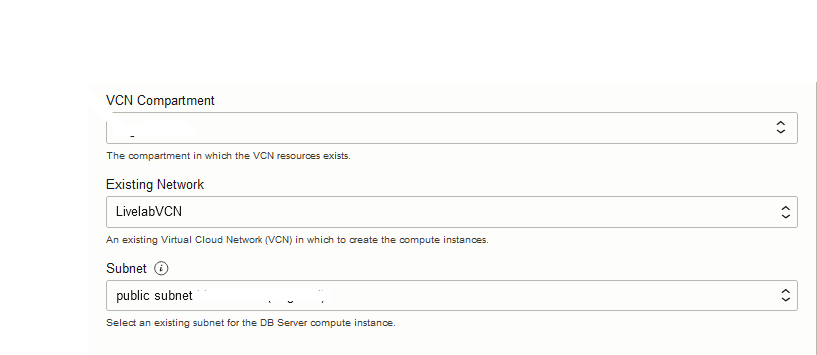
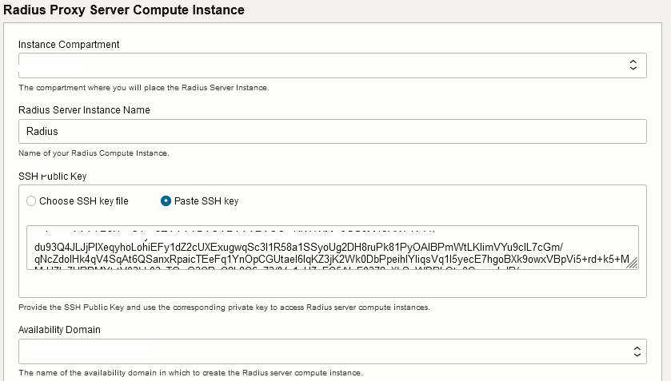
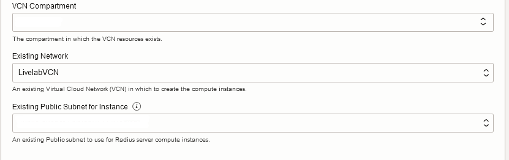
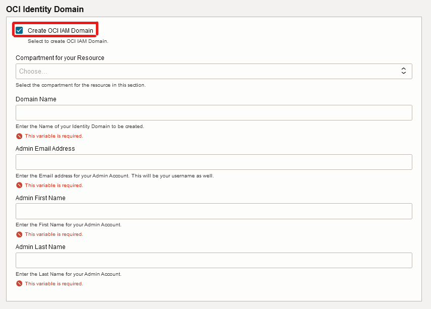
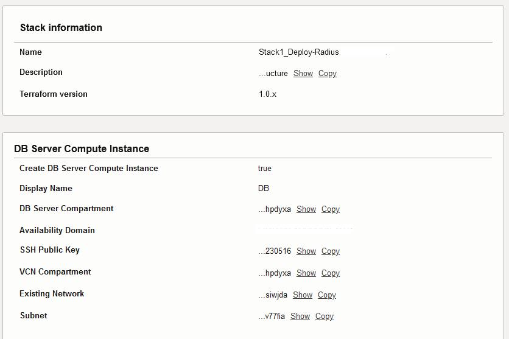
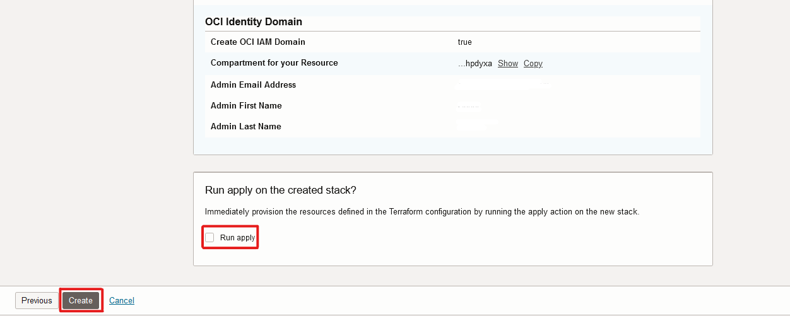
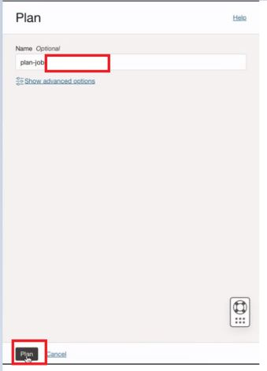
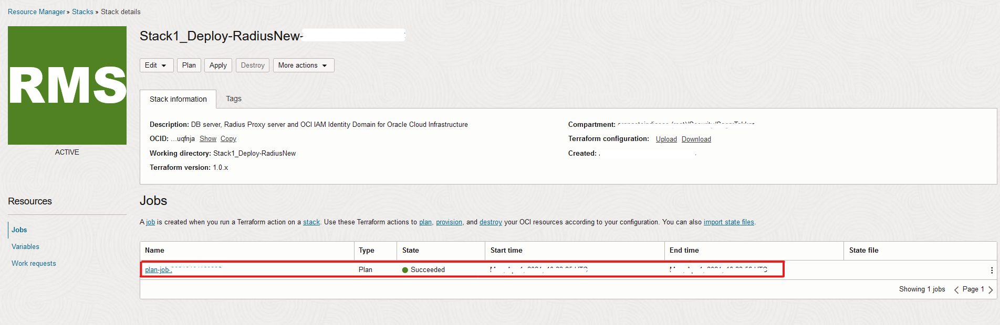

# Deploy the stack to install Oracle Database Server, Radius Proxy Instance and Identity Domain

## Introduction

Using this stack we will be able to deploy/install **Oracle Database 19c, Radius Proxy and Identity Domain**. The Identity Domain created will be of the type **Oracle Apps Premium**.

## Objectives

1.	Deploy and configure **Oracle Database 19c**. *This step is optional. If you already have your own DB then you can opt for not creating the DB instance with this lab.*
2. 	Deploy **Radius Proxy Server**
3.	Deploy the **Identity Domain** of the type **Oracle Apps Premium**. *This step is optional. If you already have Identity Domain with required SKU then you can opt for not creating the DB instance with this lab.*
4.	Validate the created resources via SSH access.
*Note: If you already have Database and Oracle Apps Premium SKU Identity Domain then you can skip the steps to create the DB server instance and Identity Domain in this Lab*

## Prerequisites

Once the **Stack1- Deploy.zip** is downloaded, unzip the zip file and replace the the content of the **SSH.key** file  with your respective content of the private key.

**Note** Name of the file should not be changed.

## Task 1: Deploy the Stack via Resource Manager

1. Once logged in to the OCI Console, navigate to **Developer Services** then select **Stacks** under **Resource Manager**. Now click on **Create Stack**

**Note** Please do not select the **Root** compartment while creating the stack

	

 
2. On the Create Stack Wizard, select the **.zip** option and then browse to upload the **Deploy** stack that you downloaded in the previous lab. Now click on **Next**

	
	
	
	
	
	
**Note** The stack automatically picks up the working directory, provides the stack with a name and the working compartment gets selected. The Stack Name and Compartment can be changed if required.

3. In the **DB Server Compute Instance** section, provide the **Display Name** for the DB instance, choose the **DB Server Compartment** for your instance to be placed in. Then select the **Availability Domain** for the instance. Choose the **Boot Volume Size** for the instance and then upload your **SSH Publik Key**. Also, select the **VCN Compartment** that has your **Existing Network**, then select the **Subnet**.

	
	
**Note** SSH Public Key needs to generated as a prerequisites.

		

4. In the **Radius Proxy Server Compute Instance** section, Choose the **Instance Compartment** to place your Radius Proxy instance. Provide **Radius Server Instance Name** for Radius Proxy. Then upload your **SSH Public Key**. Now choose the **Availability Domain** to keep your instance. Then choose **Network Compartment** for selecting the **Existing Network** for Radius. Also, choose the **Existing Public Subnet for Instance**. Also, select the **VCN Compartment** that has your **Existing Network**, then select the **Subnet**.

	
	
	
	
5. In the **OCI Identity Domain** section, select the **Compartment** where you want your **Identity Domain** to be created. Provide a valid **Domain Name**, **Admin Email Address** and basic admin details. Now Click on **Next**. 
	
    
	
6. Now on the **Review Details** check for the configurations and then click on **Create** . Make sure the **Run Apply** is not selected.

	
	
	
	
	
	
7. From the created stack now click on the **Plan** option. You should get an **Success** output.

	
	
	
	
8. From the created stack now click on the **Apply** option. You should get an **Success** output.	

	

**Note** The Stack deployment will take 2 minutes to complete but creation of Database will take approximately 30 minutes.

## Task 2: Validation of the created resources.

Check the SSH to your DB instance and Radius Proxy instance.

*With the Private Key of these instance, you should be able to SSH into these systems*

1. Once the **Stack** is successfully deployed, you can SSH in to DB instance and check below.
	1. sudo su - oracle.
	2. cd $ORACLE\_HOME. 
If the above $ORACLE\_HOME takes you to the dbhome\_1 that means DB is deployed successfully.

2. Navigate to **Domains** under **Identity and Security** on the OCI console to validate that your Domain of type **Oracle Apps Premium** has been created.

## Conclusion

In this Lab, we were able to successfully deploy and validate Database server, Radius Proxy Server and Identity Domain. 

 You may now **proceed to the next lab.**

## Acknowledgements
* **Author** - Sagar Takkar
* **Lead By** - Deepthi Shetty 
* **Last Updated By/Date** - Sagar Takkar March 2024
