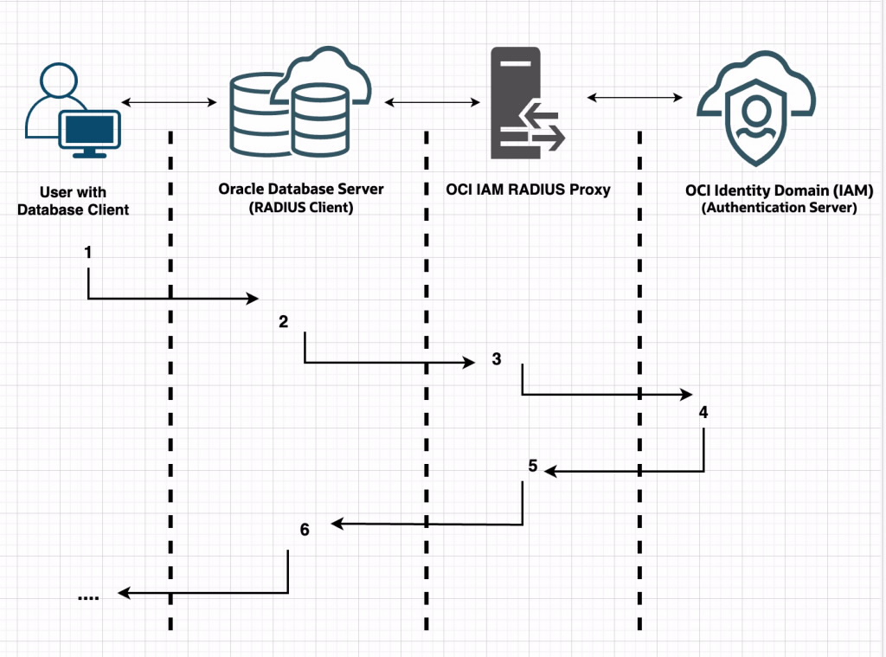

# Introduction

## About this Workshop

OCI IAM Identity Domains is a comprehensive identity-as-a-service (IDaaS) solution that can be used to address a variety of IAM use cases and scenarios. OCI IAM can be used to manage access for users across numerous cloud and on-premises applications, enabling secure authentication, easy management of entitlements, and seamless SSO for end users.In this workshop, we will deploy the Oracle Database on cloud VM, IAM Radius Proxy and OCI IAM Identity Domains on OCI using Terraform and then configure the deployed setup using Terraform to leverage the Radius Proxy feature of Identity Domains to achieve secure authentication along with MFA from OCI IAM.
  

The following diagram shows the architecture and the login flow when using the Radius Proxy to help authenticate the user for Database Server with OCI IAM. 
 

  

1. A user with a database client (ex: SQL Plus) tries to connect to database by entering a database connect string (SID). The client system passes this data to the Oracle database server .

2. The Oracle database server (acting as a RADIUS client), collects credentials from the user, passes them to the RADIUS server based on the parameters defined in SQLNET.ora file.

3. The OCI IAM RADIUS proxy server in turn passes user credentials to OCI Identity Domain.

4. OCI Identity Domain validates user credentials, optionally it can challenge the user for second factor authentication (MFA), sends either an Access Accept or an Access Reject message back to the RADIUS server.

5. The RADIUS proxy server passes this response to the Oracle database server/RADIUS client.

6. The Oracle database server/RADIUS client passes the response back to the user. Based on the response, access is either granted or rejected for the user.

This lab walks you through the steps to get started using **OCI IAM Identity Domains** with a popular use case - **Achieve MFA using OCI IAM Radius Proxy**. In this workshop, we will follow the steps to deploy the **DATABASE** server on OCI using *Terraform* via **Resource Manager**. Same Stack will also deploy a **Radius Proxy server** and an **OCI IAM Identity Domain**. Once deployed, we will also make some necessary configuration changes in the *Database server*, *Radius Proxy Server* and the *Identity Domain* using Terraform. We will carry out some *manual tasks* to complete the configuration in Identity Domains before heading towards the validation of the entire flow. Once validation is done we will be going through the clean up activities/steps using the *Resource Manager*.

*Estimated Time:* 1 Hours

### Objectives

In this workshop, you will learn how to:

* Deploy a Terraform stack to create Oracle Database on server, Radius Proxy Instance and OCI IAM Identity Domain on OCI via Resource manager.
* Create a confidential application in OCI IAM Identity Domain.
* Deploy a Terraform stack to configure the deployed Radius Proxy Instance, Database server and OCI IAM Identity Domain.
* Validate the setup and test the SSO flow.
* Clean up the deployed resources.

### Prerequisites
This lab assumes you have:
* A Pay Go tenancy (Not Free) where you have administrative access

## Learn More

* [OCI IAM Identity Domains](https://docs.oracle.com/en-us/iaas/Content/Identity/home.htm)
* [Lear About Radius Proxy](https://docs.oracle.com/en-us/iaas/Content/Identity/radiusproxy/overview.htm)

## Acknowledgements
* **Author** - Sagar Takkar
* **Lead By** - Deepthi Shetty 
* **Last Updated By/Date** - Sagar Takkar March 2024
