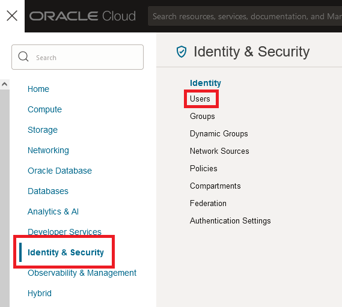

# Lab 2 - Link creation between OCI and your HSM and Master Encryption Key creation

## Introduction

*Describe the lab in one or two sentences, for example:* This lab walks you through the steps to ...

Estimated Time: -- minutes

### About <Product/Technology> (Optional)
Enter background information here about the technology/feature or product used in this lab - no need to repeat what you covered in the introduction. Keep this section fairly concise. If you find yourself needing more than two sections/paragraphs, please utilize the "Learn More" section.

### Objectives

In this lab, you will:
* Connect to your OCI tenant and create your Vault in OCI Vault
* Set up a link between Thales CipherTrust Manager (created in Lab 1) and OCI Vault
* Create a Master Encryption Key (MEK) in your Thales HSM via Thales CipherTrust Manager

### Prerequisites

This lab assumes you have:
* An Oracle Cloud account
* All previous labs successfully completed

## Task 1: Connect to OCI and create your own Vault in OCI Vault

You need below parameters to configure OCI connection to integrate with CCKM.
* **Tenancy OCID:** OCID of the tenancy.
* **User OCID:** OCID of the user.
* **Region:** An Oracle Cloud Infrastructure region.
* **Fingerprint:** Fingerprint of the public key added to this user.
* **Key File:** Private key file for the OCI connection in the PEM format. Either upload the key file or paste the file content.

You need to create vault in order to store your keys and secrets. There are two types of vaults: Default and Virtual Private. 
* Default vaults share a partition of HSM. 
* Virtual private vault use an isolated partition on a HSM.
Each vault has a management endpoint and a cryptography endpoint. To create a Vault, follow the next steps.

1. Log in to your OCI account by following steps in section Get Started

2. Navigate through the main hamburger menu to *"Identity & Security > Vault"*

	

3. Pick up the compartment in the left menu. Click the display menu and select the already created subcompartment "ocw23-OCI-Vault-HOL". Then click "Create Vault".

    

4. Enter a name for your Vault. Please follow the naming convention:

     

5. Now your Vault will start to be created. Once it is created, the status will appear as Green and Active in your OCI console:

    

6. In order to configure CCKM Oracle connection, we must add an API Key (a RSA key pair) for the user. CCKM will use the private key to make connection to OCI and call its API. To do that, navigate through the main hamburger menu to *"Identity & Security > Identity > Users"*

    

7. You will be able to see the list of users in the tenant. Once you click on your user name, you will be able to see all your user details. In the menu on the left called *"Resources"*, select API Keys. Click *"Add API Key"*.

    

8. A window will prompt asking you how you want to create those API Keys. You can generate the API key pair direclty in this step, or you also have the option to import previously created keys. In this case, we will generate the API key pair in this step and will download the private key. Then select *"Generate API Key Pair"* and *"Download Private Key"*. Save your private key in a local directory, as you will need it later. Click Add.

    

9. After you click *"Add"*, you will be able to see the Configuration File Preview, as following:

    

Copy all the information on notepad as it will be used to create connection between Oracle and CCKM.

## Task 2: Configuring CipherTrust Manager Connection to Oracle

1. From the training platform, open Windows Server.
2. Open your browser and enter the CipherTrust IP Address as the site name.
3. The Login window opens.
4. Enter the following:

You are now logged into the web GUI console.
5. On the left pane, expand Access Management, and then click Connections.

6. Click the + Add Connection button to open the Add Connection wizard. The wizard consists of the following steps:
    * Select Connection Type : Select “Cloud” : “Oracle Cloud Infrastructure”
    * General Info: provide a Name and Description (optional) for the new connection.
    * Configure Connection: 
        * Tenancy OCID: OCID of the tenancy.
        * User OCID: OCID of the user.
        * Region: An Oracle Cloud Infrastructure region.
        * Fingerprint: Fingerprint of the public key added to this user.
        * Key File: Private key file for the OCI connection in the PEM format. Either upload the key file or paste the file content.
        * File Upload: Select and click Upload Certificate to upload the key file from your machine.
        * Text: Select and paste the certificate content in the text field.
        * Passphrase: Passphrase of the encrypted key file.
        * Click Test Credentials to check whether the connection is configured correctly. If the test is successful, the status is OK else the status is Fail.
        Click Next to move to the next step.
    * Add Products: Use the check boxes in the Products list to select Cloud Key manager”

7. Click the **Cloud** icon.

8. Under **Select Cloud type**, select **Oracle Cloud Infrastructure**, and then click **Next**.

9. Enter the connection name in the **Name** field, and then click **Next**.

10. Add connection with product Cloud Key Manager aka CCKM.

11. Under **Configure Connection**, enter the following parameters:

    * **Tenancy OCID:** OCID of the tenancy.
    * **User OCID:** OCID of the user.
    * **Region:** An Oracle Cloud Infrastructure region.
    * **Fingerprint:** Fingerprint of the public key added to this user.
    * **Key File:** Private key file for the OCI connection in the PEM format. Either upload the key file or paste the file content.
    * **File Upload:** Select and click Upload Certificate to upload the key file from your machine.
    * **Text:** Select and paste the certificate content in the text field.
    * **Passphrase:** Passphrase of the encrypted key file.

12. Click Test Credentials to check whether the connection is configured correctly. If the test is successful, the status is OK else the status is Fail. Click Next to move to the next step.

13. From the connection pane you will get an option to test the connection again.

14. Your connection state should be **Ready.** 

    > Note:  If the test does not succeed, check the CipherTrust Network configuration.

## Task 3: Configuring the CCKM Connection to Oracle

1. Log into the CipherTrust Manager Web UI.
2. Click the Cloud Key Manager application.
3. On the left pane, click Containers and Oracle Vaults. 
4. Click Add Existing Vault.
5. Under Add Existing Key Vault configuration, add the following parameters:
    * **Oracle connection** - select the connection that was previously created.
    * **Compartment** – Select the compartment created with Oracle.
    * **Region** - Select your relevant region from the dropdown.
    * **Vault** – Select the vault which we created earlier with Oracle.

    > Note: Bucket name and Bucket Namespace are required for creating key backups of HSM protected 
keys for Virtual Private Vaults. Key Backup functionality while syncing vaults will cease without these 
parameters.

6. Click next and add the Vault.

## Learn More

*(optional - include links to docs, white papers, blogs, etc)*

* [URL text 1](http://docs.oracle.com)
* [URL text 2](http://docs.oracle.com)

## Acknowledgements
* **Author** - <Name, Title, Group>
* **Contributors** -  <Name, Group> -- optional
* **Last Updated By/Date** - <Name, Month Year>

