# Link creation between OCI and your HSM and Master Encryption Key creation

## Introduction

This lab walks you through configuring a connection between the Thales CipherTrust Manager and your Oracle Cloud Infrastructure (OCI) cloud tenant.

Estimated Time: 10 minutes

[Walkthough the Lab](videohub:1_4f41vj1f)

### Objectives

In this lab, you will:

* Connect to your OCI tenant and create your own Vault in OCI Vault
* Set up a link between Thales CipherTrust Manager and OCI Vault

### Prerequisites

This lab assumes:

* You properly received your login and password for both environments

## Task 1: Connect to OCI and create your own Vault in OCI Vault

You need below parameters to configure OCI connection to integrate with CTM.

* **Tenancy OCID:** OCID of the tenancy.
* **User OCID:** OCID of the user.
* **Region:** An Oracle Cloud Infrastructure region.
* **Fingerprint:** Fingerprint of the public key added to this user.
* **Key File:** Private key file for the OCI connection in the PEM format. Either upload the key file or paste the file content.

You need to create vault in order to store your keys and secrets. There are two types of vaults: Default and Virtual Private. 

* Default vaults share a partition of HSM.
* Virtual private vault use an isolated partition on a HSM.
Each vault has a management endpoint and a cryptography endpoint. To create a Vault, follow the next steps.

1. Log in to your OCI account by following steps in section *"Get Started"*.
    > **Important:** Please notice that you need to log in as a local OCI user, not as a federated user. Please go to the mentioned section for more details.

2. Navigate through the main hamburger menu to *"Identity & Security > Vault"*

	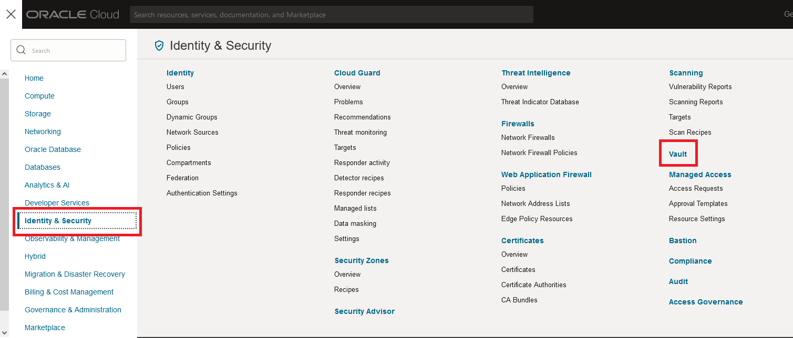

3. Pick up the compartment in the left menu. Click the display menu and select the already created subcompartment "ocw23-OCI-Vault-HOL". 

    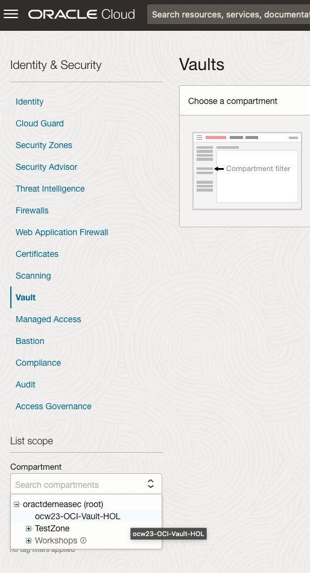

    Then click "Create Vault".

    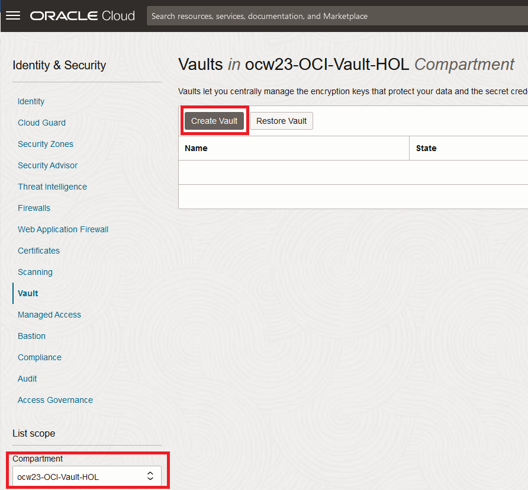

4. Enter a name for your Vault. Please follow the naming convention: ocw23-OCI-Vault-XXX where XXX is your number student. Do NOT click "Make it a virtual private vault". Click on "Create Vault" button to finish this step. 

     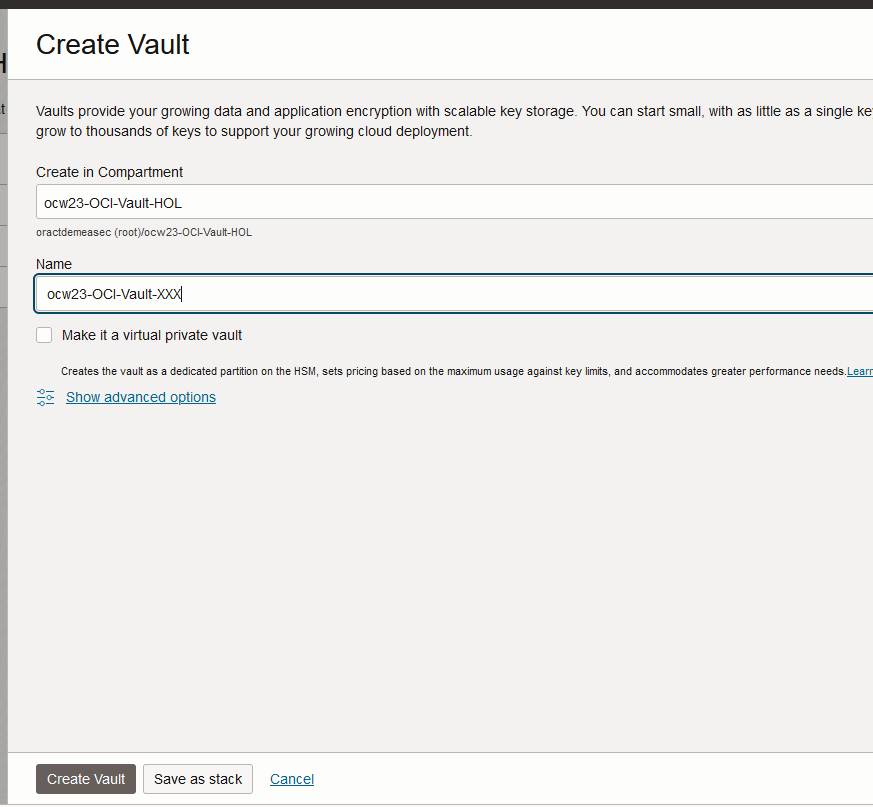

5. Now your Vault will start to be created. Once it is created, the status will appear as Green and Active in your OCI console:

    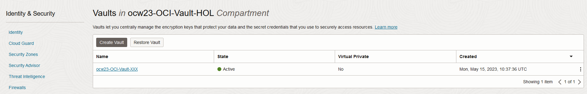

6. In order to configure the connection between the Vault you just created and Thales CipherTrust manager (CTM), you must add an API Key (a RSA key pair) for your user. CTM will use the private key to make connection to OCI and call its APIs. To do that, click on the top right user profile icon in OCI console and select **User Settings**

    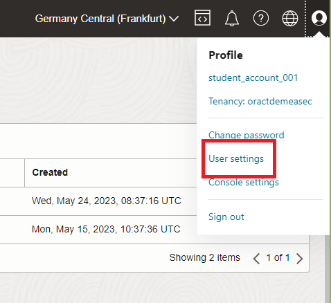

7. In the left menu, navigate to Resources and API Keys. Click *"Add API Key"*.

    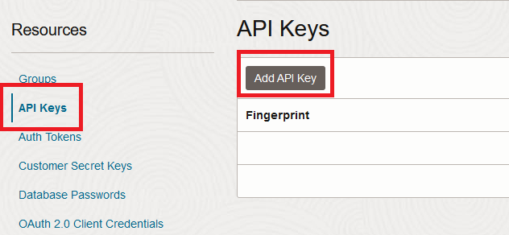

8. A window will prompt asking you how you want to create those API Keys. You can generate the API key pair direclty in this step, or you also have the option to import previously created keys. In this case, we will generate the API key pair in this step and will download the private key. 
    Select *"Generate API Key Pair"* and *"Download Private Key"*. Save your private key in a local directory, as you will need it later. Click Add.

    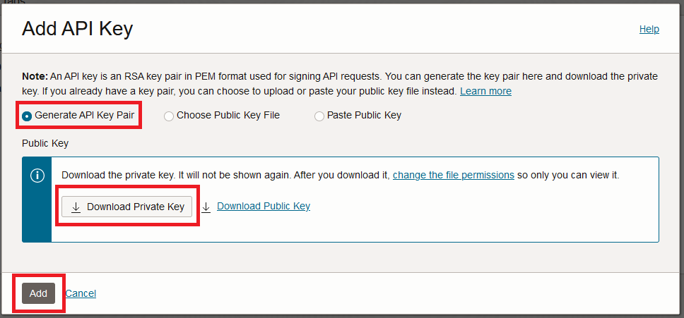

9. After you click *"Add"*, you will be able to see the Configuration File Preview, as following:

    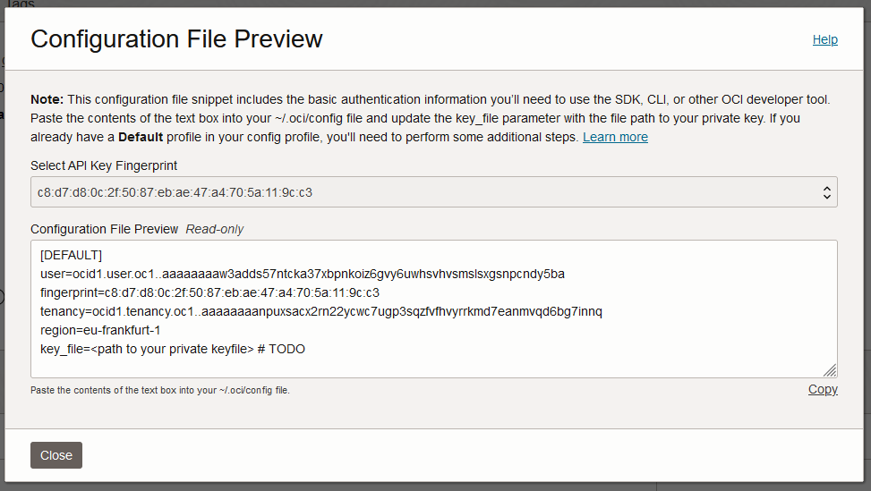

Copy all the information on notepad as it will be used to create connection between Oracle and CTM.

## Task 2: Configuring CipherTrust Manager Connection to Oracle

In this task you will create a connection from your CipherTrust Manager (CTM) tenant which is in Thales Cloud, outside of Oracle Cloud Infrastructure, to the Vault you just created in OCI. 

1. To access CipherTrust Manager as a Service you will need to create the URL to access your own private tenant. To do this, you need to copy and paste this URL: **"https://us1.ciphertrust.dpondemand.io/?tenant=oracle-OracleCTM"** in your browser address bar and replace **XXX** with your student number. For example, if your student number is 001, the complete URL to your own private CTM tenant will be: **"https://us1.ciphertrust.dpondemand.io/?tenant=oracle-OracleCTM001"**. 

    

    Once you access your login window, please login using your **"Secops_XXX"** user, with the password which has been provided to you. If you can't locate this information, please contact one of the trainer to assist you. 

    

2. You are now logged into the CipherTrust Manager web console.

    

3. On the left pane, expand Access Management, and then click Connections.

    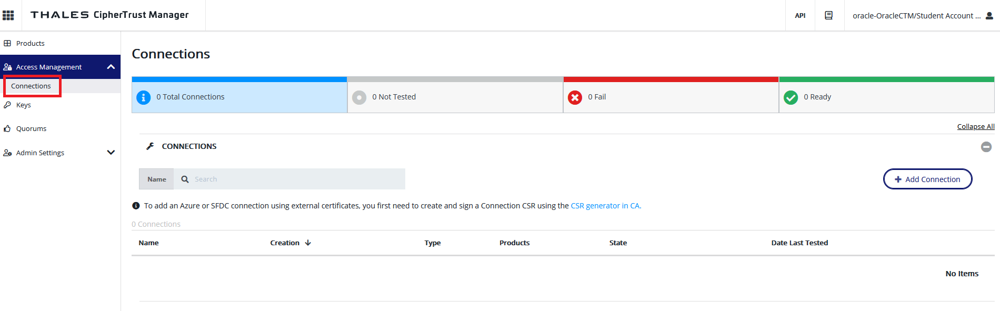

4. Click the "+ Add Connection" button to open the "Add Connection" wizard. The wizard consists of multiple steps.

    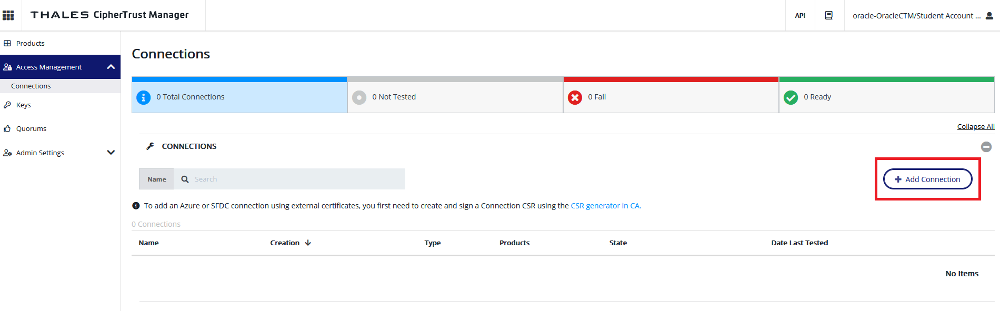

5. Select Connection Type : Select “Cloud” : “Oracle Cloud Infrastructure” and click **Next**.

     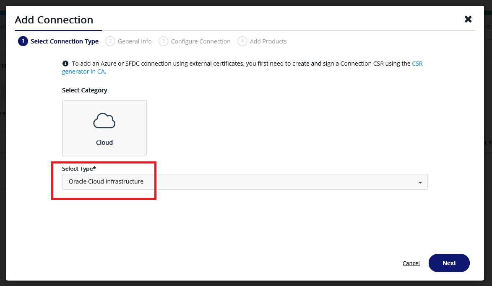

6. General Info: provide a Name following the format : *"OCI\_Connection\_XXX"* where XXX is your student number. Add a Description (optional) for the new connection, and click **Next**. 

    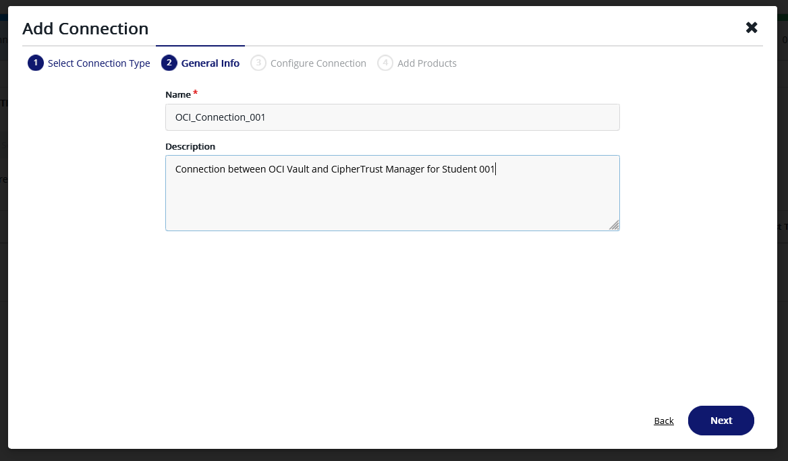

7. You are now in the **Configure Connection** step. You have to enter the information you previoulsy saved when you created the API Key Pair, in the Task 1.9 of this lab. **BE CAREFUL**, the information are not listed in the same order, for example "User OCID" is provided first and "tenancy OCID" comes third, where here "tenancy OCID" is asked first, so you have to make sure you paste the relevant information. You will also need to upload the private key file you saved in the same step.

    Copy the following parameters you had in your configuration file:

    

    * Tenancy OCID: OCID of the tenancy.
    * User OCID: OCID of the user.
    * Region: An Oracle Cloud Infrastructure region.
    * Fingerprint: Fingerprint of the public key added to this user.
    * Key File: Private key file for the OCI connection in the PEM format. Either upload the key file or paste the file content.
    * File Upload: Select and click Upload Private Key to upload the key file from your machine.
    * Text: Select and paste the certificate content in the text field.
    * Passphrase: Leave it blank if you didn't set a passphrase for the encrypted key file.
    

    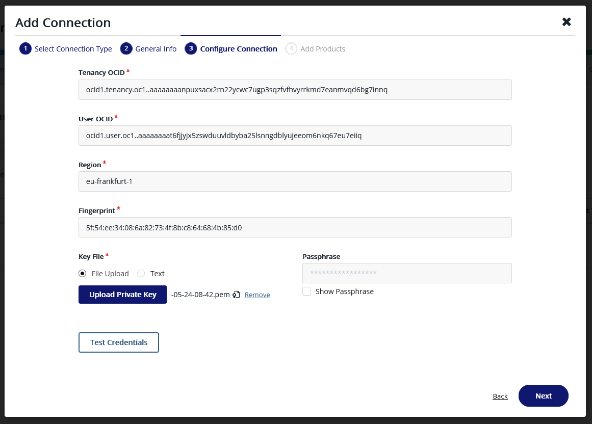

    
    Click Test Connection, a Status: OK message is displayed:

    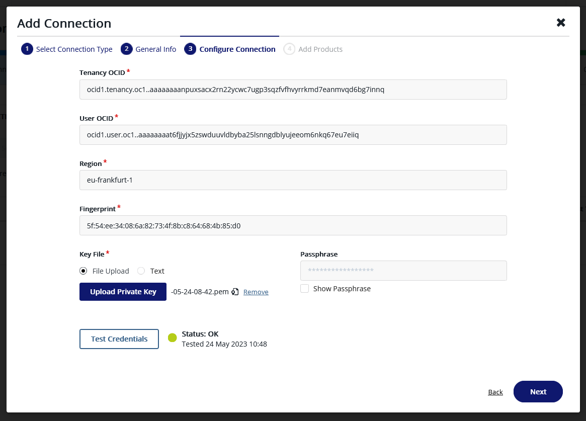

    Then click **Next**. 

8. The last step is "Add Products":use the check boxes in the Products list to select "Cloud Key manager" and click "Add Connection":

    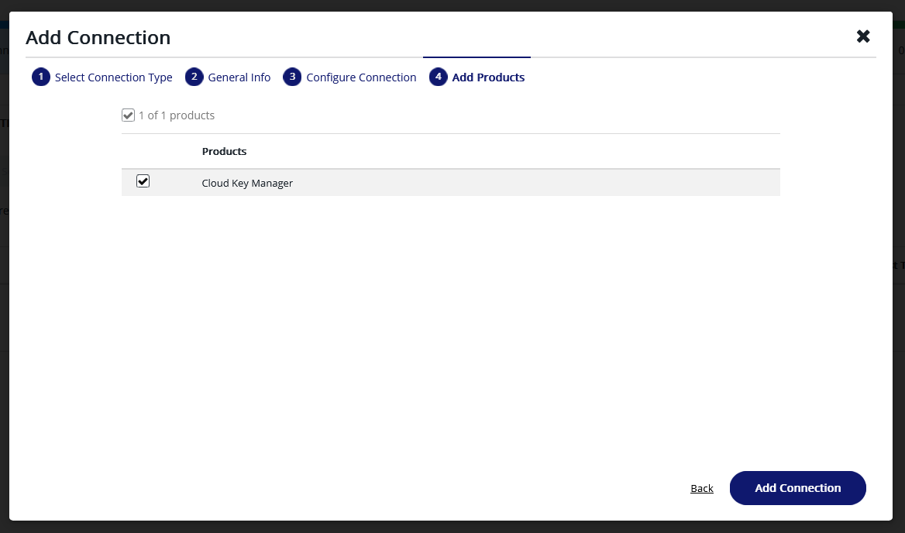

9. You should receive a "Success" notification and will be redirected to the **Connections** pane of CTM. Here you need to test the connection again by clicking on the three dots at the end of your newly created connection, and click on "Test Connection" in the menu:
    
    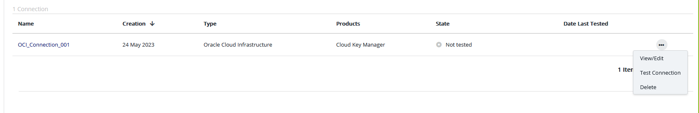

10. Your connection state should be **Ready**. 

    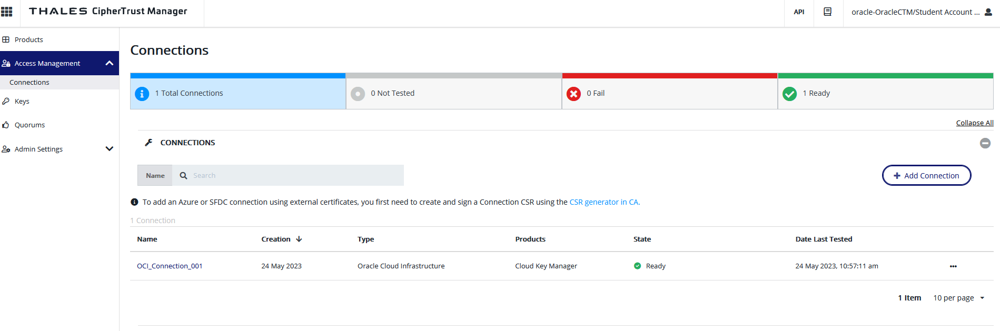

Congratulations, you have successfully created a direct link between your own Thales CipherTrust tenant and the Vault you created in OCI. Now we will see how you will be able to use this to remotely control your OCI tenant encryption in Lab 2.

## Learn More

### About THALES CipherTrust Manager
CipherTrust Cloud Key Manager (CCKM) solution is part of the Thales CipherTrust Manager. It is designed to address enterprise needs for encrypting data in the cloud while retaining custodianship of encryption keys, to comply with data security mandates in cloud storage environments. The solution uses an already-installed CipherTrust Manager (CM) as the underlying appliance that generates, stores, and retrieves encryption keys used by the CCKM servers. The keys and CCKM are administered by a Webbased graphic interface (Management Console), Command Line Interfaces (CLI) and command-line utilities. The encryption keys are maintained on the Thales CipherTrust Manager Appliance. CipherTrust Cloud Key Manager is delivered as a virtual appliance that can be
installed either on-premises or in the Cloud. The features and functionality are the same
for both deployment scenarios.
In this lab, CipherTrust Manager is hosted outside of Oracle Cloud Infrastructure. The tenant you have been provided with is a Thales Cloud Solution, but the concept would be exactly the same using a CipherTrust Manager instance you are already running in your Company DataCenter for example. In both cases, using a KMS outside of OCI provides greater segregation of duty which answers advanced compliance mandates contained in your company security policy or compliance requirements.

### About OCI Vault
Oracle Cloud Infrastructure Vault is a key management service that stores and manages master
encryption keys and secrets for secure access to resources.
Vault lets you securely store master encryption keys and secrets that you might otherwise store in
configuration files or in code. Specifically, depending on the protection mode, vault keys are either stored on the server or they are stored on highly available and durable hardware security modules (HSM) that meet Federal Information Processing Standards (FIPS) 140-2 Security Level 3 security certification.
The key encryption algorithms that the Vault service supports includes the Advanced Encryption Standard (AES), the Rivest-Shamir-Adleman (RSA) algorithm, and the elliptic curve digital signature algorithm (ECDSA). You can create and use AES symmetric keys and RSA asymmetric keys for encryption and decryption. You can also use RSA or ECDSA asymmetric keys for signing digital messages.
You can use the Vault service to create and manage the following resources:
* **Vaults**
* **Keys**
* **Secrets**

## Acknowledgements
* **Authors** - Damien Rilliard (OCI Security Senior Director), Sonia Yuste (OCI Security Specialist)
* **Last Updated By/Date** - Sonia Yuste, August 2023

