# Lab 3 - Configure customer managed encryption for OCI resources

## Introduction

*Describe the lab in one or two sentences, for example:* This lab walks you through the steps to ...

Estimated Lab Time: -- minutes

### About <Product/Technology> (Optional)
Enter background information here about the technology/feature or product used in this lab - no need to repeat what you covered in the introduction. Keep this section fairly concise. If you find yourself needing more than two sections/paragraphs, please utilize the "Learn More" section.

### Objectives

*List objectives for this lab using the format below*

In this lab, you will:
* Connect to your OCI tenant and create an encrypted Storage Bucket and Autonomous Database.
* Test access to the encrypted data and confirm the right users can correctly access cleartext data in the Storage Bucket and Autonomous Database.


### Prerequisites (Optional)

*List the prerequisites for this lab using the format below. Fill in whatever knowledge, accounts, etc. is necessary to complete the lab. Do NOT list each previous lab as a prerequisite.*

This lab assumes you have:
* An Oracle Cloud account
* All previous labs successfully completed


*This is the "fold" - below items are collapsed by default*

## Task 1: Create bucket with your own encryption keys

1. Let's first create a bucket in OCI Object Storage. To do that, log in to OCI console and navigate through the main hamburger menu to *"Storage > Object Storage > Buckets"*.
    
    

2. Create a bucket in the compartment we used to create the Vault by selecting the compartment and clicking Create Bucket.
    
    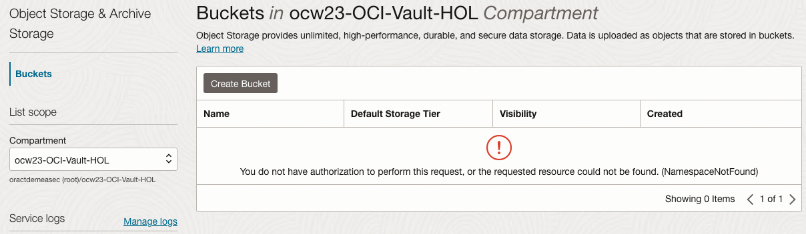


3. Name it by following same name convention: ocw23-OCI-bucket-001. Select the option Encrypt using customer-managed keys. Once you select that option, new fields to be filled will appear. Select the previously created Vault and the encryption keys that you stored in this Vault. Then click Create.
    
    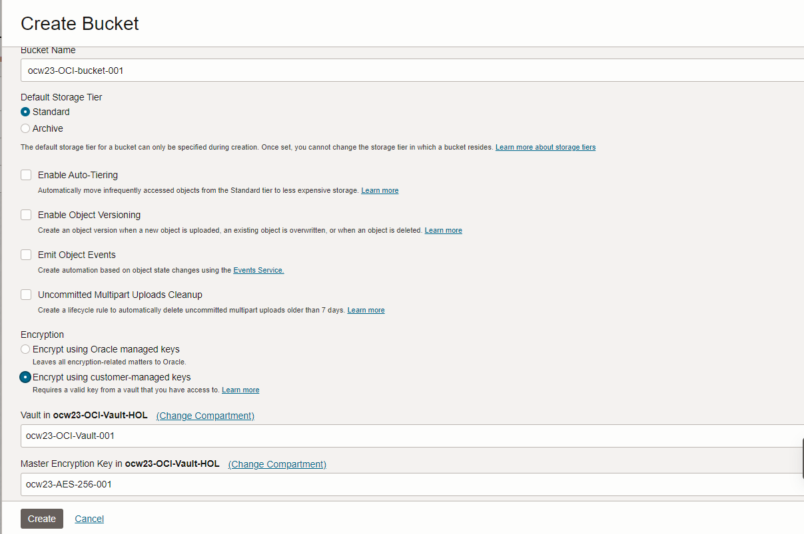

4. Now you have already created your bucket with your own ecnryption keys:

  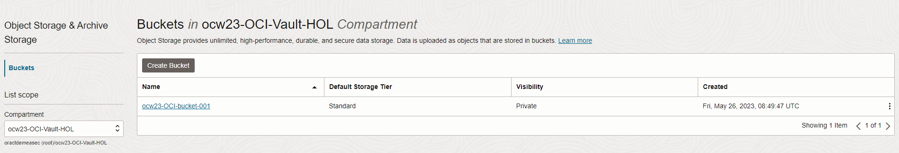

## Task 2: Upload data into the bucket and check visibility

You will upload a file that will be provided to you into the bucket you recently created in Object Storage.

1. Donwload the file [ocw23-sample-file.csv](https://objectstorage.eu-frankfurt-1.oraclecloud.com/p/4B-I7ermCb2D5OfuLn9XyvSCaEI9knzz35jIcQEnkinsuFOfg94HtJnuimhWjISj/n/frnj6sfkc1ep/b/ocw23-resources/o/ocw23-sample-file.csv)

2. Click in your recently created bucket and click **Upload** in the section **Objects**:

  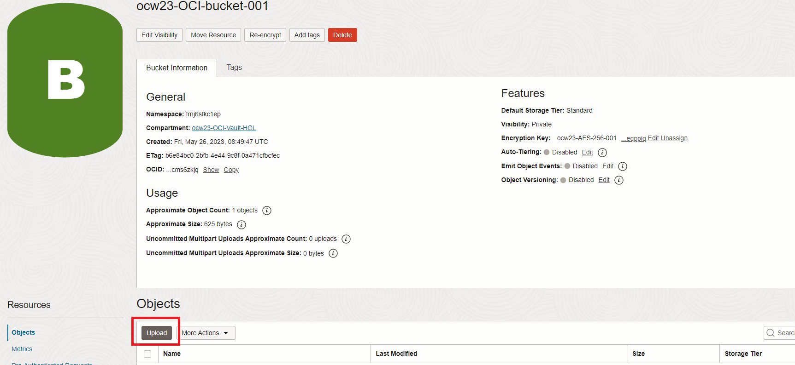

3. Leave the Object prefix name blank and select the file you downloaded. Click **Upload**:

   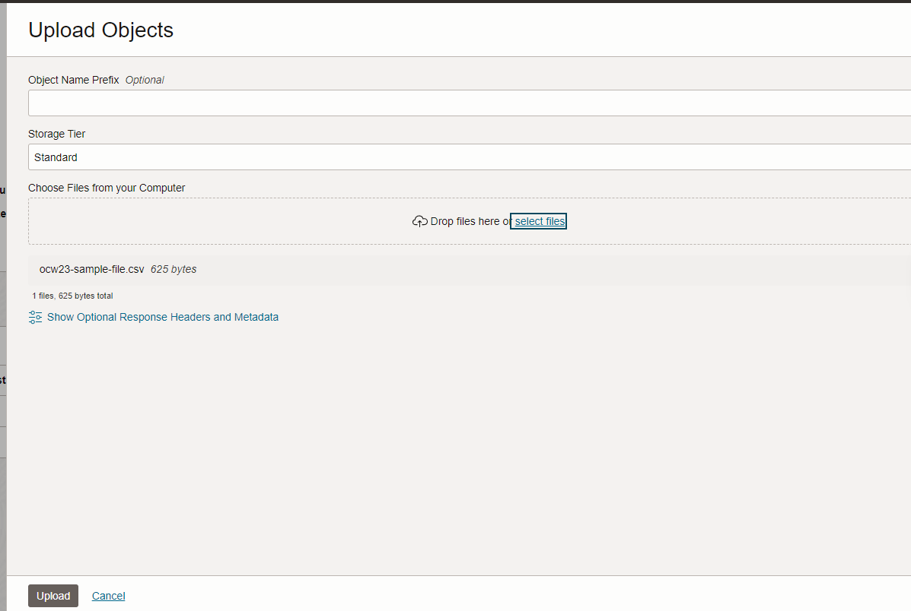

4. Close the window, and now you can see your file uploaded into your bucket:

  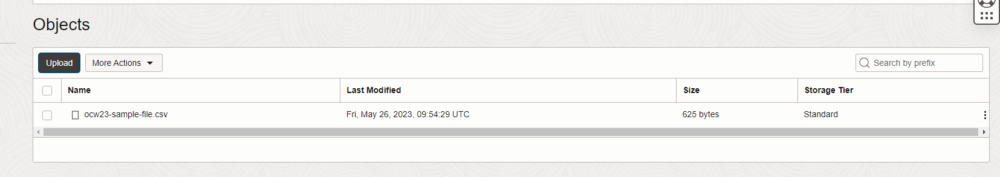

5. Now you will create a pre-authenticated request to be able to access the file in a specified time. You could share as well this URL with others. To do that, click to **Pre-Authenticated Requests** in the menu Resources in the left:

  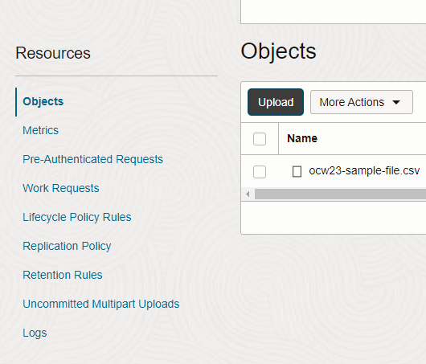

6. Click **Create Pre-Authenticated Request**:

  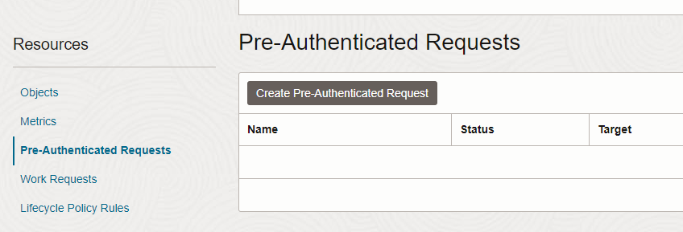

7. Fill the parameters as follow and click **Create Pre-Authenticated Request**:

  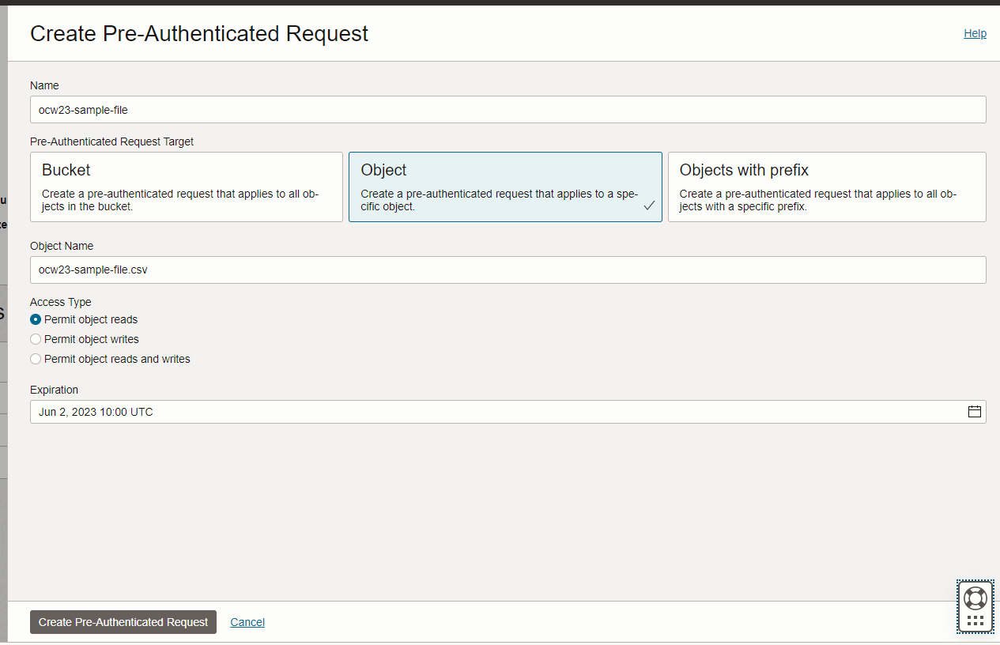

8. A window will prompt with the URL of the pre-authenticated request. Copy this URL and save it locally. Click **Close**.

  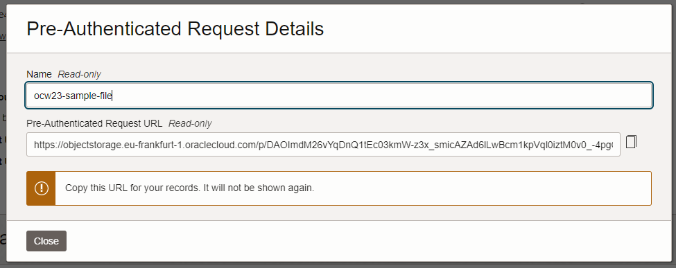

9. To check you have visibility into the file in your bucket, open another browser and go to the URL you copied previoulsy. The file should be automatically downloaded. You have already permissions to donwload and see the file as you have access to your encryption keys created in OCI from CTM.

## Task 3: Create an Autonomoous Database with your own encryption keys

Let's create now the Autonomous Database.
In order to use customer-managed encryption for Autonomous Database, it is needed to create permissions to allow OCI Vault service to communicate with your Autonomoous Database. To do that, you need first to create a dynamic group and policies to provide access to the vault and keys for Autonomous Database instance. 

1. Create a dynamic group to make the master encryption key accessible to the Autonomous Database instance: in the Oracle Cloud Infrastructure console click *"Identity & Security"* and under *"Identity"*, click *"Dynamic Groups"*. 

 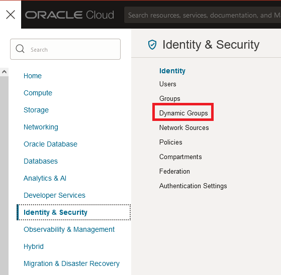

2. Click Create Dynamic Group

  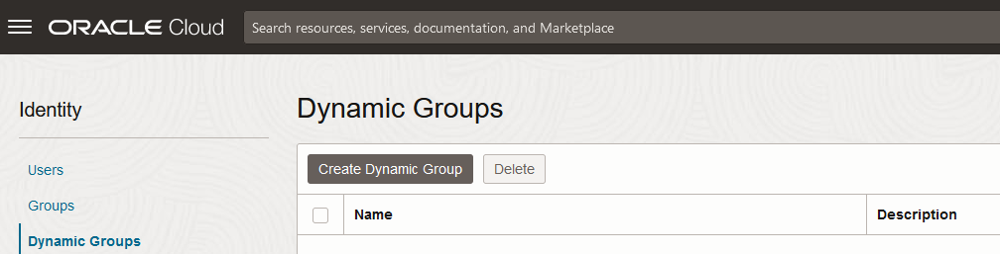

3. Enter a name and a description for the Dynamic Group. Regarding the rule, when you are creating the dynamic group before you provision or clone an Autonomous Database instance, the OCID for the new database is not yet available. For this case, create a dynamic group that specifies the resources in a given compartment by writting the following rule:

    ```
    resource.compartment.id = '<your_Compartment_OCID>'
    ```
  where &lt;your\_Compartment\_OCID&gt; is the OCID of the compartment ocw23-OCI-Vault-HOL.

  To find out this OCID, open a new tab and keep in OCI console. In the OCI console click *"Identity & Security"* and under *"Identity"*, click *"Compartments"*. Then click on your compartment ocw23-OCI-Vault-HOL and click the link Copy next to the OCID:

    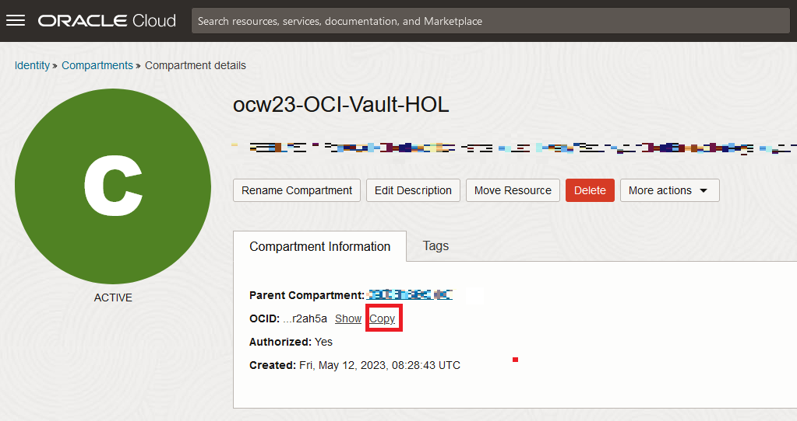

  Once you have your compartment OCID, you will be able to add it in the rule associated to the dynamic group you are about to create. The window with dynamic group information will look like as the image below:

    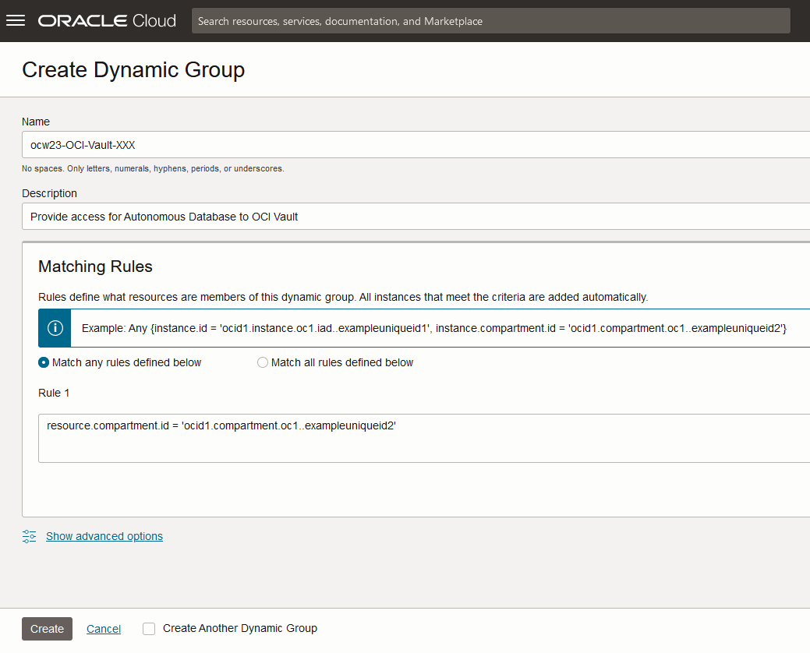

4. Write policy statements for the dynamic group to enable access to OCI resources (vaults and keys). To do that, in the OCI console click *"Identity & Security"* and under *"Identity"*, click *"Policies"*:

  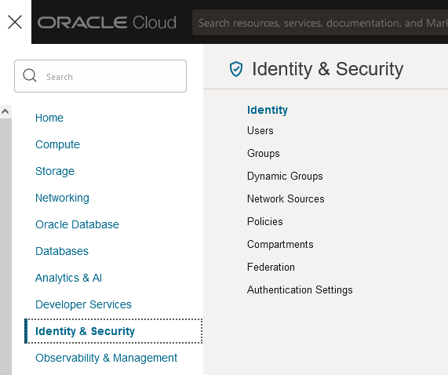


5. To write policies for a dynamic group, click Create Policy, and enter a Name and a Description. Use the Policy Builder to create a policy for vault and keys in the local tenancy.

  ```
  Allow dynamic-group ocw23-OCI-Vault-XXX to use vaults in compartment ocw23-OCI-Vault-HOL
  Allow dynamic-group ocw23-OCI-Vault-XXX to use keys in compartment ocw23-OCI-Vault-HOL
  ```
  It will look like something similar to:

   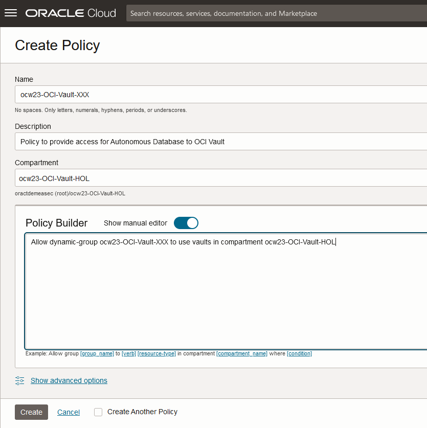

6. Click Create to save the policy.

7. Now you can create the Autonomous Database. Navigate through the main hamburger menu to: *"Oracle Database > Autonomous Database"*.

    


8.	Click Create Autonomous Database:

    


9.	Fill the parameters as follows:
    * Compartment: ocw23-OCI-Vault-HOL
    *	Display Name: ocw23-OCI-adb-001
    *	Database Name: ocw23OCIadb001
    *	Workload type: Transaction Processing
    *	Deployment type: Shared Infrastructure
    *	Configure the database: &lt;Leave it as default&gt; 
    *	Administrator credentials: &lt;your ADMIN password&gt; 
    *	Network access: Secure access from everywhere
    *	License type: Bring Your Own License (BYOL)
    * Oracle Database Edition: Oracle Database Standard Edition (SE)
  
  Click the link *"Show advanced options"*. A new section for Encryption Key will appear. Select the option: *"Encrypt using a customer-managed key in this tenancy"* and enter your previously created Vault and Master Encryption Key.

    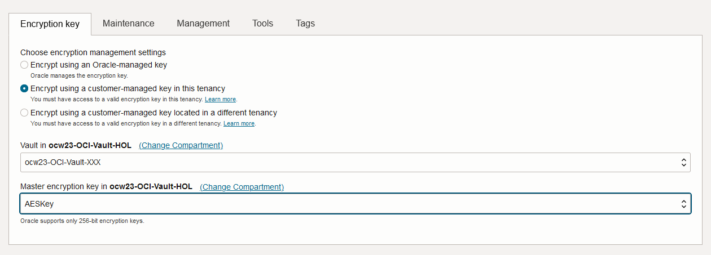


10. Click Create Autonomous Database. Then wait until the database status is set to green and ACTIVE.

  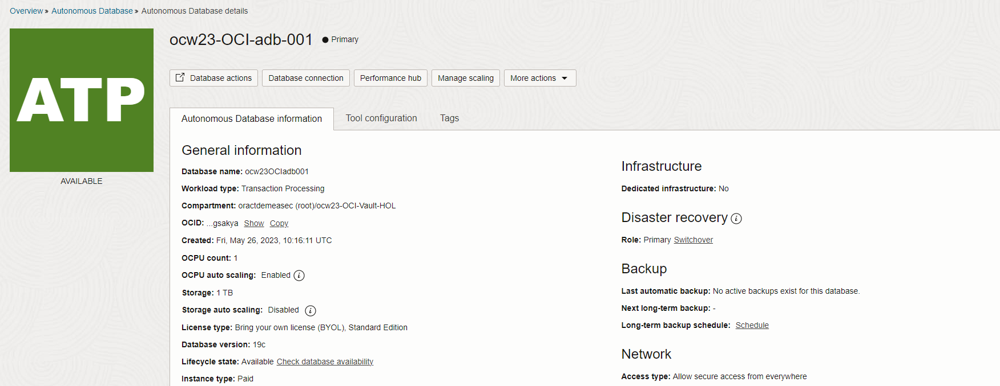

## Task 3: Upload data into the Autonomous Database and check visibility

In this task you will load the previous csv file you loaded into your bucket, into your previously created Autonomous Database.

1. Navigate to your Autonomous Database page in OCI console and go to the Database Actions Launchpad:

  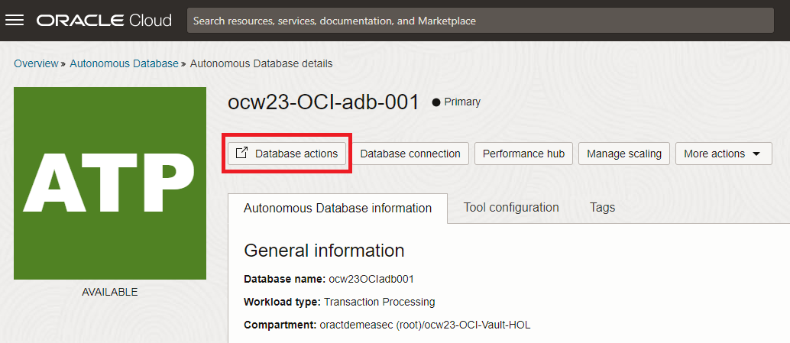

2. Once there, click to SQL under Development:

  

3. Web SQL Development UI is open and now you can load data into your database by clicking to **Data Load** on the top corner right:

  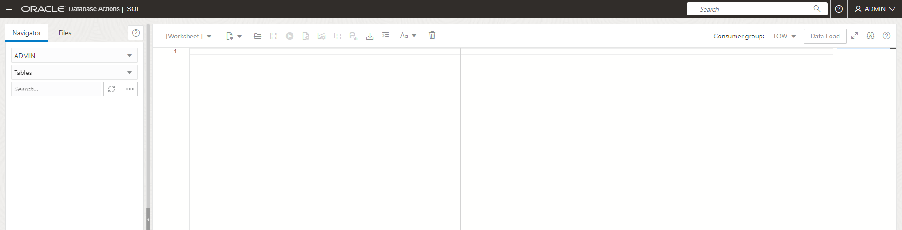

4. Drag and drop the file into it and click the button **Run all**:

  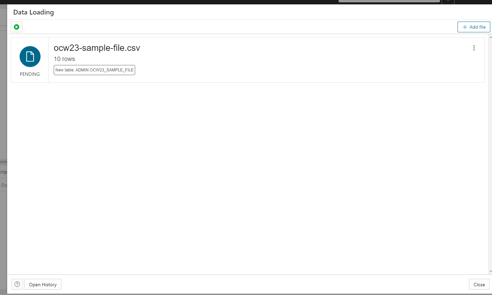

5. When the upload is complete, you will be able to see the green icon next to the filw:

   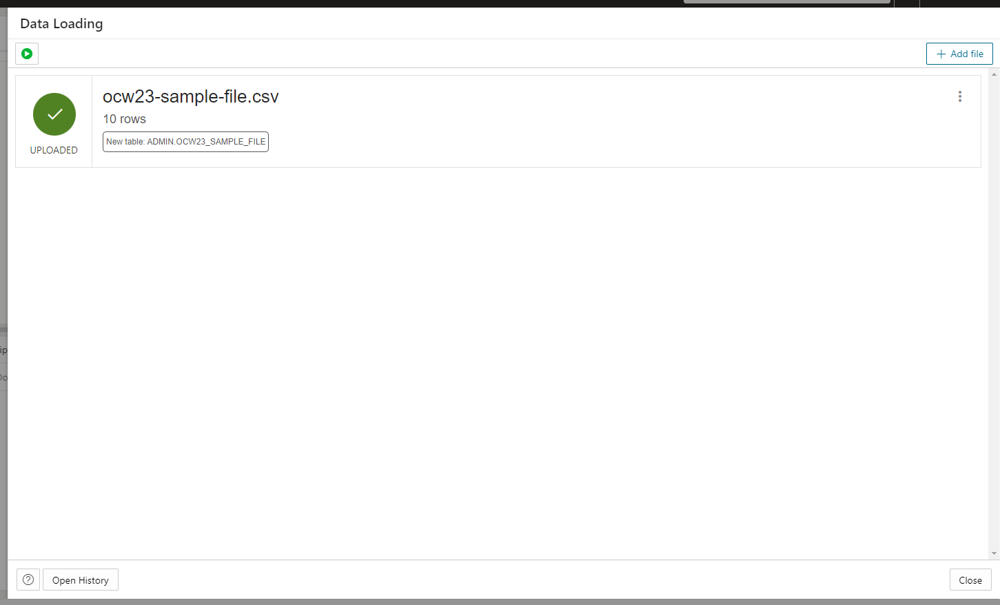

6. Click **CLose**. Refresh the browser and you will be able to see the new created table:

  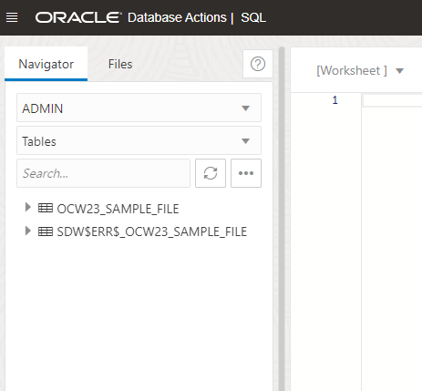

7. In order to see the data into the table, right click to the table and click **Open**:

  

8. In the new window, click the tab Data:

  

This completes the lab on loading CSV files from your local computer.

## Learn More

*(optional - include links to docs, white papers, blogs, etc)*

* [URL text 1](http://docs.oracle.com)
* [URL text 2](http://docs.oracle.com)

## Acknowledgements
* **Author** - <Name, Title, Group>
* **Contributors** -  <Name, Group> -- optional
* **Last Updated By/Date** - <Name, Month Year>
