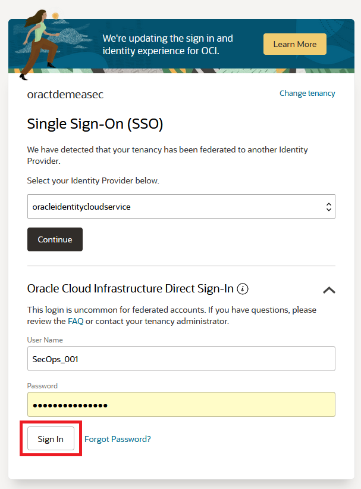

# Get started - Cloud login

## Introduction

Oracle Cloud is the industry's broadest and most integrated cloud provider, with deployment options ranging from the public cloud to your data center. Oracle Cloud offers best-in-class services across Software as a Service (SaaS), Platform as a Service (PaaS), and Infrastructure as a Service (IaaS).

Estimated Time: 5 minutes

### Types of Cloud Accounts

We offer two types of Cloud Accounts:

*Free Tier Accounts*:  After you sign up for the free [Oracle Cloud promotion](https://signup.cloud.oracle.com) or sign up for a paid account, you’ll get a welcome email. The email provides you with your cloud account details and sign in credentials.

*Oracle Cloud Paid Accounts*:  When your tenancy is provisioned, Oracle sends an email to the default administrator at your company with the sign-in credentials and URL. This administrator can then create a user for each person who needs access to the Oracle Cloud. Check your email or contact your administrator for your credentials and account name.

For this workshop, you will be provided with an Oracle Cloud Paid Account.

### Objectives

- Learn how to log in to your Oracle Cloud Account

### Prerequisites
- Cloud Account Name - The name of your tenancy 
- Username
- Password

These parameters are supplied by the administrator.

## Task 1:  Log in to Oracle Cloud
If you've signed out of the Oracle Cloud, use these steps to sign back in.

1. Go to [cloud.oracle.com](https://cloud.oracle.com) and enter your Cloud Account Name and click **Next**. 

    

2. Click **Next** and display the menu for the **Oracle Cloud Infrastructure Direct Sign-In** option to reveal the login input fields:

    

3. Enter your Cloud Account credentials and click **Sign In**. 

    

4. You are now signed in to Oracle Cloud!

    

You may now **proceed to the next lab**.

## Acknowledgements
- **Created By/Date** - 
- **Contributors** - 
- **Last Updated By** - 