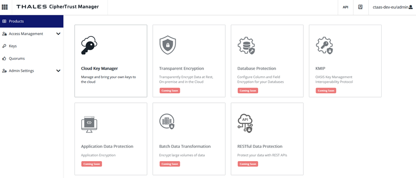

# HSM (Hardware Security Module) and Key Management Setup

## Introduction

This lab walks you through the steps to create a HSM (Hardware Security Module) and Key Management environment. 

Estimated Time: -- minutes

### About technology used in this lab 
It is representing the situation of you as an Oracle Cloud Infrastructure (OCI) customer. Either you are already owning an HSM On-Premise, or  you want to use an “HSM-as-a-Service” outside of Oracle Cloud like the Thales service we will use in this lab. 
For the purpose of this lab, you will work with Thales CipherTrust Data Security Platform service to create your encryption keys. 

### Objectives

In this lab, you will:
* Create an external Thales HSM/Key Management

### Prerequisites

This lab assumes you have:
* An Oracle Cloud account
* A Thales account

## Task 1: External Thales HSM/Key Management creation

1. Register a DPoD subscriber tenant through either of the following URLs, depending on your region. A DPoD subscriber tenant is a DPoD instance, with its own unique URL subdomain, where users consume services, including HSM as a Service where you will be able to create your encryption keys and simulate the usage of your own HSM. 

  > Tip: When you create the CDSPaaS service on DPoD, you can select a different cloud region to deploy the service in. The cloud region of the service has more of an effect on network latency for CDSPaaS than the DPoD subscriber tenant region.

2. Log in to your DPoD subscriber tenant as the Tenant Administrator.

  Provision the CDSPaaS service on DPoD to make a CDSPaaS tenant with an 	automatically generated tenant name. A CDSPaaS tenant is a logical boundary for 	each customer, cryptographically isolated from other customers by a unique Luna Cloud HSM encryption key.

3. Navigate to Services, select Add Service and select the CipherTrust Data Security Platform service.

4. Enter your configuration details in the Add Service wizard and click Finish to confirm.

   > Note: The service name you provide here is a convenience for display in DPoD. The 	CDSPaaS tenant name used in the CDSPaaS interfaces is different.

5. Click the service name in DPoD to launch CDSPaaS web console UI in a separate browser tab.
    	The URL is of the form:	
      
      https://ciphertrust.dpondemand.io/?tenant=<generated_tenant_name>

	The tenant cannot be renamed.

6. On first login to the new tenant, the default Application Administrator is "admin", with the temporary password you set during [service creation on the Data Protection on Demand (DPoD) marketplace](https://thalesdocs.com/dpod/services/key_management_services/cdsp/index.html). The initial password must be changed before using the CipherTrust Data Security Platform Services.
  a. Login as user "admin" using the temporary password you set on DPoD.
  b. Change the temporary password immediately, as prompted. Failure to do so could allow an attacker to compromise the system.

7. On first login to the UI, you are presented with the CipherTrust Data Security Platform Services products page, with the administrative navigation menu on the left, and application products in the center.
  

## Learn More

*(optional - include links to docs, white papers, blogs, etc)*

* [URL text 1](http://docs.oracle.com)
* [URL text 2](http://docs.oracle.com)

## Acknowledgements
* **Author** - <Name, Title, Group>
* **Contributors** -  <Name, Group> -- optional
* **Last Updated By/Date** - <Name, Month Year>
