# Emergency simulation test: block data access

## Introduction

Scenario:
You are your company Security Operations team manager. A severe security alert in your company just happenned. After talking to the Company CEO, the CISO has taken the decision to shut down access to data stored in the Cloud. So the CISO is asking you to make sure that all the encrypted data stored in OCI, your Company cloud, is inaccessible.

In order to block access to the data, you will disable the encryption key that you created at the beginning of this hands-on lab. As this key is used to encrypt data in the bucket you created as well as in the Autonomous Database, this will disable in turn any possibility to access the encrypted data as well as the objects themselves, even for OCI administrators.

As a Data Administrator, you will test access to the data to realize you can't access the data nor the objects anymore.

Estimated Time: 10 minutes

[Walk Through the Lab](videohub:1_jhm25js1)

### Objectives

In this lab, you will:

* Simulate an emergency situation where you as a customer want to completely block access to your data in OCI
* Disable encryption key from the external CipherTrust Key management console
* Test access to the encrypted data and confirm users cannot access data in the Storage Bucket and Autonomous Database anymore

## Task 1: Disable keys in CipherTrust Manager

1. Login to the CipherTrust Manager console.

    If you lost the link: to access CipherTrust Manager as a Service you will need to create the URL to access your own private tenant. To do this, you need to copy and paste this URL: **"https://us1.ciphertrust.dpondemand.io/?tenant=oracle-OracleCTM"** in your browser address bar and replace **XXX** with your student number. For example, if your student number is 001, the complete URL to your own private CTM tenant will be: **"https://us1.ciphertrust.dpondemand.io/?tenant=oracle-OracleCTM001"**. 

    

    Once you access your login window, please login using your **"Secops_XXX"** user, with the password which has been provided to you. If you can't locate this information, please contact one of the trainer to assist you.

    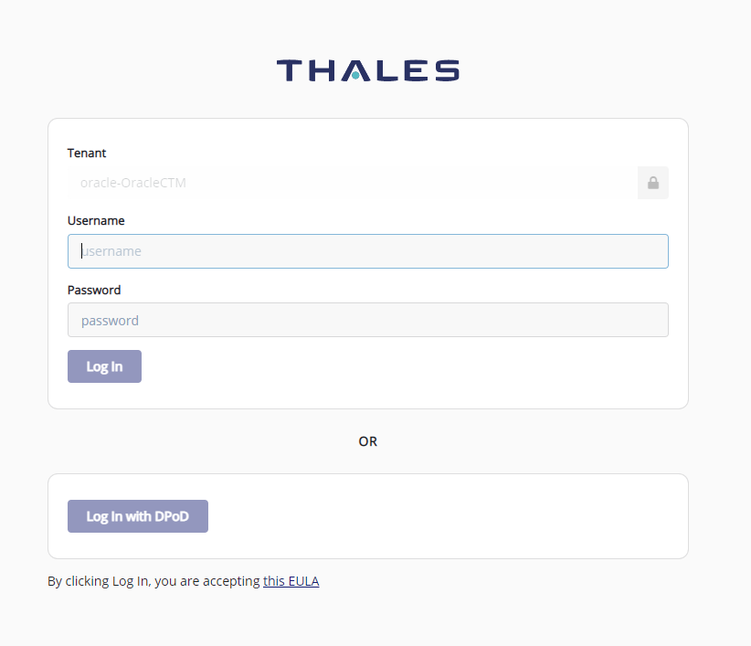

2. Enter the credentials you have been provided with. You are now logged into the CipherTrust Manager web console. Click on the Cloud Key Manager icon:

    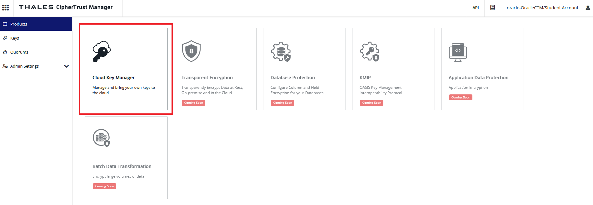

3. On the left pane, click **Cloud Keys > Oracle**.

    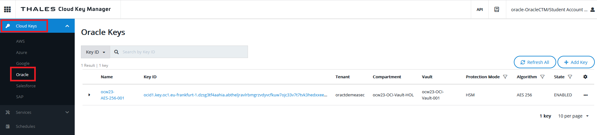

4. Click on the three points on the right of your key line and select **Disable**: 

    

5. A new window will prompt you to confirm. Click **Disable**:

    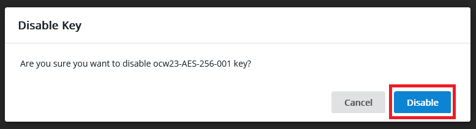

6. Click **Refresh All**:

    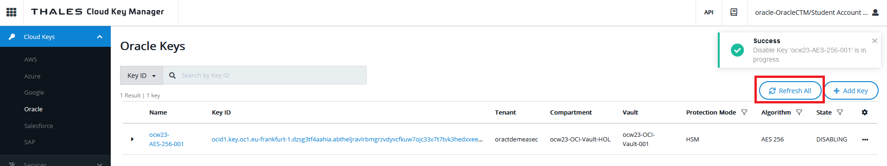

    a new window will prompt you again to confirm. Click **Refresh All**:

    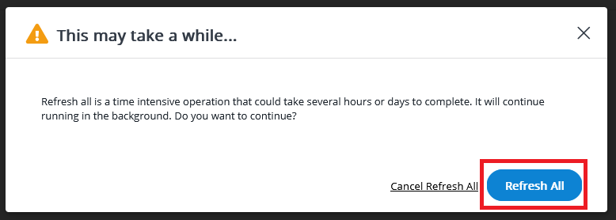

7. Wait until keys are in "Disabled" state:

    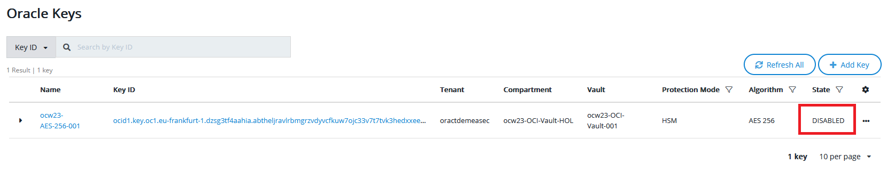


## Task 2: Confirm data access into your bucket is impossible as a result

1. Log in to OCI cloud tenant as Data\_Manager\_XXX, where "XXX" is your student number (please go to section *"Get Started"* to see how to log in to OCI), and navigate through the main hamburger menu to *"Storage > Object Storage > Buckets"*.
    
    

2. As you can see, the bucket you created with an external key is not accessible anymore and even a user like Data Manager user, who has full rights to manage this bucket cannot access any configuration items or see any parameters like Visibility and Default Storage Tier.

   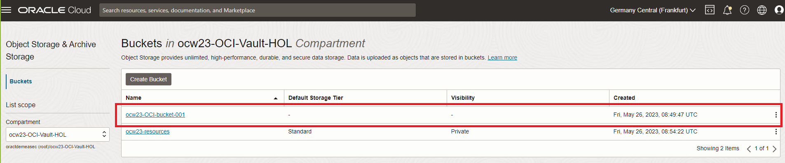

    If you click on your bucket, you will not be able to access:

    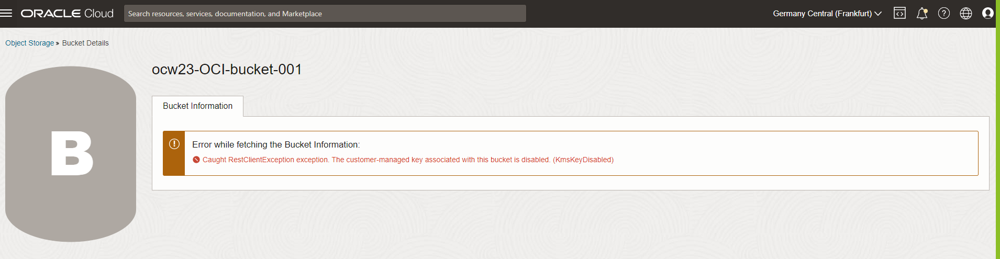

    and ocw23-resources bucket is still accessible because it has been configured with Oracle-managed keys by design. That is a best practice customers can use when they do not want to manage the keys and key lifecycle for resources that do not contain any sensitive data. This way, OCI enables companies to have a very granular and powerful key management solution for all of their OCI resources. 

3. Now we will check that any pre-authenticated request (PAR) that have been created are also non-functional anymore because the key was disabled. You should have saved the URL of a pre-authenticated request to access the excel file you uploaded in your bucket in lab 3 task 2. Copy this URL you saved and paste it in your browser:

    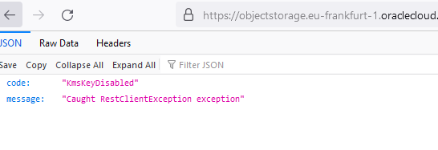

    As you can see, the pre-authenticated request does not work anymore, and the error message clearly explains this is due to the key not being accessible to the bucket.  

## Task 3: Check data access into your Autonomous Database

1. Navigate through the main hamburger menu to: *"Oracle Database > Autonomous Database"*.

    

2. Here two situations can happen. Either you will see your Autonomous Database stopped and this is the expected result. This is because the key it uses is in disabled state, and the database has checked the Master Encryption Key status already. If this is the case, congratulations! You have finished this lab, you can skip the end and go to the last lab.

    But as the Autonomous Database Service performs this check every 15 minutes, your result at this step may vary depending on how long it took you between disabling the keys and starting this task, and if a check happenned already or not. So you might have the following screen, showing the database is still running:

    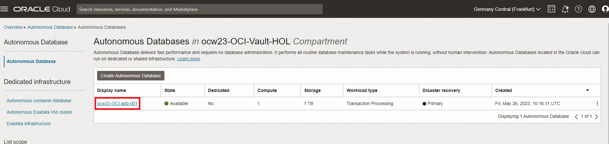


3. In this case you can either wait a little if you have time, or the easiest for the purpose of the lab is, as the Data Manager user, to stop the database and try to start it to confirm that it is impossible. 
 Click on your Autonomous Database name: 
 
   
 
   and click **More Actions**, then click **Stop**:

    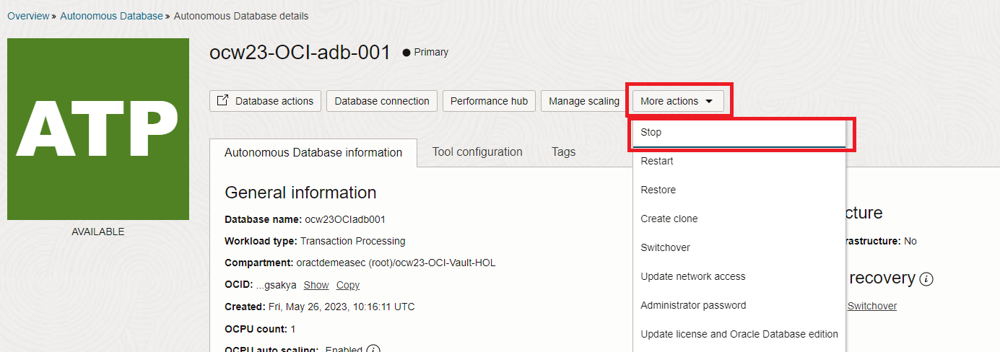

    A window will prompt you to confirm. Click **Stop**:

    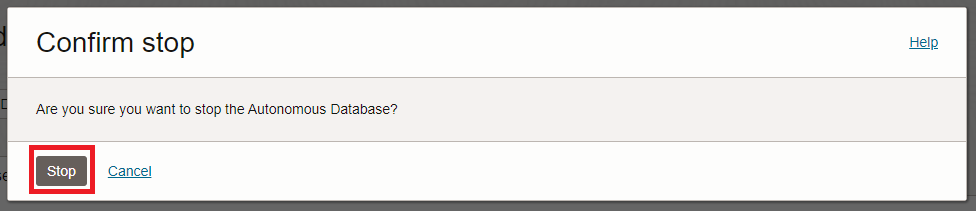

4. Wait until the database is fully stopped:

    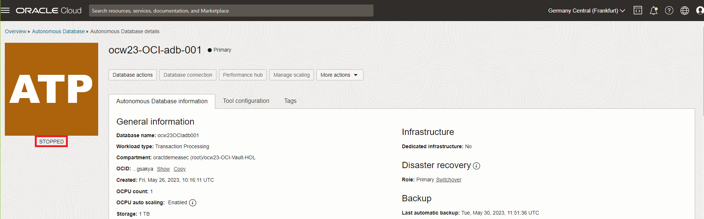

5. Try to start again the database by clicking on **More Actions** and **Start**:

    

    As you can see, it is totally impossible to start the database or do any actions on its content or configuration due to the fact that the Security Operation Manager disabled the key remotely from Thales CipherTrust Manager console:

    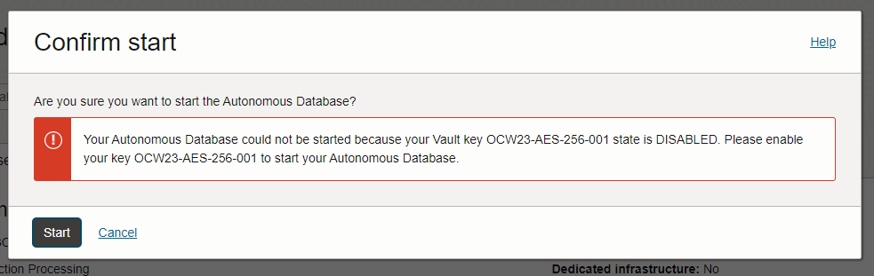

    Clicking **Start** will always bring you back to that screen until the key becomes enabled into OCI Vault, which we will see in the next lab.

Congratulations! You have completely blocked access to your Company data stored in OCI, so you're protecting it from any potential threat your CISO was alerted about. Now you can go to the next lab and learn about how to re-enable access when the alert will be over.

## Learn More

* [Load Data from Local Files with Oracle Database Actions](https://docs.public.oneportal.content.oci.oraclecloud.com/en-us/iaas/autonomous-database-shared/doc/load-data-sqldeveloper-web.html)
* [Load Data to Object Storage](https://docs.oracle.com/en-us/iaas/vision/vision-tutorials/vision/tutorials/Using_Pretrained_Models_in_the_Console/load_data.htm)
* In this example disabling the key made the Database impossible to start. This is by design because the key was actually disabled, and the Autonomous Database service receives a clear answer from the OCI Vault service or external KMS that the key is in a disabled state. 
This situation is very different from what would happen OCI Vault in itself would be unavailable. In order to protect production databases from any kind of events that would prevent the database to access Oracle Cloud Infrastructure Vault or the External KMS, such as a network outage, then Autonomous Database handles the outage as follows:

      * There is a 2-hour grace period where the database remains up and running.

      * If Oracle Cloud Infrastructure Vault is not reachable at the end of the 2-hour grace period, the database Lifecycle State is set to Inaccessible. In this state existing connections are dropped and new connections are not allowed.

      * If Autonomous Data Guard is enabled, during or after the 2-hour grace period you can manually try to perform a failover operation. Autonomous Data Guard automatic failover is not triggered when you are using customer-managed encryption keys and the Oracle Cloud Infrastructure Vault is unreachable.

      * If Autonomous Database is stopped, then you cannot start the database when the Oracle Cloud Infrastructure Vault is unreachable. For this case, the work request shown when you click Work Requests on the Oracle Cloud Infrastructure console under Resources shows: 

      ```
      The Vault service is not accessible. 
      Your Autonomous Database could not be started. Please contact Oracle Support.
      ```
 
    To check all the details about this, [please refer to the documentation.](https://docs.oracle.com/en/cloud/paas/autonomous-database/adbsa/manage-keys-notes.html)


## Acknowledgements
* **Authors** - Damien Rilliard (OCI Security Senior Director), Sonia Yuste (OCI Security Specialist)
* **Last Updated By/Date** - Damien Rilliard, July 2023