# Emergency simulation test: re-enable data access

## Introduction

Scenario: 
The Security alert is now over. After all the required checks, the CISO has taken the decision to re-enable access to data stored in the Cloud. So the CISO is asking you, as you are your Company Security Operations team manager, to go ahead and restore normal operations and data access in OCI, your Company Cloud.

In order to re-enable access to the data, you will re-enable the encryption key that you created at the beginning of this hands-on lab. As this key is used to encrypt data in the bucket you created as well as in the Autonomous Database, this will fully re-enable access to the data.

As a Data Administrator, you will test proper access to the data is now indeed possible and normal operations can restart, now that the security alert is over. This will mark the end of this hands-on lab!

Estimated Time: 10 minutes

[Walk Through the Lab](videohub:1_cg98w5b0)

### Objectives

In this lab, you will:

* Re-enable the encryption key used in OCI from the external CipherTrust Key management console as the Security alert is over
* Test access to the encrypted data and confirm users can access data again in both the Storage Bucket and Autonomous Database

### Prerequisites

This lab assumes you have:

* An Oracle Cloud account
* All previous labs successfully completed

## Task 1: Re-enable key in CipherTrust Manager

1. Go back to the CipherTrust Manager console.
    If you closed it or lost the link: to access CipherTrust Manager as a Service you will need to create the URL to access your own private tenant. To do this, you need to copy and paste this URL: "https://us1.ciphertrust.dpondemand.io/?tenant=oracle-OracleCTM" in your browser address bar and add your student number at the end of the URL. For example, if your student number is 001, the complete URL to your own private CTM tenant will be: "https://us1.ciphertrust.dpondemand.io/?tenant=oracle-OracleCTM001".
    Once you access your login window, please login using your "Secops_XXX" user, with the password which has been provided to you. If you can't locate this information, please contact one of the trainer to assist you.

    

    Enter the credentials you have been provided with. You are now logged into the CipherTrust Manager web console. Click on the Cloud Key Manager icon:

    

2. On the left pane, click **Cloud Keys > Oracle**.

    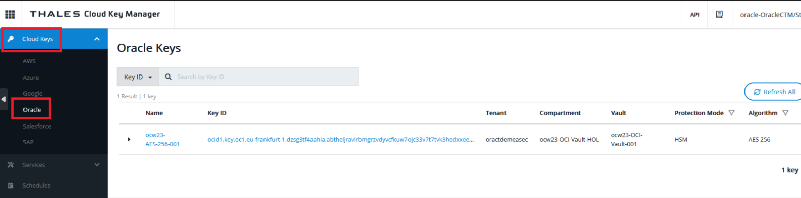

3. Click on the three points on the right of your key line and select **Enable**:

   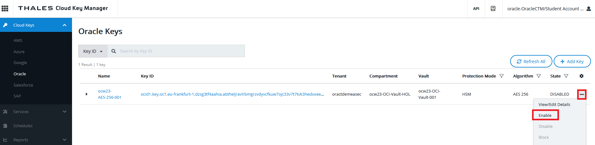

4. A new window will prompt you to confirm. Click **Enable**:

    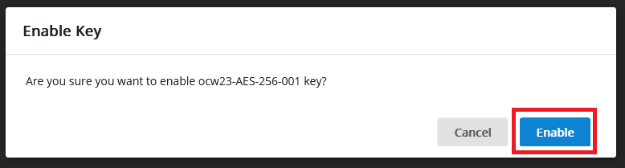

6. Click **Refresh All**: 

    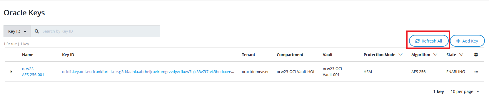

    a new window will prompt you again to confirm. Click **Refresh All** again:

    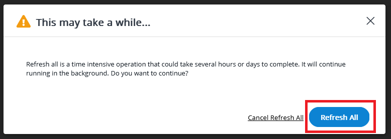

7. Wait until keys are in "Enabled" state:

    

## Task 2: Confirm data access into your bucket is possible as a result

1. Log in to OCI cloud tenant as Data\_Manager\_XXX, where "XXX" is your student number (please go to lab TODO to see how to log in to OCI), and navigate through the main hamburger menu to *"Storage > Object Storage > Buckets"*.
    
    

2. As you can see, the bucket you created with an external key is accessible again: 

   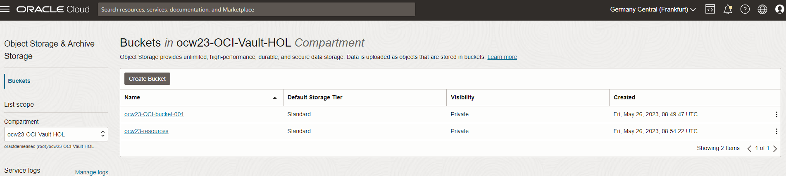

    If you click on your bucket, you will be able to access and see the objects inside the bucket listed below:

   

3. Now we will check that the pre-authenticated request (PAR) that you have created is functional again as the key is enabled.
  Copy the URL you saved in lab 3 task 2 and paste it in your browser again. Confirm you can download the document.
  Thus we have now confirmed that re-enabling the key from the external CipherTrust Manager instance brings back a fully functional behavior to OCI storage bucket.

## Task 3: Check data access into your Autonomous Database

1. Navigate through the main hamburger menu to: *"Oracle Database > Autonomous Database"*.

    

2. Here you can have two situations. Either the database has already restarted, if the Autonomous Database Service has already checked that the key is enabled again. Or most probably the database is still stopped:

    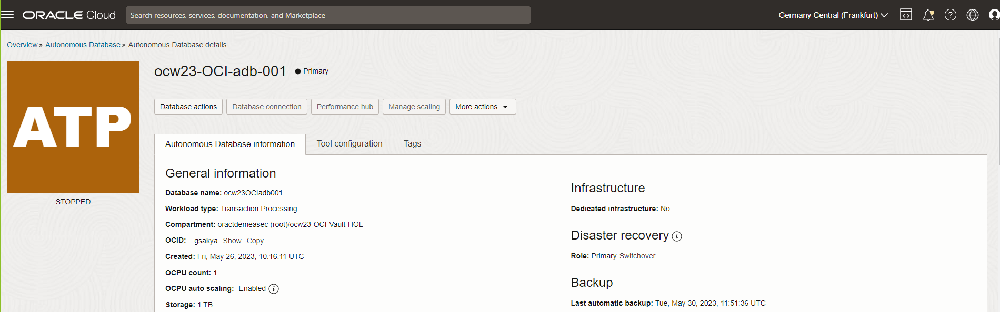

3. So you will start the database because the key is enabled again by clicking on **More Actions** and **Start**:

      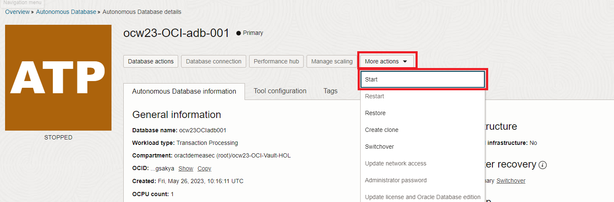

      Once you click **Start**, you will see the database is starting:

      
      
      Wait until the database is started:
      
      

      As you can see, now it is possible to start the database as the key is re-enabled and reachable by the Autonomous Database service.

4. In order to ensure the data can be decrypted, let's try to access the data within the database. In order to do that, click on the **Database actions** launchpad:

    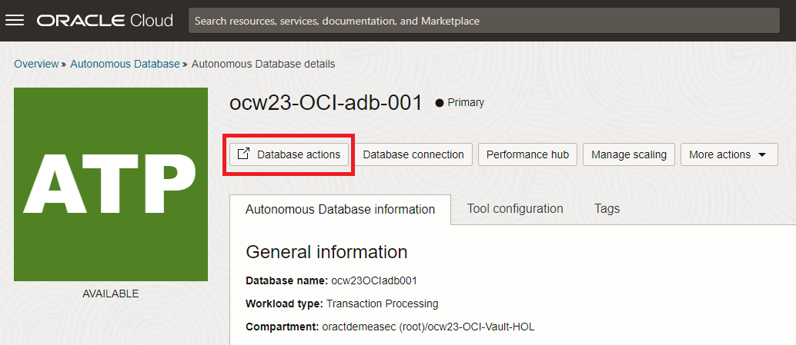

5. Once there, click on the **SQL** square under Development:

    

6. Web SQL Development UI is open and now you can see the data into the table, right click on the table and click **Open**:

    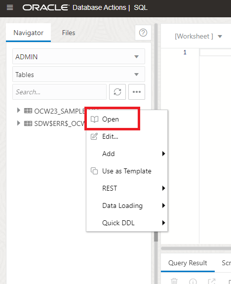

7. In the new window, click the **Data** tab:

    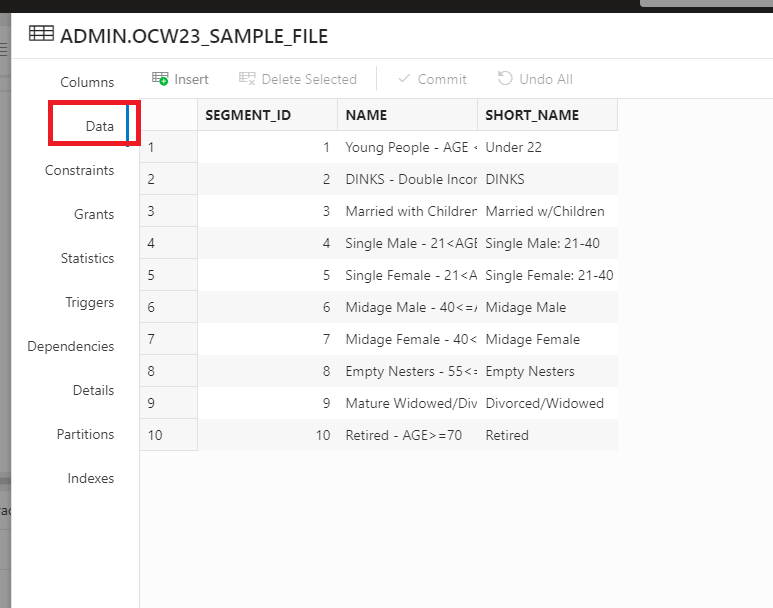

    As you can see, now you have again complete visibility on the data within the database, as the key was re-enabled.

Congratulations! You have finished this hands-on lab! Please call one of the trainer to show your completion and ask any questions. We hope you enjoyed it and learned something! The team is here to answer any questions you might have. And if you liked it, talk about it around you! See you soon!

## Learn More

* [Using Your Own Keys in Vault for Server-Side Encryption](https://docs.oracle.com/en-us/iaas/Content/Object/Tasks/encryption.htm#UsingYourKMSKeys)
* [Managing Encryption Keys on Autonomous Database](https://docs.oracle.com/en/cloud/paas/autonomous-database/adbsa/autonomous-encrypt-set-rotate-keys.html#GUID-0795135D-B057-4DBC-92C9-368AF4C82D0A)

## Acknowledgements
* **Authors** - Damien Rilliard (OCI Security Senior Director), Sonia Yuste (OCI Security Specialist)
* **Last Updated By/Date** - Sonia, August 2023
