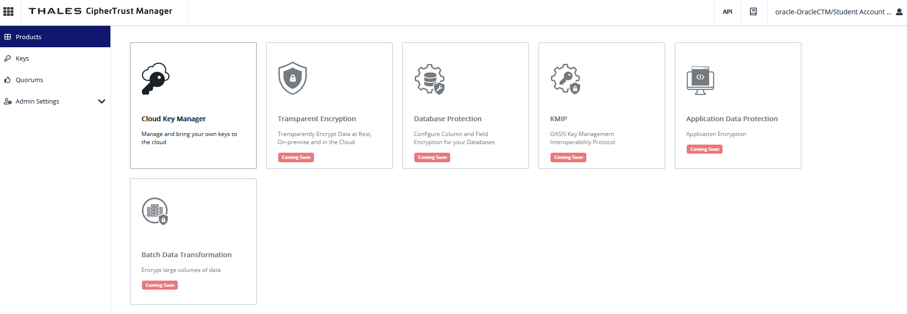
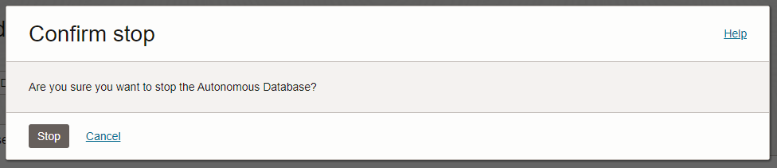
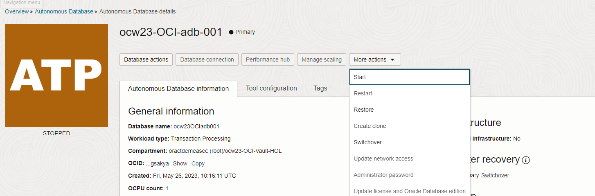

# Lab 4 - Emergency simulation test: blocking data access

## Introduction

*Describe the lab in one or two sentences, for example:* This lab walks you through the steps to ...

Estimated Lab Time: -- minutes

### About <Product/Technology> (Optional)
Enter background information here about the technology/feature or product used in this lab - no need to repeat what you covered in the introduction. Keep this section fairly concise. If you find yourself needing more than two sections/paragraphs, please utilize the "Learn More" section.

### Objectives

*List objectives for this lab using the format below*

In this lab, you will:
* Simulate an emergency situation where you as a customer want to block access to your data in OCI
* Disable encryption key from the external CipherTrust Key management console
* Test access to the encrypted data and confirm users cannot access data in the Storage Bucket and Autonomous Database anymore
* Re-enable proper access once the alert is over

### Prerequisites (Optional)

*List the prerequisites for this lab using the format below. Fill in whatever knowledge, accounts, etc. is necessary to complete the lab. Do NOT list each previous lab as a prerequisite.*

This lab assumes you have:
* An Oracle Cloud account
* All previous labs successfully completed


## Task 1: Disable keys in CipherTrust Manager

1. Go to the following URL to access CipherTrust Manager as a Service: *"https://us1.ciphertrust.dpondemand.io/?tenant=oracle-OracleCTM"* and append your student number. For example, if your student number is 001, go to the following URL: *"https://us1.ciphertrust.dpondemand.io/?tenant=oracle-OracleCTM001"*

    

2. Enter the credentials you have been provided with. You are now logged into the CipherTrust Manager web console. Click on the Cloud Key Manager icon:

    


3. On the left pane, click **Cloud Keys > Oracle**.

    

4. Click on the three points on the right of your key line and select **Disable**: 

  

5. A new window will prompt you to confirm:

  

6. Click **Refresh All** and a new window will prompt you again to confirm:

  

7. Wait until keys are in "Disabled" state:

  


## Task 2: Confirm data access into your bucket is impossible as a result

1. Log in to OCI cloud tenant as Data\_Manager\_XXX, where "XXX" is your student number (please go to lab TODO to see how to log in to OCI), and navigate through the main hamburger menu to *"Storage > Object Storage > Buckets"*.
    
    

2. As you can see, the bucket you created with an external key is not accessible anymore and even a user like Data Manager user, who has full rights to manage this bucket cannot access any configuration items or see any parameters like Visibility and Default Storage Tier.

   

  If you click on your bucket, you will not be able to access:

   

  and ocw23-resources bucket is still accessible because it has been configured with Oracle-managed keys by design. That is a best practice customers can use when they do not want to manage the keys and key lifecycle for resources that do not contain any sensitive data. This way, OCI enables companies to have a very granular and powerfull key management solution for all of their OCI resources. 


## Task 3: Check data access into your Autonomous Database

1. Navigate through the main hamburger menu to: *"Oracle Database > Autonomous Database"*.

  

2. As you can see, the database is still running:

  

  Indeed, after you switch to customer-managed keys, some database operations will be affected when the Master Encryption Key used for your Autonomous Database instance is in "Disabled" state in Oracle Cloud Infrastructure Vault. But in order to protect production databases from any kind of events that would prevent the database to access Oracle Cloud Infrastructure Vault, such as a network outage, then Autonomous Database handles the outage as follows:

    * There is a 2-hour grace period where the database remains up and running.

    * If Oracle Cloud Infrastructure Vault is not reachable at the end of the 2-hour grace period, the database Lifecycle State is set to Inaccessible. In this state existing connections are dropped and new connections are not allowed.

    * If Autonomous Data Guard is enabled, during or after the 2-hour grace period you can manually try to perform a failover operation. Autonomous Data Guard automatic failover is not triggered when you are using customer-managed encryption keys and the Oracle Cloud Infrastructure Vault is unreachable.

    * If Autonomous Database is stopped, then you cannot start the database when the Oracle Cloud Infrastructure Vault is unreachable. For this case, the work request shown when you click Work Requests on the Oracle Cloud Infrastructure console under Resources shows: 

    ```
    The Vault service is not accessible. 
    Your Autonomous Database could not be started. Please contact Oracle Support.
    ```
 
  To check all the details about this, [please refer to the following documentation link.](https://docs.oracle.com/en/cloud/paas/autonomous-database/adbsa/manage-keys-notes.html)

3. In the real world, the database would be automatically inaccessible after 2 hours. For the purpose of the lab you will, as the Data Manager user, stop the database and try to start it to confirm that it is impossible. 
 Click on your Autonomous Database name: 
 
 
 
 and click **More Actions**, then click **Stop**:

  

  A window will prompt you to confirm. Click **Stop**:

  

4. Wait until the database is fully stopped:

  

5. Try to start again the database by clicking on **More Actions** and **Start**:

  

  As you can see, it is totally impossible to start the database or do any actions on its content or configuration due to the fact that the Security Operation Manager disabled the key remotely from Thales CipherTrust Manager console:

  

  Clicking *Start** will always bring you back to that screen until the key becomes enabled into OCI Vault, which we will see in the next task.


## Task 4: Re-enable key in CipherTrust Manager

1. Go back to the CipherTrust Manager console. If you closed it, use the following URL to access CipherTrust Manager as a Service: *"https://us1.ciphertrust.dpondemand.io/?tenant=oracle-OracleCTM"* and append your student number. For example, if your student number is 001, go to the following URL: *"https://us1.ciphertrust.dpondemand.io/?tenant=oracle-OracleCTM001"*

  

  Enter the credentials you have been provided with. You are now logged into the CipherTrust Manager web console. Click on the Cloud Key Manager icon:

  


2. On the left pane, click **Cloud Keys > Oracle**.

  

3. Click on the three points on the right of your key line and select **Enable**:

  

4. A new window will prompt you to confirm:

  

6. Click **Refresh All** and a new window will prompt you again to confirm:

  

7. Wait until keys are in "Enabled" state:

  


## Task 5: Confirm data access into your bucket is possible as a result

1. Log in to OCI cloud tenant as Data\_Manager\_XXX, where "XXX" is your student number (please go to lab TODO to see how to log in to OCI), and navigate through the main hamburger menu to *"Storage > Object Storage > Buckets"*.
    
    

2. As you can see, the bucket you created with an external key is not accessible anymore and even a user like Data Manager user, who has full rights to manage this bucket cannot access any configuration items or see any parameters like Visibility and Default Storage Tier.

   

  If you click on your bucket, you will not be able to access:

   

  and ocw23-resources bucket is still accessible because it has been configured with Oracle-managed keys by design. That is a best practice customers can use when they do not want to manage the keys and key lifecycle for resources that do not contain any sensitive data. This way, OCI enables companies to have a very granular and powerfull key management solution for all of their OCI resources. 


## Task 6: Check data access into your Autonomous Database

1. Navigate through the main hamburger menu to: *"Oracle Database > Autonomous Database"*.

  

2. As you can see, the database is still running:

  

  Indeed, after you switch to customer-managed keys, some database operations will be affected when the Master Encryption Key used for your Autonomous Database instance is in "Disabled" state in Oracle Cloud Infrastructure Vault. But in order to protect production databases from any kind of events that would prevent the database to access Oracle Cloud Infrastructure Vault, such as a network outage, then Autonomous Database handles the outage as follows:

    * There is a 2-hour grace period where the database remains up and running.

    * If Oracle Cloud Infrastructure Vault is not reachable at the end of the 2-hour grace period, the database Lifecycle State is set to Inaccessible. In this state existing connections are dropped and new connections are not allowed.

    * If Autonomous Data Guard is enabled, during or after the 2-hour grace period you can manually try to perform a failover operation. Autonomous Data Guard automatic failover is not triggered when you are using customer-managed encryption keys and the Oracle Cloud Infrastructure Vault is unreachable.

    * If Autonomous Database is stopped, then you cannot start the database when the Oracle Cloud Infrastructure Vault is unreachable. For this case, the work request shown when you click Work Requests on the Oracle Cloud Infrastructure console under Resources shows: 

    ```
    The Vault service is not accessible. 
    Your Autonomous Database could not be started. Please contact Oracle Support.
    ```
 
  To check all the details about this, [please refer to the following documentation link.](https://docs.oracle.com/en/cloud/paas/autonomous-database/adbsa/manage-keys-notes.html)

3. In the real world, the database would be automatically inaccessible after 2 hours. For the purpose of the lab you will, as the Data Manager user, stop the database and try to start it to confirm that it is impossible. 
 Click on your Autonomous Database name: 
 
 
 
 and click **More Actions**, then click **Stop**:

  

  A window will prompt you to confirm. Click **Stop**:

  

4. Wait until the database is fully stopped:

  

5. Try to start again the database by clicking on **More Actions** and **Start**:

  

  As you can see, it is totally impossible to start the database or do any actions on its content or configuration due to the fact that the Security Operation Manager disabled the key remotely from Thales CipherTrust Manager console:

  

  Clicking *Start** will always bring you back to that screen until the key becomes enabled into OCI Vault, which we will see in the next task.


## Learn More

*(optional - include links to docs, white papers, blogs, etc)*

* [URL text 1](http://docs.oracle.com)
* [URL text 2](http://docs.oracle.com)

## Acknowledgements
* **Author** - <Name, Title, Group>
* **Contributors** -  <Name, Group> -- optional
* **Last Updated By/Date** - <Name, Month Year>
