# Configure Required Oracle Cloud Infrastructure Components

## Introduction

In this lab you will be creating required virtual cloud networks (VCNs), subnets in each VCN, dynamic routing gateways (DRG), route tables and spoke VCN compute instances to support traffic between VCNs.

Estimated Lab Time: 15 minutes.

### Objectives
- Demonstrate launching Firewall VCN and supporting configuration 
- Demonstrate launching Spoke VCN and supporting configuration 
- Demonstrate launching Dynamic Routing Gateways and supporting configuration 
- Demonstrate launching Route Tables on each VCNs and supporting configuration
- Launch Compute Instances in Firewall and Spoke VCNs.

### Prerequisites

- Oracle Cloud Infrastructure paid account credentials (User, Password, Tenant, and Compartment)
- Required Quota, Resources permission,and associated policies are complete.

## **Task 1: Configure Firewall VCN**

1. From the OCI Services menu, click **Virtual Cloud Networks** under **Networking**. Select your region on right part of the screen:

   

2. Below table represents what you will be creating. Click on **Create VCN** icon to create new **Virtual Cloud Network**:

      | VCN Name                              | VCN CIDR       | Comment                                                    |
      |---------------------------------------|----------------|------------------------------------------------------------|
      | firewall-vcn                          | 10.10.0.0/16   | Hub Virtual Cloud Network; OCI Network Firewall will be part of this |
      
   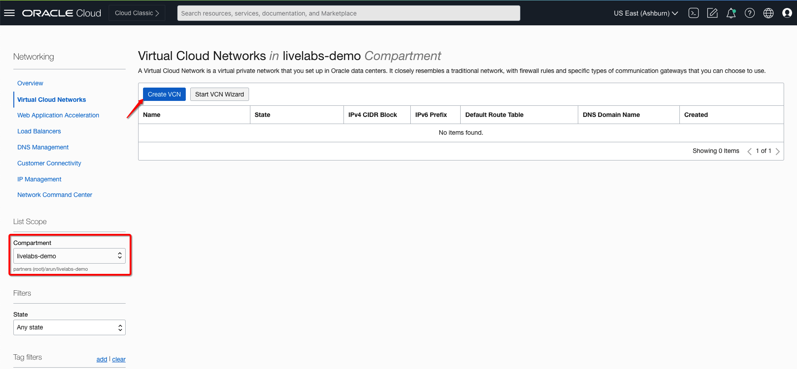

3. Fill out the dialog box:

      - **VCN NAME**: Provide a name
      - **COMPARTMENT**: Ensure your compartment is selected
      - **VCN CIDR BLOCK**: Provide a CIDR block (10.10.0.0/16)

   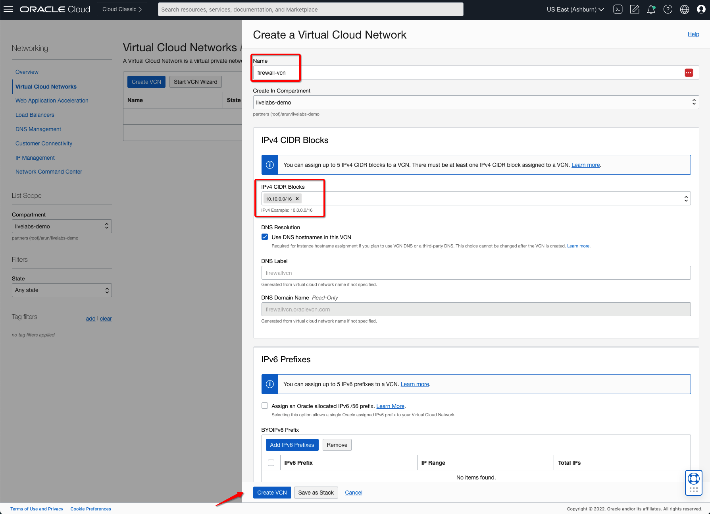

4. Verify all the information and Click **Create VCN**.

5. This will create a VCN with following components.

    *VCN, Default Route Tables, Default Security List*

6. Click **View Virtual Cloud Network** you just created to display your VCN details.

7. Create a public **firewall-subnet** subnet which will support **OCI Network Firewall** deployment. Below table represents what you will be creating in **firewall-vcn**: 

      | Name        | Type     | CIDR           | Access | Route Table         | DHCP Options         | Security List         |
      |-------------|----------|----------------|--------|---------------------|----------------------|-----------------------|
      | firewall-subnet | Regional | 10.10.0.0/24 | Public | Default Route Table | Default DHCP Options | Default Security List |

   **NOTE**: You can also deploy **Network Firewall** in private subnet but if you want to protect public workloads (public subnet) then you must deploy Firewall in public subnet. 

8. Click on **Create Subnet** on **firewall-vcn** Virtual Cloud Network Details page and fill out the dialog box: 

      - **Subnet NAME**: Provide a name
      - **COMPARTMENT**: Ensure your compartment is selected
      - **Subnet Type**: Regional Subnet Type is selected
      - **CIDR Block**:  Unique CIDR within the range of your VCN CIDR block.
      - **Route Table**: Default Route Table in your Case.
      - **Subnet Access**: Public in your case.
      - **DHCP Options**: Default DHCP Options in your case.
      - **Security List**: Default Security List in your case.

   

9. Verify all the information and Click **Create Subnet**.

10. This will create a Subnet with following components.

    *firewall-subnet Subnet*

11. Create a public **client-subnet** subnet which will support Client VMs. Below table represents what you will be creating in **firewall-vcn**: 

      | Name           | Type     | CIDR           | Access  | Route Table         | DHCP Options         | Security List         |
      |----------------|----------|----------------|---------|---------------------|----------------------|-----------------------|
      | client-subnet | Regional | 10.10.1.0/24 | Public  | Default Route Table | Default DHCP Options | Default Security List |

12. Click on **Create Subnet** on **firewall-vcn** Virtual Cloud Network Details page and fill out the dialog box: 

      - **Subnet NAME**: Provide a name
      - **COMPARTMENT**: Ensure your compartment is selected
      - **Subnet Type**: Regional Subnet Type is selected
      - **CIDR Block**:  Unique CIDR within the range of your VCN CIDR block.
      - **Route Table**: Default Route Table in your Case.
      - **Subnet Access**: Public in your case.
      - **DHCP Options**: Default DHCP Options in your case.
      - **Security List**: Default Security List in your case.

   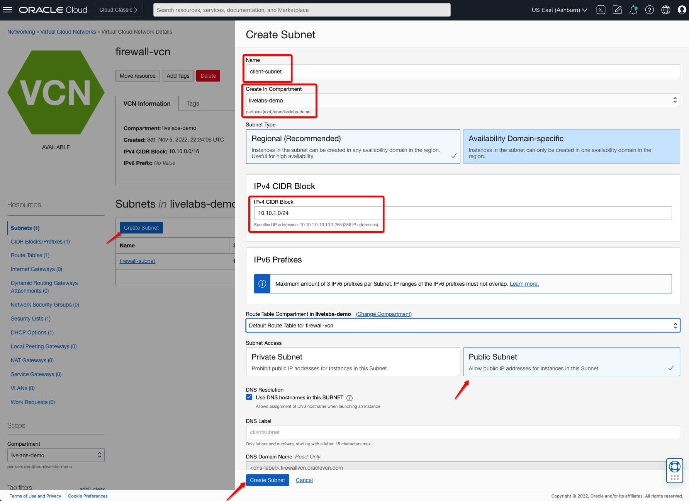

13. Verify all the information and Click **Create Subnet**.

14. This will create a Subnet with following components.

    *client-subnet Subnet*

15. Create a private **server-subnet** subnet which will support Server VMs. Below table represents what you will be creating in **firewall-vcn**: 

      | Name         | Type     | CIDR           | Access  | Route Table         | DHCP Options         | Security List         |
      |--------------|----------|----------------|---------|---------------------|----------------------|-----------------------|
      | server-subnet | Regional | 10.10.2.0/24 | Private | Default Route Table | Default DHCP Options | Default Security List |

16. Click on **Create Subnet** on **firewall-vcn** Virtual Cloud Network Details page and fill out the dialog box: 

      - **Subnet NAME**: Provide a name
      - **COMPARTMENT**: Ensure your compartment is selected
      - **Subnet Type**: Regional Subnet Type is selected
      - **CIDR Block**:  Unique CIDR within the range of your VCN CIDR block.
      - **Route Table**: Default Route Table in your Case.
      - **Subnet Access**: Private in your case.
      - **DHCP Options**: Default DHCP Options in your case.
      - **Security List**: Default Security List in your case.

   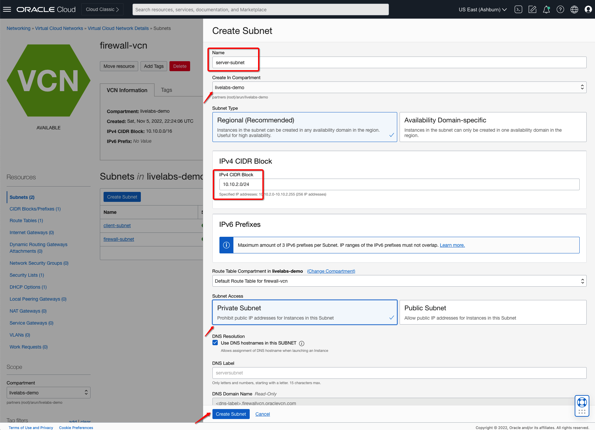

17. Verify all the information and Click **Create Subnet**.

18. This will create a Subnet with following components.

    *server-subnet Subnet*

19. Create a Internet Gateway for **Firewall VCN**. Below table represents what you will be creating on **Internet Gateway**: 

      | Name            |
      |-----------------|
      | internet-gateway |

20. Click on **Create Internet Gateway** on **firewall-vcn**; details page > internet Gateway and fill out the dialog box: 

      - **NAME**: Provide a name
      - **COMPARTMENT**: Ensure your compartment is selected

   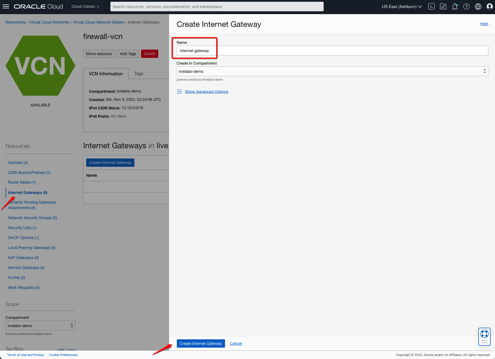

21. Verify all the information and Click **Create Internet Gateway**.

22. This will create an Internet Gateway in your Firewall VCN with following components.

    *internet-gateway Internet Gateway*

23. Create a Service Gateway for **Firewall VCN**. Below table represents what you will be creating on **Service Gateway**: 

      | Name            | Services                                       |
      |-----------------|------------------------------------------------|
      | service-gateway | All Region Services in Oracle Services Network |

24. Click on **Create Service Gateway** on **firewall-vcn** Details page > Service Gateway and fill out the dialog box: 

      - **NAME**: Provide a name
      - **COMPARTMENT**: Ensure your compartment is selected
      - **Services**: Select appropriate services

   

25. Verify all the information and Click **Create Service Gateway**.

27. This will create a Service Gateway in your Firewall VCN with following components.

    *service-gateway Service Gateway*

28. Create a NAT Gateway for **Firewall VCN**. Below table represents what you will be creating on **NAT Gateway**: 

      | Name            |
      |-----------------|
      | nat-gateway     |

29. Click on **Create NAT Gateway** on **firewall-vcn** Details page > NAT Gateway and fill out the dialog box: 

      - **NAME**: Provide a name
      - **COMPARTMENT**: Ensure your compartment is selected
      - **Public IP Address**: Select Ephemeral or your Reserved Public IP

   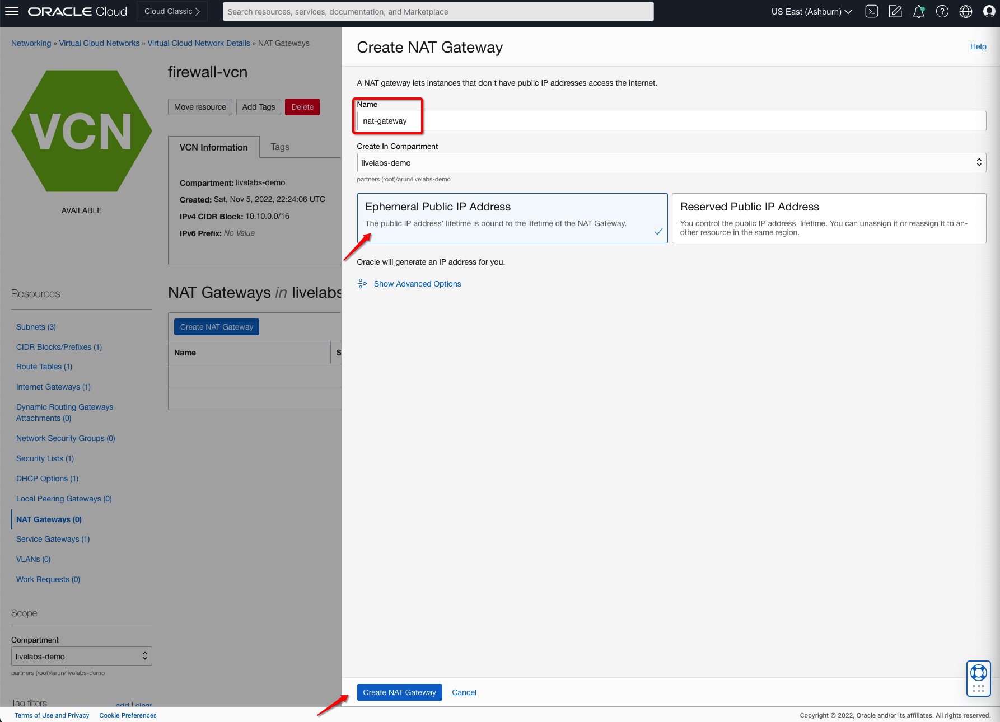

30. Verify all the information and Click **Create NAT Gateway**.

31. This will create a NAT Gateway in your Firewall VCN with following components.

    *nat-gateway NAT Gateway*

## **Task 2: Configure Spoke VCN**

1. From the OCI Services menu, click **Virtual Cloud Networks** under **Networking**. Select your region on right part of the screen:

   

2. Below table represents what you will be creating. Click on **Create VCN** icon to create new **Virtual Cloud Network**:

      | VCN Name                              | VCN CIDR       | Comment                                                    |
      |---------------------------------------|----------------|------------------------------------------------------------|
      | spoke-vcn                             | 10.20.0.0/16    | Spoke Virtual Cloud Networks; Spoke VMs will be present here   |

3. Fill out the dialog box:

      - **VCN NAME**: Provide a name
      - **COMPARTMENT**: Ensure your compartment is selected
      - **VCN CIDR BLOCK**: Provide a CIDR block (10.20.0.0/16)

   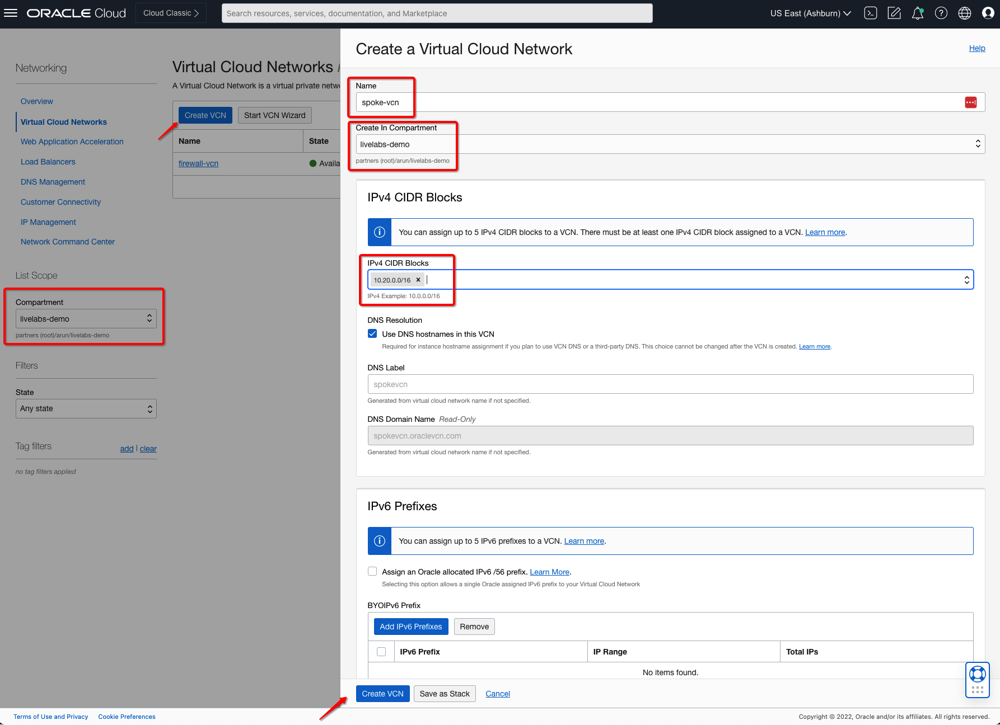

4. Verify all the information and Click **Create VCN**.

5. This will create a VCN with following components.

    *Spoke-VCN, Default Route Tables, Default Security List*

6. Click **View Virtual Cloud Network** you just created to display your VCN details.

7. Create a public **serverA-subnet** subnet which will host Spoke ServerA VMs. Below table represents what you will be creating in **spoke-vcn**: 

      | Name                | Type     | CIDR          | Access  | Route Table         | DHCP Options         | Security List         |
      |---------------------|----------|---------------|---------|---------------------|----------------------|-----------------------|
      | serverA-subnet | Regional | 10.20.1.0/24   | Public | Default Route Table | Default DHCP Options | Default Security List |

8. Click on **Create Subnet** on **spoke-vcn** Virtual Cloud Network Details page and fill out the dialog box: 

      - **Subnet NAME**: Provide a name
      - **COMPARTMENT**: Ensure your compartment is selected
      - **Subnet Type**: Regional Subnet Type is selected
      - **CIDR Block**:  Unique CIDR within the range of your VCN CIDR block.
      - **Route Table**: Default Route Table in your Case.
      - **Subnet Access**: Private in your case.
      - **DHCP Options**: Default DHCP Options in your case.
      - **Security List**: Default Security List in your case.

   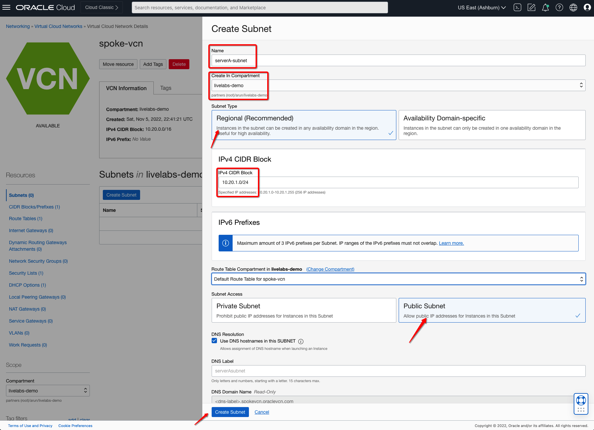

9. Verify all the information and Click **Create Subnet**.

10. This will create a Subnet with following components.

    *serverA-subnet Subnet*

11. Create a private **serverB-subnet** subnet which will host Spoke VMs/Applications. Below table represents what you will be creating in **spoke-vcn**: 

      | Name                | Type     | CIDR          | Access  | Route Table         | DHCP Options         | Security List         |
      |---------------------|----------|---------------|---------|---------------------|----------------------|-----------------------|
      | serverB-subnet | Regional | 10.20.2.0/24   | Private | Default Route Table | Default DHCP Options | Default Security List |

12. Click on **Create Subnet** on **spoke-vcn** Virtual Cloud Network Details page and fill out the dialog box: 

      - **Subnet NAME**: Provide a name
      - **COMPARTMENT**: Ensure your compartment is selected
      - **Subnet Type**: Regional Subnet Type is selected
      - **CIDR Block**:  Unique CIDR within the range of your VCN CIDR block.
      - **Route Table**: Default Route Table in your Case.
      - **Subnet Access**: Private in your case.
      - **DHCP Options**: Default DHCP Options in your case.
      - **Security List**: Default Security List in your case.

   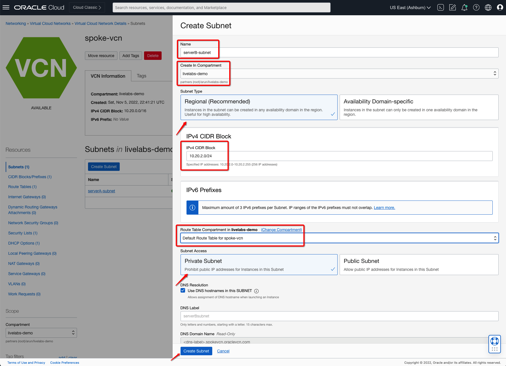

13. Verify all the information and Click **Create Subnet**.

14. This will create a Subnet with following components.

    *serverB-subnet Subnet*

15. Create a Internet Gateway for **Spoke VCN**. Below table represents what you will be creating on **Internet Gateway**: 

      | Name            |
      |-----------------|
      | internet-gateway |

16. Click on **Create Internet Gateway** on **spoke-vcn**; details page > internet Gateway and fill out the dialog box: 

      - **NAME**: Provide a name
      - **COMPARTMENT**: Ensure your compartment is selected

   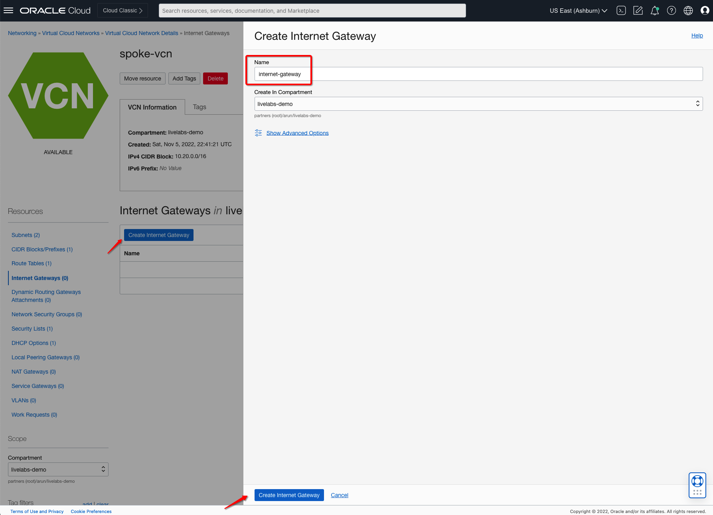

17. Verify all the information and Click **Create Internet Gateway**.

18. This will create a Internet Gateway in your Firewall VCN with following components.

    *internet-gateway Internet Gateway*

## **Task 3: Configure Dynamic Routing Gateway**

1. From the OCI Services menu, click **Dynamic Routing Gateways** under **Networking**. Select your region on right part of the screen:

   

2. Below table represents what you will be creating. Click on **Create Dynamic Routing Gateway** icon to create new **Dynamic Routing Gateway**:

      | Name         |
      |--------------|
      | firewall-drg |

3. Fill out the dialog box:

      - **DRG NAME**: Provide a name
      - **COMPARTMENT**: Ensure your compartment is selected

   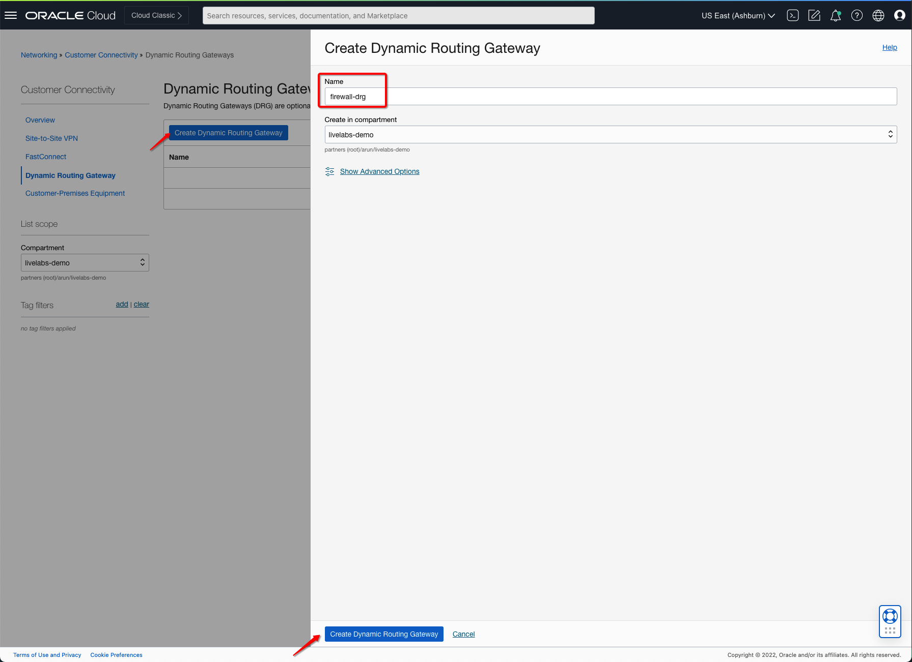

4. Verify all the information and Click **Create Dynamic Routing Gateway**.

5. This will create a VCN with following components.

    *DRG, Default Route Tables, Default Import and Export Route Distribution*

6. Click **DRG** you just created to display your DRG details.

7. Create a Virtual Cloud Network Attachment for **Firewall VCN**. Below table represents what you will be creating on **DRG VCN Attachments**: 

      | Name         | Virtual Cloud Network | DRG Route Table                                   |
      |--------------|-----------------------|---------------------------------------------------|
      | Firewall_VCN | firewall-vcn          | Autogenerated Drg Route Table for VCN Attachments |

8. Click on **Create Virtual Cloud Network Attachment** on **firewall-drg** details page and fill out the dialog box: 

      - **Attachment NAME**: Provide a name
      - **COMPARTMENT**: Ensure your compartment is selected
      - **DRG Route Table**:  Select default value as you will be updating route table in this lab.

   

9. Verify all the information and Click **Create Virtual Cloud Network Attachment**.

10. This will create a Virtual Cloud Network Attachment to your Dynamic Routing Gateway with following components.

    *Firewall_VCN VCN Attachment*

11. Create a Virtual Cloud Network Attachment for **Spoke VCN**. Below table represents what you will be creating on **DRG VCN Attachments**: 

      | Name         | Virtual Cloud Network | DRG Route Table                                   |
      |--------------|-----------------------|---------------------------------------------------|
      | Spoke_VCN      | spoke-vcn               | Autogenerated Drg Route Table for VCN Attachments |

12. Click on **Create Virtual Cloud Network Attachment** on **firewall-drg** Details page and fill out the dialog box: 

      - **Attachment NAME**: Provide a name
      - **COMPARTMENT**: Ensure your compartment is selected
      - **DRG Route Table**:  Select default value as you will be updating route table in this lab.

   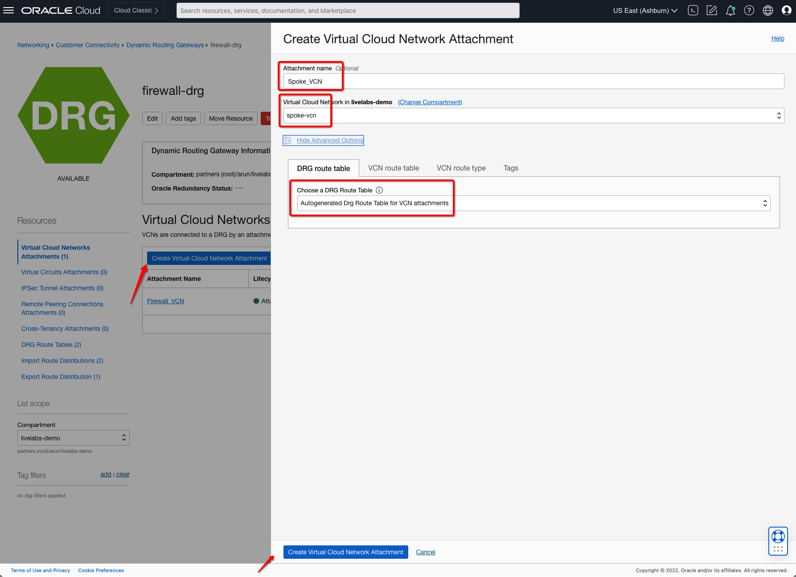

13. Verify all the information and Click **Create Virtual Cloud Network Attachment**.

14. This will create a Virtual Cloud Network Attachment to your Dynamic Routing Gateway with following components.

    *Spoke_VCN VCN Attachment*

15. Create a **To-Firewall** Route Table for **Spoke VCNs** traffic which should go to **Firewall VCN**. Below table represents what you will be creating on **DRG Route Table**: 

      | Name        | Destination CIDR | Next Hop Attachment Type | Next Hop Attachment |
      |-------------|------------------|--------------------------|---------------------|
      | To-Firewall | 0.0.0.0/0        | Virtual Cloud Network    | Firewall_VCN        |

16. Click on **Create DRG Route Table** on **firewall-drg** Details page and fill out the dialog box: 

      - **Route Table NAME**: Provide a name
      - **COMPARTMENT**: Ensure your compartment is selected
      - **Destination CIDR**:  Enter 0.0.0.0/0 so all traffic from Spoke VCN goes to Firewall VCN for inspection. 
      - **Next Hop Attachment Type**:  Select Virtual Cloud Network type. 
      - **Next Hop Attachment**:  Select Firewall_VCN attachment created earlier from drop-down

   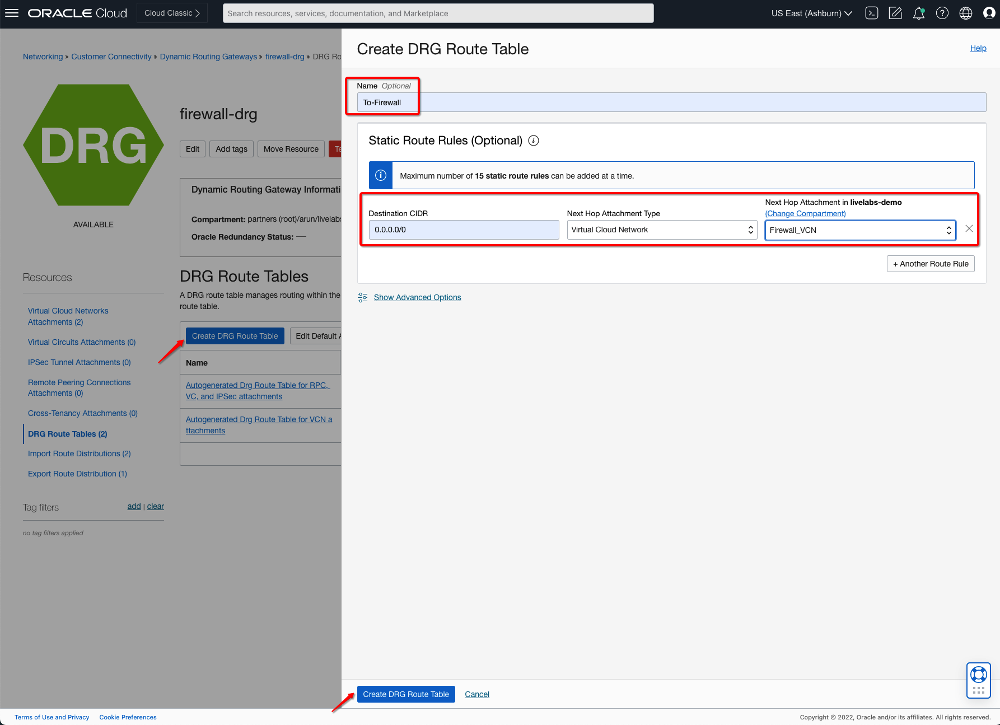

17. Verify all the information and Click **Create DRG Route Table**.

18. This will create a DRG Route Table to your Dynamic Routing Gateway with following components.

    *To-Firewall DRG Route Table*

19. Create a **From-Firewall** Route Table for **Firewall VCN** traffic which should go to respective **DB and Web VCNs**. Below table represents what you will be creating on **DRG Route Table**: 

      | Name          | 
      |---------------|
      | From-Firewall |

20. Click on **Create DRG Route Table** on **firewall-drg** Details page and fill out the dialog box: 

      - **Route Table NAME**: Provide a name
      - **COMPARTMENT**: Ensure your compartment is selected

   

21. Verify all the information and Click **Create DRG Route Table**.

22. This will create a DRG Route Table to your Dynamic Routing Gateway with following components.

    *From-Firewall DRG Route Table*

23. Attach **From-Firewall** route table to **Firewall VCN** attachment on Dynamic Routing Gateway. 

24. Click on **Firewall_VCN** and click **Edit** button to update route table. Click on **Show Advanced Options** next to Edit Attachment Dialog box and select **From-Firewall** route table from **DRG Route Table** and **Save Changes**

   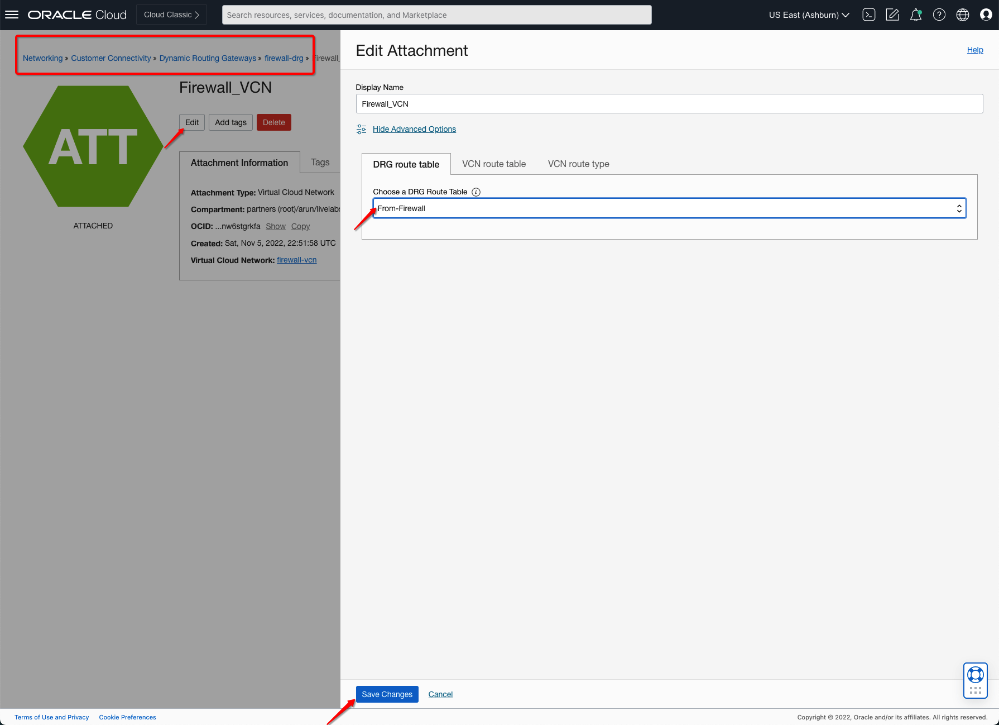

25. Attach **To-Firewall** route table to **Spoke VCN** attachment on Dynamic Routing Gateway. 

26. Click on **Spoke_VCN** and click **Edit** button to update route table. Click on **Show Advanced Options** next to Edit Attachment Dialog box and select **To-Firewall** route table from **DRG Route Table** and **Save Changes**

   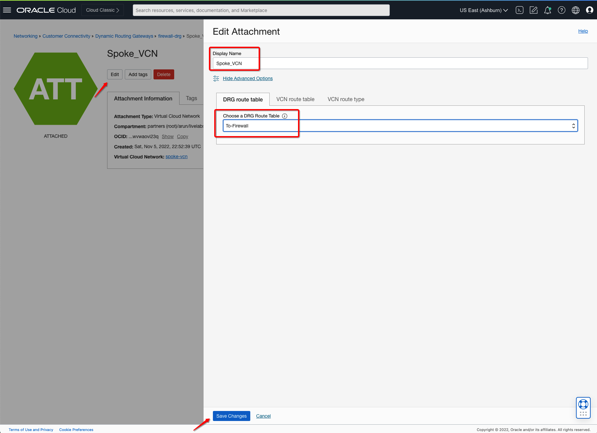

27. Create **Import Route Distribution** for each DB and Web VCNs on Dynamic Routing Gateway. Below table represents what you will be creating on **Import Route Distribution Entries**: 

   | Priority | Match Type | Attachment Type Filter | DRG Attachment | Action |
   |----------|------------|------------------------|----------------|--------|
   | 1        | Attachment | Virtual Cloud Network  | Spoke_VCN        | ACCEPT |

28. Click on **Create Import Route Distribution** on **firewall-drg** Details/Import Route Distribution page and fill out the dialog box: 

      - **Route Distribution NAME**: Provide a name
      - **COMPARTMENT**: Ensure your compartment is selected
      - **Add Statement**: Add below Statement here for Spoke VCN
         - **First Statement**
            - **Priority**: Enter priority value; in your case 1 
            - **Match Type**: Select Attachment as type
            - **Attachment Type Filter**: Select Virtual Cloud Network from dropdown
            - **VCN Attachment**: Select Spoke_VCN from dropdown
            - **Action**: Default Value as ACCEPT       

   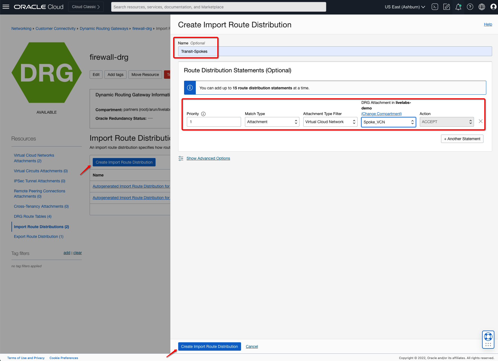

29. Verify all the information and Click **Create Import Route Distribution**.

30. This will create a Import Route Distribution to your Dynamic Routing Gateway with following components.

    *Transit-Spokes Import Route Distribution*

31. Attach **Transit-Spokes** import route redistribution to **From-Firewall** drg route table and click **Edit** button to update route table. 

32. Select **Enable Route Distribution** and from drop down in dialog box select **Transit Spokes** import route distribution. Complete your change by clicking **Save Changes**

   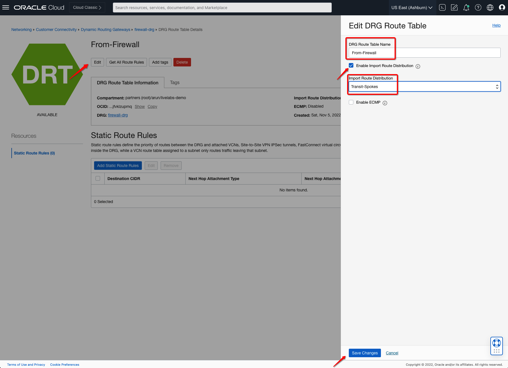

33. This will update import route distribution to **From-Firewall** route table attached to **Firewall VCN**

## **Task 4: Configure Route Tables in each VCNs**

1. From the OCI Services menu, click **Virtual Cloud Networks** under **Networking**. Select your region on right part of the screen:

   

2. Select **spoke-vcn** which you created earlier. You will be creating **ServerA-Subnet, ServerB-Subnet** route tables within this VCN. Make sure you choose right Compartment from drop down on your left screen **COMPARTMENT** section. 

3. Click on **Create Route Table** on **Route Tables** resources under **spoke-vcn** section. You will be creating a placeholder for **ServerA-subnet** route table. Fill out the dialog box: 

      - **NAME**: Provide a name; In your case **ServerASubnetRouteTable**
      - **COMPARTMENT**: Ensure your compartment is selected

   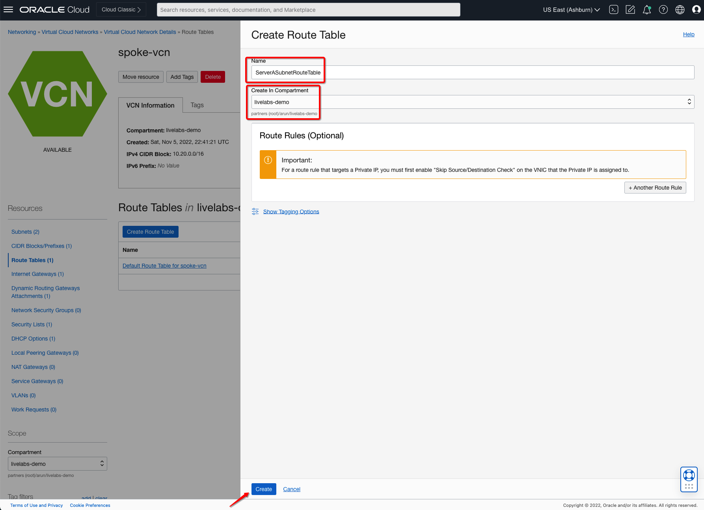

4. Verify all the information and Click **Create**.

5. This will create ServerA Subnet Route Table for spoke-vcn with following components.

    *Created ServerA Subnet Route table for spoke-vcn*

6. Click on **Create Route Table** on **Route Tables** resources under **spoke-vcn** section. You will be creating a placeholder for **ServerB-subnet** route table. Fill out the dialog box: 

      - **NAME**: Provide a name; In your case **ServerBSubnetRouteTable**
      - **COMPARTMENT**: Ensure your compartment is selected

   

7. Verify all the information and Click **Create**.

8. This will create ServerB Subnet Route Table for spoke-vcn with following components.

    *Created ServerB Subnet Route table for spoke-vcn*

9. Navigate to **ServerASubnetRouteTable for spoke-vcn** on your Virtual Cloud Networks Details >> Route Tables page. You will be adding below table entries:

   | Target Type             | Destination CIDR Block | Description                      | Comment                                                                                             |
   |-------------------------|------------------------|----------------------------------|-----------------------------------------------------------------------------------------------------|
   | Internet Gateway | 0.0.0.0/0              | InternetTrafficOnServerA Subnet | You will connecting to Spoke ServerA VM over Public IP |
   | Dynamic Routing Gateway | 10.10.0.0/16              | SendTrafficToFirewallsThroughDRG | For Test Purpose you are going to connect to Firewall VCN VMs via DRG |
   | Dynamic Routing Gateway | 10.20.2.0/24              | SendTrafficToFirewallsThroughDRG | For Test Purpose you are going to connect to ServerB Subnet VM via DRG and inspect traffic through Firewall |

10. Click on **Add Route Rules** on **ServerASubnetRouteTable Route Table for spoke-vcn** route table; Virtual Cloud Networks Details >> Route Table page and fill out the dialog box as per *Step 9* table entries: 

      - **Target Type**: Select Dynamic Routing Gateway; earlier created dynamic routing gateway **firewall-drg** will reflect automatically due to VCN attachment. 
      - **Destination CIDR Block**:  Enter Destination CIDR block which you want to inspect; 10.10.0.0/16 in our case.
      - **Description**:  Enter a user-Friendly Description 

   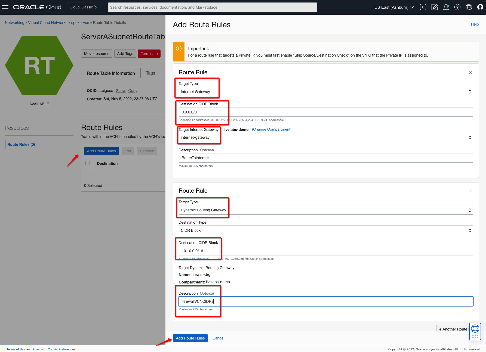

11. Verify all the information and Click **Add Route Rules**.

12. This will update ServerASubnetRouteTable for spoke-vcn with following components.

    *Updated ServerASubnet Route Table for spoke-vcn with DRG, IGW entries*

13. Navigate to **ServerBSubnetRouteTable for spoke-vcn** on your Virtual Cloud Networks Details >> Route Tables page. You will be adding below table entries:

   | Target Type             | Destination CIDR Block | Description                      | Comment                                                                                             |
   |-------------------------|------------------------|----------------------------------|-----------------------------------------------------------------------------------------------------|
   | Dynamic Routing Gateway | 10.10.0.0/16              | SendTrafficToFirewallsThroughDRG | For Test Purpose you are going to connect to Firewall VCN VMs via DRG |
   | Dynamic Routing Gateway | 10.20.1.0/24              | SendTrafficToFirewallsThroughDRG | For Test Purpose you are going to connect to ServerA Subnet VM via DRG and inspect traffic through Firewall |

14. Click on **Add Route Rules** on **ServerBSubnetRouteTable Route Table for spoke-vcn** route table; Virtual Cloud Networks Details >> Route Table page and fill out the dialog box as per *Step 13* table entries:  

      - **Target Type**: Select Dynamic Routing Gateway; earlier created dynamic routing gateway **firewall-drg** will reflect automatically due to VCN attachment. 
      - **Destination CIDR Block**:  Enter Destination CIDR block which you want to inspect; 0.0.0.0/0 in our case.
      - **Description**:  Enter a user-Friendly Description 

   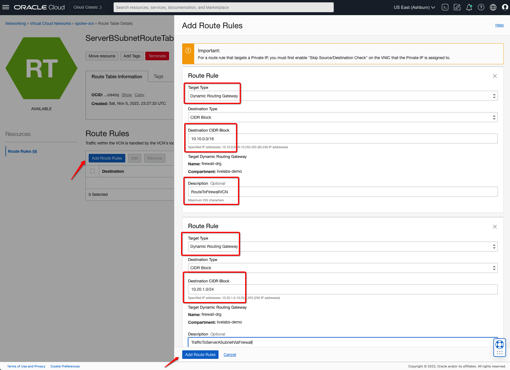

15. Verify all the information and Click **Add Route Rules**.

16. This will ServerBSubnet Route Table for spoke-vcn with following components.

    *Updated ServerBSubnet Route Table for spoke-vcn with DRG entries*

17. Go back to **spoke-vcn** and select Security Lists under Resources section. Navigate to **Default Security Lists for spoke-vcn**. You will be updating ingress rules in your security list based on below table: 

   | Source Type | Source CIDR | IP Protocol           | Description |
   |-------------|-------------|-----------------------|-------------|
   | CIDR        | 0.0.0.0/0   | All Protocols         | AllowAll    |

18. Click on **Add Ingress Rules** on **Default Security Lists for spoke-vcn** and fill out the dialog box: 

      - **Source Type**: Select **CIDR**.
      - **Source CIDR Block**:  Enter Source CIDR block which you want to allow inbound connection; 0.0.0.0/0 in our case.
      - **IP Protocol**:  Select IP Protocol from dropdown; All Protocols in our case.
      - **Description**:  Enter a user-Friendly Description 

   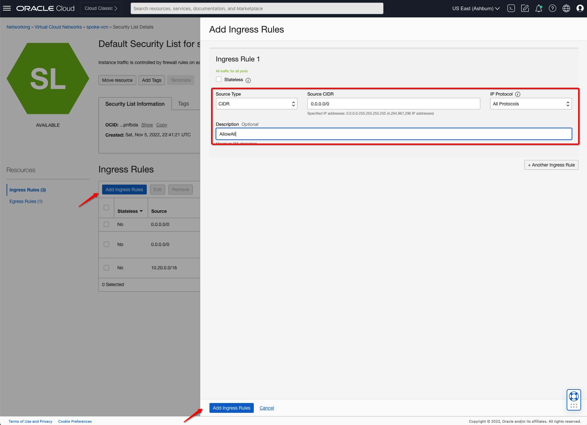

19. Verify all the information and Click **Add Ingress Rules**.

20. This will update Default Route Table for spoke-vcn with following components.

    *Updated Default Security Lists for spoke-vcn with Allow All IP Protocols entry*

21. Go back to Virtual Cloud Networks home page and select **firewall-vcn** which you created earlier. You will be creating few route tables associated to each subnet within this VCN. Make sure you choose right Compartment from drop down on your left screen **COMPARTMENT** section. 

22. Click on **Create Route Table** on **Route Tables** resources under **firewall-vcn** section. You will be creating a placeholder for **client-subnet** route table. Fill out the dialog box: 

      - **NAME**: Provide a name; In your case **ClientSubnetRouteTable**
      - **COMPARTMENT**: Ensure your compartment is selected

   

27. Verify all the information and Click **Create**.

28. This will create Untrust Route Table for firewall-vcn with following components.

    *Created Client Subnet Route table for firewall-vcn*

29. Click on **Create Route Table** on **Route Tables** resources under **firewall-vcn** section. You will be creating a placeholder for **server-subnet** route table. Fill out the dialog box: 

      - **NAME**: Provide a name; In your case **ServerSubnetRouteTable**
      - **COMPARTMENT**: Ensure your compartment is selected

   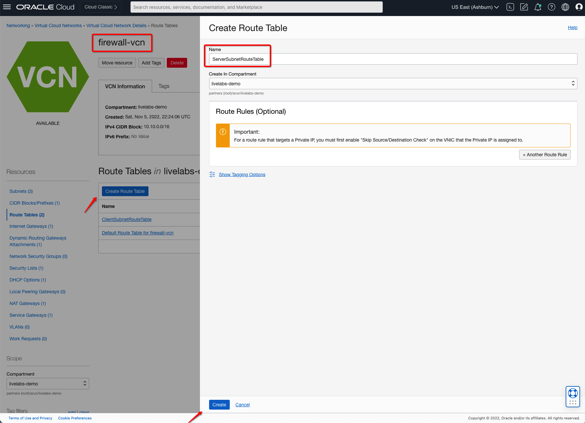

30. Verify all the information and Click **Create**.

31. This will create Server Subnet Route Table for firewall-vcn with following components.

    *Created Server Subnet Route table for firewall-vcn*

32. Click on **Create Route Table** on **Route Tables** resources under **firewall-vcn** section. You will be creating a placeholder for **firewall-subnet** route table. Fill out the dialog box: 

      - **NAME**: Provide a name; In your case **FirewallSubnetRouteTable**
      - **COMPARTMENT**: Ensure your compartment is selected

   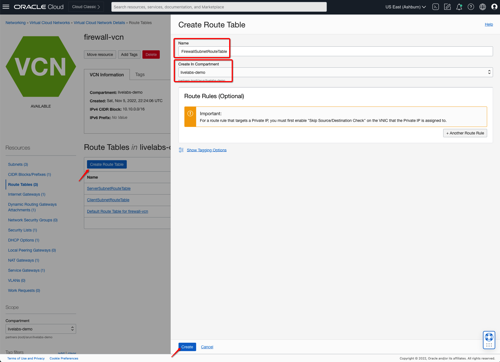

33. Verify all the information and Click **Create**.

34. This will create Firewall Subnet Route Table for firewall-vcn with following components.

    *Created Firewall Subnet Route table for firewall-vcn*
   
35. Click on **Create Route Table** on **Route Tables** resources under **firewall-vcn** section. You will be creating a placeholder for firewall-vcn attachment ingress route table. Fill out the dialog box: 

      - **NAME**: Provide a name; In your case **VCN-INGRESS-RouteTable**
      - **COMPARTMENT**: Ensure your compartment is selected

   

36. Verify all the information and Click **Create**.

37. This will create VCN-INGRESS Route Table for firewall-vcn with following components.

    *Created VCN-INGRESS-RouteTable for firewall-vcn*
   
38. Go back to **firewall-vcn** and select Security Lists under Resources section. Navigate to **Default Security Lists for firewall-vcn**. You will be updating ingress rules in your security list based on below table: 

   | Source Type | Source CIDR | IP Protocol           | Description |
   |-------------|-------------|-----------------------|-------------|
   | CIDR        | 0.0.0.0/0   | All Protocols         | AllowAll    |

39. Click on **Add Ingress Rules** on **Default Security Lists for firewall-vcn** and fill out the dialog box: 

      - **Source Type**: Select **CIDR**.
      - **Source CIDR Block**:  Enter Source CIDR block which you want to allow inbound connection; 0.0.0.0/0 in our case.
      - **IP Protocol**:  Select IP Protocol from dropdown; All Protocols in our case.
      - **Description**:  Enter a user-Friendly Description

   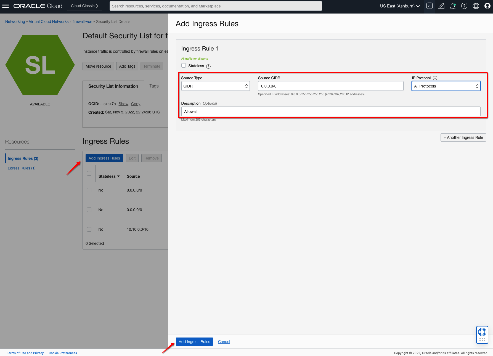

40. Verify all the information and Click **Add Ingress Rules**.

41. This will update Default Route Table for firewall-vcn with following components.

    *Updated Default Security Lists for firewall-vcn with Allow All IP Protocols entry*

42. Navigate to **firewall-drg** dynamic routing gateway's **Firewall_VCN** attachment to update VCN Route Table. Click on **Edit** icon to update **VCN Route Table** and select **VCN-INGRESS-RouteTable** route table from drop-down.

   

43. Verify all the information and Click **Save Changes**.

44. This will create add VCN-INGRESS Route Table for **Firewall_VCN** with following components.

    *Added VCN INGRESS Route table for Firewall_VCN attachment*

## **Task 5: Launch Compute instances in Firewall VCN**

1. Launch **Cloud Shell** by clicking the icon next to region name on top right of OCI console. ('<=' icon)

2. Once cloud Shell is launched. Enter command **ssh-keygen**, press enter for all prompts. This will create a ssh key pair. Enter command.

      ```
      <copy>
      bash
      cd .ssh
      cat id_rsa.pub
      </copy>
      ```
   
   Copy the key displayed. This will be used when creating the compute instance.

3. From OCI services menu, Click **Instances** under **Compute**.
 
4. On the left sidebar, select the **Compartment** in which you placed your VCN under **List Scope**. The, Click **Create Instance**. You will be creating **2** instances as per below table: 

   | Name     | Placement  | Image                 | Shape   | Network | Subnet              | Add SSH-Keys                | Assign Public IP              |
   |----------|------------|-----------------------|---------|---------|---------------------|-----------------------------|---|
   | client-vm | AD1        | Default: Oracle Linux | Default | firewall-vcn | client-subnet | Yours/CloudShell Public Key | Yes | 
   | server-vm | AD2 or AD1 | Default: Oracle Linux | Default | firewall-vcn | server-subnet | Yours/CloudShell Public Key | Not Applicable | 
 
5. Enter a **Name** for your Instance and the **Compartment** in which you placed your **Firewall VCN**. Fill out the dialog box. Leave **Image or Operating System** and **Availability Domain** as the default values.

6. Leave Shape **Shape** as default value.

7. Scroll Down to **Networking** and verify the following.
      - Your Compartment is selected
      - The VCN created is populated: **Firewall VCN**
      - The subnet created is populated: 
        - Select **client-subnet** for Client VM. 
        - Select **server-subnet** for Server VM.      

8. Ensure **PASTE PUBLIC KEYS** is selected under **Add SSH Keys**. Paste the public key copied earlier.
 
   **NOTE:** If 'Service limit' error is displayed choose a different shape from VM.Standard.E4.Flex, VM.Standard2.1, VM.Standard.E2.1, VM.Standard1.1, VM.Standard.B1.1 OR choose a different AD.

   **NOTE:** If you already have your ssh-key available you can skip copying from cloud-shell and paste your own public key and use private key associated to that for accessing instance.

9. Click **Create** and wait for Instance to be in **Running** state. 

10. Repeat step 5 to 9 based on the **table** provided in **step 4** for another instance.

## **Task 6: Launch Compute instances in Spoke VCN**

1. Launch **Cloud Shell** by clicking the icon next to region name on top right of OCI console. ('<=' icon)

2. Once cloud Shell is launched. Enter command **ssh-keygen**, press enter for all prompts. This will create a ssh key pair. Enter command.

      ```
      <copy>
      bash
      cd .ssh
      cat id_rsa.pub
      </copy>
      ```
   
   Copy the key displayed. This will be used when creating the compute instance.

3. From OCI services menu, Click **Instances** under **Compute**.
 
4. On the left sidebar, select the **Compartment** in which you placed your **DB VCN** under **List Scope**. The, Click **Create Instance**. You will be creating **2** instances as per below table: 

   | Name     | Placement | Image                 | Shape   | Network | Subnet              | Add SSH-Keys                | Assign Public IP              |
   |----------|------------|-----------------------|---------|---------|---------------------|-----------------------------|---|
   | ServerA-vm | AD1        | Default: Oracle Linux | Default | spoke-vcn | ServerA-subnet | Yours/CloudShell Public Key | Yes | 
   | ServerB-vm | AD2 or AD1 | Default: Oracle Linux | Default | spoke-vcn | ServerB-subnet | Yours/CloudShell Public Key | Not Applicable | 
 
5. Enter a **Name** for your Instance and the **Compartment** in which you placed your **Spoke VCN**. Fill out the dialog box. Leave **Image or Operating System** and **Availability Domain** as the default values.

6. Leave Shape **Shape** as default value.

7. Scroll Down to **Networking** and verify the following.
      - Your Compartment is selected
      - The VCN created is populated: **Spoke VCN**
      - The subnet created is populated: 
        - Select **ServerA-subnet** for ServerA VM. 
        - Select **ServerB-subnet** for ServerB VM.  

8. Ensure **PASTE PUBLIC KEYS** is selected under **Add SSH Keys**. Paste the public key copied earlier.
 
   **NOTE:** If 'Service limit' error is displayed choose a different shape from VM.Standard.E4.Flex, VM.Standard2.1, VM.Standard.E2.1, VM.Standard1.1, VM.Standard.B1.1 OR choose a different AD.

   **NOTE:** If you already have your ssh-key available you can skip copying from cloud-shell and paste your own public key and use private key associated to that for accessing instance.

9. Click **Create** and wait for Instance to be in **Running** state. 

10. Repeat step 5 to 9 based on the **table** provided in **step 4** for another instance.

11. Verify that required instances in **Firewall VCN** and **Spoke VCN** are in **Running** state. 

   

***Congratulations! You have successfully completed the lab.***

You may now [proceed to the next lab](#next).

## Learn More

1. [OCI Training](https://www.oracle.com/cloud/iaas/training/)
2. [Familiarity with OCI console](https://docs.us-phoenix-1.oraclecloud.com/Content/GSG/Concepts/console.htm)
3. [Overview of Networking](https://docs.us-phoenix-1.oraclecloud.com/Content/Network/Concepts/overview.htm)
4. [Overview of OCI Network Firewall](https://docs.oracle.com/en-us/iaas/Content/network-firewall/overview.htm)
5. [OCI Network Firewall Cloud Security Page](https://www.oracle.com/security/cloud-security/network-firewall/)
6. [OCI Intra VCN Routing Capabilities](https://docs.oracle.com/en-us/iaas/Content/Network/Tasks/managingroutetables.htm)

## Acknowledgements

- **Author** - Arun Poonia, Principal Solutions Architect
- **Adapted by** - Oracle
- **Contributors** - N/A
- **Last Updated By/Date** - Arun Poonia, Oct 2022