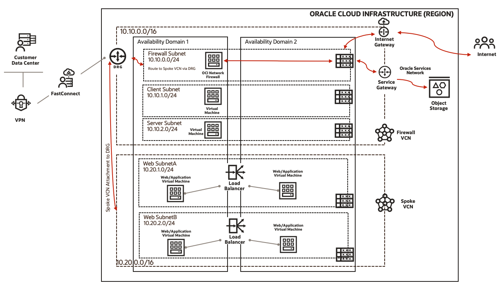

# Introduction to OCI Network Firewall

Oracle Cloud Infrastructure (OCI) offers best-in-class security technology and operational processes to secure its enterprise cloud services. However, security in the cloud is based on a shared responsibility model. Oracle is responsible for the security of the underlying infrastructure, such as data center facilities, hardware, and software to manage cloud operations and services. Customers are responsible for securing their workloads and configuring their services and applications securely to meet their compliance obligations. In this workshop, you will be using the **OCI Network Firewall** solution to secure your workloads.

This workshop will cover step-by-step(manual) and automated approaches which you can follow to deploy required components on Oracle Cloud Infrastructure with OCI Network Firewall solution.

Estimated time: 120 minutes

## Solution

Oracle has partnered with **Palo Alto Networks** to provide Oracle Cloud Infrastructure Network Firewall which is a next-generation managed network firewall service for your OCI VCN, powered by Palo Alto Networks. Oracle Cloud Infrastructure Network Firewall service provides the following **security features**:

- **Stateful network filtering**: Create stateful network filtering rules that allow or deny network traffic based on source IP (IPv4 and IPv6), destination IP (IPv4 and IPv6), port, and protocol.
- **Custom URL and FQDN filtering**: Restrict ingress and egress traffic to a specified list of fully qualified domain names (FQDNs), including wild cards and custom URLs.
- **Intrusion Detection and Prevention (IDPS)**: Monitor your network for malicious activity. Log information, report, or block the activity.
- **SSL inspection**: Decrypt and inspect TLS-encrypted traffic with Encrypted Server Name Indication (ESNI) support for security vulnerabilities. ESNI is a TLSv1.3 extension that encrypts the Server Name Indication (SNI) in the TLS handshake.
- **Logging**: Network Firewall is integrated with Oracle Cloud Infrastructure Logging. Enable logs based on your firewall's policy rules.
- **Metrics**: Network Firewall is integrated with Oracle Cloud Infrastructure Monitoring. Enable alerts based on metrics such as the number of blocked requests using Monitoring service capabilities.
- **Intra-VCN subnet traffic inspection**: Route traffic between two subnets within a VCN through a network firewall.
- **Inter-VCN traffic inspection**: Route traffic between VCNs through a network firewall.

You can deploy **Network Firewall** in two different architectures:
- **Distributed Network Firewall**: Network Firewall is deployed in its dedicated VCN which is recommended that way you can deploy a firewall in each VCN and secure your workloads.
- **Transit Network Firewall**: Network Firewall is deployed in a Firewall VCN and connected to spoke VCNs through a dynamic routing gateway.

This workshop will cover different security key features including security rules, intrusion prevention, intrusion detection, URL filtering, and more where you can deploy the solution and secure your OCI workloads.

Attached below is a sample architecture of the solution based on **Transit Network Firewall** which gives you the familiarity of the **Hub & Spoke** model and traffic routed through the network firewall in **firewall-vcn**:

   

### Objectives

   - Provision the infrastructure using Oracle Resource Manager i.e. Terraform
   - Provision and configure the infrastructure manually 
   - Learn to Deploy OCI Network Firewall 
   - Configure OCI Network Firewall to support different security features. 
   - Validate and inspect the traffic via OCI Network Firewall
   - Destroy the infrastructure using Oracle Resource Manager or Manually.

### Prerequisites

   - Oracle Cloud Infrastructure paid account credentials (User, Password, Tenant, and Compartment)
   - User must have required permissions, and quota to deploy resources.

   > **Please Read**: You must have a valid **Oracle Cloud Infrastructure paid account** which allows you to deploy **OCI Network Firewall** and associated components. 
   > **Note**: The **Getting Started** section includes instructions to create a new free trial account, please convert that account as pay you go so you can deploy resources.

### Let's get Started!

You may now **proceed to the next lab**.

### Learn More

1. [OCI Training](https://www.oracle.com/cloud/iaas/training/)
2. [Familiarity with OCI console](https://docs.us-phoenix-1.oraclecloud.com/Content/GSG/Concepts/console.htm)
3. [Overview of Networking](https://docs.us-phoenix-1.oraclecloud.com/Content/Network/Concepts/overview.htm)
4. [Overview of OCI Network Firewall](https://docs.oracle.com/en-us/iaas/Content/network-firewall/overview.htm)
5. [OCI Network Firewall Cloud Security Page](https://www.oracle.com/security/cloud-security/network-firewall/)
6. [OCI Intra VCN Routing Capabilities](https://docs.oracle.com/en-us/iaas/Content/Network/Tasks/managingroutetables.htm)

## Acknowledgements

- **Author** - Arun Poonia, Principal Solutions Architect
- **Adapted by** - Oracle
- **Contributors** - N/A
- **Last Updated By/Date** - Arun Poonia, Oct 2022