# Configure Network Firewall Policy

## Introduction

In this lab you will be configuring Network Firewall Policy required resources,rules to explore different firewall features sets and supporting configuration for **Lab 4**.

Estimated Lab Time: 30 minutes.

### Objectives

- Configure Network Firewall Policy Rules
- Configure Application, URLs and IP Address Lists
- Configure Decryption rules to support SSL/HTTPS Traffic, SSL Inbound Inspection, Forward Proxy
- Configure Security rules to support Allow, Block, Reject, IPS/IDS traffic, URL Filtering
- Demonstrate updating Network Firewall Policy to Network Firewall
- Demonstrate enabling Network Firewall logs
- Explore Network Firewall Metrics and Work Requests 

### Prerequisites

- Oracle Cloud Infrastructure paid account credentials (User, Password, Tenant, and Compartment)  
- Required Resources and Quota as per use-case topology.

## **Task 1: Clone Network Firewall Policy**

1. From the OCI Services menu, click **Network Firewall Policies** under **Identity & Security**. Select your region on right part of the screen:

   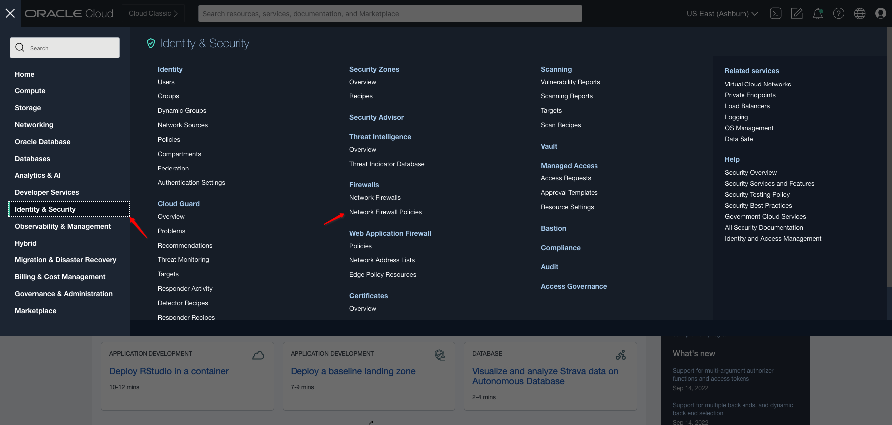

2. Click on **network-firewall-policy-demo** created earlier. 

   

3. Below table represents what you will be creating. Click on **Clone Policy** icon to create copy of **Network Firewall Policy**:

      | New Policy Name                           | Comment                                                    |
      |---------------------------------------|------------------------------------------------------------|
      | network-firewall-policy-demo-latest          |  This Lab will include tasks to update Policy. |

   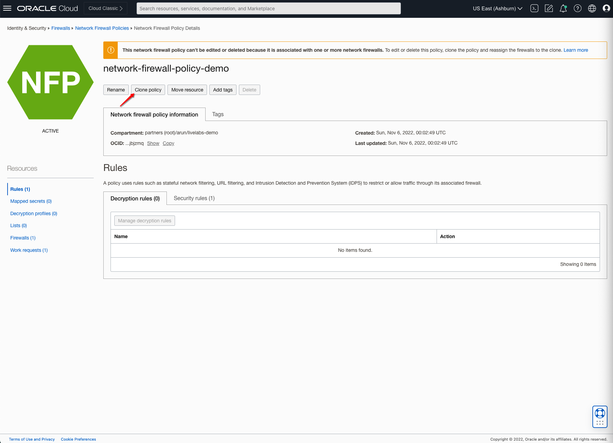

3. Fill out the dialog box and Click **Next**:

      - **POLICY NAME**: Provide a name
      - **COMPARTMENT**: Ensure your compartment is selected

   

4. Continue to **next task** to create **Application Lists**. 

## **Task 2: Create Application Lists**

1. Continue with **Create network firewall policy clone** workflow and click on **Add application list**: 

   

2. Below table represents what you will be creating **Application Lists** to support traffic flows:

      | Application List Name                           | Protocol        | Comment                                                    |
      |---------------------------------------|------------------------------------------------------------|------------------------------------------------------------|
      | ssh-http-https-list          |  Select TCP with Port 22, 80, 443 |   These ports traffic will be validated |
      | icmp-list          |  Select Echo Request and Echo Reply ICMP Protocol |   ICMP Traffic will be validated |

3. You will add list one-by-one by clicking on **Add application list** and Fill out the dialog box:
      - **LIST NAME**: Provide a name
      - **Application List Protocol Setting**: Select **UDP/TCP**
         - **App1**: 
            - **Protocol** Select **TCP** from dropdown.
            - **Port range**: Enter **22-22**
         - **App2**: 
            - **Protocol** Select **TCP** from dropdown.
            - **Port range**: Enter **80-80**
         - **App3**: 
            - **Protocol** Select **TCP** from dropdown.
            - **Port range**: Enter **443-443**

4. Verify all the information and Click **Add Application List**.

   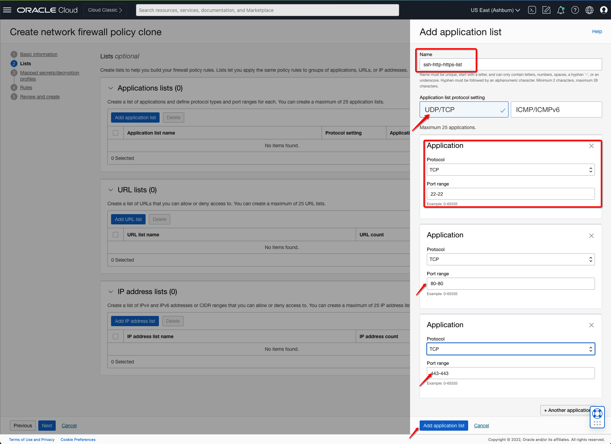

5. Similarly create another application list to support **ICMP** traffics as per *Step 3* table: 

      - **List NAME**: Provide a name
      - **Application List Protocol Setting**: Select **UDP/TCP**
         - **App1**: 
            - **Protocol** Select **ICMP/ICMP6** from dropdown.
            - **ICMP Type**: Select **0 - Echo Reply**
            - **ICMP Code**: Select **0 - Echo Reply**
         - **App2**: 
            - **Protocol** Select **ICMP/ICMP6** from dropdown.
            - **ICMP Type**: Select **8 - Echo**
            - **ICMP Code**: Select **0 - Echo Request**

   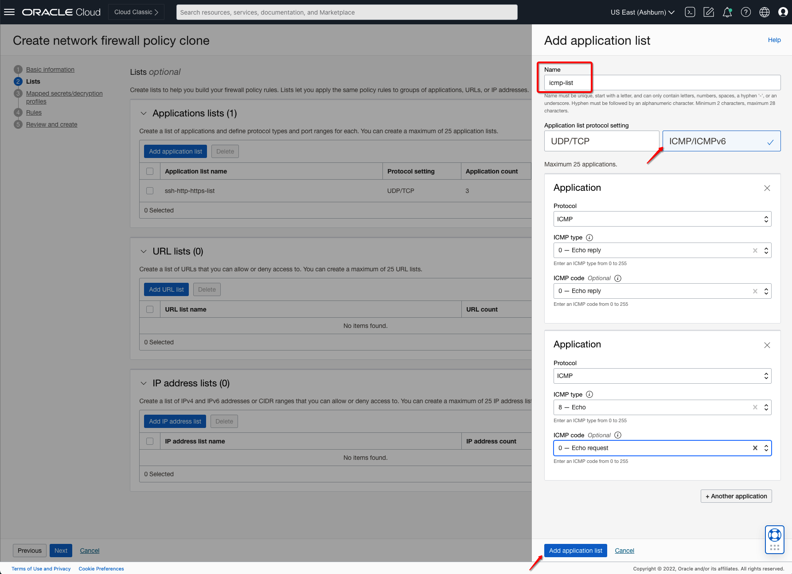

6. Continue to next task to create **URL Lists**. 

## **Task 3: Create URL Lists**

1. Continue with **Create network firewall policy clone** workflow and click on **Add URL list**: 

2. Below table represents what you will be creating **URL lists** to support traffic flow:

      | URL List Name                           | URLs        | Comment                                                    |
      |---------------------------------------|------------------------------------------------------------|------------------------------------------------------------|
      | http-info-url-espn-traffic          |  Enter URLs: info.cern.ch, espn.com |   URL Filtering Validation: Info Cern for HTTP and ESPN for SSL/HTTPS traffic |

3. You will add list one-by-one by clicking on **Add appication list** and Fill out the dialog box:

      - **List NAME**: Provide a name
      - **URLs**: Enter **info.cern.ch** and **espn.com** URLs.

4. Verify all the information and Click **Add URL List**.

   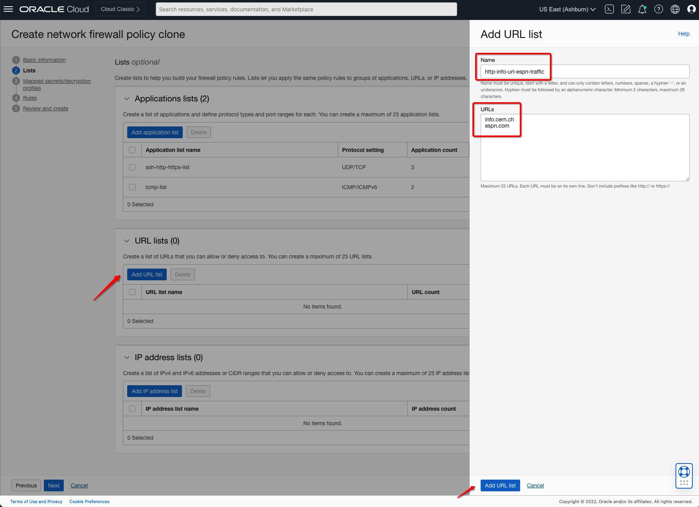

5. Continue to next task to create **IP address Lists**. 

## **Task 4: Create IP Address Lists**

1. Continue with **Create network firewall policy clone** workflow and click on **Add address list**.

2. Below table represents what you will be creating **IP address list** to support traffic flows:

      | IP Address List Name                           | IP Addresses        | Comment                                                    |
      |---------------------------------------|------------------------------------------------------------|------------------------------------------------------------|
      | Client-Subnet-CIDR         |  10.10.1.0/24 |   Client Subnet CIDR in Firewall-VCN   |
      | Server-Subnet-CIDR         |  10.10.2.0/24 |    Server Subnet CIDR in Firewall-VCN  |
      | Spoke-VCN-Subnet-CIDRs     |  10.20.1.0/24, 10.20.2.0/24 |    Spoke VCN Subnets CIDR in Spoke-VCN |
      | ServerA-Subnet-CIDR        |  10.10.1.0/24 |    ServerA Subnet CIDR in Spoke-VCN    |
      | ServerB-Subnet-CIDR        |  10.10.2.0/24 |   ServerB Subnet CIDR in Spoke-VCN     |
      | MyPublic-IP                |  98.X.X.X/32  |   Enter your Public IP Address         |

3. You will add list one-by-one by clicking on **Add appication list** and Fill out the dialog box:

      - **IP Address List NAME**: Provide a name
      - **IP Addresses**: Enter value as per table for Each List. 
        - For Example: **Clinet-Subnet-CIDR** IP address list enter **10.10.1.0/24**.

4. Verify all the information and Click **Add IP Addrerss List**.

   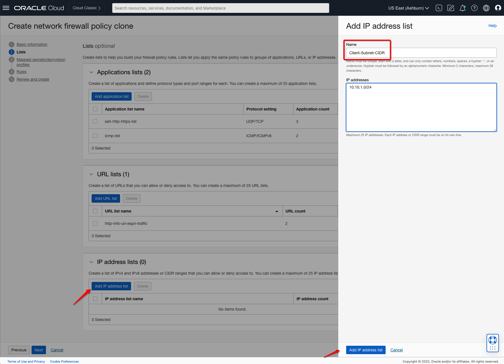

5. Repeat *Step 3-4* and add **Server-Subnet-CIDR** IP address list. 

   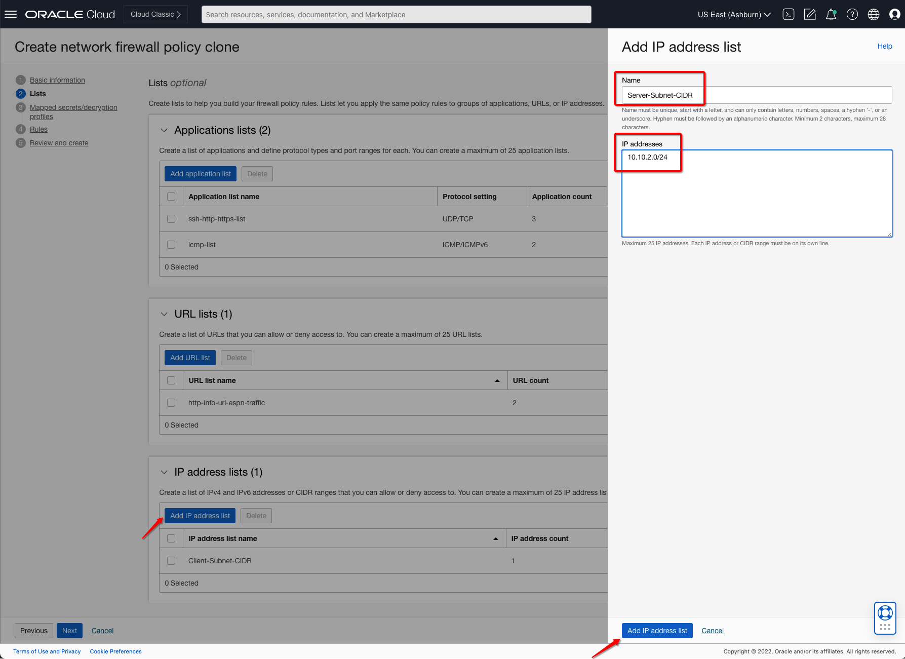

6. Repeat *Step 3-4* and add **Spoke-VCN-Subnet-CIDRs** IP address list. 

   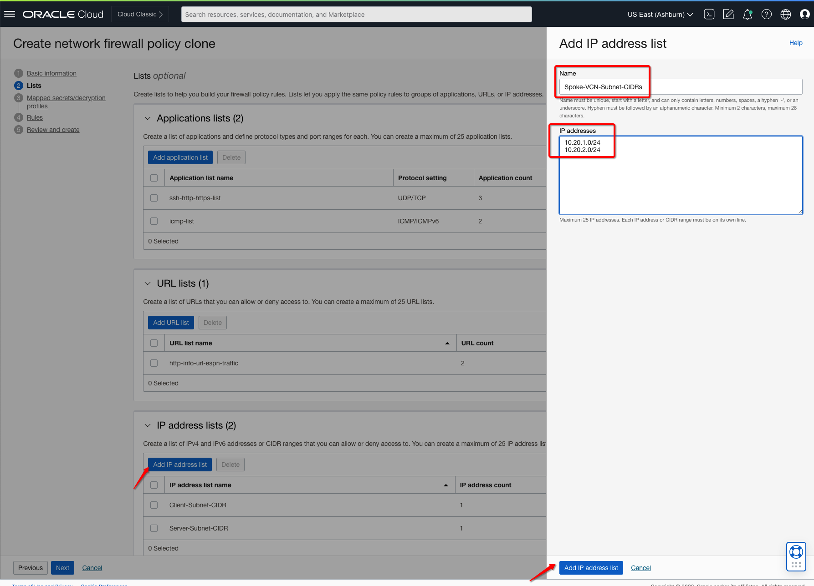

7. Repeat *Step 3-4* and add **ServerA-Subnet-CIDR** IP address list. 

   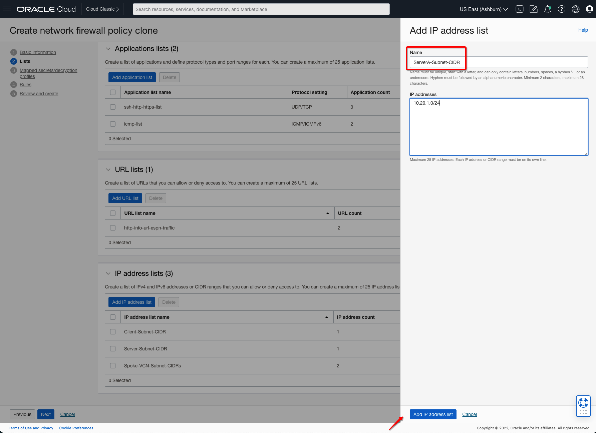

8. Repeat *Step 3-4* and add **ServerB-Subnet-CIDR** IP address list. 

   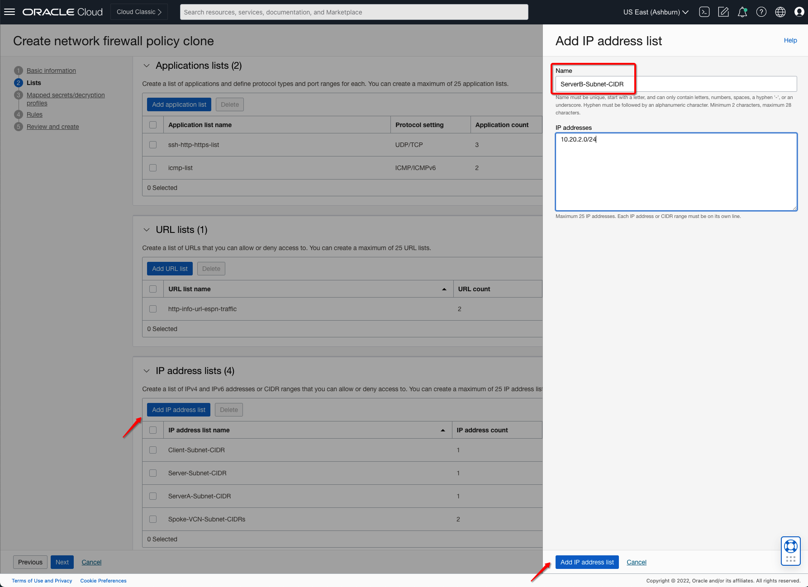

9. Repeat *Step 3-4* and add **MyPublic-IP** IP address list. 

   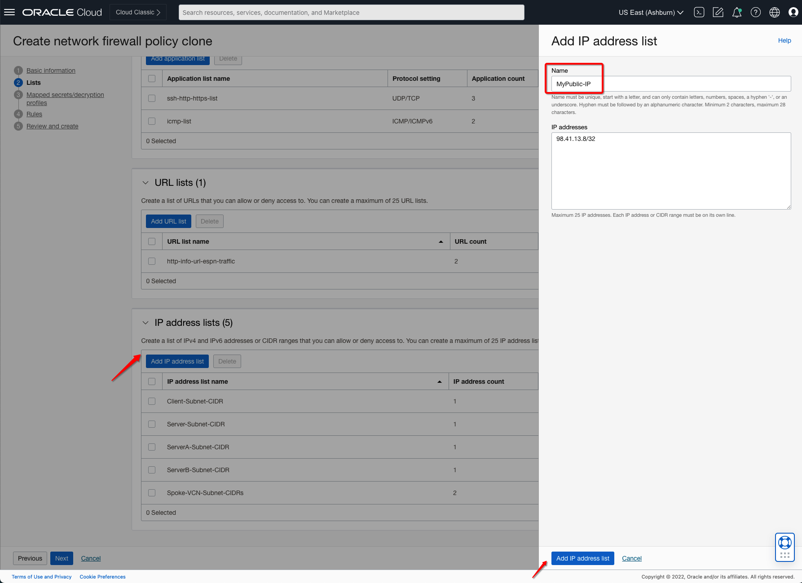

10. Continue to next task to create **Mapped Secrets and Decryption Profiles**. 

## **Task 5: Create Mapped Secrets and Decryption Profiles**

1. Our use-case requires SSL Forward Proxy (HTTPS) traffic validation so you must follow **Task 1-4: Store the Certrificarte** from **Network Firewall** official docs: 

   [Task 1-4: Create Vault, Create Certificate, Store the Certificate](https://docs.oracle.com/en-us/iaas/Content/network-firewall/setting-up-certificate-authentication.htm)

  **PLEASE READ**: You can also refer *Step 2-4* to create a **Certificate**, **Secret** and **Update CA Cert** to create a **mapped secret**. In case if you have completed *Step1* you can continue with *Step6*. 

2. For your reference you can download certificate script on your **Client-VM**. Save this [file](https://github.com/oracle-quickstart/oci-network-firewall/blob/master/scripts/create-certificate.sh) as **certificate.sh** at home directory. 

3. Run bash scrip **./certificate.sh** with **forward** and **network firewall ip** parameters command to generate certificate:

   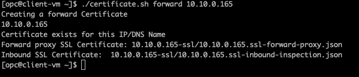

4. You can refer this image which shows how to **Create Secret** with **...ssl-forward-proxy.json** file output. 

   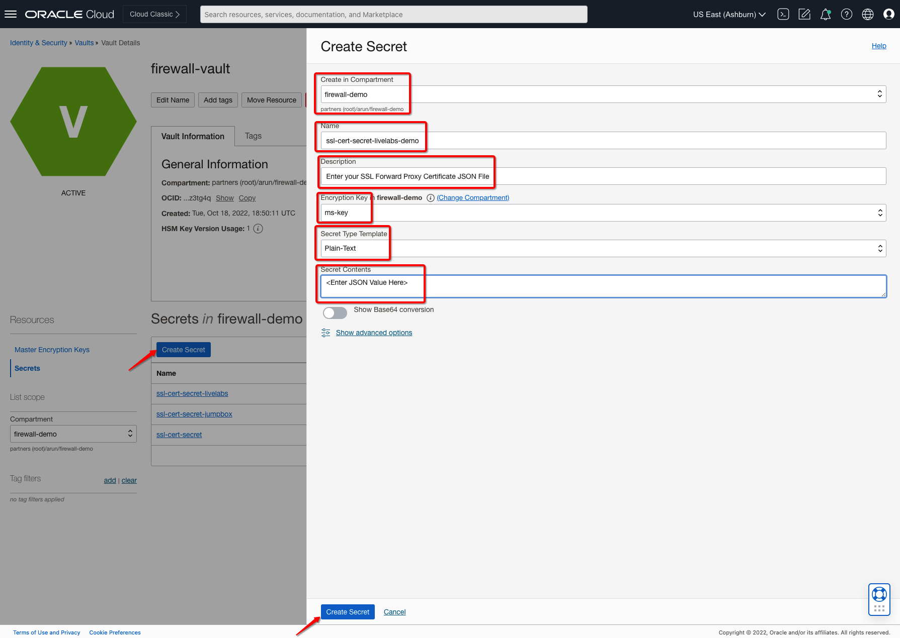

5. You need to update **CA-Cert**, below is a sample image which shows commands that you need to run:

   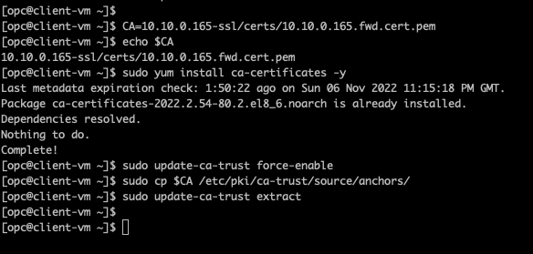

6. After successful completion of importing certificate to **OCI Vault**, continue with **Create network firewall policy clone** workflow and click on **Add Mappped Secret**.

7. Below table represents what you will be creating **Mapped Secret** to support **SSL/HTTPS** traffic flow:

      | Mapped Secret Name                           | Mapped Secret Type        | Comment                                                    |
      |---------------------------------------|------------------------------------------------------------|------------------------------------------------------------|
      | ssl-forward-proxy-mapped-secret          |  SSL Forward Proxy |   Select SSL Forward Proxy Certificate Secret Import in OCI Vault |

8. You will add mapped secret by clicking on **Add mapped secret** and Fill out the dialog box:

      - **Mapped Secret NAME**: Provide a name
      - **Mapped Secret Type**: Select **SSL Forward Proxy**
      - **Vault**: Select **Vault** from your Compartment
      - **Secret**: Select **Secret** from your Vault
      - **Version**: Select Secret **Version** from your Vault

9. Verify all the information and Click **Add Mapped Secret**.

   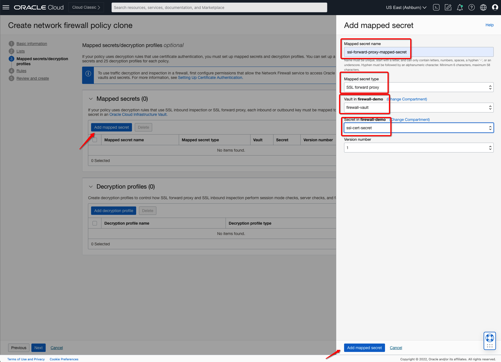

10. You will add decryption profile by clicking on **Add Decryption Profile** and Fill out the dialog box:

      - **Decryption Profile NAME**: Provide a name
      - **Decryption Profile Type**: Select **SSL Forward Proxy**

11. Verify all the information and Click **Add Decryption Profile**.

   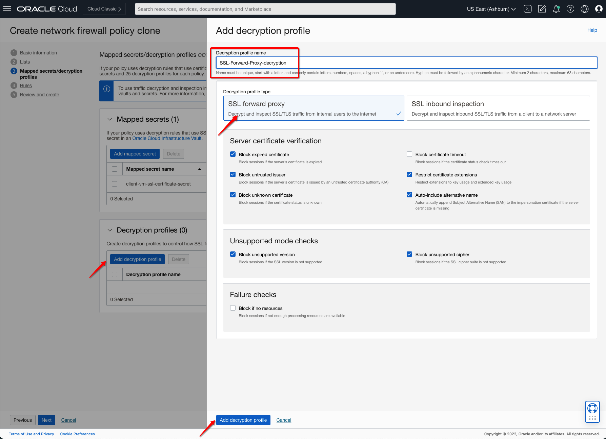

12. Continue to next task to create **Decryption Rule**. 

## **Task 6: Create Decryption Rules**

1. Continue with **Create network firewall policy clone** workflow and click on **Add Decryption Rule**.

2. Below table represents what you will be creating **Decryption Rule** to support traffic flow:

      | Decryption Rule Name                  |
      |---------------------------------------|
      | Client-SSL-Traffic-Decryption-Rule    | 

3. You will create Decpytion Rule by clicking on **Add Decrpytion Rule** and Fill out the dialog box:

      - **Decrpytion Rule NAME**: Provide a name
      - **Match Condition**:
         - **Source IP address**: Select **Client-Subnet-CIDR**
         - **Destination IP address**: Enter **Any IP Address** 
      - **Rule Action**:
         - **Action**: Select Decrypt Traffic with SSL forward proxy
         - **Decryption Profile**: Select earlier created SSL-Forward-Proxy-Decryption profile
         - **Mapped Secret**: Select earlier created Mapped Secret

4. Verify all the information and Click **Save Changes**.

   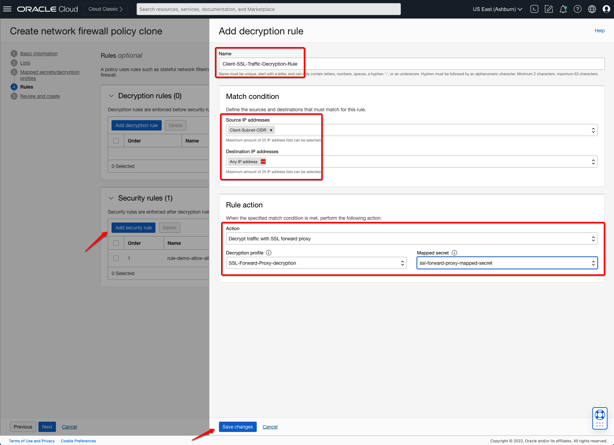

5. Continue to next task to create **Security Rules**. 

## **Task 7: Create Security Rules**

1. Navigate to next page of **Create network firewall policy clone workflow** and click on **Add Secure Rule** to create security Rule: 

2. Below table represents what you will be creating **Security Rules** to support traffic flow:

      | Rule Name                           | Source IP Addresses       | Destination IP Addresses     | Applications | URLs | Rule Action                                              |
      |---------------------------------------|------------------------------------------------------------|------------------------------------------------------------|---------|---------|---------|
      | rule-inbound-my-ip-to-client-vm-allow-all-traffic |  MyPublic-IP |  Client-Subnet-CIDR | Any protocol | Any URL | Allow Traffic |
      | rule-client-server-vm-allow-ssh-traffic |  Client-Subnet-CIDR |  Server-Subnet-CIDR | UDP/TCP with ssh-http-https-list | Any URL | Allow Traffic |	
      | rule-client-server-vm-reject-icmp-traffic |  Client-Subnet-CIDR |  Server-Subnet-CIDR | ICMP/ICMPv6 with icmp-list  | Any URL | Reject traffic |	
      | rule-client-serverB-vm-reject-all-traffic |  Client-Subnet-CIDR | ServerB-Subnet-CIDR | Any protocol  | Any URL| Reject traffic	|
      | rule-client-serverA-vm-allow-all-traffic  |  Client-Subnet-CIDR |  ServerA-Subnet-CIDR | Any protocol | Any URL | Allow Traffic |	
      | rule-client-allow-http-https-url-filtering-traffic   | Client-Subnet-CIDR |  Client-Subnet-CIDR | UDP/TCP with  ssh-http-https-list | http-info-url-espn-traffic | Allow Traffic |	
      | rule-client-to-internet-intrusion-detection-traffic | Client-Subnet-CIDR |  Any IP address | UDP/TCP with  ssh-http-https-list | Any URL | Intrusion Detection |	
      | rule-client-to-outbound-allow-all-traffic               |  Client-Subnet-CIDR|  Any IP address | Any protocol | Any URL | Allow Traffic |	
      | rule-serverA-to-serverB-allow-icmp-traffic               |  ServerA-Subnet-CIDR |  ServerB-Subnet-CIDR | ICMP/ICMPv6 with  icmp-list | Any URL | Allow Traffic |	
      | rule-serverB-to-serverA-allow-ssh-http-https-traffic    | ServerB-Subnet-CIDR | ServerA-Subnet-CIDR| UDP/TCP with  ssh-http-https-list | Any URL | Allow Traffic |	
      | rule-spoke-vcn-to-firewall-vcn-allow-all-traffic   |  Client-Subnet-CIDR, Spoke-VCN-Subnet-CIDRs, Server-Subnet-CIDR |   Client-Subnet-CIDR, Spoke-VCN-Subnet-CIDRs, Server-Subnet-CIDR | Any protocol | Any URL | Allow Traffic |	
      | rule-default-drop-all-traffic               | Any IP address|  Any IP address | Any protocol | Any URL | Drop Traffic |	

3. You will add rules one-by-one by clicking on **Add Security Rule** and Fill out the dialog box:

      - **Rule NAME**: Provide a name
      - **Match Condition**:
         - **Source IP address**: Enter as per Table
         - **Destination IP address**: Enter as per Table
         - **Applications**: Enter as per Table
         - **URLs**: Enter as per Table
      - **Rule Action**: Select as per Table

4. Verify all the information and Click **Save Changes**.

   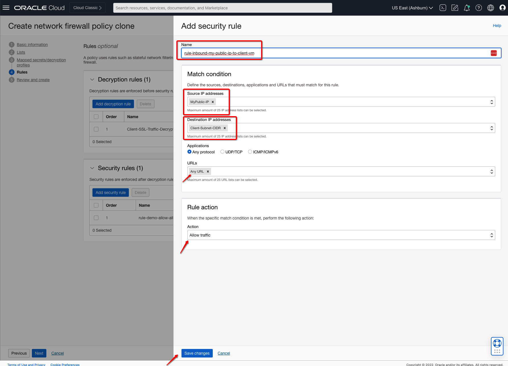

5. [Optional] You can remove earlier created default **allow-rule** from automation if available:

   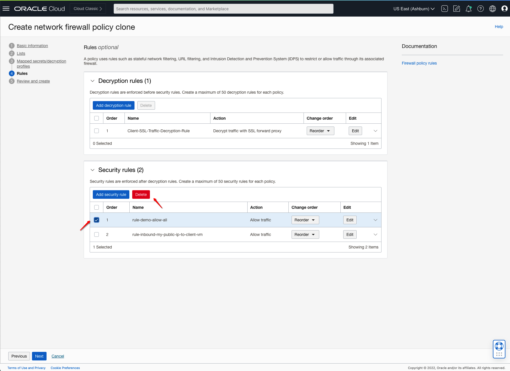

6. Repeat *Step 3-4* as per *Step 2* table entries: 

7. Verify All **security rules** are created successfully, Click on **Next**:

   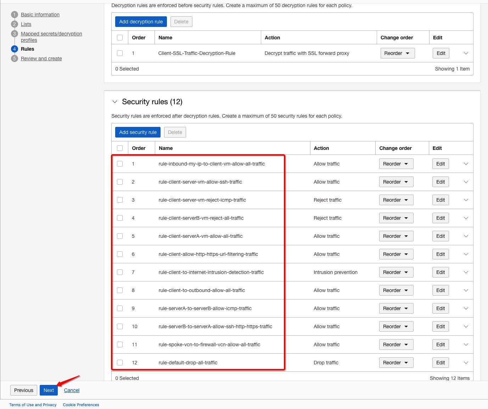

8. Finish the Network Firewall Policy creation by clicking on **Create Network Firewall Policy** button:  

   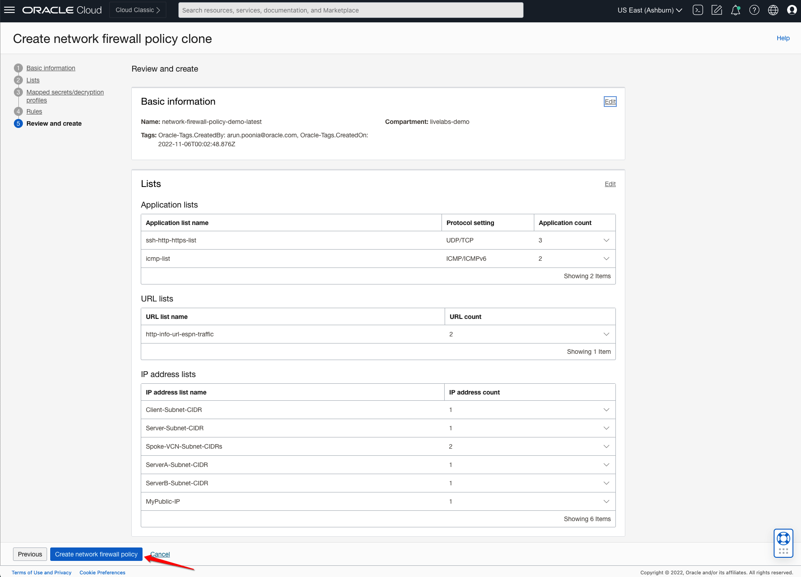

## **Task 8: Update Network Firewall Policy**

1. Navigate to **Network Firewall** page to to update **Network Firewall Policy**: 

2. Below table represents what you will be updating policy associated **Network Firewall** to support traffic flow:

      | Network Firewall Policy    | Comment                                                    |
      |---------------------------------------|---------------------------|
      | network-firewall-policy-demo-latest          |   New Policy to associate with Network Firewall |

3. Click on **Edit** icon and select **network-firewall-demo-latest** policy from dropdown. 

4. Verify all the information and Click **Save Changes**.

   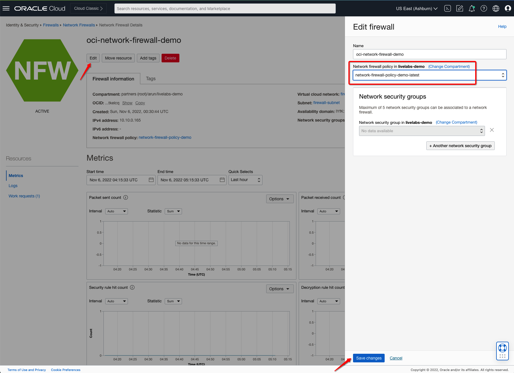

5. Policy Updates takes close to **7-10** mins at this moment and you can track your work request within **Network Firewall** resources page. 

## **Task 9: Enable Network Firewall Logs**

1. Navigate to **Network Firewall > Resources > Logs** page to to enable **Traffic** and **Threat** logs: 

   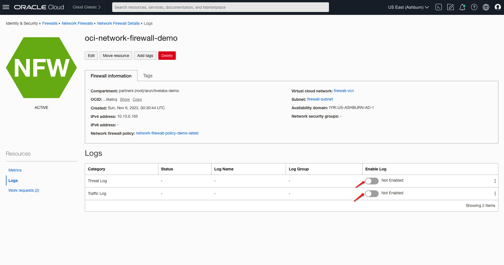

2. Click on toggle buttons next to **Threat Log** to enable logs. 

3. Verify all the information and Click **Enable Log**.

   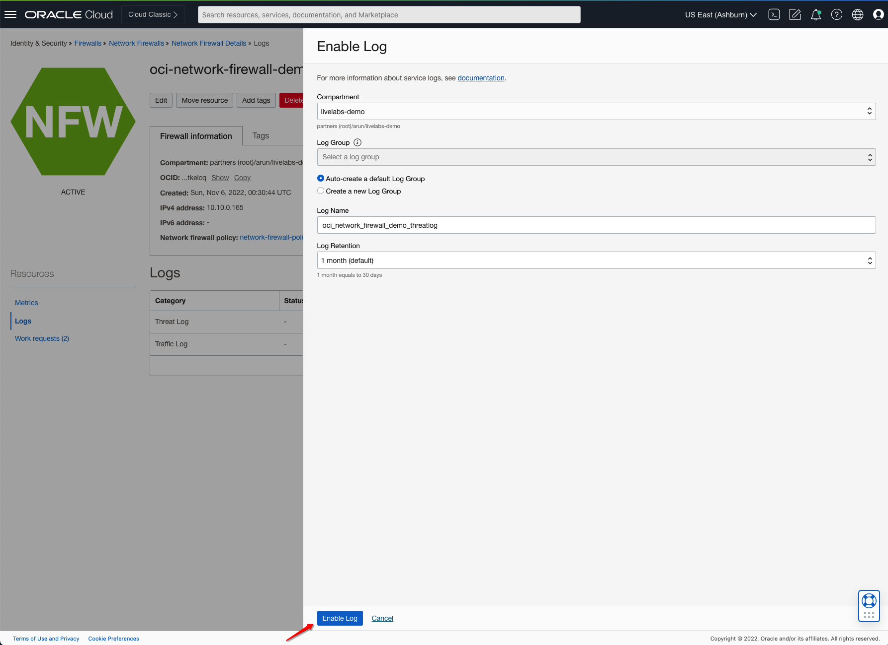

4. Click on toggle buttons next to **Traffic Log** to enable logs.

5. Verify all the information and Click **Enable Log**.

   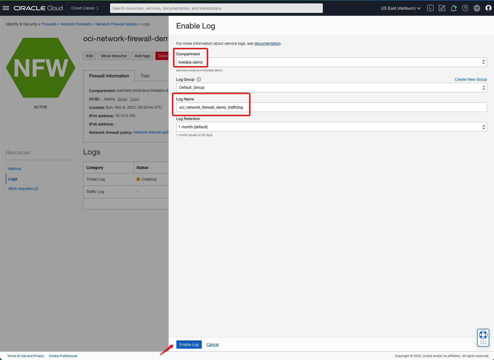

6. You have successfully enabled Network Firewall Logs.

## **Task 10: Explore Network Firewall Metrics**

1. Navigate to **Network Firewall > Resources > Metrics** page to to check **Metrics**: 

   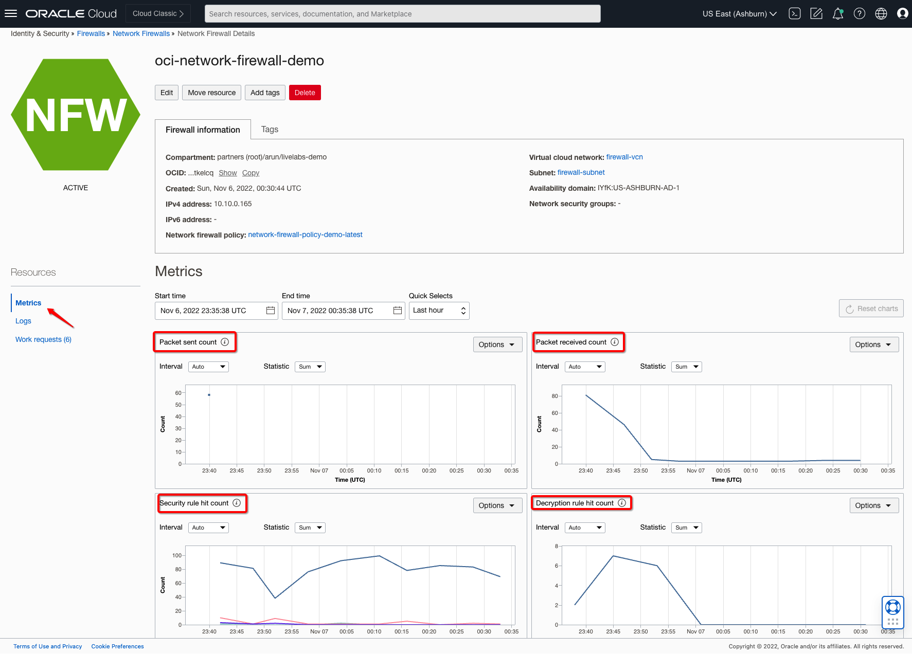

2. Explore different metrics either hovering on top of it or explore **options** to create alarms if needed: 

   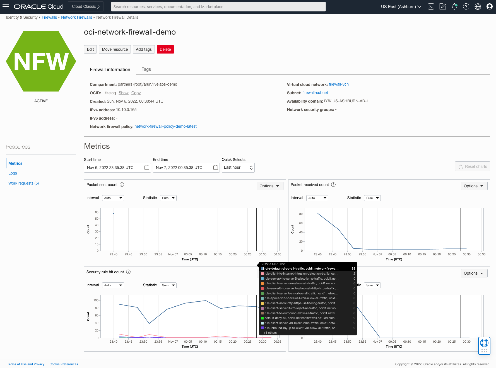

## **Task 11: Explore Network Firewall Work Requests**

1. Navigate to **Network Firewall > Resources > Work requests** page to to check **Work requests**: 

   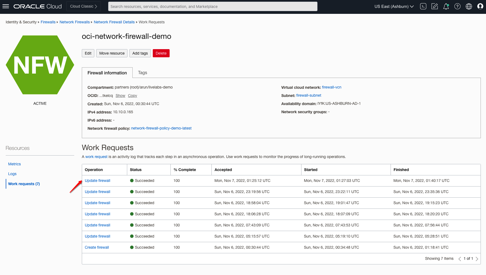

2. Click on **Update Firewall** request to know more about **log**, **error** and **associated resources**:

   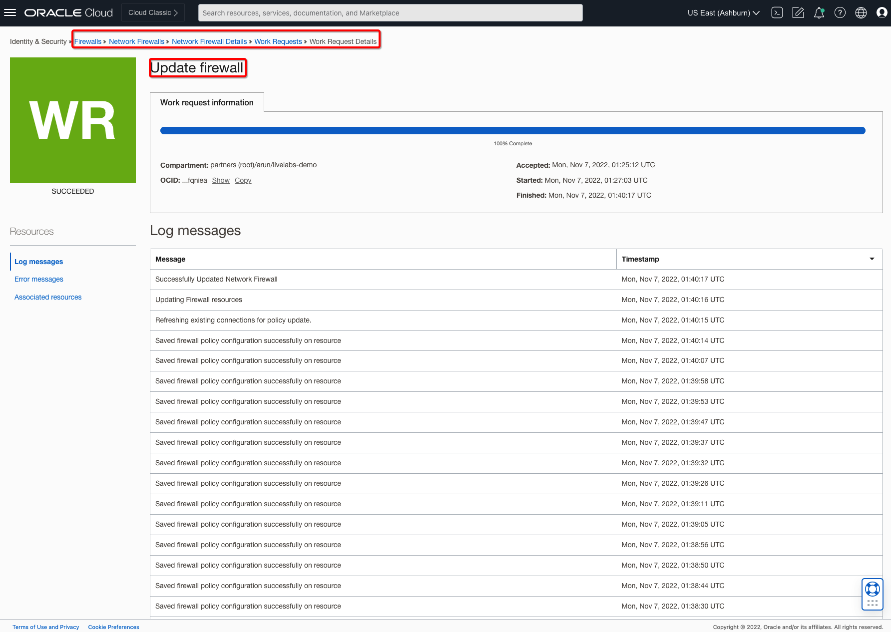

***Congratulations! You have successfully completed the lab.***

You may now [proceed to the next lab](#next).

## Learn More

1. [OCI Training](https://www.oracle.com/cloud/iaas/training/)
2. [Familiarity with OCI console](https://docs.us-phoenix-1.oraclecloud.com/Content/GSG/Concepts/console.htm)
3. [Overview of Networking](https://docs.us-phoenix-1.oraclecloud.com/Content/Network/Concepts/overview.htm)
4. [Overview of OCI Network Firewall](https://docs.oracle.com/en-us/iaas/Content/network-firewall/overview.htm)
5. [OCI Network Firewall Cloud Security Page](https://www.oracle.com/security/cloud-security/network-firewall/)
6. [OCI Intra VCN Routing Capabilities](https://docs.oracle.com/en-us/iaas/Content/Network/Tasks/managingroutetables.htm)

## Acknowledgements

- **Author** - Arun Poonia, Principal Solutions Architect
- **Adapted by** - Oracle
- **Contributors** - N/A
- **Last Updated By/Date** - Arun Poonia, Oct 2022