# Deploy Network Firewall and Supporting Configuration

## Introduction

In this lab, you will be creating **Network Firewall Policy**, and **Network Firewall**, updating required routes and policies to support traffic between VCNs.

Estimated time: 45 minutes.

### Objectives

- Configure Network Firewall Policy
- Launch Network Firewall in Firewall VCN 
- Demonstrate updating routing tables 
- Validate route tables association

### Prerequisites

- Oracle Cloud Infrastructure paid account credentials (User, Password, Tenant, and Compartment)
- User must have required permissions, and quota to deploy resources.

## Task 1: Configure Network Firewall Policy

1. From the OCI Services menu, click **Network Firewall Policies** under **Identity & Security**. Select your region on the right part of the screen:

   

2. Below table represents what you will be creating. Click on **Create Policy** icon to create new **Network Firewall Policy**:

      | Policy Name                           | Comment                                                    |
      |---------------------------------------|------------------------------------------------------------|
      | network-firewall-policy-demo          |  You will be adding required policy configuration in **Lab3** so you will allow default **allow all** rule first. |

   

3. Fill out the dialog box and Click **Next**:

      - **Policy Name**: Provide a name
      - **Compartment**: Ensure your compartment is selected

   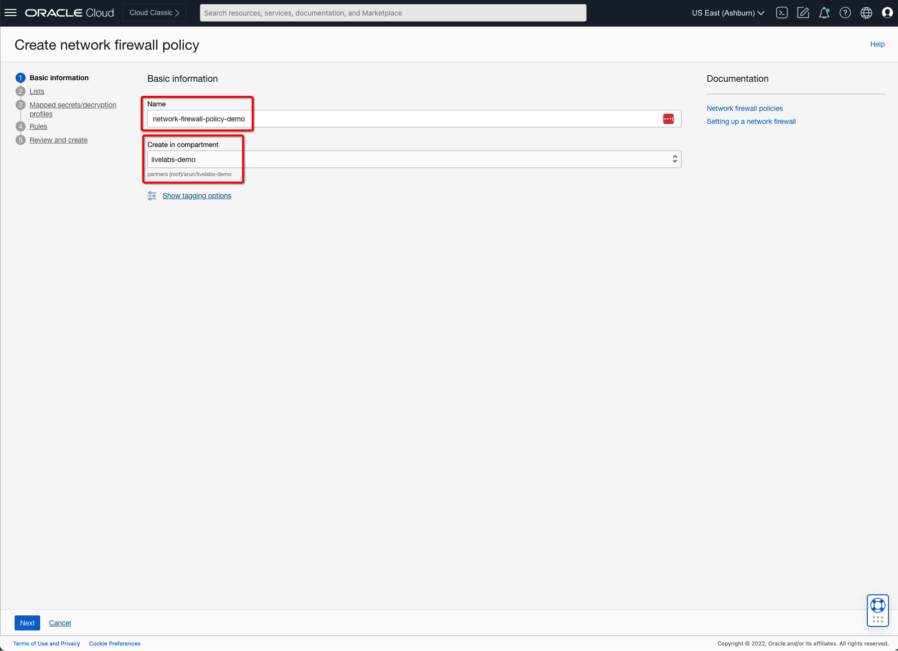

4. Keep value as default and Click **Next**:

   

5. Keep value as default and Click **Next**:

   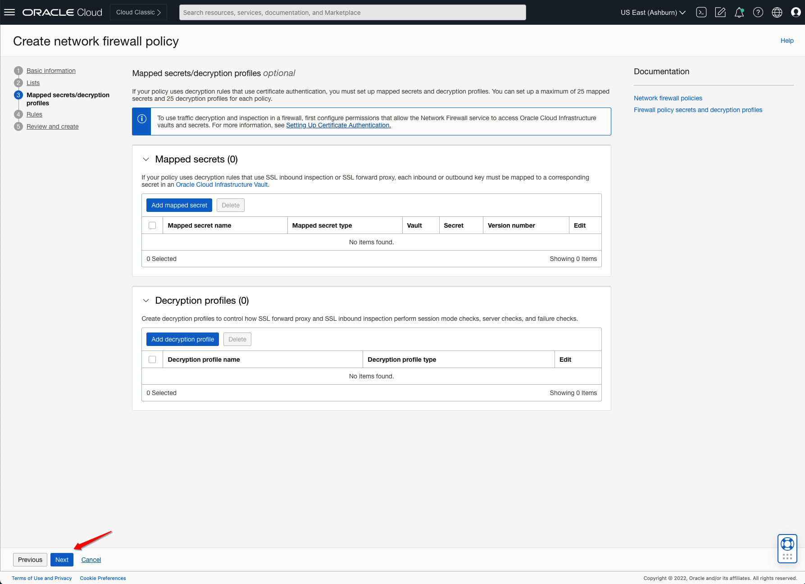

6. You will add an **allow-all** rule. Click on **Add Security Rule** and Fill out the dialog box:

      - **Rule Name**: Provide a name
      - **Match Condition**: 
        - **Source IP Address**: Ensure **Any IP Address** is selected
        - **Destination IP Address**: Ensure **Any IP Address** is selected
        - **Application**: Ensure **Any Protocol** is selected
        - **URLs**: Ensure **Any URL** is selected
      - **Match Condition**: Select **Allow Traffic** action. 

7. Verify all the information and Click **Save Changes** and click on **Next**.

   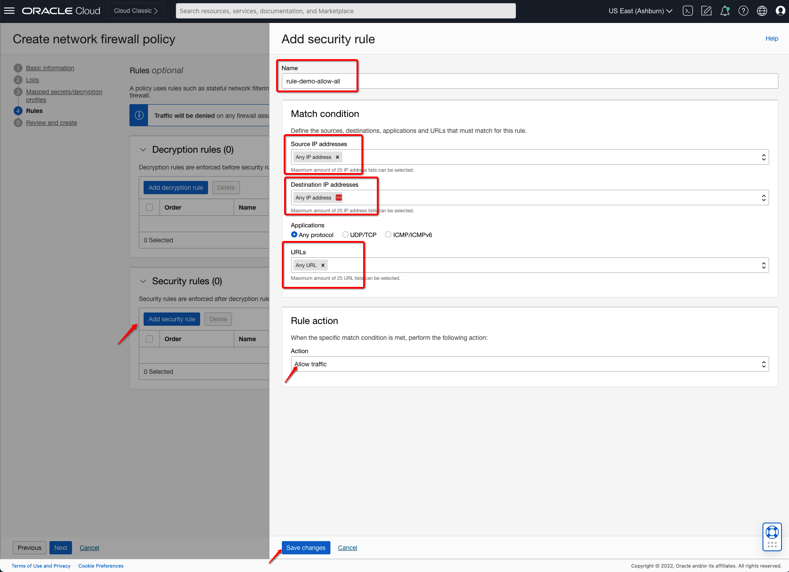

   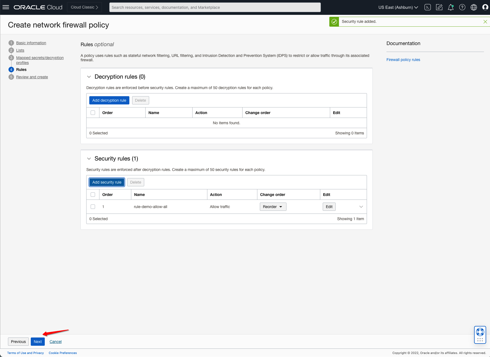

7. Click on **Create Network Policy** to create your initial policy: 

   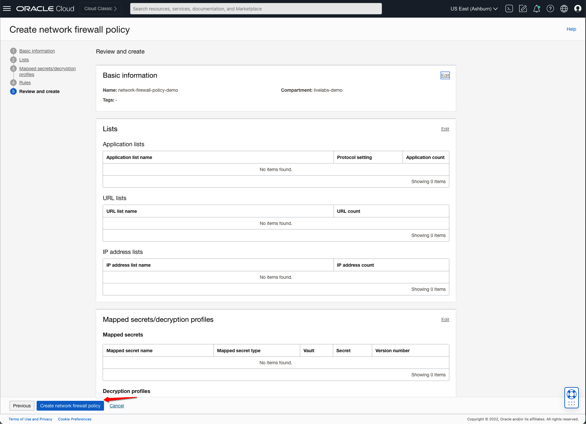

8. This will create a Network Firewall Policy with the following components.

    *Network Firewall Policy with Allow All Rule*

## Task 2: Create Network Firewall in Firewall VCN

1. From the OCI Services menu, click **Network Firewall** under **Identity & Security**. Select your region on the right part of the screen:

   

2. Below table represents what you will be creating. Click on **Create Network Firewall** icon to create new **Network Firewall**:

      | Firewall Name                           | Comment                                                    |
      |---------------------------------------|------------------------------------------------------------|
      | oci-network-firewall-demo|  You will be creating Network Firewall in **Firewall-Subnet** to protect public and OCI workloads. |

   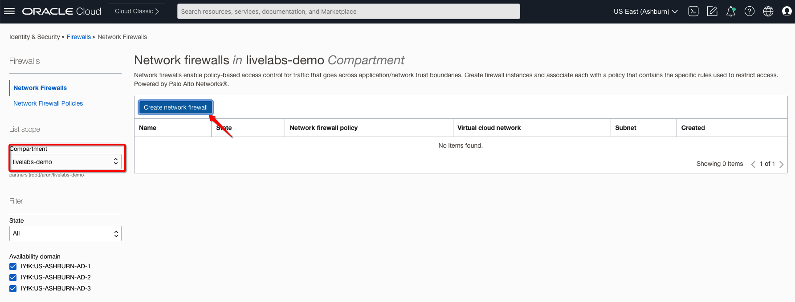

3. Fill out the dialog box:

      - **Firewall Name**: Provide a name
      - **Compartment**: Ensure your compartment is selected
      - **Network Firewall Policy**: Select **network-firewall-policy-demo** from dropdown. 
      - **Enforcement Point**: 
        - **Virtual Cloud Network**: Select **firewall-vcn** from dropdown.
        - **Subnet**: Select **firewall-subnet** from dropdown.
        - **[Optional] Availability Domain**: Select required **AD** from dropdown.

   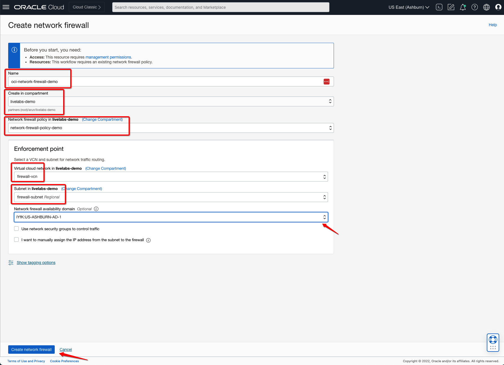

4. Verify all the information and Click **Create Network Firewall**.

5. This will create a Network Firewall with the following components.

    *Network Firewall within Firewall-Subnet*

   > **Please Read**: OCI Network Firewall deployment will take close to **30-35 mins** initially. Ensure that this task is complete before proceeding further.

6. Verify the **Network Firewall** IP address which you would need to update route tables in the next task. 

   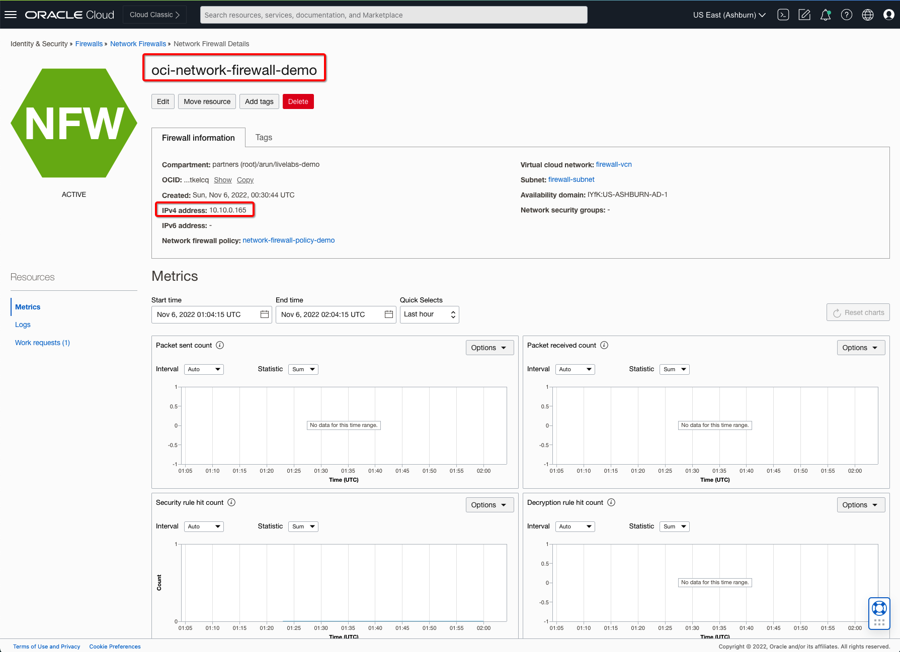

## Task 3: Update Route Tables on Firewall-VCN

1. Navigate to the **firewall-vcn** and select **VCN-INGRESS-RouteTable** route table. 

2. Click **Add Route Rules**

3. Select the Target Type as **Private IP** and enter the Secondary IP Address Associated with **Network Firewall** IP Address.

4. Enter the **Destination CIDR Block**

    - In this case, you will put all default CIDR **0.0.0.0/0** which is incoming traffic from Spoke VCNs via **DRG** to Active Firewall. You can also enter the CIDR block for the Firewall VCNs or Public/On-Prem Subnets if needed.  i.e.: 10.10.1.0/24 or 10.10.2.0/24

5. Add **Description**.

   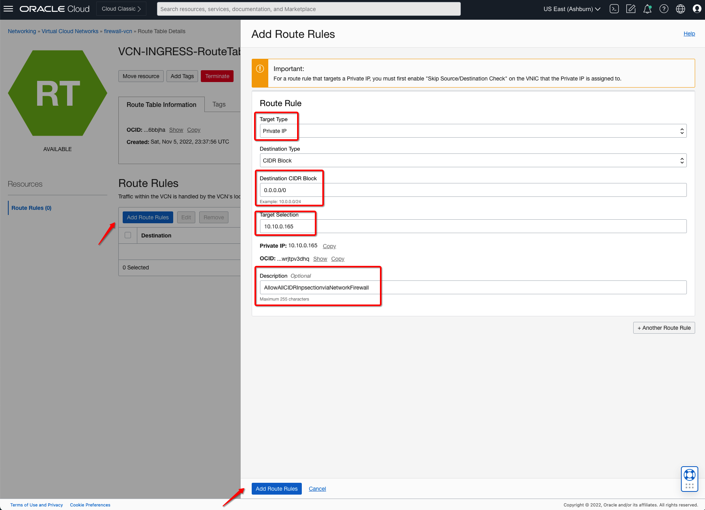

6. Click **Add Route Rules** to finish.

7. Navigate to the **firewall-vcn** and select **ClientSubnetRouteTable** route table. 

8. Click **Add Route Rules**

9. Enter the required entries as below, and click on **Another Route Rule** as needed:

    - **First Entry**
        - Select the Target Type as **Private IP** 
        - Enter the **Destination CIDR Block**
            - In this case you will put **10.10.2.0/24** for outgoing traffic of Server Subnet via **OCI Network Firewall**.
        - **Target Selection**: Enter **Network Firewall** IP Address. 
    - **Second Entry**
        - Select the Target Type as **Private IP** 
        - Enter the **Destination CIDR Block**
            - In this case you will put **10.20.0.0/16** for outgoing traffic of Server Subnet via **OCI Network Firewall**.
        - **Target Selection**: Enter **Network Firewall** IP Address.  
    - **Third Entry**
        - Select the Target Type as **Private IP** 
        - Enter the **Destination CIDR Block**
            - In this case you will put **0.0.0.0/0** for ensuring any outgoing traffic goes via **OCI Network Firewall**.
        - **Target Selection**: Enter **Network Firewall** IP Address.  

       > **Please Read**: Even though we are adding the **0.0.0.0/0** route rule it's needed to add **first entry** if you want to inspect intra-vcn subnets level inspection. Each route table has its local entry hence first entry is needed which will take precedence.

10. Add **Description** for each entry.

   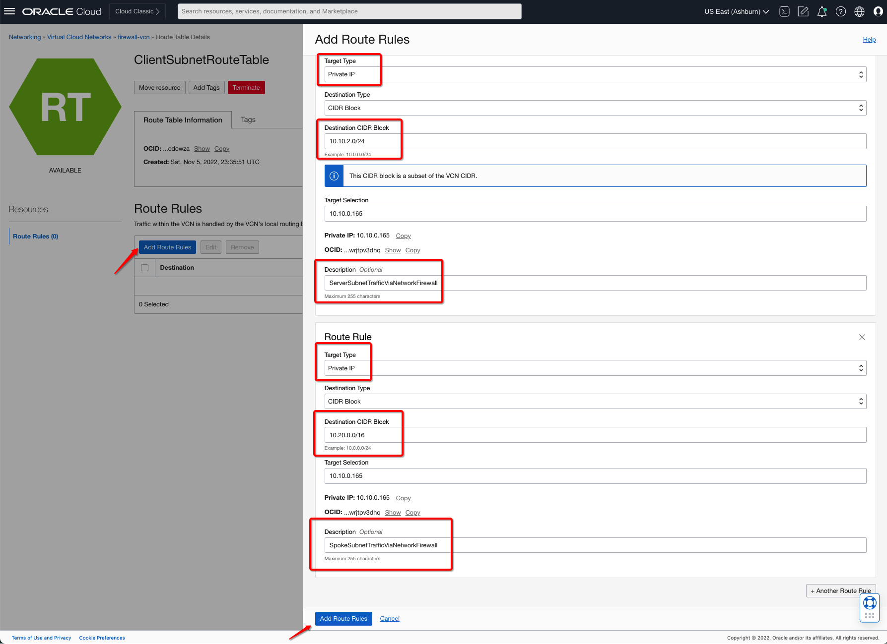

11. Click **Add Route Rules** to finish.

12. Navigate to the **firewall-vcn** and select **ServerSubnetRouteTable** route table. 

13. Click **Add Route Rules**

14. Enter the required entries as below, and click on **Another Route Rule** as needed:

    - **First Entry**
        - Select the Target Type as **Private IP** 
        - Enter the **Destination CIDR Block**
            - In this case you will put **10.10.1.0/24** for outgoing traffic of Client Subnet via **OCI Network Firewall**.
        - **Target Selection**: Enter **Network Firewall** IP Address. 
    - **Second Entry**
        - Select the Target Type as **Private IP** 
        - Enter the **Destination CIDR Block**
            - In this case you will put **10.20.0.0/16** for outgoing traffic of Server Subnet via **OCI Network Firewall**.
        - **Target Selection**: Enter **Network Firewall** IP Address.   

15. Add **Description** for each entry.

   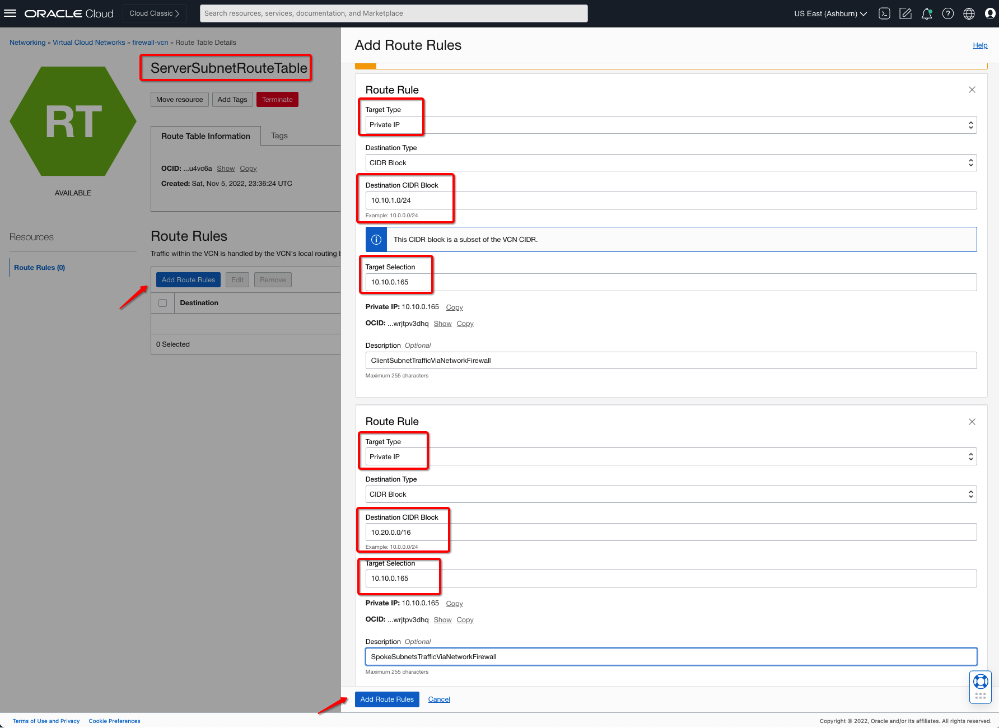

16. Click **Add Route Rules** to finish.

17. Navigate to the **firewall-vcn** and select **FirewallSubnetRouteTable** route table. 

18. Click **Add Route Rules**

19. Enter the required entries as below, and click on **Another Route Rule** as needed:

    - **First Entry**
        - Select the Target Type as **Private IP** 
        - Enter the **Destination CIDR Block**
            - In this case you will put **10.20.0.0/16** for outgoing traffic of Server Subnet via **OCI Network Firewall**.
        - **Target Selection**: Enter **Network Firewall** IP Address.   

20. Add **Description** for each entry.

   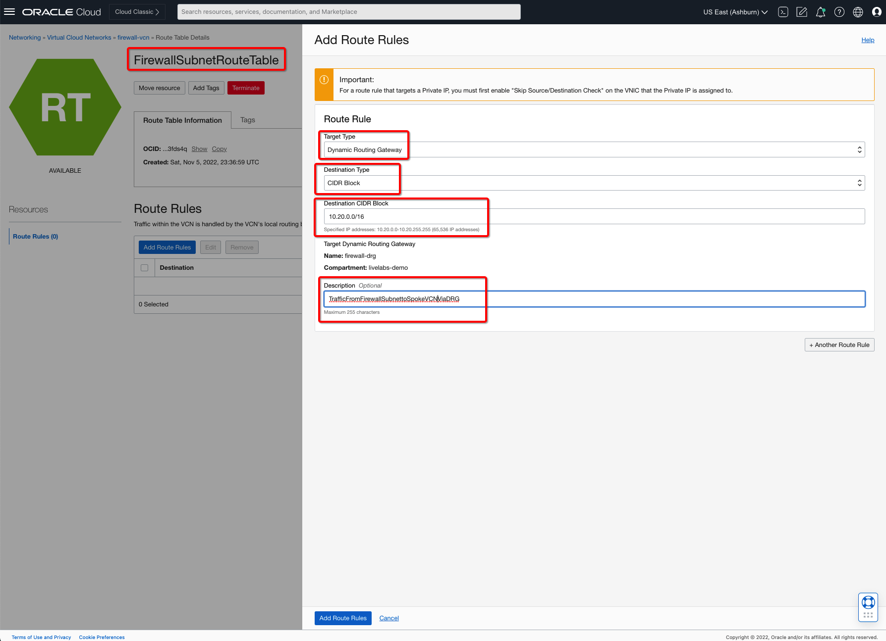

21. Click **Add Route Rules** to finish.

22. Navigate to the **firewall-vcn** and select **SGWRouteTable** route table. 

23. Click **Add Route Rules**

24.  Select the Target Type as **Private IP** and enter **Network Firewall** IP address.

25. Enter the **Destination CIDR Block**

    - In this case, you will put all default CIDR **0.0.0.0/0** so all return traffic goes from Service Gateway goes via Firewall.

26. Add **Description** for each entry.

   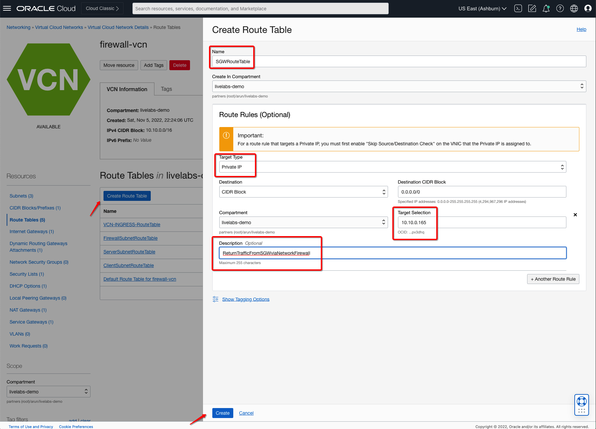

## Task 4: Verify Route Tables associated with Subnets and Gateways

1. Below table includes the necessary subnets in each **VCN** and makes sure **Route Table** is attached to the right subnets and service gateway. 

    | VCN          | Resource Name/Type                       | Route Table Name                |
    |--------------|------------------------------------------|---------------------------------|
    | firewall-vcn | firewall-subnet                       | FirewallSubnetRouteTable           |
    | firewall-vcn | client-subnet                    | ClientSubnetRouteTable                  |
    | firewall-vcn | server-subnet                      | ServerSubnetRouteTable                |
    | firewall-vcn | Firewall VCN/DRG Firewall VCN Attachment | VCN-INGRESS-RouteTable                     |
    | firewall-vcn | hubServiceGateway/Service Gateway        | SGWRouteTable                   |
    | spoke-vcn    | serverA-subnet              | ServerASubnet Route Table for spoke-vcn |
    | spoke-vcn    | serverB-subnet              | ServerBSubnet Route Table for spoke-vcn |

2. Below example reflects how to attach the correct route table based on the above table to one of the resources **Service Gateway**:

   

3. Below example reflects how to attach the correct route table based on the above table to one of the resources **FirewallSubnetRouteTable**:

   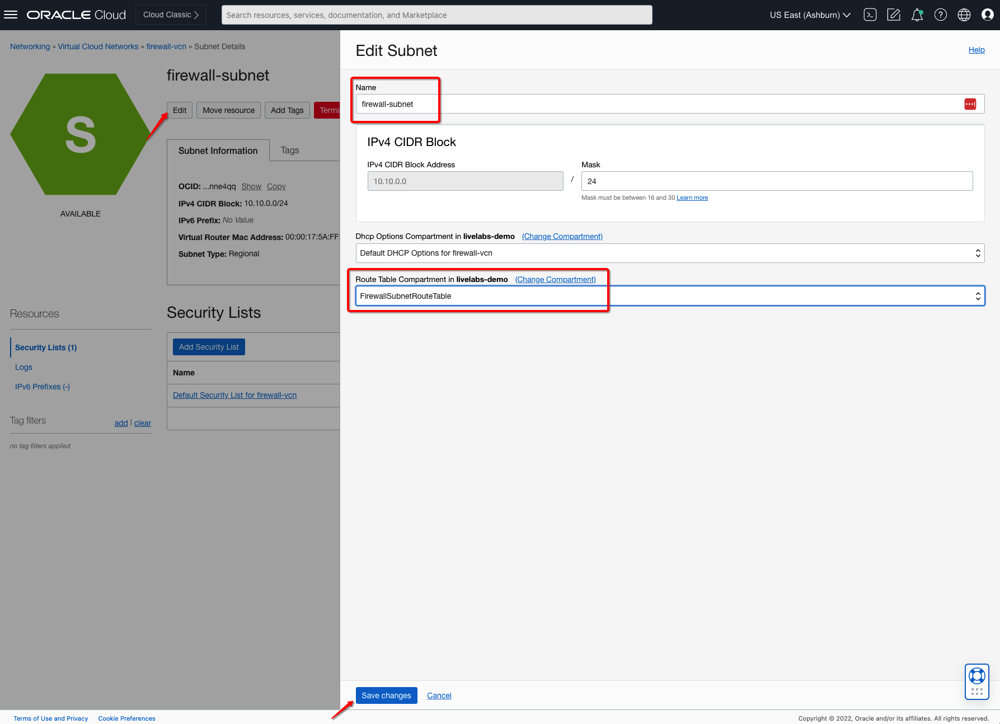

***Congratulations! You have completed the lab.***

You may now **proceed to the next lab**.

## Learn More

1. [OCI Training](https://www.oracle.com/cloud/iaas/training/)
2. [Familiarity with OCI console](https://docs.us-phoenix-1.oraclecloud.com/Content/GSG/Concepts/console.htm)
3. [Overview of Networking](https://docs.us-phoenix-1.oraclecloud.com/Content/Network/Concepts/overview.htm)
4. [Overview of OCI Network Firewall](https://docs.oracle.com/en-us/iaas/Content/network-firewall/overview.htm)
5. [OCI Network Firewall Cloud Security Page](https://www.oracle.com/security/cloud-security/network-firewall/)
6. [OCI Intra VCN Routing Capabilities](https://docs.oracle.com/en-us/iaas/Content/Network/Tasks/managingroutetables.htm)

## Acknowledgements

- **Author** - Arun Poonia, Principal Solutions Architect
- **Adapted by** - Oracle
- **Contributors** - N/A
- **Last Updated By/Date** - Arun Poonia, Oct 2022