# Network Firewall Traffics Validation and Security Features

## Introduction

In this lab, you will be creating required security rules, and routes associated with **Network Firewall** traffic flow to support different use-case and validate traffics within, between, and from VCNs.

Estimated time: 30 minutes.

### Objectives

- Validate North-South Inbound Traffic
- Validate North-South Outbound Traffic
- Validate East-West Intra VCN Traffic
- Validate East-West Inter VCN Traffic
- Validate IPS/IDS Traffic
- Validate URL Filtering Traffic
- Validate SSL Forward Proxy Traffic
- Validate North-South NAT Gateway Ingress Traffic

### Prerequisites

- Oracle Cloud Infrastructure paid account credentials (User, Password, Tenant, and Compartment)  
- User must have required permissions, and quota to deploy resources.

## Task 1: Validate North-South Inbound Traffic

1. From the OCI Services menu, click **Virtual Cloud Network** and navigate to **firewall-vcn**. 

   

2. Click on **Create Route Table** on **Route Tables** resources under **firewall-vcn** section. You will be creating an Internet Gateway route table. Fill out the dialog box: 

      - **Name**: Provide a name; In your case **IGWRouteTable**
      - **Compartment**: Ensure your compartment is selected

3. Click **Another Route Rule**

4. Enter the required entries as below, and click on **Another Route Rule** as needed:

    - **First Entry**
        - Select the Target Type as **Private IP** 
        - Enter the **Destination CIDR Block**
            - In this case you will put **10.10.1.0/24** for incoming traffic of Client Subnet via **OCI Network Firewall**.
        - **Target Selection**: Enter **Network Firewall** IP Address.

5. Verify all the information and Click **Create**.

   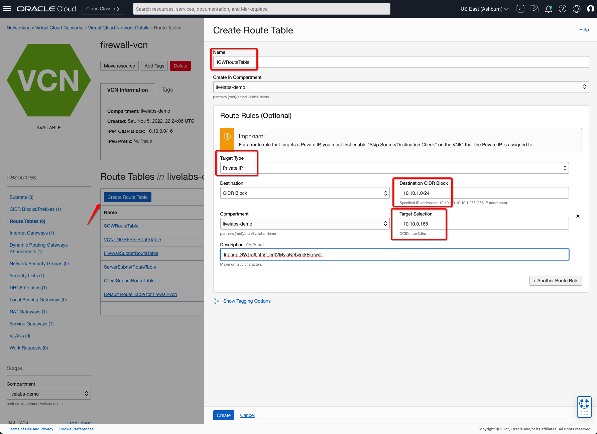

6. This will create IGW Route Table for firewall-vcn with the following components.

    *Created IGWRouteTable for firewall-vcn*

7. Associated **IGWRouteTable** to internet gateway, Click on **Associate Route Table**: 

   

   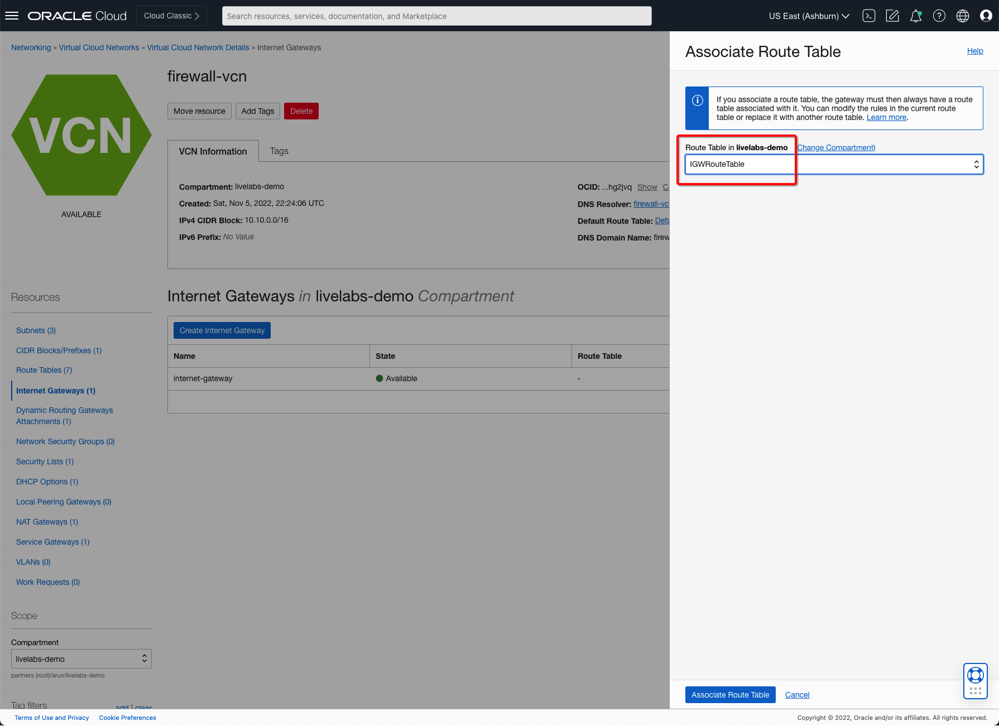

8. Update **firewall-subnet** default route to consider **IGW** to go out which will ensure client VM internet traffic goes via the firewall: 

   

9. You have already defined the required security rule in **Lab 3** but you can double check, for this task below rule will take effect: 

   

10. Connect to **Client-VM** instance public IP on your local machine's over **SSH** as per below table: 

    | VM       | Port  | IP                                   | Example                       |
    |----------|-------|--------------------------------------|-------------------------------|
    | Client VM | 22   | VM Public IP                         | ssh opc@129.213.19.12         |

11. Below table represents traffic flow and associated security rules which will be validated:

    | Traffic From       | Traffic To  |  Traffic  | Action        | Network Firewall Policy Rule                               |
    |-------------------------|-------------|--------------------|-----------------|--------------------------------------------|
    | Internet - My Public IP | Client VM   | SSH Inbound Traffic| Allowed         | rule-inbound-my-ip-to-client-vm-allow-all-traffic     |

12. Below diagram validates that Inbound traffic is working towards your Client VM. 

   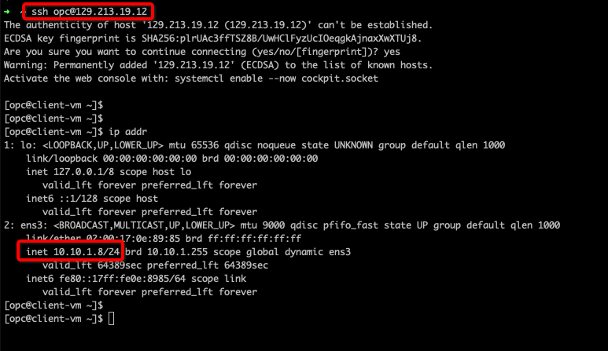

13. You can also verify traffic from **Traffic Logs** on your **Network Firewall** resource. Data *filters* are available, below screenshot shows **policy-rule** filtered traffic:

   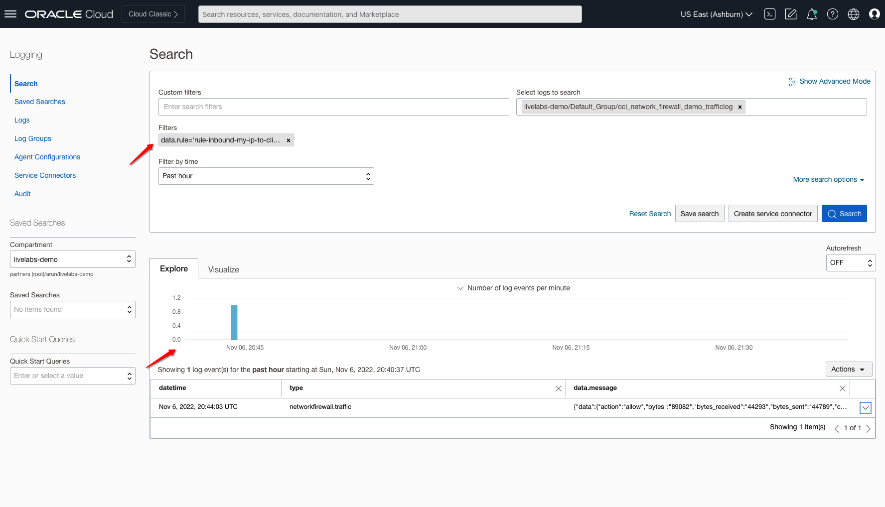

14. You can expand the logs and confirm it's hitting the right security rule **rule-inbound-my-ip-to-client-vm-allow-all-traffic** as below: 

   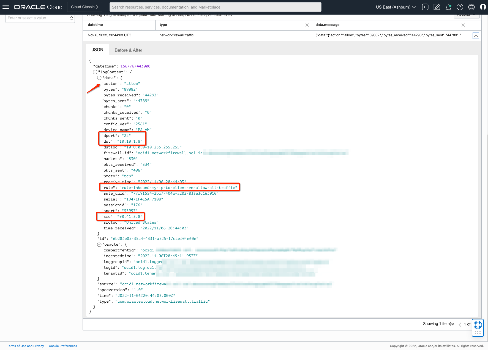

## Task 2: Validate North-South Outbound Traffic

1. From the OCI Services menu, click **Virtual Cloud Network** and navigate to **firewall-vcn**. 

   

2. Confirm **Client-Subnet** route table has an entry for Internet Traffic CIDR **0.0.0.0/0** via **Network Firewall**:

   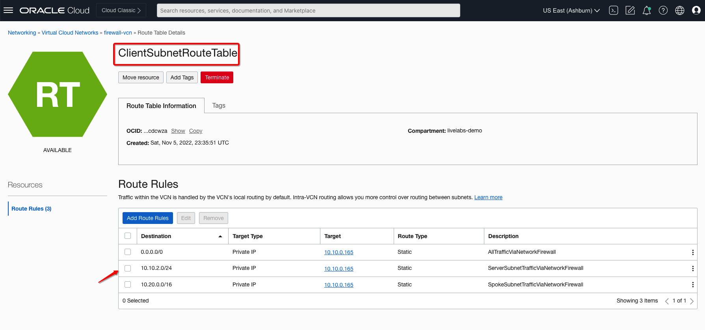

3. Confirm **Firewall-Subnet** route table has an entry for Internet Traffic CIDR **0.0.0.0/0** via **internet-gateway**:

   

4. Confirm **InternetGateway** route table has an entry for return traffic of **Client-Subnet** CIDR via **Network Firewall**:

   

5. You have already defined the required security rule in **Lab 3** but you can double check, for this task below rule will take effect: 

   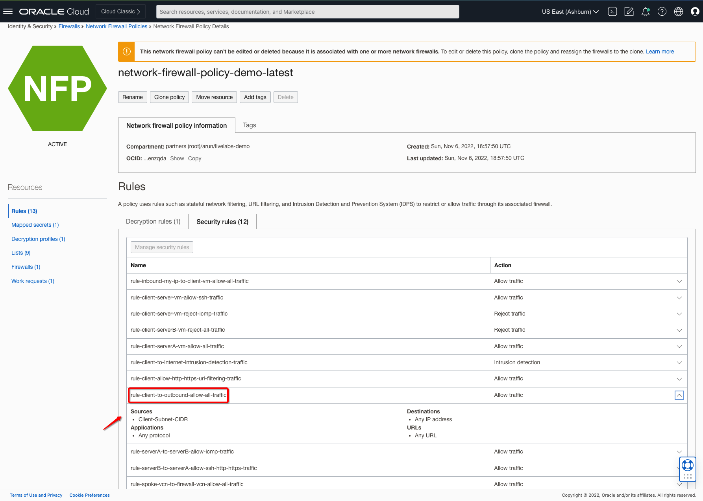

6. Connect to **Client-VM** instance public IP on your local machine's over **SSH** as per below table and initiate **ICMP** traffic which should go through **Network-Firewall**:

    | VM       | Port  | IP                                   | Example                                   |
    |----------|-------|--------------------------------------|-------------------------------------------|
    | Client VM | 22   | VM Public IP                         | ssh opc@129.213.19.12                     |

7. Below table represents traffic flow and associated security rules which will be validated: 

    | Traffic From       | Traffic To  |  Traffic  | Action        | Network Firewall Policy Rule                               |
    |-------------------------|-------------|--------------------|-----------------|--------------------------------------------|
    | Client VM | Internet Traffic   | ICMP Traffic| Allowed         | rule-client-to-outbound-allow-all-traffic                     |

8. Below diagram validates that Outbound traffic is working towards Public IP:

   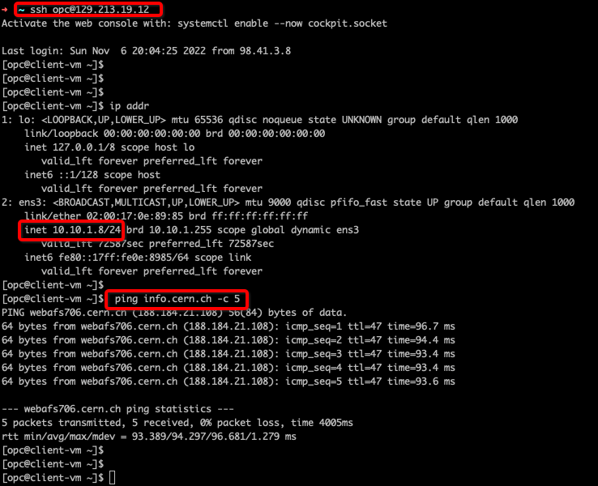

9. You can also verify traffic from **Traffic Logs** on your **Network Firewall** resource. Data *filters* are available, below screenshot shows **policy-rule** filtered traffic:

   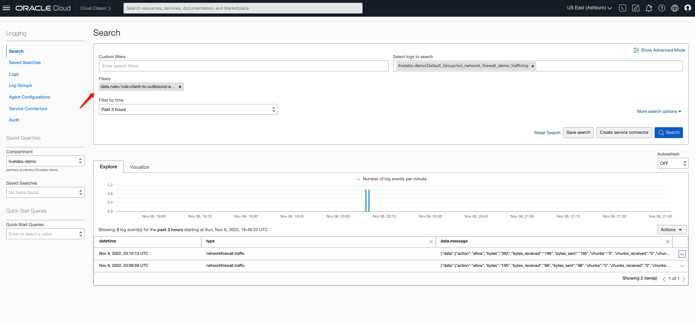

10. You can expand the logs and confirm it is hitting the right security rule **rule-inbound-my-ip-to-client-vm-allow-all-traffic** as below: 

   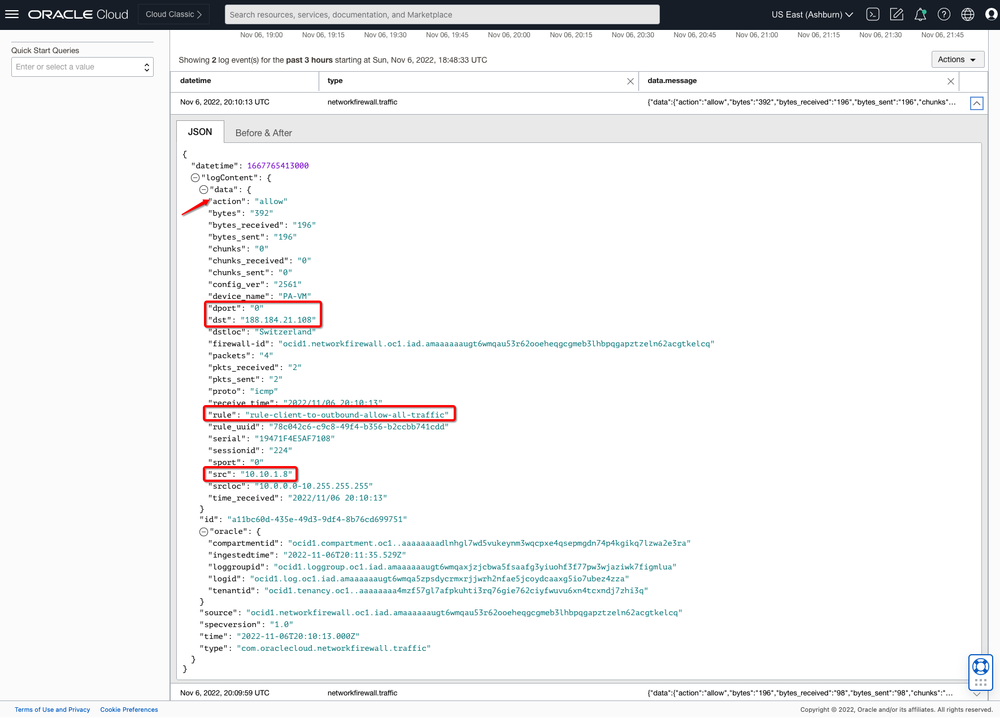

## Task 3: Validate East-West Intra VCN Traffic

1. From the OCI Services menu, click **Virtual Cloud Network** and navigate to **firewall-vcn**. 

   

2. Confirm **Client-Subnet** route table has an entry for Server-Subnet CIDR **10.10.2.0/24** and Spoke VCN CIDR via **Network Firewall**:

   

   > **Please Read**: You must define subnet level route table entries if you want to inspect traffic at subnet levels within a VCN else local routes will take precedence.

3. Confirm **Server-Subnet** route table has an entry for Client-Subnet CIDR **10.10.1.0/24** and Spoke VCN CIDR via **Network Firewall**:

   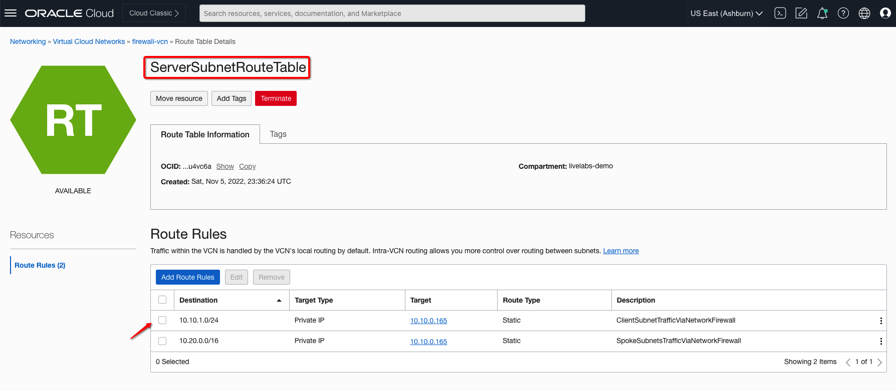

   > **Please Read**: You must define subnet level route table entries if you want to inspect traffic at subnet levels within a VCN else local routes will take precedence.

4. Confirm **ServerA-Subnet** route table has an entry for ServerB-Subnet CIDR and Firewall VCN CIDR via **dynamic-routing-gateway**:

   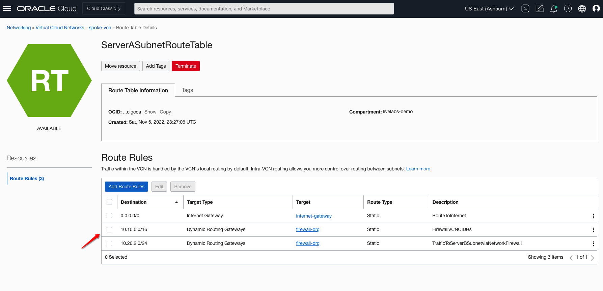

   > **Please Read**: You must define subnet level route table entries if you want to inspect traffic at subnet levels within a VCN else local routes will take precedence.

5. Confirm **ServerB-Subnet** route table has an entry for ServerA-Subnet CIDR and Firewall VCN CIDR via **dynamic-routing-gateway**:

   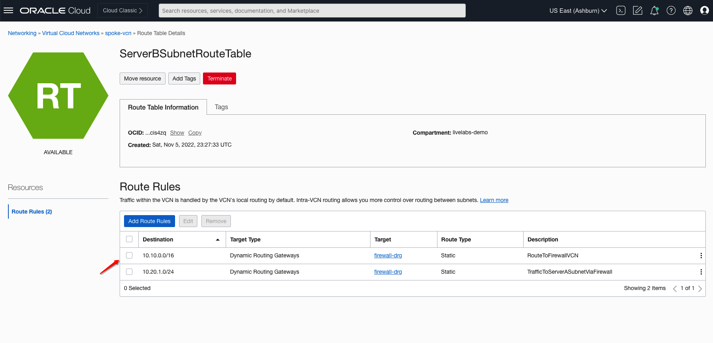

   > **Please Read**: You must define subnet level route table entries if you want to inspect traffic at subnet levels within a VCN else local routes will take precedence.

6. You have already defined the required security rule in **Lab 3** but you can double check, for this task below rule will take effect: 

   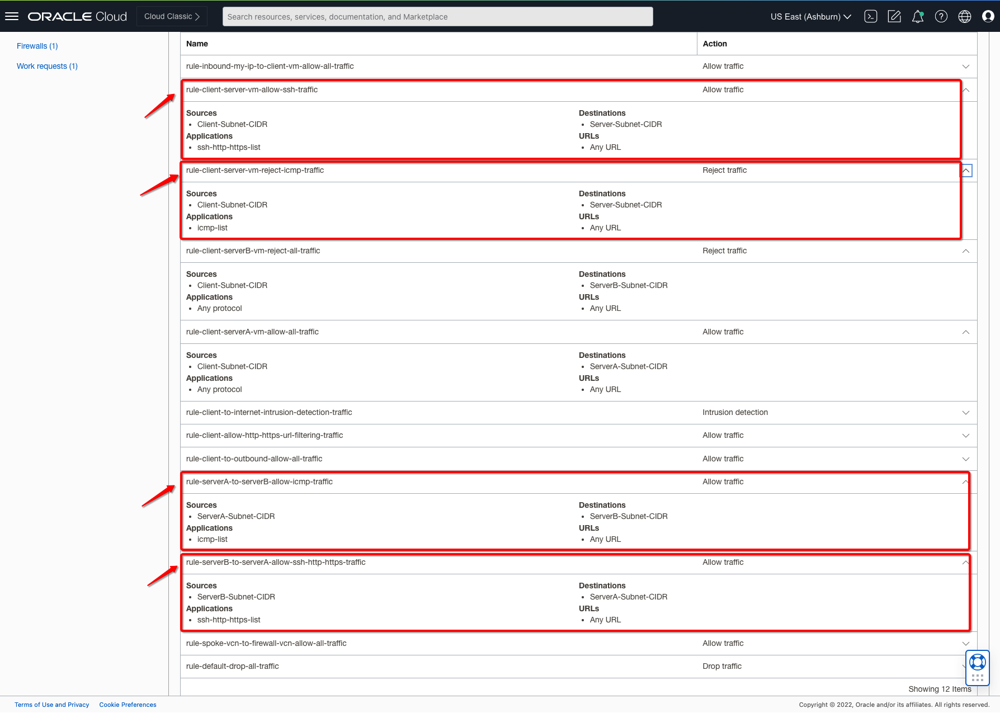

7. Connect to **Client-VM** instance public IP on your local machine over **SSH** as per the below table and initiate traffic which should go through **Network-Firewall**:

    | VM       | Port  | IP                                   | Example                                   |
    |----------|-------|--------------------------------------|-------------------------------------------|
    | Client VM | 22   | VM Public IP                         | ssh opc@129.213.19.12                     |
    | Server VM | 22   | VM Private IP                        | ssh opc@10.10.2.242 -i private-key        |
    | ServerA VM | 22   | VM Private IP                        | ssh opc@150.136.89.124        |
    | ServerB VM | 22   | VM Private IP                        | ssh opc@10.20.2.45       |

8. Below table represents traffic flow and associated security rules which will be validated: 

    | Traffic From       | Traffic To  |  Traffic  | Action        | Network Firewall Policy Rule                               |
    |-------------------------|-------------|--------------------|-----------------|--------------------------------------------|
    | Client VM | Server VM   | SSH Inbound Traffic| Allowed         | rule-client-server-vm-allow-ssh-traffic                      |
    | Client VM | Server VM   | ICMP Traffic| Blocked        |  rule-client-server-vm-reject-icmp-traffic        |
    | ServerA VM | ServerB VM | ICMP Traffic| Allowed |  rule-serverA-to-serverB-allow-icmp-traffic | 
    | ServerA VM | ServerB VM | SSH | Allowed |  rule-serverB-to-serverA-allow-ssh-http-https-traffic | 

9. Below diagram validates that Intra VCN traffic is working between Client and Server VMs in **firewall-vcn**. 

   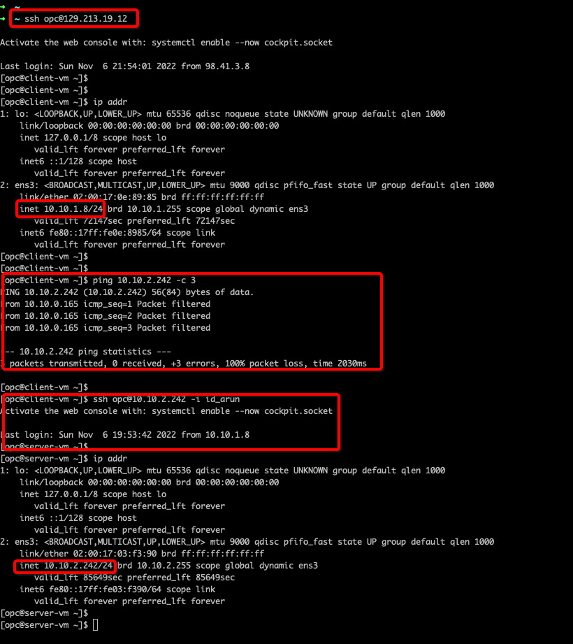

10. You can also verify traffic from **Traffic Logs** on your **Network Firewall** resource.

   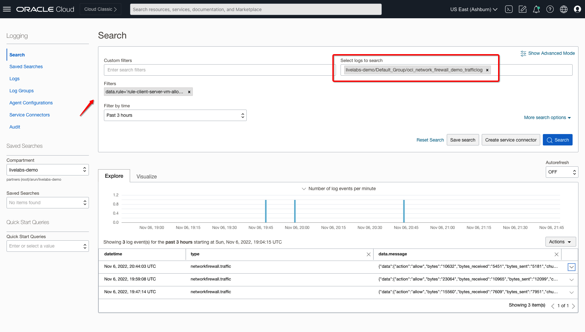

   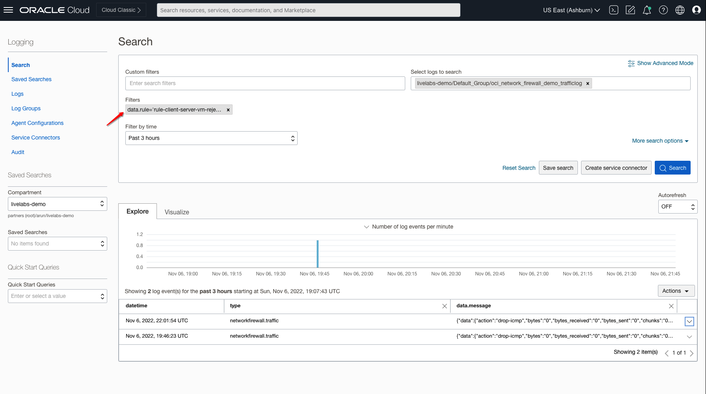

11. You can also expand the logs and confirm if it's hitting the right security rules **rule-client-server-vm-reject-icmp-traffic** & **rule-client-server-vm-allow-ssh-traffic** as below: 

   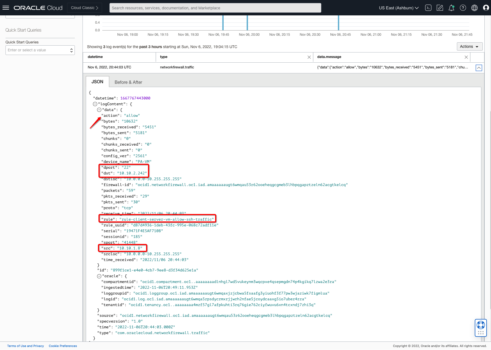

   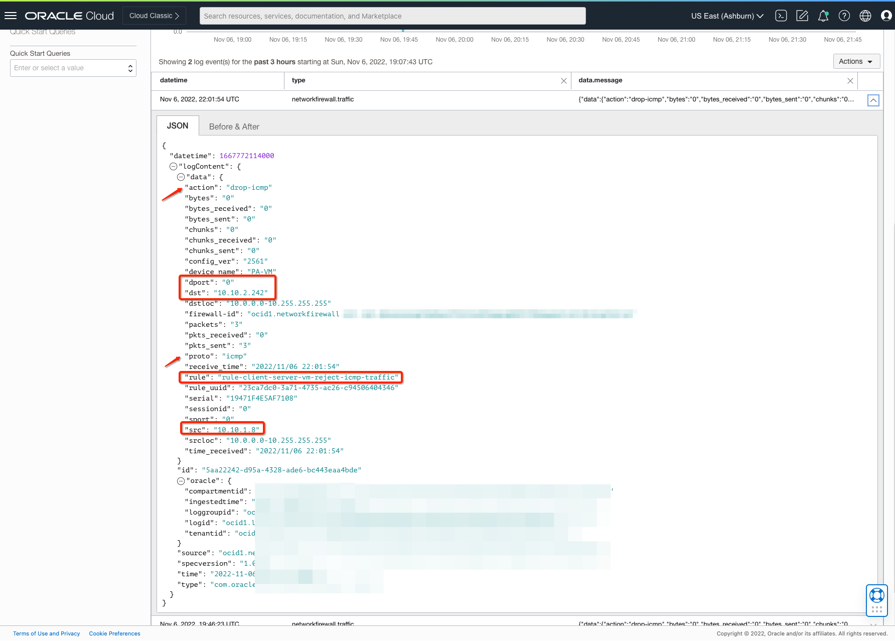

12. Below diagram validates that Intra VCN traffic is working between Firewall VCN VMs and Server VMs in **spoke-vcn**. 

   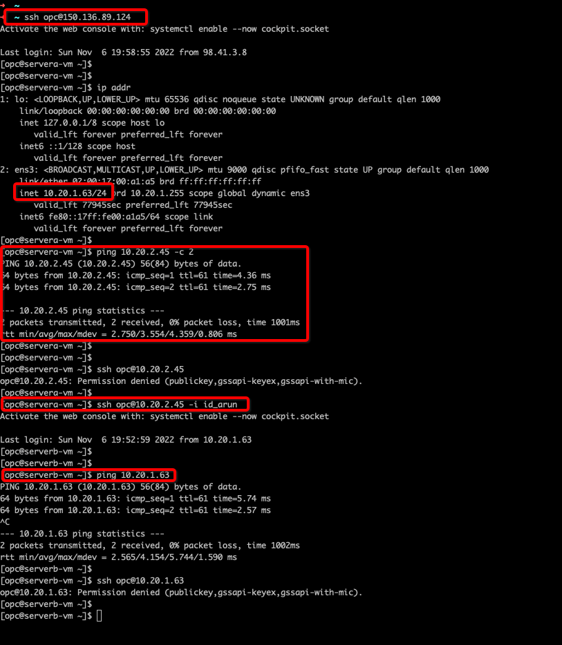

13. You can also verify traffic from **Traffic Logs** on your **Network Firewall** resource.

   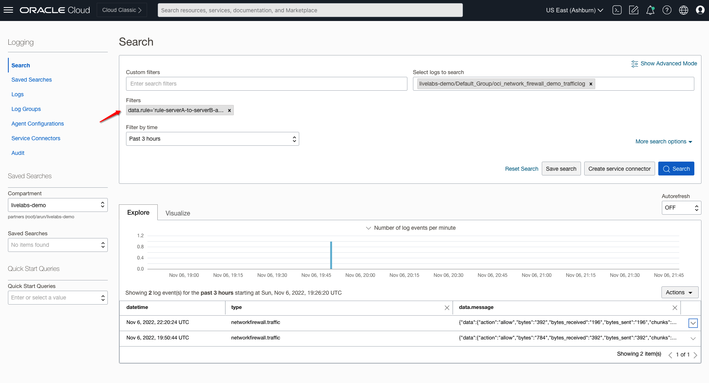

   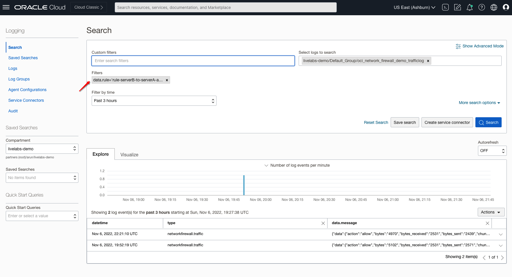

14. You can also expand the logs and confirm if it's hitting the right security rules **rule-serverA-to-serverB-allow-icmp-traffic** & **rule-serverB-to-serverA-allow-ssh-http-https-traffic** as below: 

   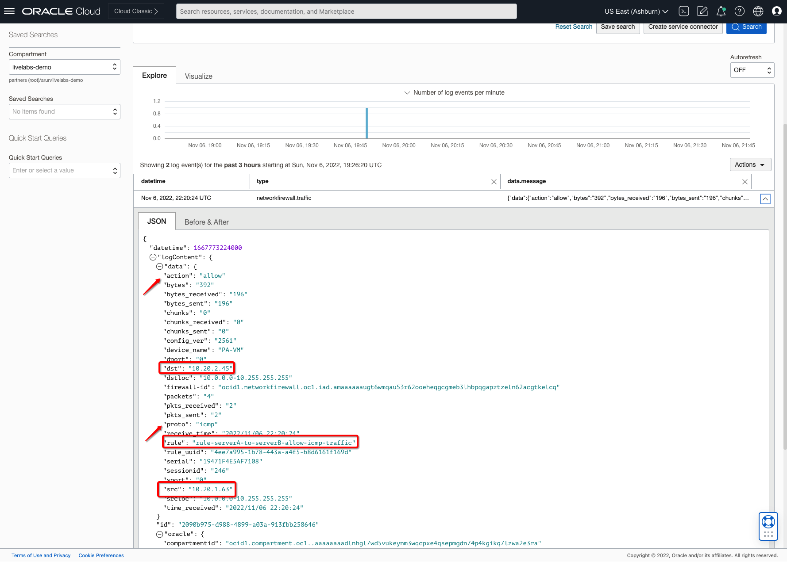

   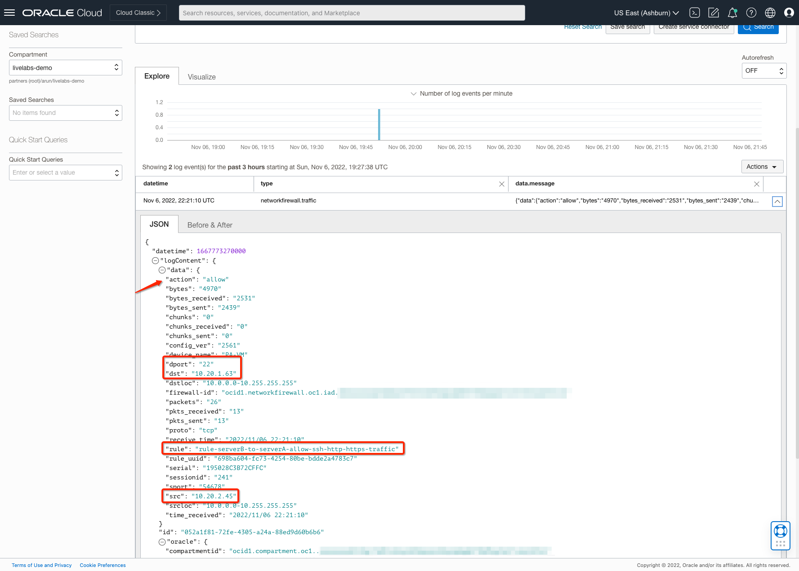

## Task 4: Validate East-West Inter VCNs Traffic

1. From the OCI Services menu, click **Virtual Cloud Network** and navigate to **firewall-vcn**.

   

2. Confirm **Client-Subnet** route table has an entry for Spoke VCN CIDR **10.20.0.0/16** via **Network Firewall**:

   

3. Confirm **Server-Subnet** route table has an entry for Spoke VCN CIDR **10.20.0.0/16** via **Network Firewall**:

   

4. Confirm **Firewall-Subnet** route table has an entry for Spoke VCN CIDR **10.20.0.0/16** via **dynamic-routing-gateway**:

   

5. Confirm **VCN-Ingress-RouteTable** route table has an entry for Spoke VCN return traffic via **Network-Firewall**:

   

6. From the OCI Services menu, click **Virtual Cloud Network** and navigate to **spoke-vcn**. 

   

7. Confirm **ServerA-Subnet** route table has an entry for Firewall-VCN CIDR via **dynamic-routing-gateway**:

   

   > **Please Read**: You must define subnet level route table entries if you want to inspect traffic at subnet levels within a VCN else local routes will take precedence.

8. Confirm **ServerB-Subnet** route table has an entry for Firewall-VCN CIDR via **dynamic-routing-gateway**:

   

   > **Please Read**: You must define subnet level route table entries if you want to inspect traffic at subnet levels within a VCN else local routes will take precedence.

9. You have already defined the required security rules in **Lab 3** but you can double check, for this task below rule will take effect: 

   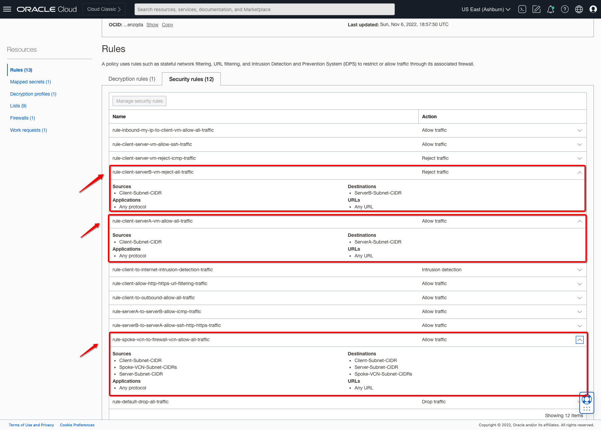

10. Connect to **Client-VM**, **ServerA-VM** instances public IP on your local machine over **SSH** as per the below table and initiate traffic which should go through **Network-Firewall**:

    | VMs       | Port  | IP                                   | Example                                   |
    |----------|-------|--------------------------------------|-------------------------------------------|
    | Client VM | 22   | VM Public IP                         | ssh opc@129.213.19.12                     |
    | Server VM | 22   | VM Private IP                        | ssh opc@10.10.2.242 -i private-key        |
    | ServerA VM | 22   | VM Public IP                        | ssh opc@150.136.89.124        |
    | ServerB VM | 22   | VM Private IP                        | ssh opc@10.20.2.45           |  

11. Below table represents traffic flow and associated security rules which will be validated:

    | Traffic From       | Traffic To  |  Traffic  | Action        | Network Firewall Policy Rule                               |
    |-------------------------|-------------|--------------------|-----------------|--------------------------------------------|
    | Client VM | ServerB VM   | SSH Traffic| Reject         | rule-client-serverB-vm-reject-all-traffic                      |
    | Client VM | ServerA VM   | ICMP Traffic| Allowed        | rule-client-serverA-vm-allow-all-traffic     |
    | Spoke Server VMs | Firewall Client/Server VMs  | SSH Inbound Traffic| Allowed         | rule-spoke-vcn-to-firewall-vcn-allow-all-traffic                      |

12. Below diagram validates that traffic is working between your Client VM from **firewall-vcn** and Spoke VMs in **spoke-vcn**. 

   

13. You can also verify traffic from **Traffic Logs** on your **Network Firewall** resource.

   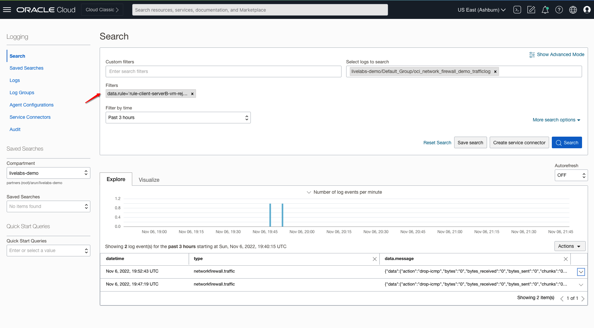

14. You can also expand the logs and confirm if it's hitting the right security rule **rule-client-serverB-vm-reject-all-traffic** as below: 

   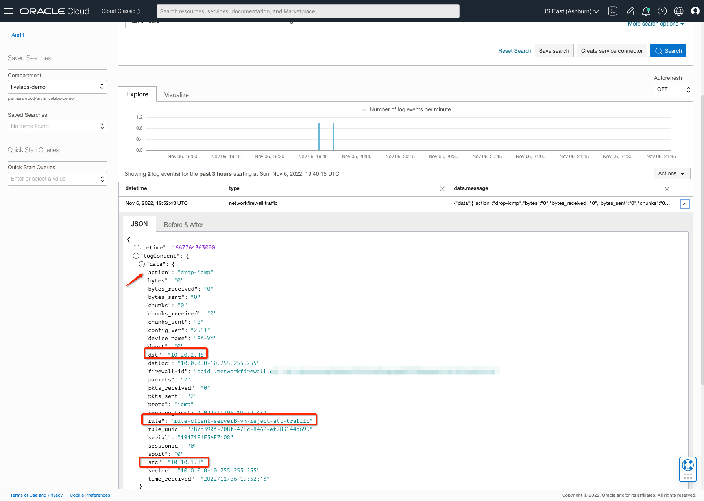

15. Below diagram validates that traffic is working between your Spoke VCMs and Client/Server VMs in **spoke-vcn**. 

   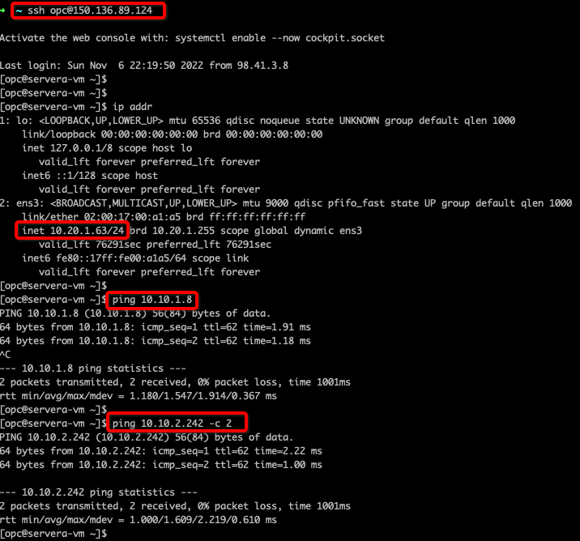

16. You can also verify traffic from **Traffic Logs** on your **Network Firewall** resource.

   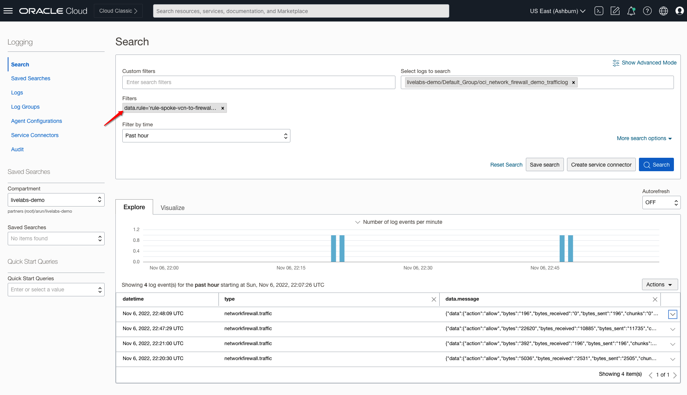

17. You can also expand the logs and confirm if it's hitting the right security rule **rule-spoke-vcn-to-firewall-vcn-allow-all-traffic** as below:

   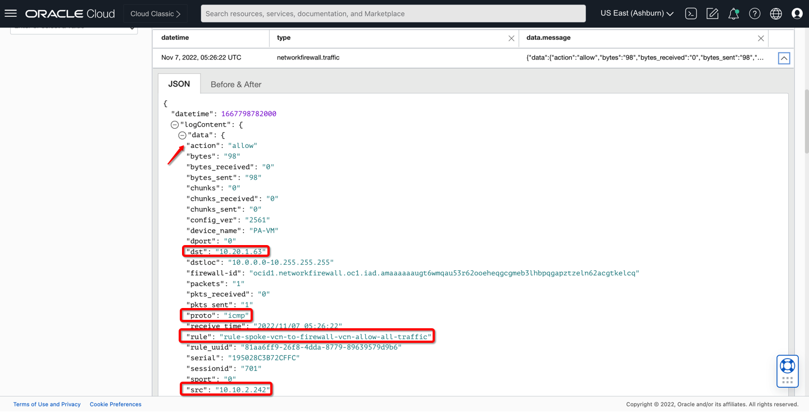

## Task 5: Validate IPS/IDS Traffic

1. From the OCI Services menu, click **Virtual Cloud Network** and navigate to **firewall-vcn**. 

   

2. Confirm **Client-Subnet** route table has an entry for Internet Traffic **0.0.0.0/0** via **Network Firewall**:

   

3. Confirm **Firewall-Subnet** route table has an entry for Internet Traffic **0.0.0.0/0** via **internet-gateway**:

   

4. Confirm **InternetGateway** route table has an entry for return traffic of **Client-Subnet** CIDR:

   

5. You have already defined the required security rule in **Lab 3** but you can double check, for this task below rule will take effect: 

   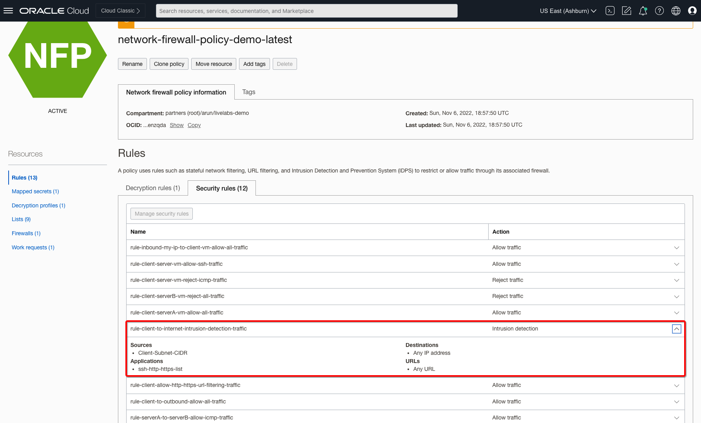

6. Connect to **Client-VM** instance public IP on your local machine's over **SSH** as per below table and initiate **ICMP** traffic which should go through **Network-Firewall**:

    | VM       | Port  | IP                                   | Example                                   |
    |----------|-------|--------------------------------------|-------------------------------------------|
    | Client VM | 22   | VM Public IP                         | ssh opc@129.213.19.12                     |

7. Below table represents traffic flow and associated security rules which will be validated: 

    | Traffic From       | Traffic To  |  Traffic  | Action        | Network Firewall Policy Rule                               |
    |-------------------------|-------------|--------------------|-----------------|--------------------------------------------|
    | Client VM | Internet Traffic   | IDS Traffic over HTTPS| IDS Profile         | rule-client-to-internet-intrusion-detection-traffic                     |

8. Below diagram validates that Outbound traffic is working when the User downloads a malware file. 

   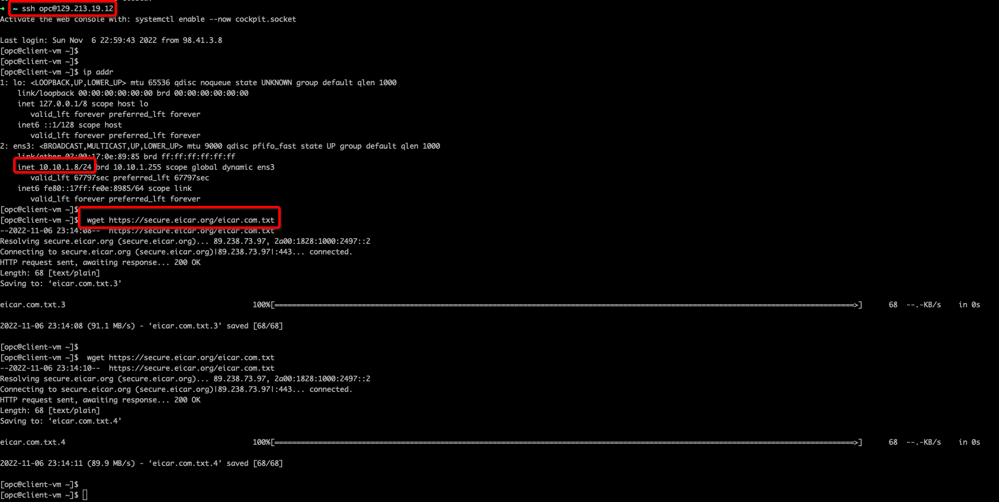

9. You can also verify traffic from **Traffic Logs** on your **Network Firewall** resource. Data *filters* are available, below screenshot shows **policy-rule** filtered traffic:

   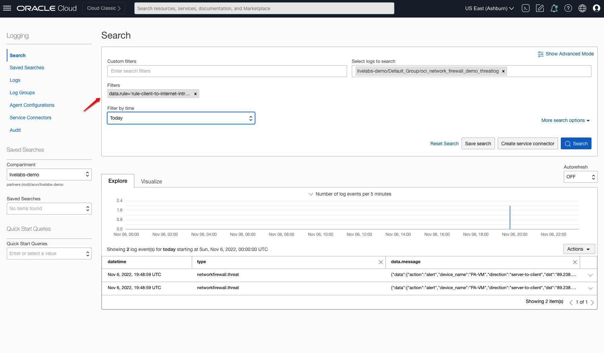

10. You can expand the logs and confirm it's hitting the right security rule **rule-client-to-internet-intrusion-detection-traffic** as below: 

   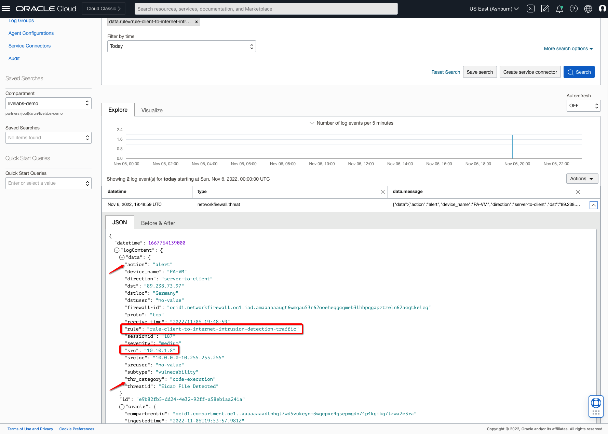

11. You can update action of **rule-client-to-internet-intrusion-detection-traffic** policy rule to **Intrusion prevention** and try to redownload malware file: 

   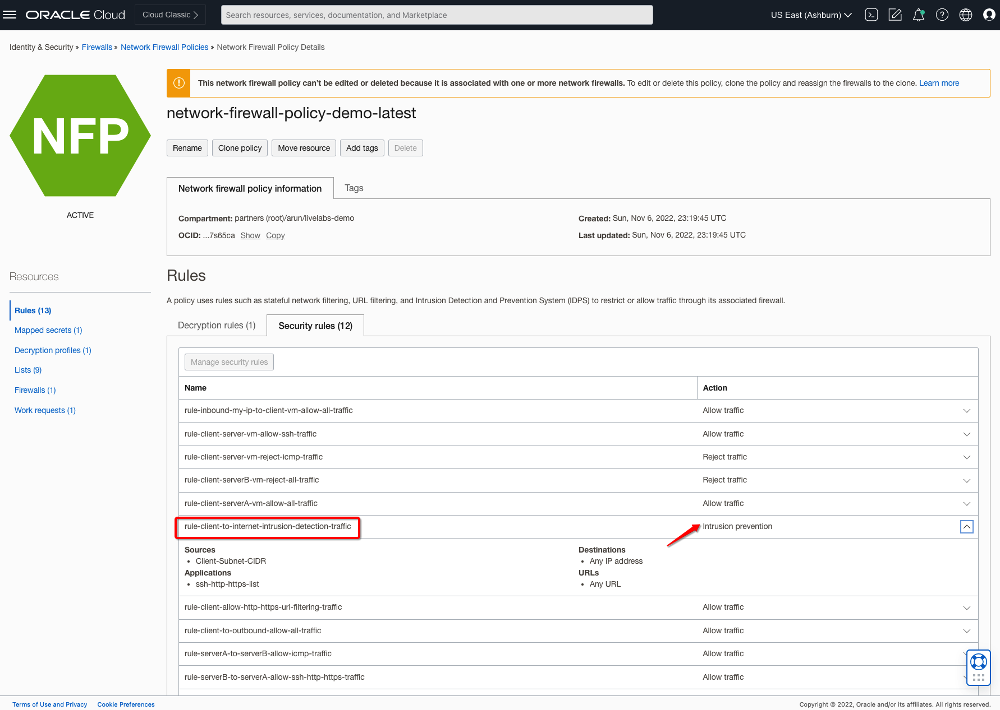

12. Below diagram validates that Outbound traffic is blocked when the User downloads a malware file. 

   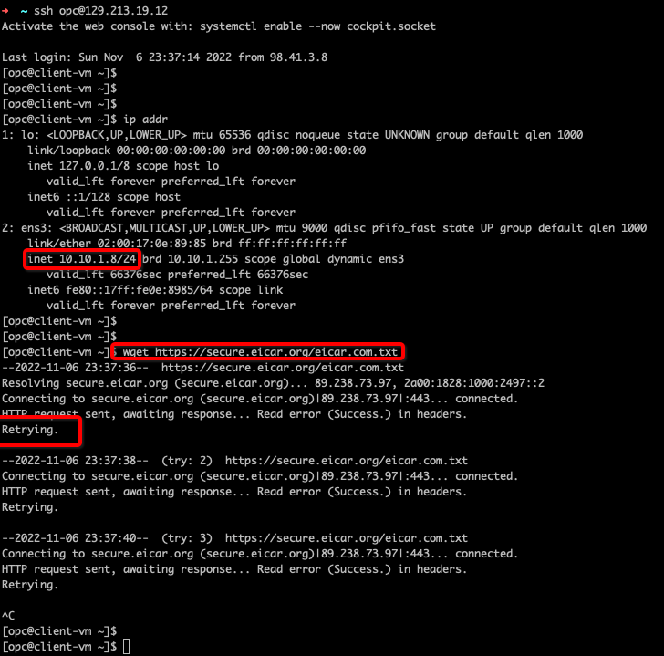

13. You can also verify traffic from **Traffic Logs** on your **Network Firewall** resource. Data *filters* are available, below screenshot shows **policy-rule** filtered traffic:

   

14. You can expand the logs and confirm it's hitting the right security rule **rule-client-to-internet-intrusion-detection-traffic** as below: 

   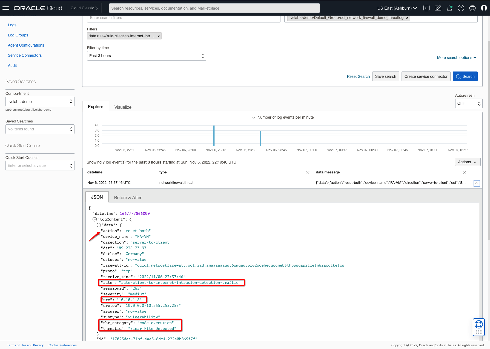

## Task 6: Validate URL Filtering Traffic

1. From the OCI Services menu, click **Virtual Cloud Network** and navigate to **firewall-vcn**. 

   

2. Confirm **Client-Subnet** route table has an entry for Internet Traffic CIDR **0.0.0.0/0** via **Network Firewall**:

   

3. Confirm **Firewall-Subnet** route table has an entry for Internet Traffic CIDR **0.0.0.0/0** via **internet-gateway**:

   

4. Confirm **InternetGateway** route table has an entry for return traffic of **Client-Subnet** CIDR:

   

5. You have already defined the required security rule in **Lab 3** but you can double check, for this task below rule will take effect: 

   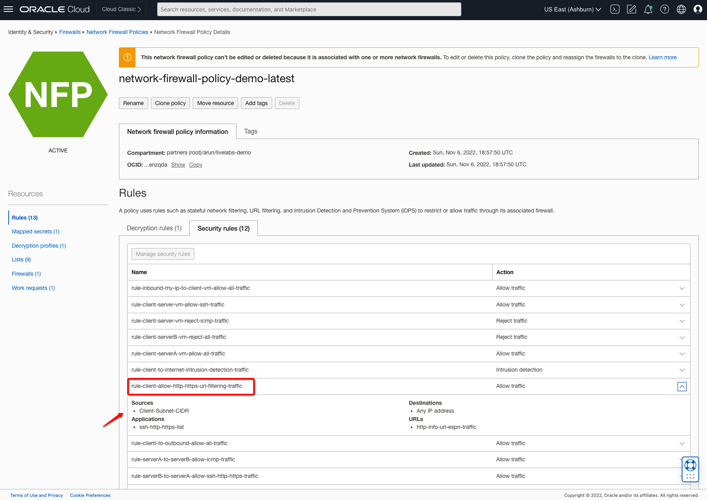

6. Connect to **Client-VM** instance public IP on your local machine's over **SSH** as per below table and initiate **ICMP** traffic which should go through **Network-Firewall**:

    | VM       | Port  | IP                                   | Example                                   |
    |----------|-------|--------------------------------------|-------------------------------------------|
    | Client VM | 22   | VM Public IP                         | ssh opc@129.213.19.12                     |

7. Below table represents traffic flow and associated security rules which will be validated: 

    | Traffic From       | Traffic To  |  Traffic  | Action        | Network Firewall Policy Rule                               |
    |-------------------------|-------------|--------------------|-----------------|--------------------------------------------|
    | Client VM | Internet Traffic   | HTTP and HTTPS| Allowed with selected URLs         | rule-client-allow-http-https-url-filtering-traffic                      |

8. Below diagram validates that the Client VM connects to Internet URL over HTTP and HTTPS/SSL traffic. 

   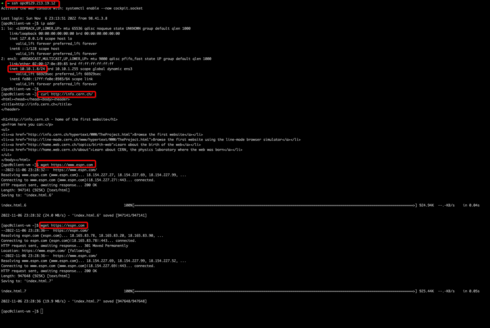

9. You can also verify traffic from **Traffic Logs** on your **Network Firewall** resource. Data *filters* are available, below screenshot shows **policy-rule** filtered traffic:

   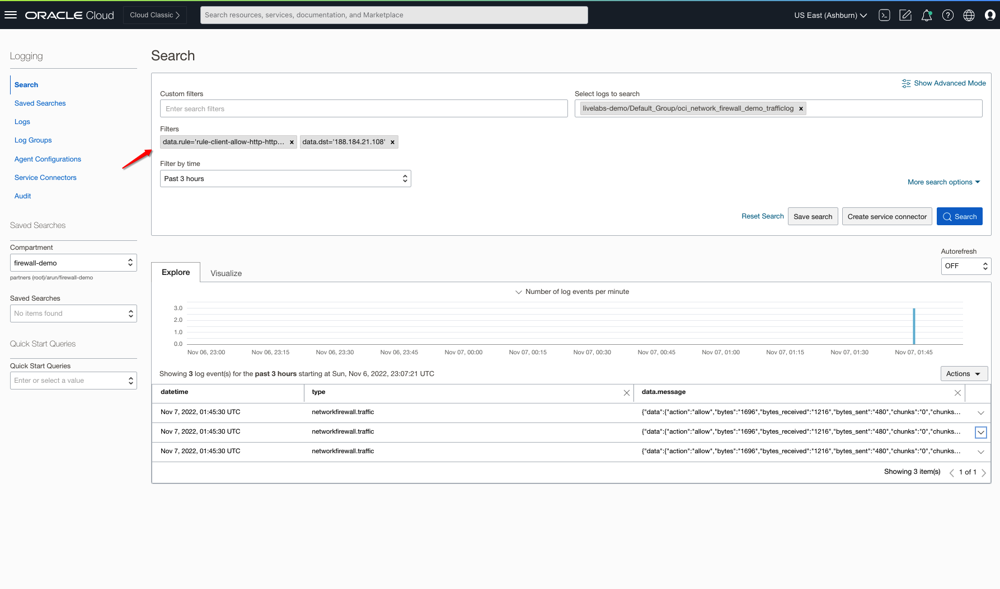

10. You can expand the logs and confirm it's hitting the right security rule **rule-client-allow-http-https-url-filtering-traffic** as below and **filter** with: 

   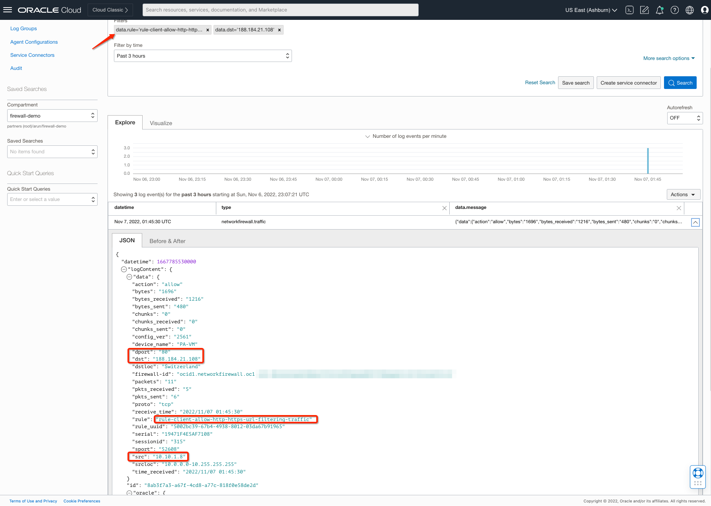

## Task 7: Validate SSL Forward Proxy Traffic

1. From the OCI Services menu, click **Virtual Cloud Network** and navigate to **firewall-vcn**. 

   

2. Confirm **Client-Subnet** route table has an entry for Internet Traffic **0.0.0.0/0** via **Network Firewall**:

   

3. Confirm **Firewall-Subnet** route table has an entry for Internet Traffic **0.0.0.0/0** via **internet-gateway**:

   

4. Confirm **InternetGateway** route table has an entry for return traffic of **Client-Subnet** CIDR:

   

5. You have already defined the required security rule in **Lab 3** but you can double check, for this task below rule will take effect: 

   

6. Connect to **Client-VM** instance public IP on your local machine's over **SSH** as per below table and initiate **ICMP** traffic which should go through **Network-Firewall**:

    | VM       | Port  | IP                                   | Example                                   |
    |----------|-------|--------------------------------------|-------------------------------------------|
    | Client VM | 22   | VM Public IP                         | ssh opc@129.213.19.12                     |

7. Below table represents traffic flow and associated security rules which will be validated: 

    | Traffic From       | Traffic To  |  Traffic  | Action        | Network Firewall Policy Rule                               |
    |-------------------------|-------------|--------------------|-----------------|--------------------------------------------|
    | Client VM | Internet Traffic   | HTTP and HTTPS| Allowed         | rule-client-to-internet-intrusion-detection-traffic                     |

8. Below diagram validates that the Client VM connects to the Internet over HTTPS/SSL traffic. 

   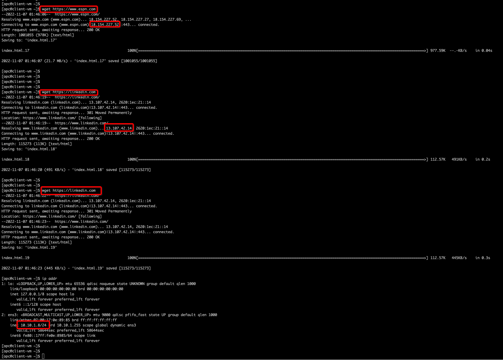

9. You can also verify traffic from **Traffic Logs** on your **Network Firewall** resource. Data *filters* are available, below screenshot shows **policy-rule** filtered traffic:

   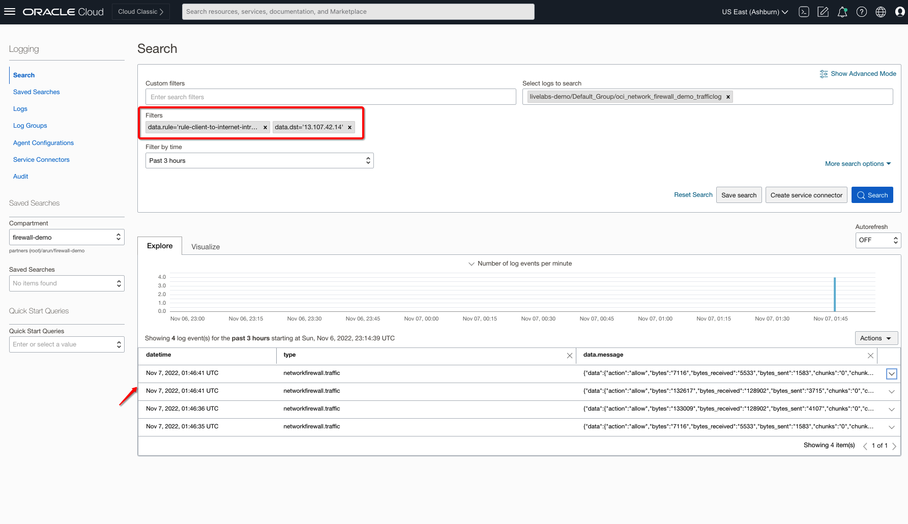

10. You can expand the logs and confirm it's hitting the right security rule **rule-client-to-internet-intrusion-detection-traffic** as below: 

   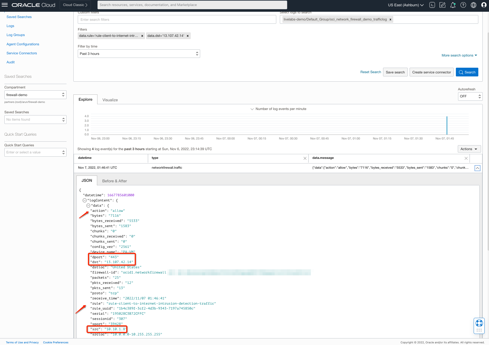

## Task 8: Validate NAT Gateway Ingress Routing Traffic

1. From the OCI Services menu, click **Virtual Cloud Network** and navigate to **firewall-vcn**. 

2. Confirm **Client-Subnet** route table has an entry for Internet Traffic **0.0.0.0/0** via **Network Firewall**:

   

3. Confirm **Firewall-Subnet** route table has an entry for Internet Traffic **0.0.0.0/0** via **nat-gateway** and for **public-ip** via **internet-gateway**:

   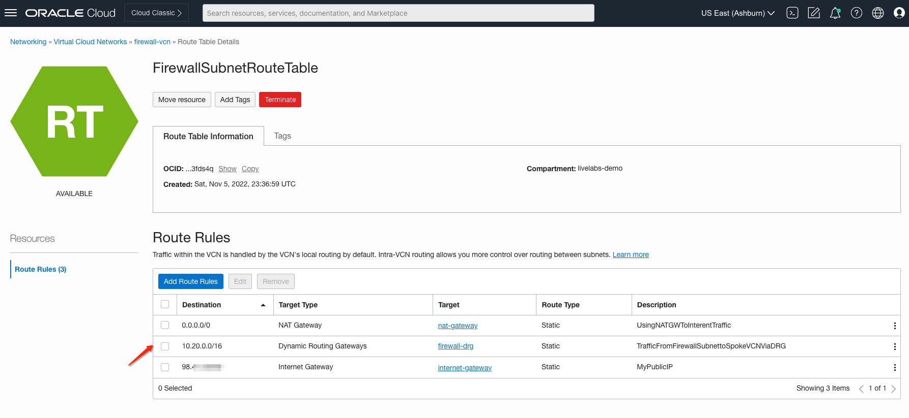

   > **Please Read**: We have updated the route table here with default route entry via **NAT-GW** and access to **Client-VM** using your public IP via **IGW**. 

4. Click on **Create Route Table** on **Route Tables** resources under **firewall-vcn** section. You will be creating a NAT Gateway route table. Fill out the dialog box: 

      - **NAME**: Provide a name; In your case **NAT-GW-RT**
      - **COMPARTMENT**: Ensure your compartment is selected

5. Click **Another Route Rule**

6. Enter the required entries as below, and click on **Another Route Rule** as needed:

    - **First Entry**
        - Select the Target Type as **Private IP** 
        - Enter the **Destination CIDR Block**
            - In this case you will put **10.10.1.0/24** for incoming traffic of Client Subnet via **OCI Network Firewall**.
        - **Target Selection**: Enter **Network Firewall** IP Address.

7. Verify all the information and Click **Create**.

   

8. This will create NAT Gateway Route Table for firewall-vcn with the following components.

    *Created NAT GW RouteTable for firewall-vcn*

9. You have already defined the required security rule in **Lab 3** but you can double check, for this task below rule will take effect: 

   

10. Connect to **Client-VM** instance public IP on your local machine's over **SSH** as per below table and initiate **ICMP** traffic which should go through **Network-Firewall**:

    | VM       | Port  | IP                                   | Example                                   |
    |----------|-------|--------------------------------------|-------------------------------------------|
    | Client VM | 22   | VM Public IP                         | ssh opc@129.213.19.12                     |

11. Below table represents traffic flow and associated security rules which will be validated: 

    | Traffic From       | Traffic To  |  Traffic  | Action        | Network Firewall Policy Rule                               |
    |-------------------------|-------------|--------------------|-----------------|--------------------------------------------|
    | Client VM | Internet Traffic   | HTTP and HTTPS| Allowed with selected URLs         | rule-client-to-outbound-allow-all-traffic                     |

12. You can also **Block** the traffic at the **NAT Gateway** level which will also allow you to validate stop traffic. 

   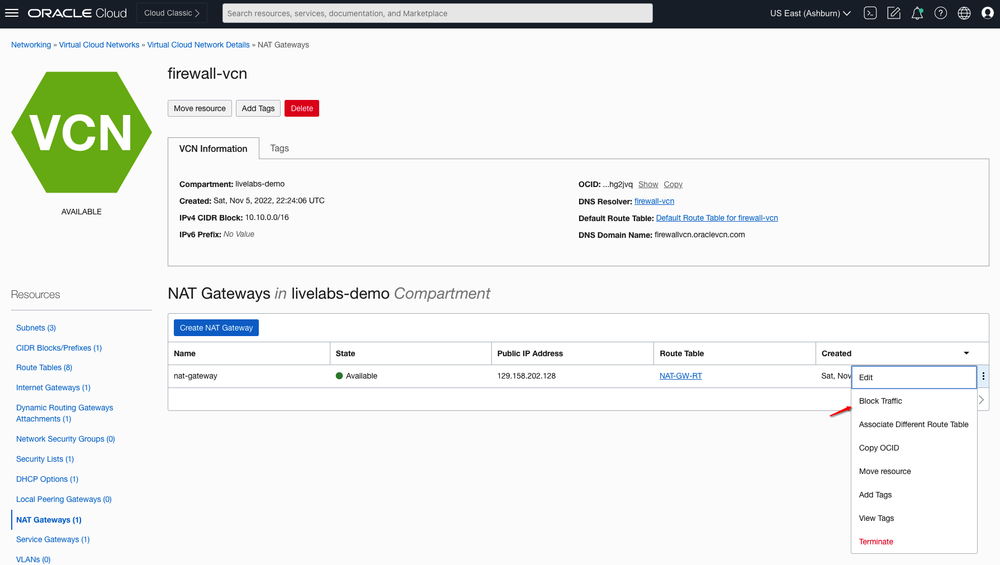

13. Below diagram validates that the Client VM connects to the Internet over HTTPS/SSL traffic. 

   

14. You can also verify traffic from **Traffic Logs** on your **Network Firewall** resource. Data *filters* are available, below screenshot shows **policy-rule** filtered traffic:

   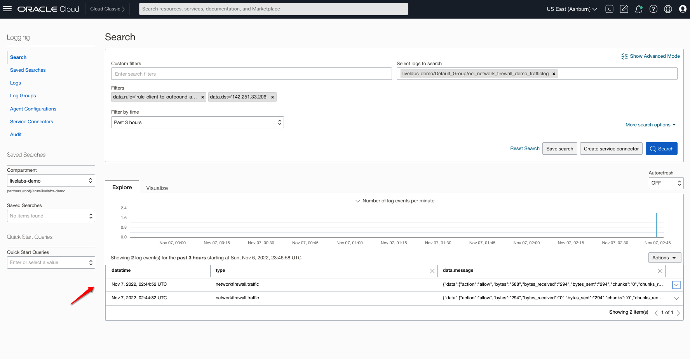

15. You can expand the logs and confirm it's hitting the right security rule **rule-client-to-outbound-allow-all-traffic** as below: 

   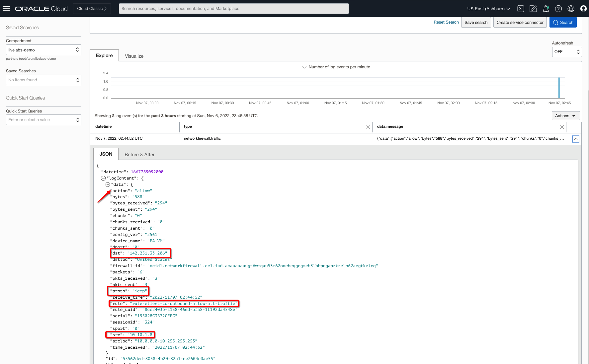

## Task 9: Explore SGW Gateway Ingress Routing Traffic

1. You can also use **Service Gateway** ingress routing capabilities to ensure traffic destined to **OCI Network** inspected by **Network Firewall**. 

   > **Please Read** Currently you can't create NAT-GW/IGW route entries in the same route table as **SGW**. So you would have to modify your use-case to 

2. You could consider deploying another **Network Firewall** in a private subnet so **OCI SGW Network** traffic can be inspected by this new firewall. 

3. You should consider firewall pricing too which plays a critical role when designing architecture.

***Congratulations! You have completed the lab.***

You may now **proceed to the next lab**.

## Learn More

1. [OCI Training](https://www.oracle.com/cloud/iaas/training/)
2. [Familiarity with OCI console](https://docs.us-phoenix-1.oraclecloud.com/Content/GSG/Concepts/console.htm)
3. [Overview of Networking](https://docs.us-phoenix-1.oraclecloud.com/Content/Network/Concepts/overview.htm)
4. [Overview of OCI Network Firewall](https://docs.oracle.com/en-us/iaas/Content/network-firewall/overview.htm)
5. [OCI Network Firewall Cloud Security Page](https://www.oracle.com/security/cloud-security/network-firewall/)
6. [OCI Intra VCN Routing Capabilities](https://docs.oracle.com/en-us/iaas/Content/Network/Tasks/managingroutetables.htm)

## Acknowledgements

- **Author** - Arun Poonia, Principal Solutions Architect
- **Adapted by** - Oracle
- **Contributors** - N/A
- **Last Updated By/Date** - Arun Poonia, Oct 2022