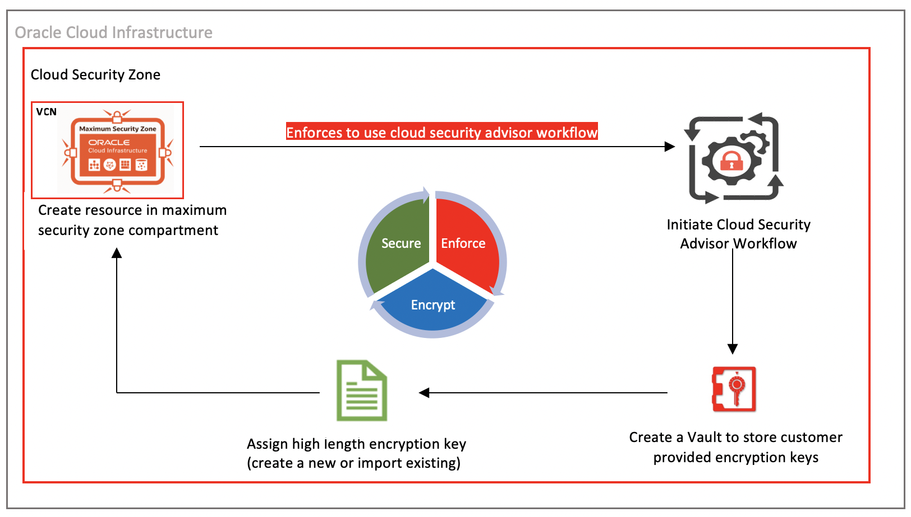

# Introduction

## About this Workshop

This hands-on workshop provides users with step-by-step instructions on provisioning compute and storage resources on Oracle Cloud Infrastructure(OCI)musing Oracle Cloud Security Advisor and it's Workflows. It provides detailed technical steps to use customer managed high length encryption keys while creating OCI resources like storage bucket, block volumes and compute machines. 

Security Advisor only allows you to create master encryption key with 4096 bits in length and fulfils the requirements of the tenancy by Security Zones configurations. It provides an interactive walkthrough and graphical user interface and comes as a complementary offering of Oracle Maximum Security Zones service.

**Security Advisor Workflow :**

  
  
Estimated Workshop Time: 1 Hour

### Workshop Objectives
In this workshop, you will learn how to:
* Create a Maximum Security Zone and Maximum Secure Compartment
* Grant security access in policy to create resources in the compartment
* Create OCI Key Vault
* Invoke and use OCI Security Advisor Workflows
* Create secure Object Storage Bucket using Oracle Cloud Security Advisor
* Create Secure Block Volume using Oracle Cloud Security Advisor
* Create Secure Virtual Machine Instance using Oracle Cloud Security Advisor

### Prerequisites
* An Oracle Free Tier, Always Free, Paid or LiveLabs Cloud Account
* Some understanding of cloud and security terms is helpful
* Familiarity with Oracle Cloud Infrastructure (OCI) is helpful

## Learn More
- You can find more information about OCI Security Cloud Advisor [here](https://docs.oracle.com/en-us/iaas/Content/SecurityAdvisor/Concepts/securityadvisoroverview.htm)

## Technical support
For any technical issues related to OCI and Security Advisor, please contact Oracle support through OCI cloud console support or help button. SMEs will monitor the SR and respond to any questions or issues.

## Acknowledgements
* **Author** - Sanjay Rahane, Senior Cloud Engineer, NA Cloud Engineering
* **Contributors** -  Sanjay Rahane, Senior Cloud Engineer, NA Cloud Engineering
* **Last Updated By/Date** - Sanjay Rahane, Senior Cloud Engineer, NA Cloud Engineering, September 2021
