# Create a Secure Bucket Using OCI Security Advisor

## Introduction

This lab walks you through the steps to create a Secure Bucket using Security Advisor. It involves creating not only the bucket but also create a vault and key which will be used to encrypt the bucket and meets minimum security requirements established by security zones. Existing key can also be used to import in a vault and use to create a secure bucket.

Estimated Time:  30 Minutes


### Objectives
In this lab, you will learn to :
* Create a Maximum Security Zone and Maximum Security Compartment
* Grant security access in policy to create resources in the compartment
* Create OCI Key Vault
* Create a Secure Object Storage Bucket using OCI Security Advisor

### Prerequisites  

This lab assumes you have:
- A Free or LiveLabs Oracle Cloud account
- IAM policies to create resources in the compartment


##  Task 1: Create a Maximum Security Zone and Maximum Security Compartment

1. Login to the Oracle Cloud.

2. Once you are logged in, you are taken to the cloud services dashboard where you can see all the services available to you. Click the navigation menu in the upper left to show top level navigation choices. From options, click Identity & Security, and then click Security Zones.
 
  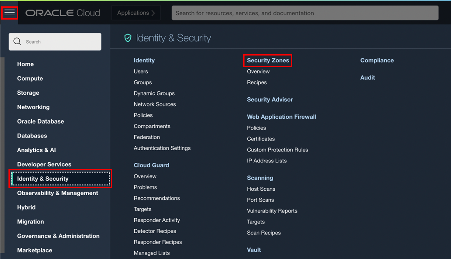

3. Enter a name and description for the security zone.
    Oracle Cloud creates a compartment  with the same name and assigns it to this security zone.
    Avoid entering confidential information.
    For Create in Compartment, navigate to the compartment that you want to create the new compartment in and then click Create Security Zone.

  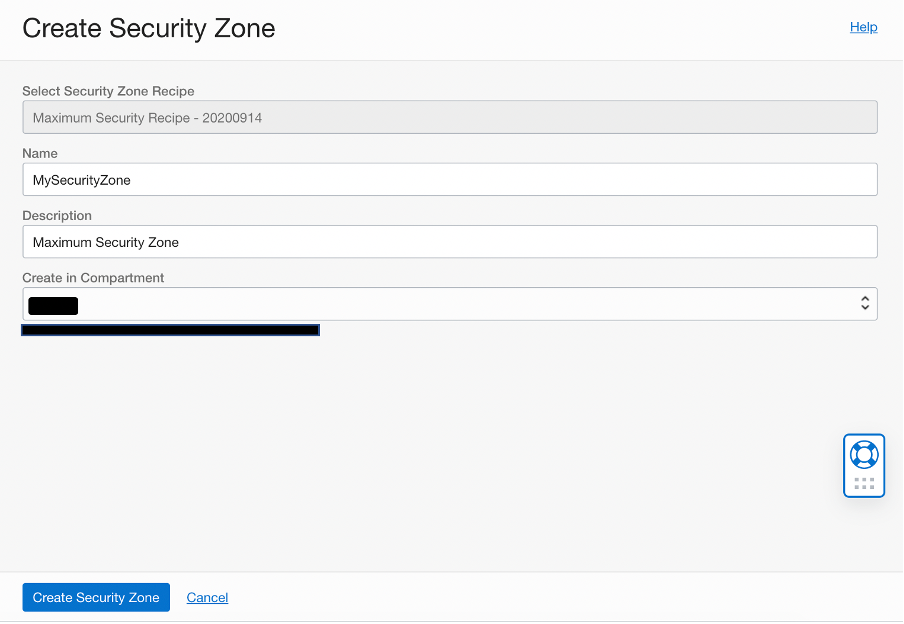

4. You can see the new Maximum Security Compartment created in security zone. 
    Click the navigation menu in the upper left to show top level navigation choices. From options, click Identity & Security, and then click Compartments. You will be able to see the compartment created and Security Zone option "Enabled" as shown in below image.

  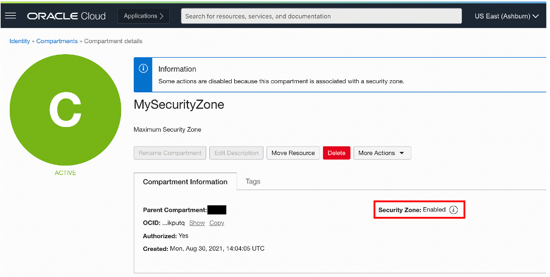

5. Default policies will be applied to the new security zone compartment. Open the navigation menu and click Identity & Security.Under Security Zones, click Overview. Click the name of the security zone and then click the recipe for the security zone.

  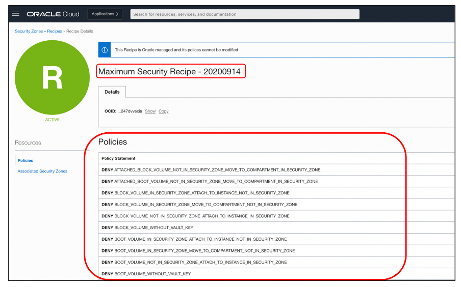


##  Task 2: Grant security access in policy to create resources in the compartment

- To use Oracle Cloud Infrastructure, you must be granted security access in a policy  by an administrator.
- As an Administrator, please create below polices:
 
      ```
  <copy>
  allow group CreateSecureOSBucketGroup to manage object-family in compartment compartment_name
  allow group CreateSecureOSBucketGroup to manage vaults in compartment compartment_name
  allow group CreateSecureOSBucketGroup to manage keys in compartment compartment_name
  allow service ObjectStorage to use keys in compartment compartment_name
  </copy>
      ```  

##  Task 3: Create OCI Key Vault

1. Open the navigation menu, click Identity & Security, and then click Vault.

    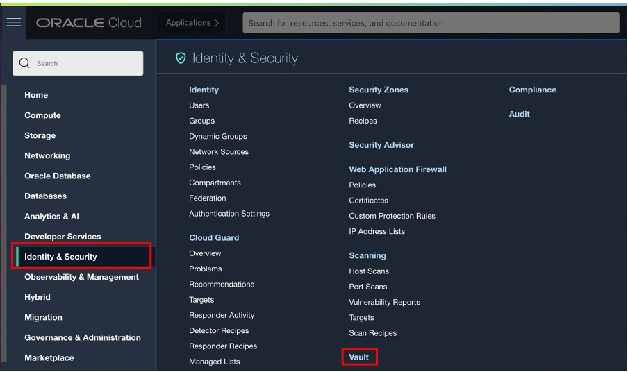

2. Under List Scope, in the Compartment list, click the name of the compartment where you want to create the vault.
    Click Create Vault and in the Create Vault dialog box, click Name, and then enter a display name for the vault.
    Optionally, make the vault a virtual private vault by selecting the Make it a virtual private vault check box.

    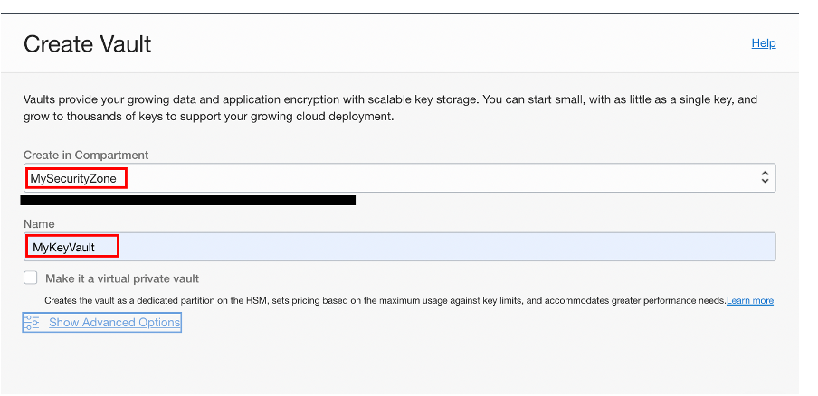

3. After Vault is created, you will be able to see the details as shown in below image.

    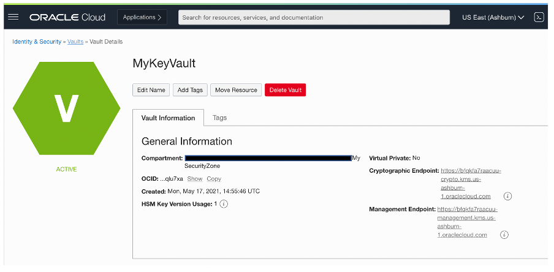


##  Task 4: Create a Secure Object Storage Bucket

1. Open the navigation menu, click **Identity & Security**, and then click **Security Advisor**

  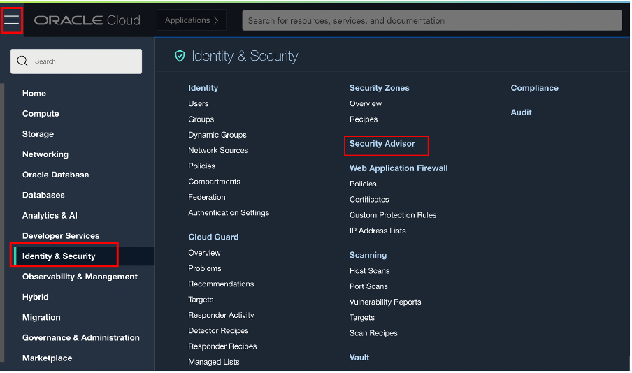

2. Security Advisor Window will be shown as below. Security Advisor use workflow which enforce the use of underlined best practices of using high length customer managed encryption keys which is enforced by **Security Zones** and **Maximum Security Compartment**. Click on Create Secure Bucket button to initiate the Security Advisor Workflow. Security Advisor workflows help you create resources that abide by the enhanced security requirements of such environments.

  

3. Security Advisor Workflow is a five steps process to create a secure bucket using customer managed encryption keys with high length, to secure sensitive data on OCI. On Getting Started windows it, lists pre-requisite steps required to perform before provisioning or creating the bucket as shown in below image.

  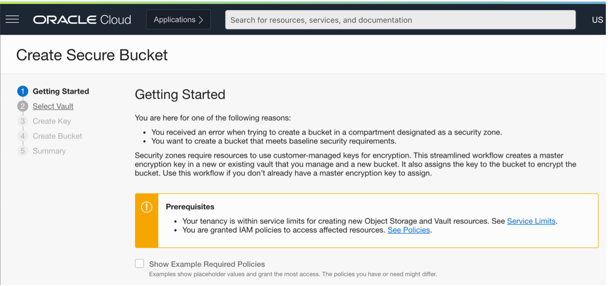

4. Click on **Show Example Required Policies** to get the list of policies required to create a bucket using Security Advisor.
This pre-requisite steps are taken care in Task 2. Review the details and click on Next.

  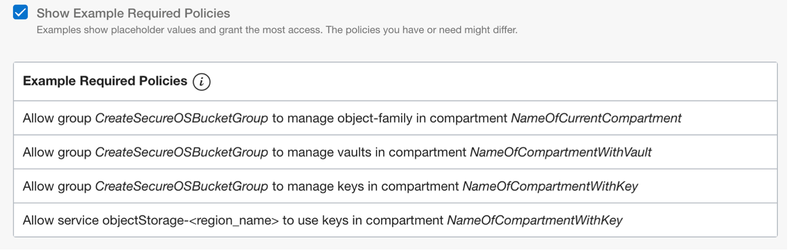

5. Choose the compartment where the vault resides, and then choose the vault as shown in below image.

  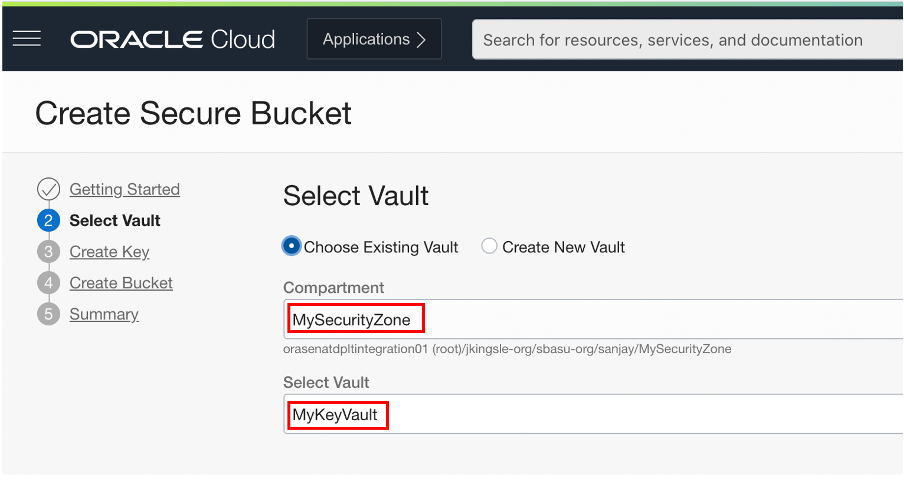

6. Provide input parameters as below:

    * Click Name, and then enter a name to identify the key. Avoid entering confidential information.
    * Click Key Shape: Algorithm, and then choose from one of the following algorithms:
        * **AES** : Advanced Encryption Standard (AES) keys are symmetric keys that you can use to encrypt data at rest.
        * **RSA** : Rivest-Shamir-Adleman (RSA) keys are asymmetric keys, also known as key pairs consisting of a public key and a private key, that you can use to encrypt data in transit, to sign data, and to verify the integrity of signed data.
        * **ECDSA** :  Elliptic curve cryptography digital signature algorithm (ECDSA) keys are asymmetric keys that you can use to sign data and to verify the integrity of signed data.
    * Select **Key Shape : Length** based on the **Key Shape : Algorithm**. For AES keys, the Vault service supports keys that are exactly 128 bits, 192 bits, or 256 bits in length.
    * Select option Import external key to use customer managed existing key, which allows to select the file from localfile system and upload to OCI Valut.

  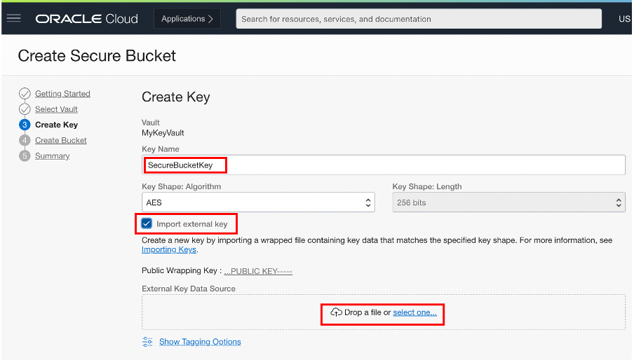

7. On the Create Bucket page, specify the attributes of the bucket as below and click next:
    * Bucket Name : Enter name of your choice
    * Create in Compartment : Select compartment created in Task 1
    * Storage Tier: Standard or Archive
    * Objects Events
    * Object Versioning

  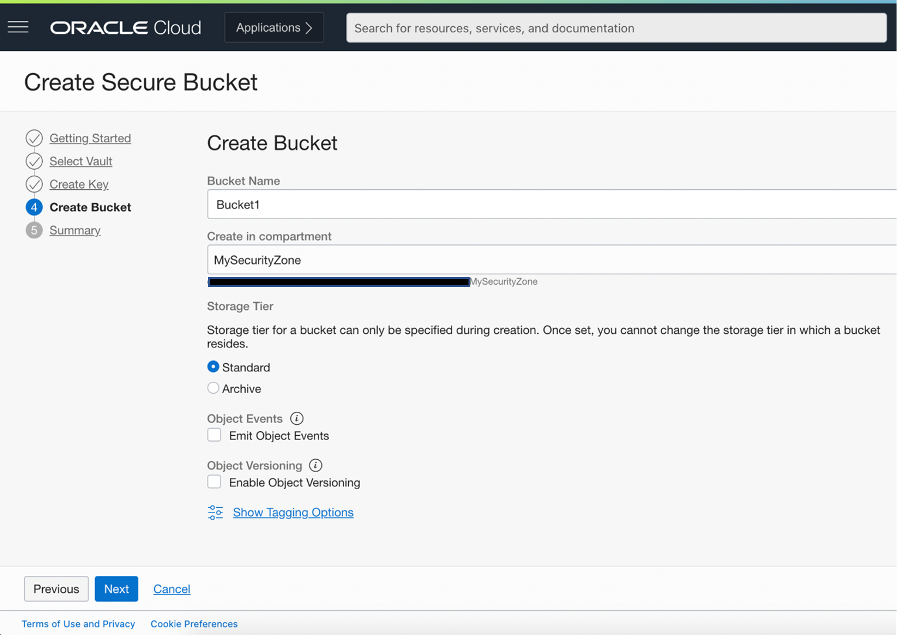

8. Summary page will show all the details provided in previous steps as part of Security Advisor Workflow. Review the details and click **Create Secure Bucket**.

  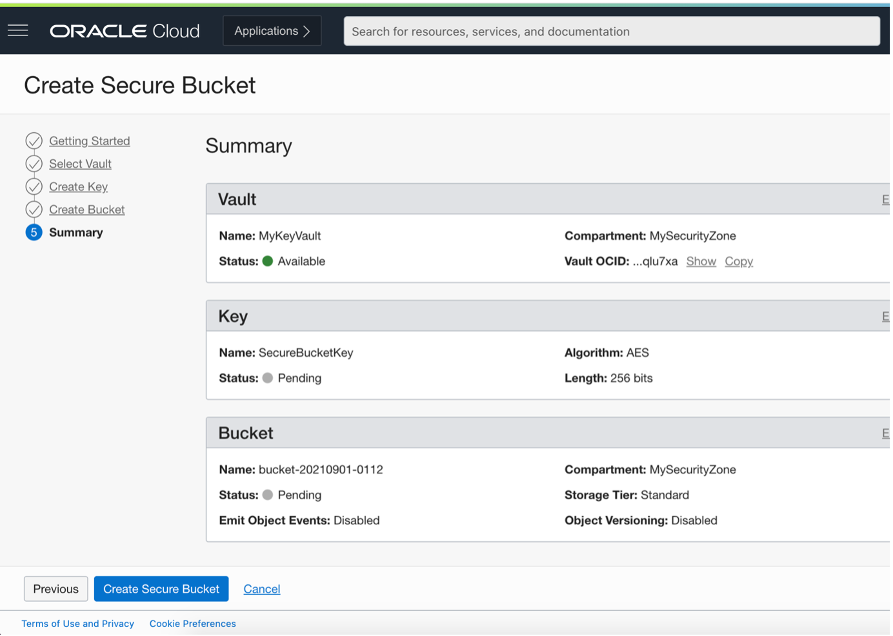

9. Object Storage Bucket will get created and encrypted using encryption key selected.

  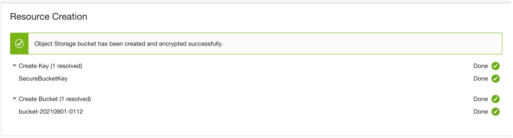

You may now **proceed to the next lab**.

## Learn More
- You can find more information about OCI Security Cloud Advisor [here](https://docs.oracle.com/en-us/iaas/Content/SecurityAdvisor/Concepts/securityadvisoroverview.htm)


## Acknowledgements
* **Author** - Sanjay Rahane, Senior Cloud Engineer, NA Cloud Engineering
* **Contributors** -  Sanjay Rahane, Senior Cloud Engineer, NA Cloud Engineering
* **Last Updated By/Date** - Sanjay Rahane, Senior Cloud Engineer, NA Cloud Engineering, September 2021