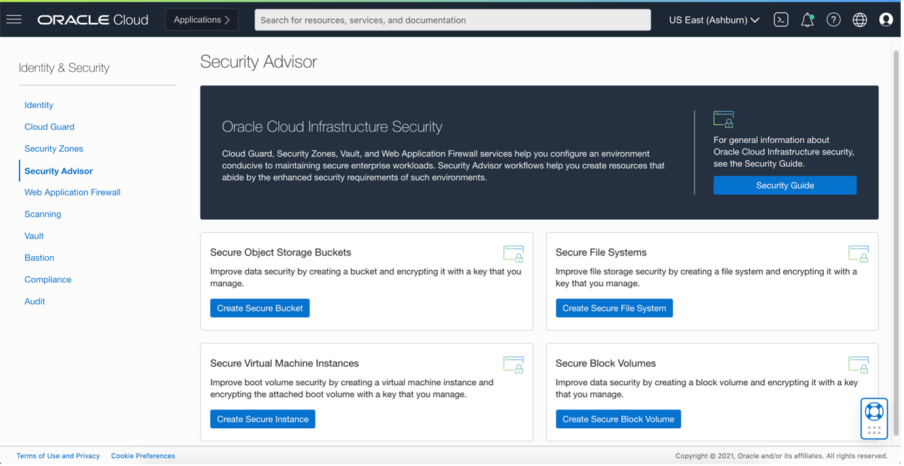
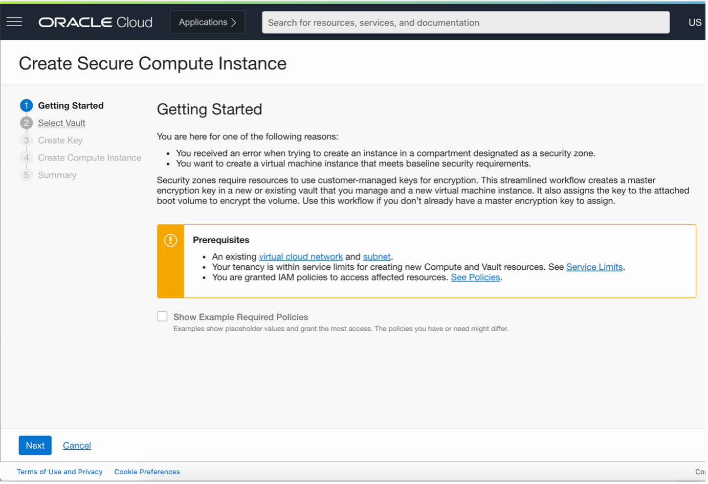
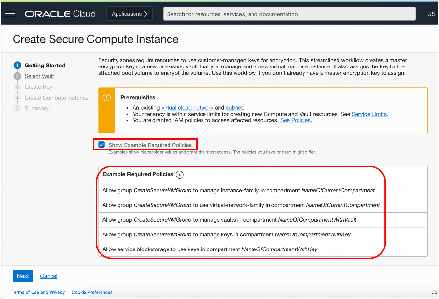
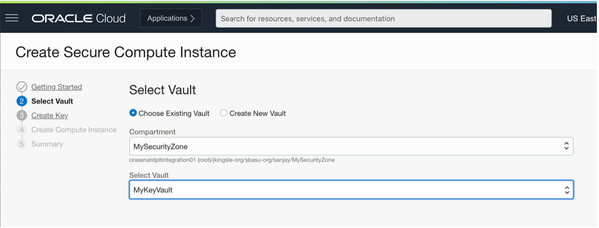
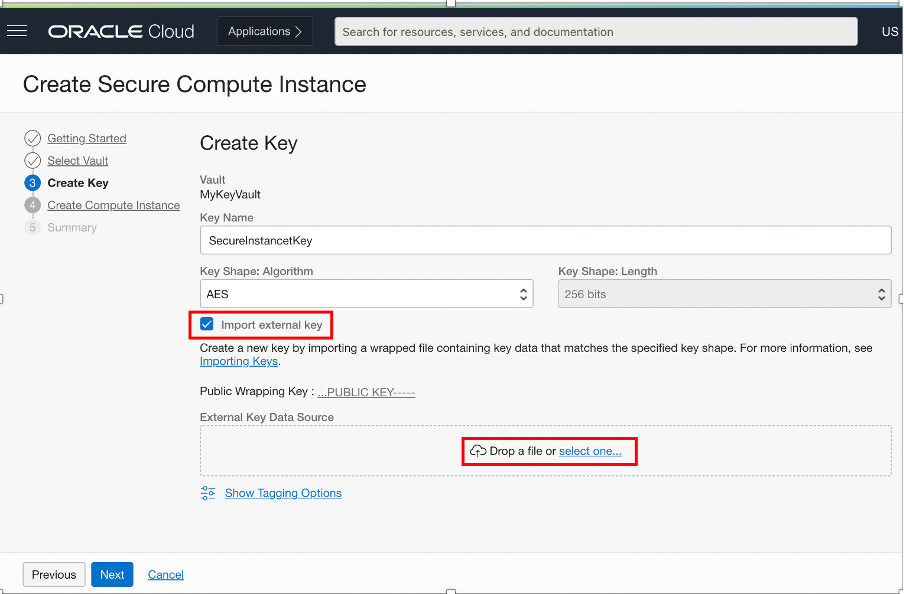
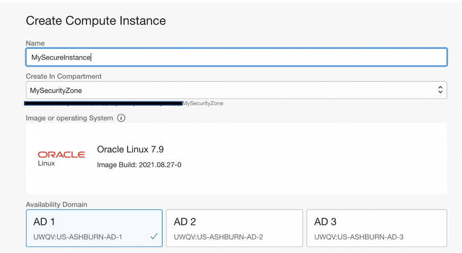
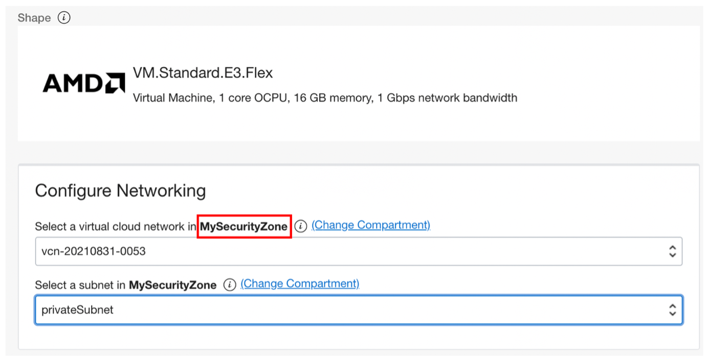
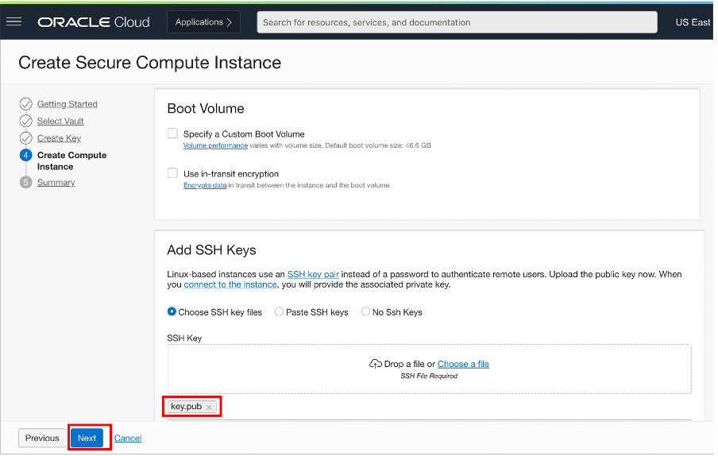
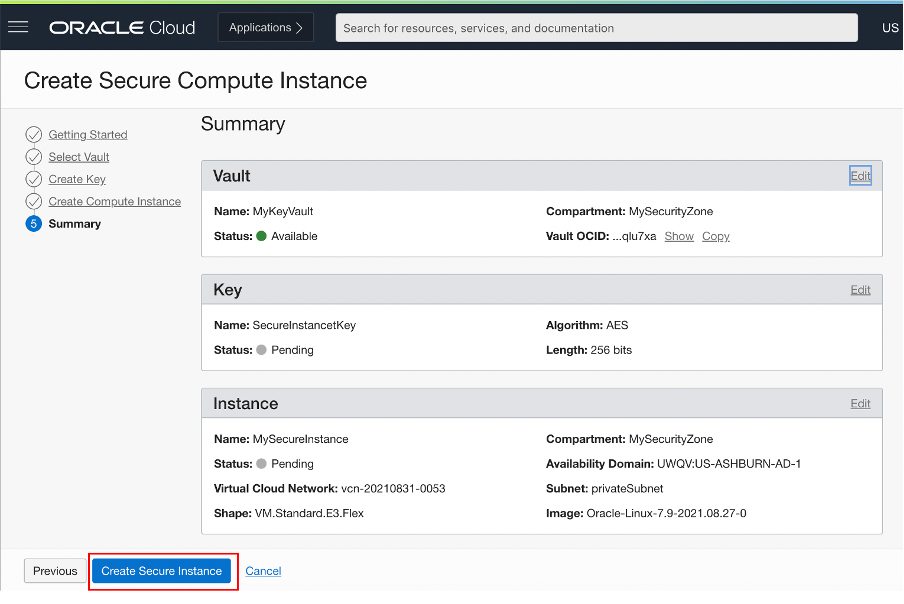
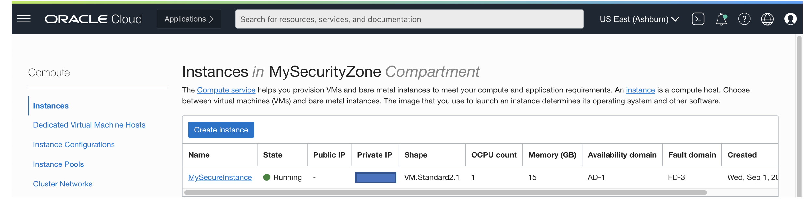

# Create a Secure Virtual Machine Instance Using OCI Security Advisor

## Introduction

This lab walks you through the steps to create a Secure Virtual Machine Instance using Security Advisor. It involves creating not only the virtual machine but also create a vault and key which will be used to encrypt the virtual machine data and meets minimum security requirements established by security zones. Existing key can also be used to import in a vault and use to create a secure virtual machine instance.

Estimated Time:  15 Minutes

### Objectives
In this lab, you will learn to :
* Create or Import Customer Managed Encryption Key
* Create a Secure Virtual Machine Instance using OCI Security Advisor

### Prerequisites  

This lab assumes you have:
- A Free or LiveLabs Oracle Cloud account
- IAM policies to create resources in the compartment

##  Task 1: Create a Secure Virtual Machine Instance

1. Open the navigation menu, click **Identity & Security**, and then click **Security Advisor**

  

2. Security Advisor Window will be shown as below. Security Advisor use workflow which enforce the use of underlined best practices of using high length customer managed encryption keys which is enforced by **Security Zones** and **Maximum Security Compartment**. Click on **Create Secure Instance** button to initiate the Security Advisor Workflow. Security Advisor workflows help you create resources that abide by the enhanced security requirements of such environments.

  

3. Security Advisor Workflow is a five steps process to create a secure bucket using customer managed encryption keys with high length, to secure sensitive data on OCI. On Getting Started windows it, lists pre-requisite steps required to perform before provisioning or creating the secure instance as shown in below image.

  

4. Click on **Show Example Required Policies** to get the list of policies required to create a secure compute instance using Security Advisor.
This pre-requisite steps are taken care in Lab 1, Task 2 of this workshop. Review the details and click on Next.

  

5. Choose the compartment where the vault resides, and then choose the vault as shown in below image.

  

6. Provide input parameters as below:

    * Click Name, and then enter a name to identify the key. Avoid entering confidential information.
    * Click Key Shape: Algorithm, and then choose from one of the following algorithms:
        * **AES** : Advanced Encryption Standard (AES) keys are symmetric keys that you can use to encrypt data at rest.
        * **RSA** : Rivest-Shamir-Adleman (RSA) keys are asymmetric keys, also known as key pairs consisting of a public key and a private key, that you can use to encrypt data in transit, to sign data, and to verify the integrity of signed data.
        * **ECDSA** :  Elliptic curve cryptography digital signature algorithm (ECDSA) keys are asymmetric keys that you can use to sign data and to verify the integrity of signed data.
    * Select **Key Shape : Length** based on the **Key Shape : Algorithm**. For AES keys, the Vault service supports keys that are exactly 128 bits, 192 bits, or 256 bits in length.
    * Select option Import external key to use customer managed existing key, which allows to select the file from localfile system and upload to OCI Valut.

  

7. On the Create Compute Instance page, specify the attributes of the instance as below and click next:
    * Name : Enter name of your choice
    * Create in Compartment : Select compartment created in Lab 1, Task 1 of this workshop
    * Image or Operating System: Select Operating System Image
    * Availability Domain : Select AD from the list as per your choice

  

8. As part of Configure Networking, select the Secure ZOne Compartment, VCN and Subnet as shown in below image. Subnet should be Private Subnet only to adhere the security guidelones enforced by Maximum Security Zone and Maximum Security Compartment.

  

9. In below section, select custome boot volume if required. In *ADD SSH Keys* section, public key needs to be selected, which will be used to connect to this instance in a privat subnet. Select the public ssh key and click on **Next**.

  

10. Summary page will show all the details provided in previous steps as part of Security Advisor Workflow. Review the details and click **Create Secure Virtual Machine Instance**.

  

11. Secure Virtual Machine Instance will get created and data will be encrypted using encryption key selected.

  

    **Congratulations !!! You Have Completed Successfully The Workshop .**

## Learn More
- You can find more information about OCI Security Cloud Advisor [here](https://docs.oracle.com/en-us/iaas/Content/SecurityAdvisor/Concepts/securityadvisoroverview.htm)

## Acknowledgements
* **Author** - Sanjay Rahane, Senior Cloud Engineer, NA Cloud Engineering
* **Contributors** -  Sanjay Rahane, Senior Cloud Engineer, NA Cloud Engineering
* **Last Updated By/Date** - Sanjay Rahane, Senior Cloud Engineer, NA Cloud Engineering, September 2021