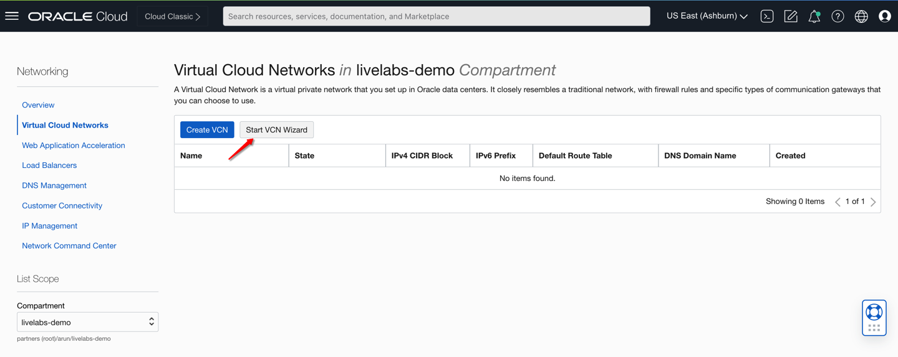
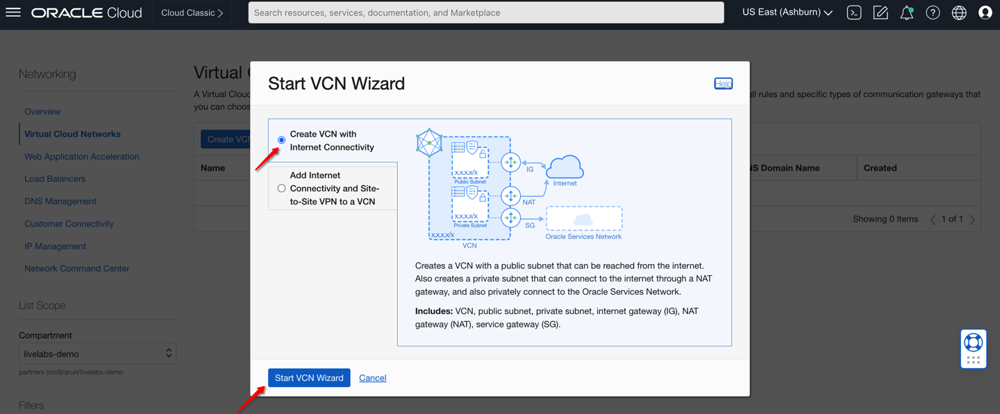
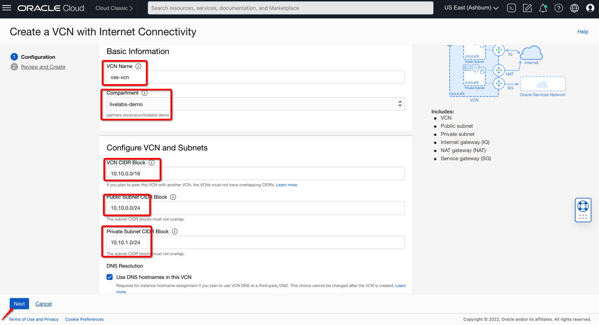
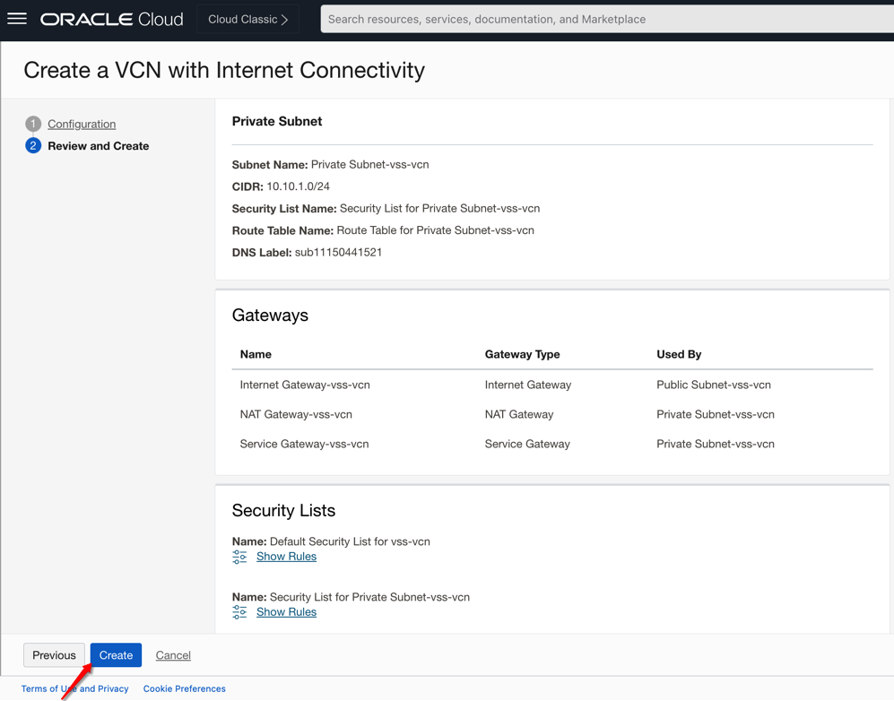
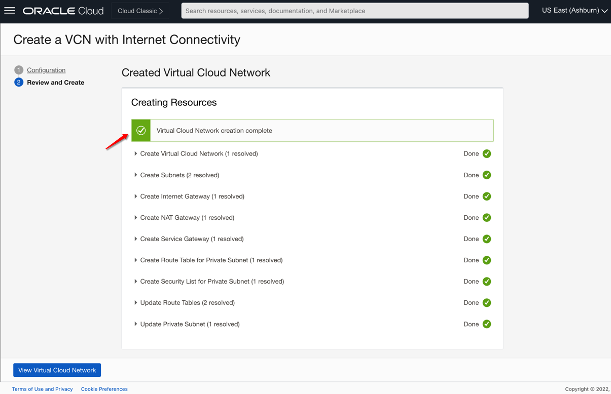
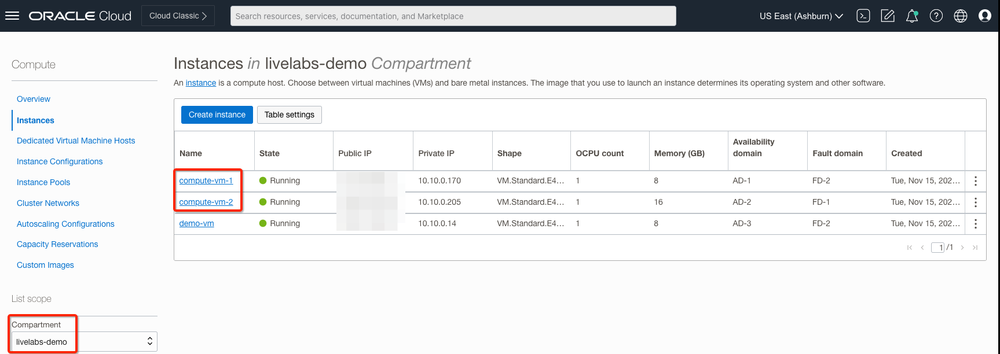

# Configure Required Oracle Cloud Infrastructure Components

## Introduction

In this lab you will be creating required virtual cloud network (VCN) with subnets, internet gateway,nat gateway, service gateways, and compute instances which you will scanning using **OCI VSS**.

Estimated Lab Time: 10 minutes.

### Objectives

- Demonstrate launching VSS VCN and supporting configuration 
- Launch Compute Instances in VSS VCN.

### Prerequisites

- Oracle Cloud Infrastructure account credentials (User, Password, Tenant, and Compartment)
- User must have required permissions, quota to deploy resources.

## Task 1: Configure VSS VCN

1. From the OCI Services menu, click **Virtual Cloud Networks** under **Networking**. Select your region on right part of the screen:

   

2. Below table represents what you will be creating. Click on **Start VCN Wizard** icon to create new **Virtual Cloud Network**:

      | Resource | Name                              | CIDR       | Comment                                                    |
      |---------------------------------------|----------------|----------------|------------------------------------------------------------|
      | Virtual Cloud Networks | vss-vcn                          | 10.10.0.0/16   | Virtual Cloud Network to host OCI workloads |
      | Public Subnet | Public Subnet-vss-vcn                          | 10.10.0.0/24   | [Optional] You can rename it to Compute Subnet|
      | Private Subnet | Private Subnet-vss-vcn                          | 10.10.1.0/24   | Private Subnet to host OCI Workloads |
      
   

3. Click on **Create a VCN with Internet Connectivity** option: 

   

4. Fill out the dialog box and Click **Next**:

      - **VCN NAME**: Provide a name
      - **COMPARTMENT**: Ensure your compartment is selected
      - **VCN CIDR BLOCK**: Provide a CIDR block (10.10.0.0/16)
      - **PUBLIC SUBNET CIDR BLOCK**: Provide a CIDR block (10.10.0.0/24)
      - **PRIVATE SUBNET  CIDR BLOCK**: Provide a CIDR block (10.10.1.0/24)
      
   

5. Verify all the information and Click **Create**.

   

6. This will create a VCN with following components.

    *VCN, Default Route Tables, Default Security List, Public Subnet, Private Subnet, NAT Gateway, Service Gateway, and Internet Gateway*

7. Click **View Virtual Cloud Network** you just created to display your VCN details.

   

8. Navigate to **VSS VCN** Virtual Cloud Network Details page to know more about VCN details:

   

## Task 2: Launch Compute instances in VSS VCN

1. Launch **Cloud Shell** by clicking the icon next to region name on top right of OCI console. ('<=' icon)

2. Once cloud Shell is launched. Enter command **ssh-keygen**, press enter for all prompts. This will create a ssh key pair. Enter command.

      ```
      <copy>
      bash
      cd .ssh
      cat id_rsa.pub
      </copy>
      ```
   
   Copy the key displayed. This will be used when creating the compute instance.

3. From OCI services menu, Click **Instances** under **Compute**.
 
4. On the left sidebar, select the **Compartment** in which you placed your **VSS VCN** under **List Scope**. The, Click **Create Instance**. You will be creating **2** instances as per below table: 

   | Name     | Placement | Image                 | Shape   | Network | Subnet              | Add SSH-Keys                | Assign Public IP              |
   |----------|------------|-----------------------|---------|---------|---------------------|-----------------------------|---|
   | compute-vm-1 | AD1        | Default: Oracle Linux | Default | vss-vcn | Public Compute Subnet | Yours/CloudShell Public Key | Yes | 
   | compute-vm-2 | AD2 or AD1 | Default: Oracle Linux | Default | vss-vcn | Public Compute Subnet | Yours/CloudShell Public Key | Not Applicable | 
 
5. Enter a **Name** for your Instance and the **Compartment** in which you placed your **VSS VCN**. 

6. Fill out the dialog box. Leave **Image or Operating System** and **Availability Domain** as the default values.

7. Leave Shape **Shape** as default value.

8. Scroll Down to **Networking** and verify the following.
      - Your Compartment is selected
      - The VCN created is populated: **VSS VCN**
      - The subnet created is populated: 
        - Select **Public Compute Subnet** for compute-vm-1 VM. 
        - Select **Public Compute Subnet** for compute-vm-1 VM.  

9. Ensure **PASTE PUBLIC KEYS** is selected under **Add SSH Keys**. Paste the public key copied earlier.
 
    > **Note:** If 'Service limit' error is displayed choose a different shape from VM.Standard.E4.Flex, VM.Standard2.1, VM.Standard.E2.1, VM.Standard1.1, VM.Standard.B1.1 OR choose a different AD.

    > **Note:** If you already have your ssh-key available you can skip copying from cloud-shell and paste your own public key and use private key associated to that for accessing instance.

10. Click **Create** and wait for Instance to be in **Running** state. 

11. Verify that required instances in **VSS VCN** are in **Running** state. 

   

***Congratulations! You have successfully completed the lab.***

You may now [proceed to the next lab](#next).

## Learn More

1. [OCI Training](https://www.oracle.com/cloud/iaas/training/)
2. [Familiarity with OCI console](https://docs.us-phoenix-1.oraclecloud.com/Content/GSG/Concepts/console.htm)
3. [Overview of OCI Vulnerability Scanning Service](https://docs.oracle.com/en-us/iaas/scanning/home.htm)
4. [OCI Vulnerability Scanning Service Page](https://www.oracle.com/security/cloud-security/cloud-guard/)
5. [OCI CloudGuard Capabilities](https://www.oracle.com/security/cloud-security/cloud-guard/)

## Acknowledgements

- **Author** - Arun Poonia, Principal Solutions Architect
- **Adapted by** - Oracle
- **Contributors** - N/A
- **Last Updated By/Date** - Arun Poonia, Nov 2022