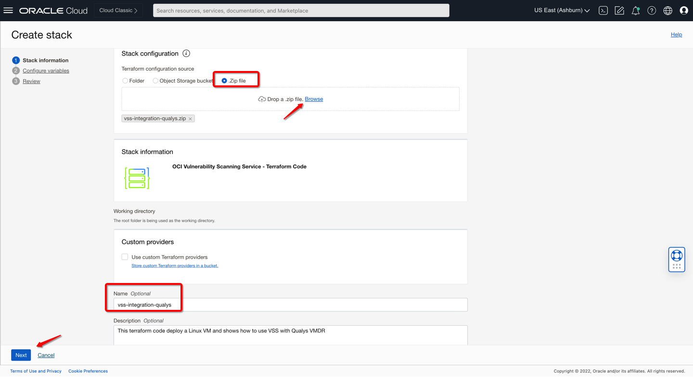
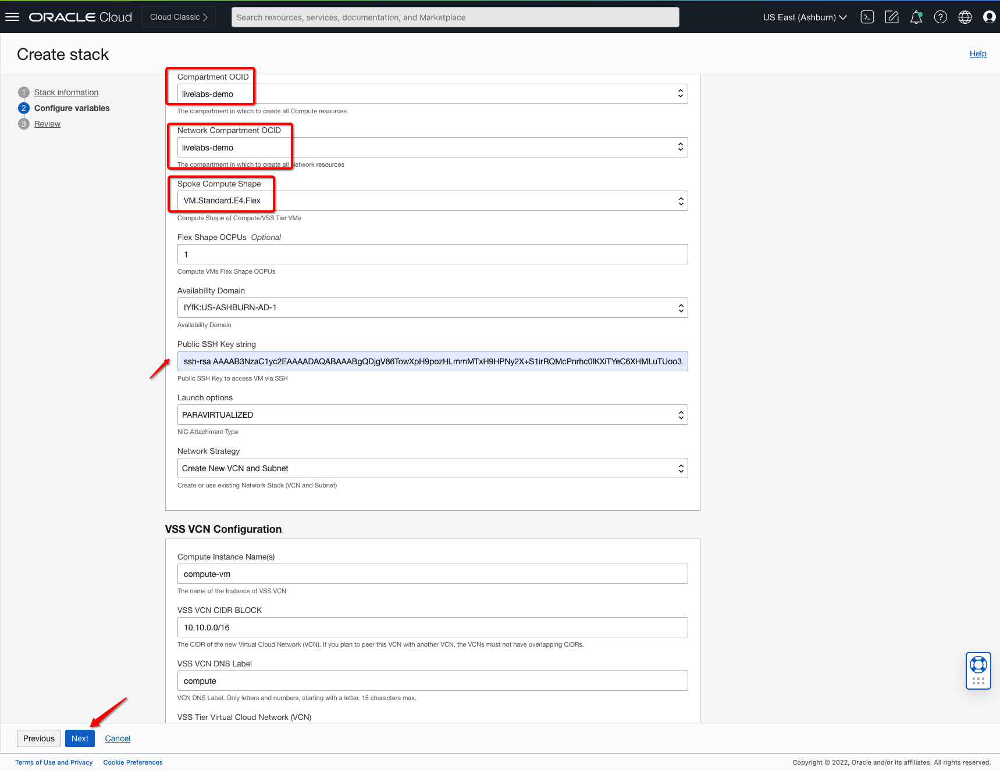
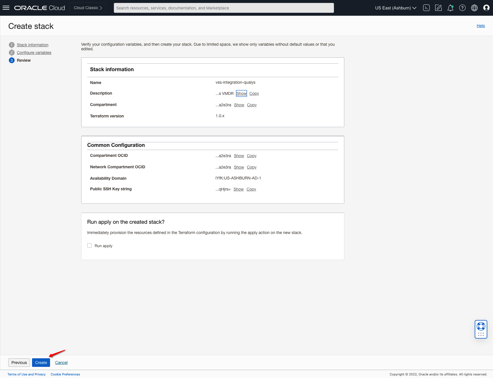
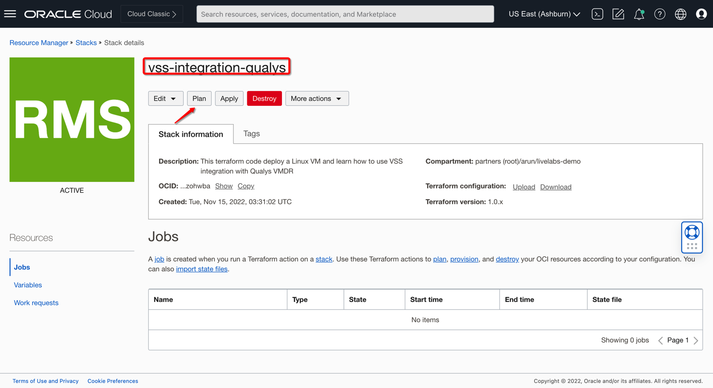
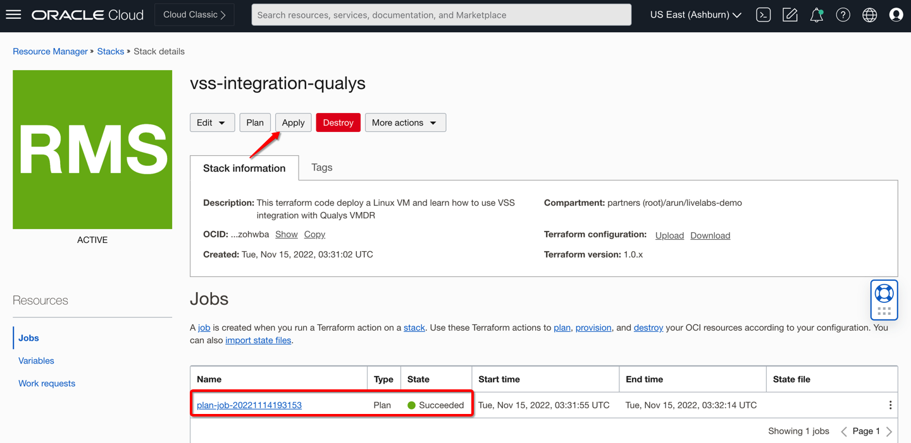
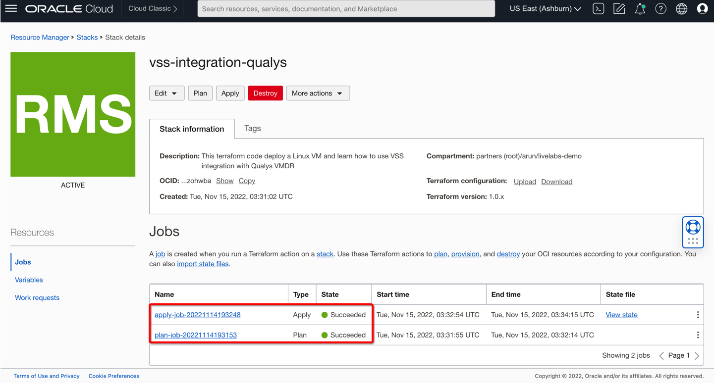
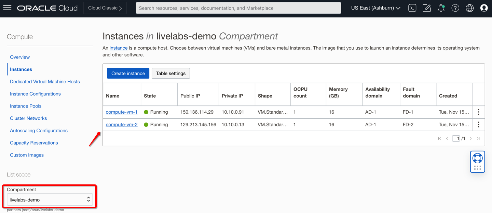

# Deploy Lab using Oracle Resource Manager

## Introduction

In this lab, you will be using Oracle Resource Manager to deploy the required virtual cloud network, subnet, and compute instances to support the use-case to scan compute resources using **OCI VSS** integrated with **Qualys VMDR**.

> **Please Read**: If you wish to deploy the configuration manually, please skip **Lab0** and continue from **Lab1** onwards.

Estimated time: 10 minutes.

### Objectives

   - Create Stack using Oracle Resource Manager
   - Validate Terraform Plan and Apply
   - Connect to Instances

### Prerequisites

- Oracle Cloud Infrastructure account credentials (User, Password, Tenant, and Compartment)
- User must have required permissions, and quota to deploy resources.

## Task 1: Login and Create Stack using Resource Manager

You will be using Terraform to create your lab environment.

1.  Click on the link below to download the zip file which you need to build your environment.  

    - Click here: [oci-network-vss-qualys-live-labs.zip](https://objectstorage.us-ashburn-1.oraclecloud.com/p/fAx5rXgL1PJ3YMHzw0gM4PuCmeyjBoV3CBwdMJla7GDIhKLkWjSKu3vG22SrbAtp/n/partners/b/files/o/vss-integration-qualys.zip) 
        - Packaged terraform **OCI VSS Qualys** use-case.
        - **PAR URL** is valid until **Dec, 2025**.

    > **Please Read**: You can also download this zip folder locally and update the required resources to support additional use cases. 

2.  Save in your local machine's downloads folder.

3.  Open up the hamburger menu in the left-hand corner.  Choose **Developer Services > Stacks**. Click on **Stacks**: 

    

4. Choose the right compartment from the left-hand side drop-down and the appropriate region from the top right drop-down and click the **Create Stack** button

    

5.  Select **My Configuration**, choose the **.ZIP FILE** button, click the **Browse** link and select the zip file (vss-integration-qualys.zip) that you downloaded. Click **Select**.

    

    Enter the following information and accept all the defaults

    - **Name**: Enter a user-friendly name for your **stack** 

    - **Compartment**: Select the Compartment where you want to create your stack. 

    - **Terraform Version**: Validated version for this stack is **1.0.x**

6.  Click **Next**. 

    

    Enter/Select the following minimum information. Some information may already be pre-populated. Do not change the pre-populated info.

    **Compute Compartment**: Select Compute Compartment from the drop-down where you would like to create compute instances. 

    **Availability Domain:** Select Appropriate AD from the drop-down. 

    **Public SSH Key**: Paste the public key string that you would like to use to connect VMs via your private key.

    **Network Compartment**: Select Network Compartment from the drop-down where you would like to create networking components i.e. VCN, subnets, route tables, DRG, etc.  

    > **Note:** Keep the Network Strategy as **Create New VCN and Subnet** as the default value, if you chose to modify the code you can do so to support existing VCN/Subnet values. 

6. Click **Create** to create your stack. Now you can move to the next steps to create your environment.

    

## Task 2: Terraform Plan and Apply

When using Resource Manager to deploy an environment, you need to execute a terraform **plan** and **apply**. Let's do that now.

1. [OPTIONAL] Click **Plan** to validate your configuration. This takes about a minute, please be patient.

    

2.  At the top of your page, click on **Stack Details**.  Click the button, **Apply**. This will create your instances and required configuration.

    

3.  Once this job succeeds, your environment is created! Time to log in to your instance to finish the configuration.

    

    > **Note:**  Stack will deploy required VMs to support this use-case.

## Task 3: Connect to your instances

1. Based on your laptop config, choose the appropriate steps to connect to your instances. 

   

    > **Note:**  It will take a few minutes before you can connect to ssh-daemon becomes available. If you are unable to connect then make sure you have a valid key, wait a few minutes, and try again.

***Congratulations! You have completed the lab.***

> **Please Read**: You must skip **Lab 1** now and proceed to **Lab 2** i.e. **Deploy VSS integration with Qualys and Supporting Configuration**. 

You may now **proceed to the next lab**.

## Learn More

1. [OCI Training](https://www.oracle.com/cloud/iaas/training/)
2. [Familiarity with OCI console](https://docs.us-phoenix-1.oraclecloud.com/Content/GSG/Concepts/console.htm)
3. [Overview of OCI Vulnerability Scanning Service](https://docs.oracle.com/en-us/iaas/scanning/home.htm)
4. [OCI Vulnerability Scanning Service Page](https://www.oracle.com/security/cloud-security/cloud-guard/)
5. [OCI CloudGuard Capabilities](https://www.oracle.com/security/cloud-security/cloud-guard/)

## Acknowledgements

- **Author** - Arun Poonia, Principal Solutions Architect
- **Adapted by** - Oracle
- **Contributors** - N/A
- **Last Updated By/Date** - Arun Poonia, Nov 2022