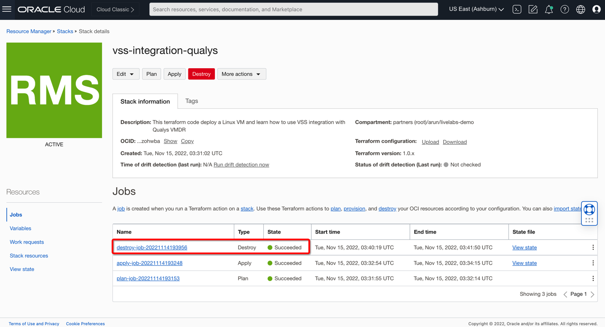

# Destroy Lab Environment

## Introduction

In this lab, you will be destroying the lab environment which you created either manually or using Oracle Resource Manager. Manual steps include deleting virtual cloud networks (VCNs), subnets in each VCN, route tables, compute instances, scanning recipes, targets, secret, and vault.

> **Note:**  Select the right Compartment where you have created your resources. 

Estimated time: 10 minutes.

### Objectives

   - Destroy the environment manually
   - Destroy environment using Oracle Resource Manager

### Prerequisites

- Oracle Cloud Infrastructure account credentials (User, Password, Tenant, and Compartment)
- User must have required permissions, and quota to deploy resources.

## Task 1: Delete environment manually

When manually destroying the environment, ensure that one resource is not tied to another resource.

1. From the OCI services menu, Click **Instances** under **Compute** and delete instances that you have created in your lab environment. 

2. From OCI services menu, Click **Scanning** under **Identity & Security**. Delete the Scanning Recipe and Targets which you created earlier to validate use cases. 

3. From OCI services menu, Click **Vault** under **Identity & Security**. Delete the Scanning Recipe and Targets which you created earlier to validate use cases.

    > **Note:** Vault deletion can be done through scheduled time. You would need to consider that time to ensure the environment is deleted successfully.

4. From the OCI services menu, Click **Virtual Cloud Networks** under **Networking** and delete route table entries, service gateway, route tables, subnets, and VCN from each **VSS-VCN**, which you have created in your lab environment. 

## Task 2: Delete environment using Oracle Resource Manager

When using Resource Manager to destroy the environment, you need to execute a **terraform destroy** and apply. Let's do that now.

1. Open up the hamburger menu in the left-hand corner.  Choose **Developer Services > Stacks**. Click on **Stacks** and navigate to your stack which you created in **Lab0**

2. At the top of your page, click on Stack Details. Click the button, **Destroy**. This will destroy your instances and required configuration.

    

3. Once this job succeeds, your environment is destroyed! Time to enjoy a cup of coffee now :) 

    

***Congratulations! You have completed the labs.***

## Learn More

1. [OCI Training](https://www.oracle.com/cloud/iaas/training/)
2. [Familiarity with OCI console](https://docs.us-phoenix-1.oraclecloud.com/Content/GSG/Concepts/console.htm)
3. [Overview of OCI Vulnerability Scanning Service](https://docs.oracle.com/en-us/iaas/scanning/home.htm)
4. [OCI Vulnerability Scanning Service Page](https://www.oracle.com/security/cloud-security/cloud-guard/)
5. [OCI CloudGuard Capabilities](https://www.oracle.com/security/cloud-security/cloud-guard/)

## Acknowledgements

- **Author** - Arun Poonia, Principal Solutions Architect
- **Adapted by** - Oracle
- **Contributors** - N/A
- **Last Updated By/Date** - Arun Poonia, Nov 2022