# Deploy Vulnerability Scanning Service and Supporting Configuration

## Introduction

In this lab, you will be creating a required dynamic group, policy, vault, license secret, scanning recipe, and required target rules to enable the scanning of compute resources in **VSS VCN**.

Estimated time: 15 minutes.

### Objectives

- Configure Dynamic Group and Policy
- Configure Vault and add Agent License Secret
- Configure Scanning Recipe and Target
- Validate Scanned Targets and Agent Installation

### Prerequisites

- Oracle Cloud Infrastructure account credentials (User, Password, Tenant, and Compartment)
- User must have required permissions, and quota to deploy resources.

## Task 1: Create Dynamic Group and Required Policy

1. From the OCI Services menu, click **Dynamic Groups** under **Identity & Security**. Select your region on the right part of the screen:

   

2. You will be creating **Dynamic Group** which will include **instances OCIDs** or **compartment OCIDs** which you want to scan. Based on the below tables you will create a Dynamic Group.

      | Resource | Name                               | Comment                                                    |
      |---------------------------------------|----------------|------------------------------------------------------------|
      | Dynamic Group | vss-demo                        | Example: All {instance.compartment.id = enter compartment ocid_here}  |

    > **Note:** You can also specify the entire tenancy. 

3. Select **Create Dynamic Group** and fill out the dialog box for creating a dynamic group:

      - **Name**: Enter a Name
      - **Description**: Enter a friendly name
      - **Include Instance That Match**: Select **All of the following**
      - **Match Instances with**: Select Compartment OCID and Enter your compute resources Compartment OCID.

   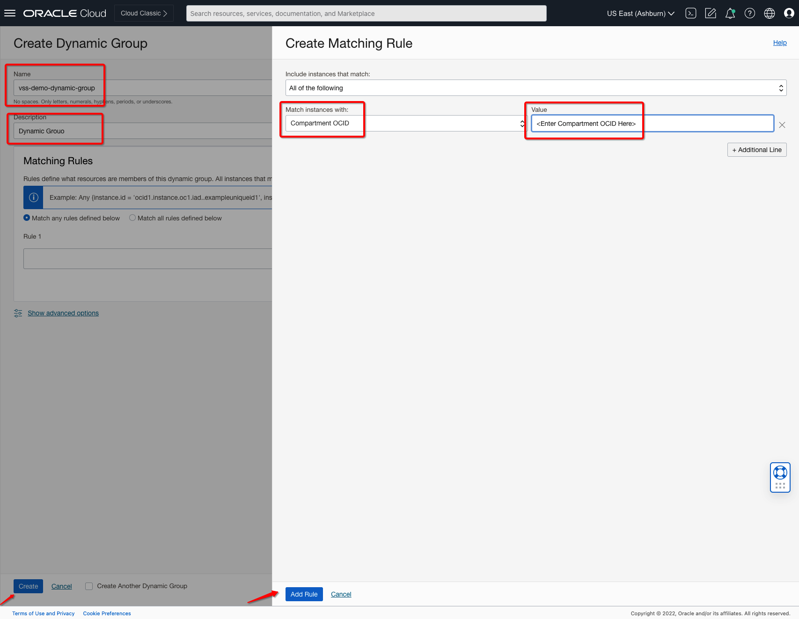

4. Verify all the information and Click **Add Rule** and **Create**

5. This will create a Dynamic Group with the following components.

   *New Dynamic Group with Required Compute Compartment OCIDs to scan*

6. From the OCI Services menu, click **Policies** under **Identity & Security**. Select your region on the right part of the screen:

7. Now you will be creating **Policy** which will grant permission for the dynamic group to access secrets and have data sent back from **Qualys**. Based on the below tables you will create a policy.

      - **Name**: Enter Policy Name
      - **Description**: Enter Policy Description
      - **COMPARTMENT**: Ensure the Root compartment is selected
         - You can define policy at your Root or Required Compartment level based on your need.
         - Please follow the official docs mentioned in the **Learn More** section to know more about **Agent-Based Qualys Policies**. 
      - **Policy Builder**: Enter policy
         - **Entries**: Ensure you enter the correct dynamic group name in our case it’s **vss-demo**

   ```
   Define tenancy ocivssprod as ocid1.tenancy.oc1..aaaaaaaa6zt5ejxod5pgthsq4apr5z2uzde7dmbpduc5ua3mic4zv3g5ttma
   Allow dynamic-group vss-demo to read vaults in tenancy
   Allow dynamic-group vss-demo to read keys in tenancy
   Allow dynamic-group vss-demo to read secret-family in tenancy
   Endorse dynamic-group vss-demo to read objects in tenancy ocivssprod
   ```

   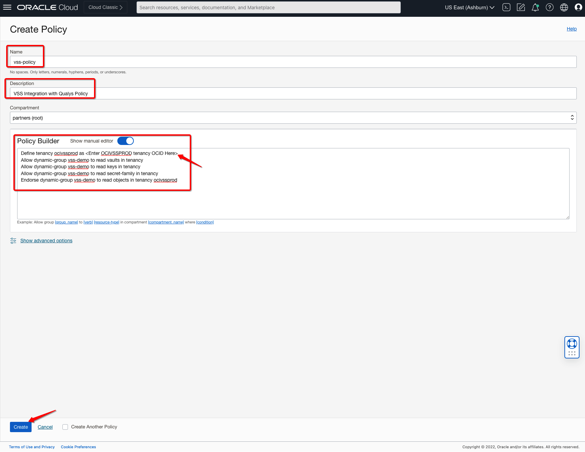

8. Verify all the information and Click **Create**.

9. This will create a policy with the following components.

   *New Policy Present in Root compartment associated with a dynamic group created earlier*

## Task 2: Create Vault and Secret

1. From the OCI Services menu, click **Vault** under **Identity & Security**. Select your region on the right part of the screen:

   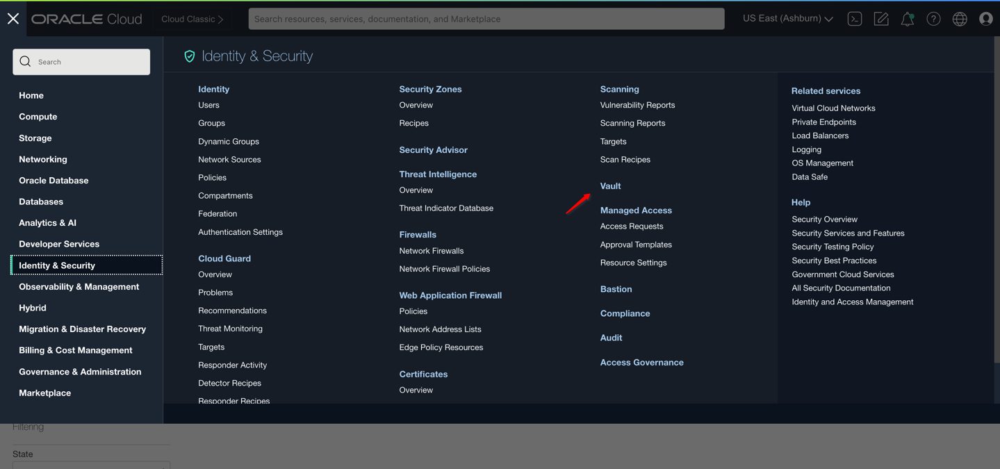

2. Below table represents what you will be creating. Click on **Create Vault** icon to create new **Vault**:

      | Resource | Name                               | Comment                                                    |
      |---------------------------------------|----------------|------------------------------------------------------------|
      | Vault | demo-vault                         | Vault to Store License Secrets |
      
   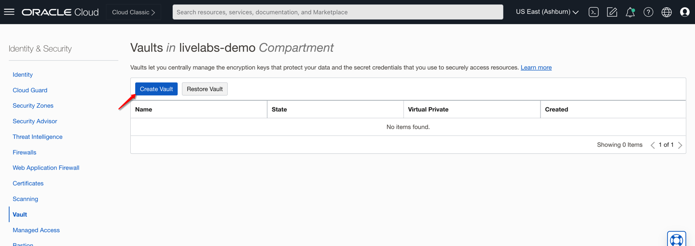

4. Fill out the dialog box and Click **Next**:

      - **VAULT NAME**: Provide a name
      - **COMPARTMENT**: Ensure your compartment is selected
      
   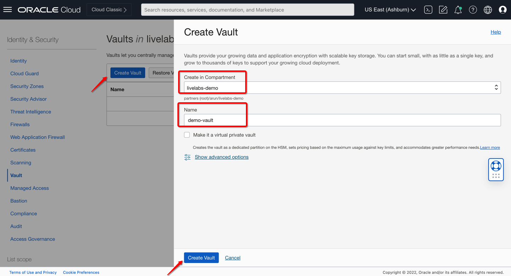

5. Verify all the information and Click **Create Vault**.

6. This will create a Vault with the following components.

    *Vault*

7. Proceed to next step once **demo-vault** created successfully which **takes few mins** to complete.

8. Click on **demo-vault** and navigate to **Master Encryption Keys** to create key. You will be creating an encryption key on the below table: 

      | Resource | Name                               |  Protection Mode                               | Comment                                                    |
      |---------------------------------------|----------------|----------------|------------------------------------------------------------|
      | Master Encryption Key | ms-key                         | HSM                         | Key to Encrypt Secret, you can also use your vault and key |

9. Click on **Create Key** and fill out the dialog box: 

      - **COMPARTMENT**: Ensure your compartment is selected
      - **PROTECTION MODE**: Select **HSM**
      - **NAME**: Provide a name
      - **KEY SHAPE ALGORITHM**: Select **AWES**.

   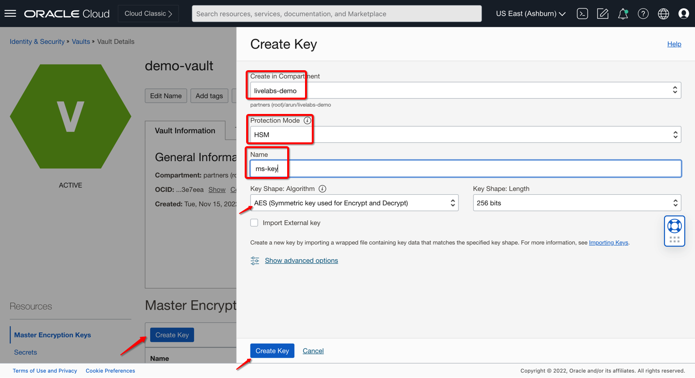

10. Verify all the information and Click **Create Key**.

11. This will create Master Encryption Key with the following components.

    *Master Encryption Key with ms-key name*

12. Click on **Secrets** option within your **Vault** to create secret. You will be creating a secret using License Code as per below table: 

      | Resource | Name                               |  Encryption Key                              |  Secret Type Template                               | Comment                                                    |
      |---------------------------------------|----------------|----------------|----------------|------------------------------------------------------------|
      | Secret | license-secret                         | ms-key                         |  Base64                         | Enter your License Code within Secret Contents |

13. Click on **Create Secret** and fill out the dialog box: 

      - **COMPARTMENT**: Ensure your compartment is selected
      - **NAME**: Provide a name
      - **ENCRYPTION KEY**: Select **mas-key**
      - **SECRET TYPE TEMPLATE**: Select **Base64**
      - **SECRET CONTENT**: Enter **License Code Value**.

   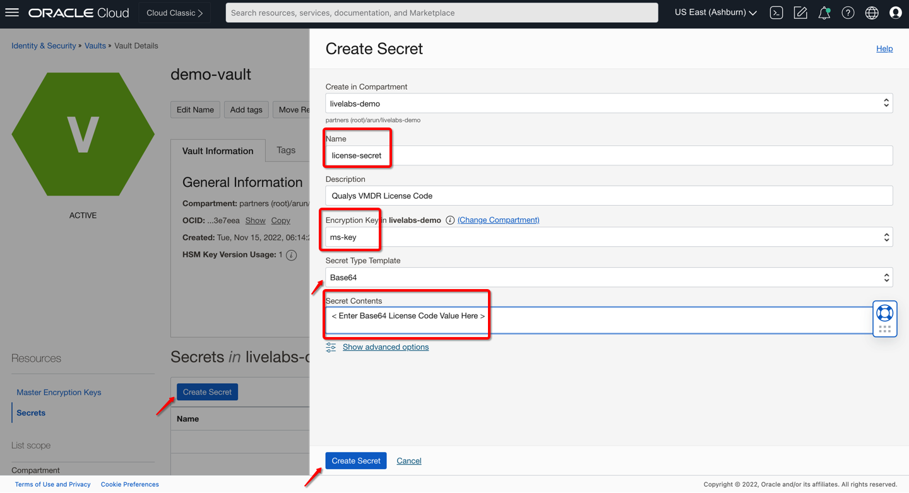

14. Verify all the information and Click **Create Secret**.

15. This will create Master Encryption Key with the following components.

    *Secret with License Code Value*

## Task 3: Create Scan Recipe and Target

1. From the OCI Services menu, click **Scanning** under **Identity & Security**. Select your region on the right part of the screen:

   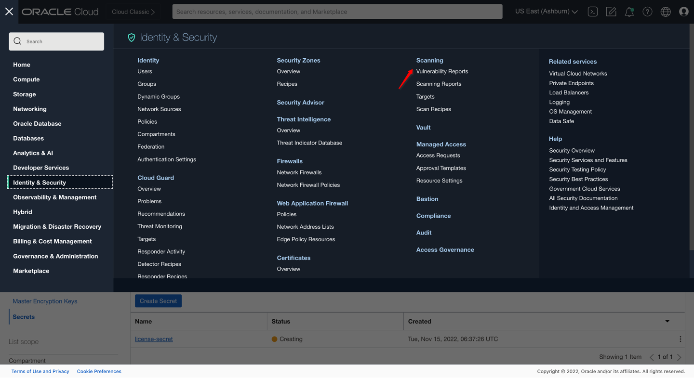

2. Below table represents what you will be creating. Click on **Create** icon to create new **Scan Recipe**:

      | Resource | Agent to Use                               | Vault                                             |    Secret                               |   Comment                               | 
      |---------------------------------------|----------------|----------------|--------------------------------|------------------------------------------------------------|
      | Scan Recipe | Qualys                        | Select your Vault | Select your License Secret | Select your Scheduling Accordingly |
      
   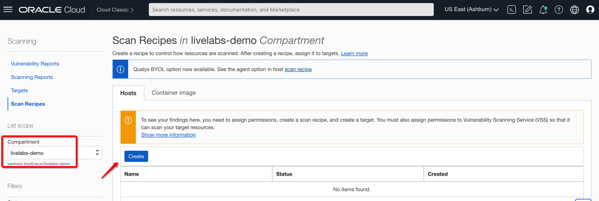

4. Fill out the dialog box:

      - **Type**: Select Compute
      - **NAME**: Provide a name
      - **AGENT BASED SCANNING**: Select **Qualys**
      - **VAULT**: Select your Vault.
      - **SECRET**: Select your Secret
      
   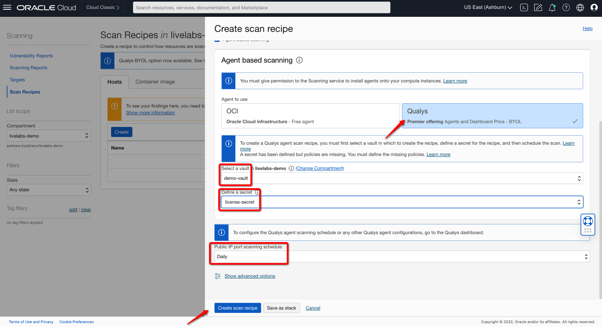

5. Verify all the information and Click **Create Scan Recipe**.

6. This will create a Scan Recipe with the following components.

    *Qualys Agent-Based Scanning Recipe*

8. Click on **Targets** under **Hosts** to enable scanning using Scanning Recipe. You will be creating a Target based on below table: 

      | Resource | Name                               |  Scan Recipe                              | Comment                                                    |
      |---------------------------------------|----------------|----------------|------------------------------------------------------------|
      | Hosts Target | Qualys-validation-targets                         | Select qualys-validation-recipe created earlier.                         | Select your Target Compartment where Compute Hosts are running and you have required policies |

   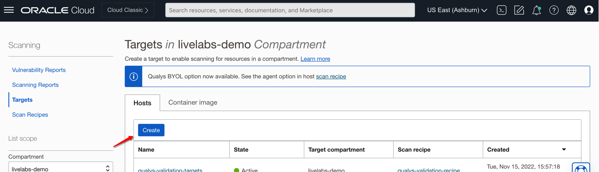

9. Click on **Create** and fill out the dialog box: 

      - **NAME**: Provide a name
      - **COMPARTMENT**: Ensure your compartment is selected
      - **DESCRIPTION**: Enter user friendly description
      - **SCAN RECIPE**: Select your scanning recipe
      - **TARGET COMPARTMENT**: Ensure your compartment is selected
      - **TARGETS**: Ensure your compartment or compartment's instances are selected which you want to scan.

   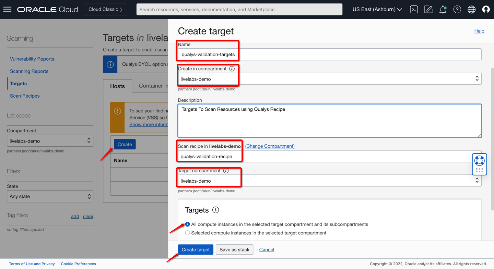

10. Verify all the information and Click **Create Target**.

11. This will create a Host Target with the following components.

    *Host Target to enable scanning for compute resources*

## Task 4: Verify Scanned Targets

1. From the OCI Services menu, click **Instances** under **Compute**. Select your region on the right part of the screen.

2. Navigate to your **compute-vm-1** and/or **compute-vm-2** instances to verify **Qualys** agent installation.

3. You should see a message next to the **Vulnerability Scanning** tab as **...successfully started plugin, Qualys agent installation complete** which indicates your compute host has the required agent installed successfully and it should be visible on Qualys VMDR. 

4. [Optional] You can also double check the **Vulnerability Scanning** plugin if not enabled, enable it using the **Enabled** button from OCI Console. 

5. Below image reflects **compute-vm-1** instance details:

   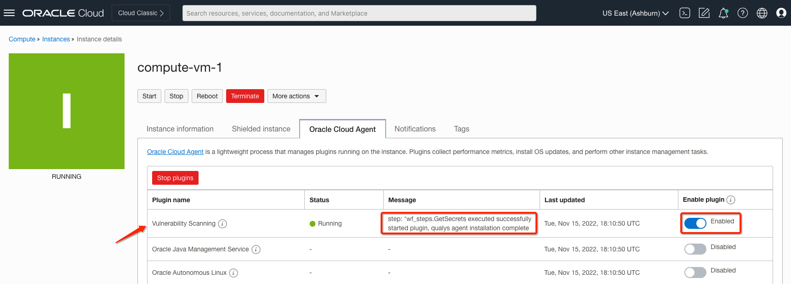

6. Below image reflects **compute-vm-2** instance details:

   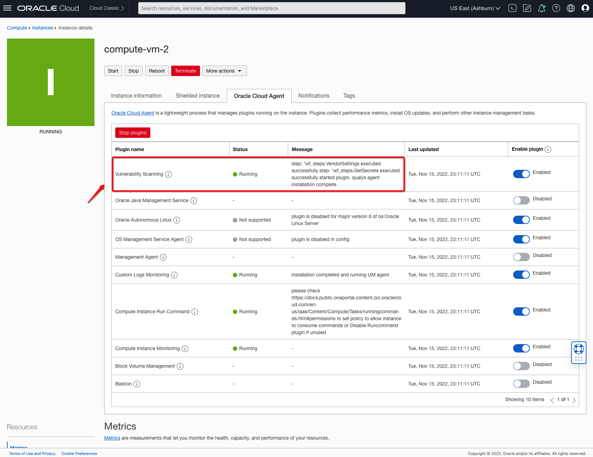

7. [Optional] You can deploy additional compute resources and validate that the Qualys agent was installed successfully.

8. You should be able to see **Assets** reported successfully on your **Qualys VMDR** as below: 

   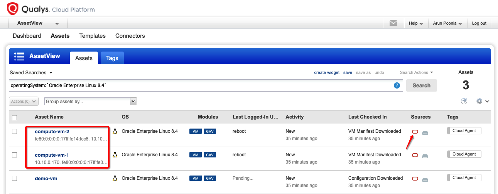

***Congratulations! You have completed the lab.***

You may now **proceed to the next lab**.

## Learn More

1. [OCI Training](https://www.oracle.com/cloud/iaas/training/)
2. [Familiarity with OCI console](https://docs.us-phoenix-1.oraclecloud.com/Content/GSG/Concepts/console.htm)
3. [Overview of OCI Vulnerability Scanning Service](https://docs.oracle.com/en-us/iaas/scanning/home.htm)
4. [OCI Vulnerability Scanning Service Page](https://www.oracle.com/security/cloud-security/cloud-guard/)
5. [OCI CloudGuard Capabilities](https://www.oracle.com/security/cloud-security/cloud-guard/)

## Acknowledgements

- **Author** - Arun Poonia, Principal Solutions Architect
- **Adapted by** - Oracle
- **Contributors** - N/A
- **Last Updated By/Date** - Arun Poonia, Nov 2022