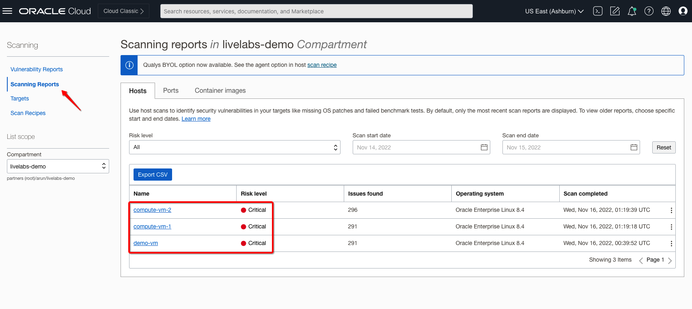
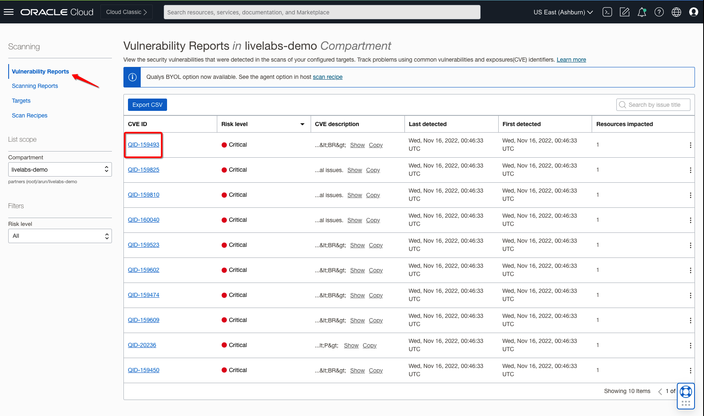
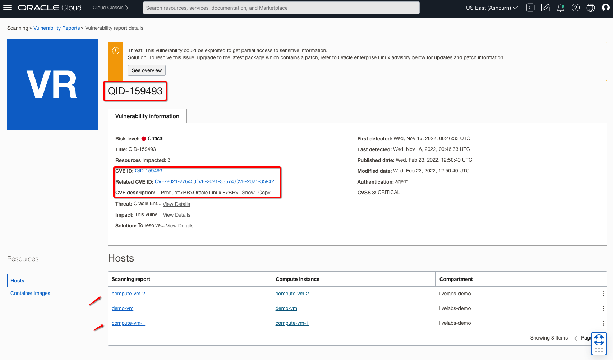
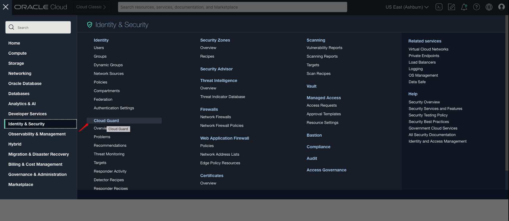
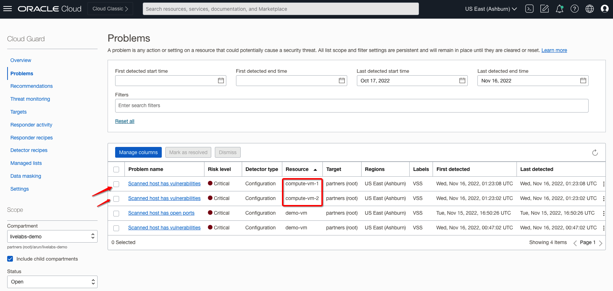
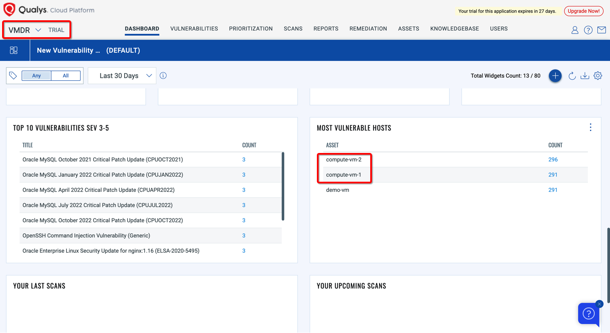
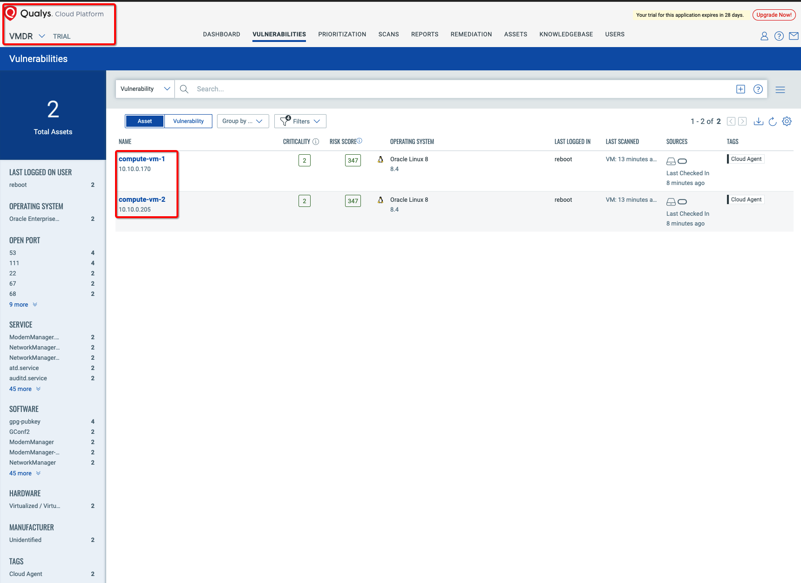
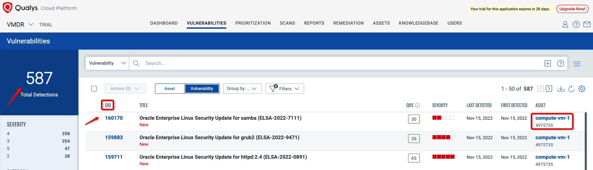
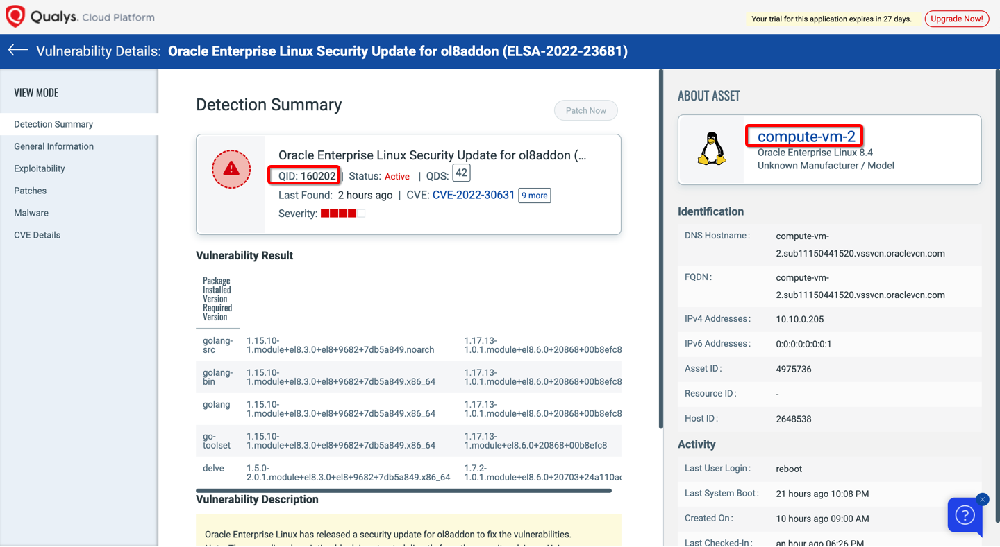

# Explore Scanning and Vulnerabilities Reports

## Introduction

In this lab you will be validating scanning & vulnerabilities reports from **VSS**, **CloudGuard** and **Qualys VMDR** platform.

> **Please Read**: Qualys performs OCI hosts scans every **four hours** so you can view reports in the **Qualys** portal approximately in four hours. Similarly view Qualys scan results in the OCI Console within **12 hours** of creating the new scan target

Estimated Lab Time: 10 minutes.

### Objectives

- Validate Scanning and Vulnerabilities Reports from OCI VSS
- Validate Scanning and Vulnerabilities Reports from OCI CloudGuard
- Validate Scanning and Vulnerabilities Reports from Qualys VMDR Platform

### Prerequisites

- Oracle Cloud Infrastructure account credentials (User, Password, Tenant, and Compartment)
- User must have required permissions, quota to deploy/view resources.

## Task 1: Validate Scanning and Vulnerabilities Reports from OCI VSS

1. From the OCI Services menu, click **Scanning** under **Identity & Security**. Select your region on right part of the screen.

2. Navigate to your **Scanning Reports** to view individual **host target** reports. 

   

3. Navigate to your **Vulnerabilities Reports** to view individual **CVE: QID** reports. 

   

4. Click on vulnerability to know more about and related details, for example **QID: 159493**:

   

## Task 2: Explore Scanning and Vulnerabilities Reports from OCI CloudGuard

1. From the OCI Services menu, click **CloudGuard** under **Identity & Security**. Select your region on right part of the screen.

   

2. Navigate to your **Problems** to view individual **host target** problems. 

   

## Task 3: Validate Scanning and Vulnerabilities Reports from Qualys VMDR

1. Connect to **Qualys VMDR** and navigate to **Dashboard** to view **vulnerabilities** overview and **assets**:

   

2. Navigate to **Vulnerabilities > Assets** to view individual **assets** details: 

   

3. Navigate to **Vulnerabilities > Vulnerability** tab to view additional reports: 

   

4. Click on individual vulnerability to know more about the details and perform needed action:

   

***Congratulations! You have successfully completed the lab.***

You may now [proceed to the next lab](#next).

## Learn More

1. [OCI Training](https://www.oracle.com/cloud/iaas/training/)
2. [Familiarity with OCI console](https://docs.us-phoenix-1.oraclecloud.com/Content/GSG/Concepts/console.htm)
3. [Overview of OCI Vulnerability Scanning Service](https://docs.oracle.com/en-us/iaas/scanning/home.htm)
4. [OCI Vulnerability Scanning Service Page](https://www.oracle.com/security/cloud-security/cloud-guard/)
5. [OCI CloudGuard Capabilities](https://www.oracle.com/security/cloud-security/cloud-guard/)

## Acknowledgements

- **Author** - Arun Poonia, Principal Solutions Architect
- **Adapted by** - Oracle
- **Contributors** - N/A
- **Last Updated By/Date** - Arun Poonia, Nov 2022