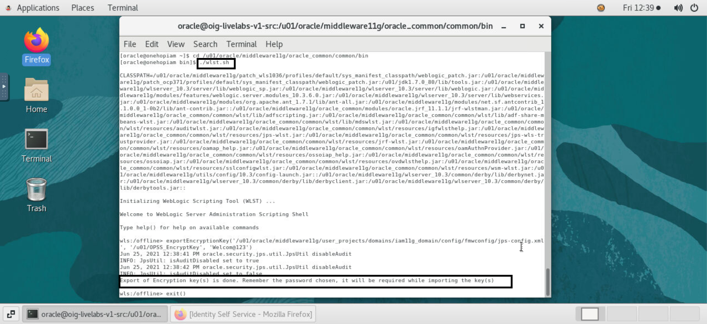
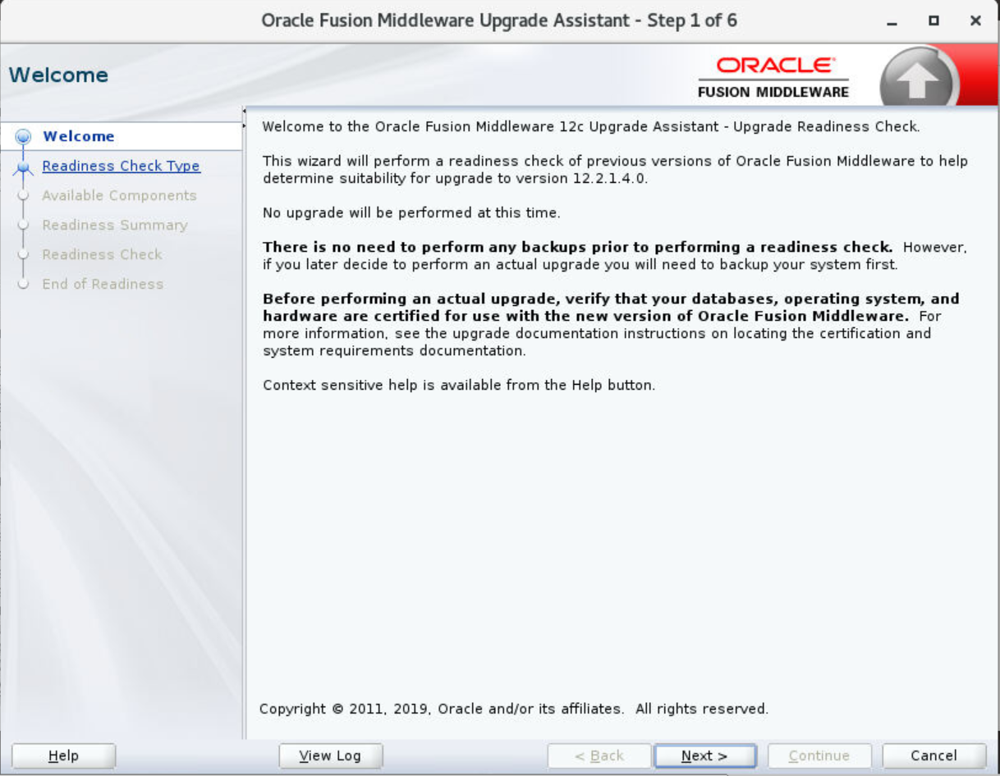
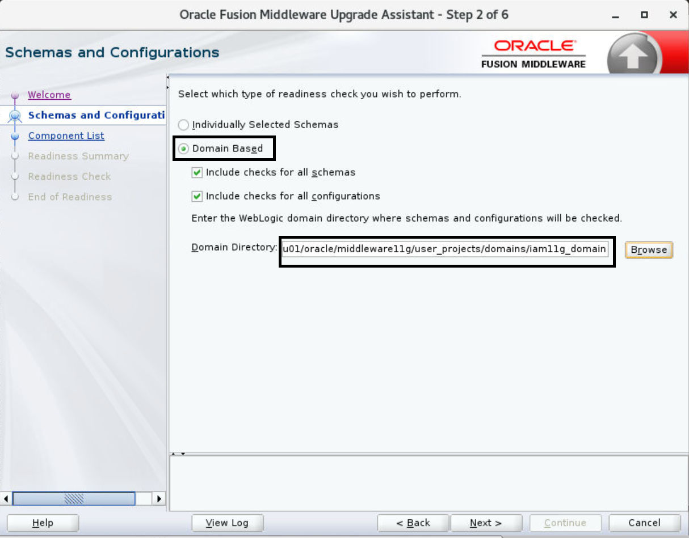
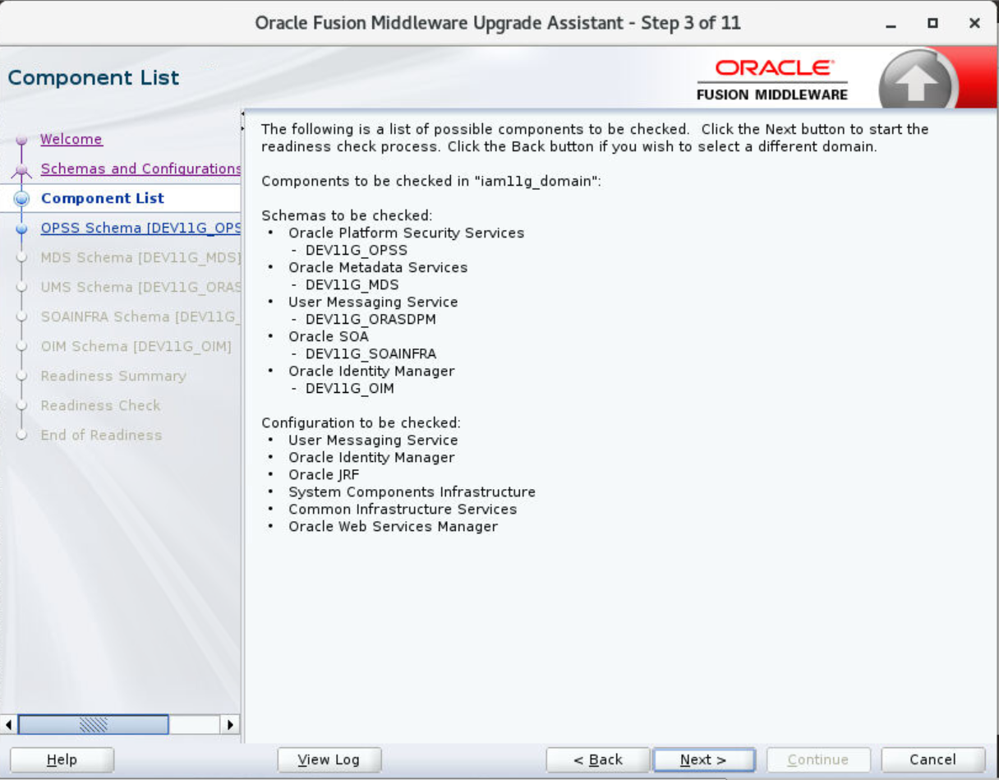
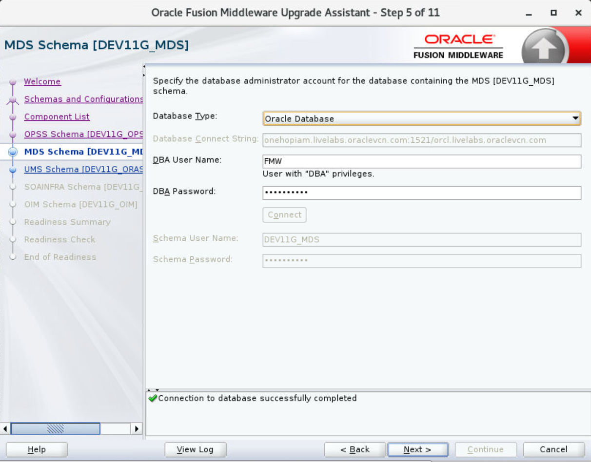
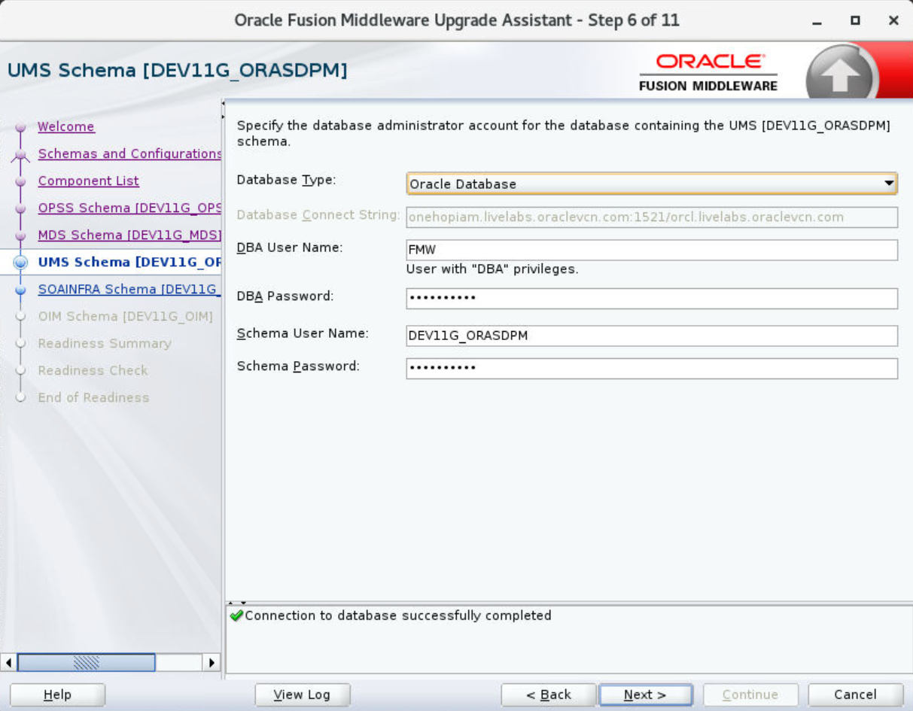
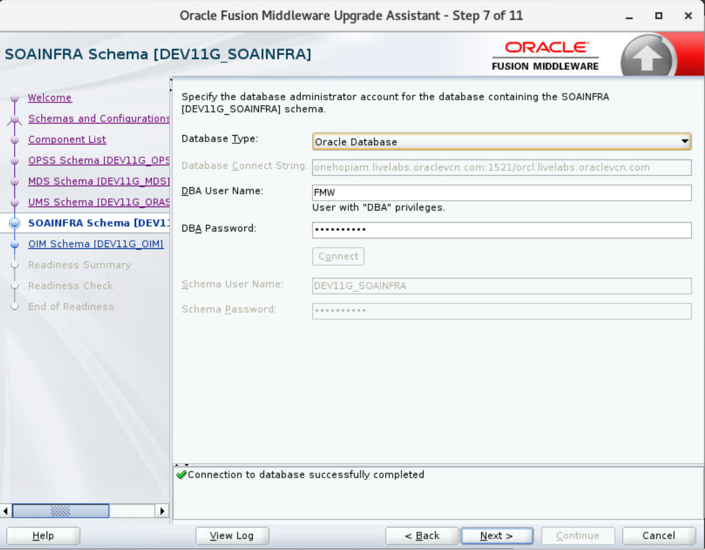
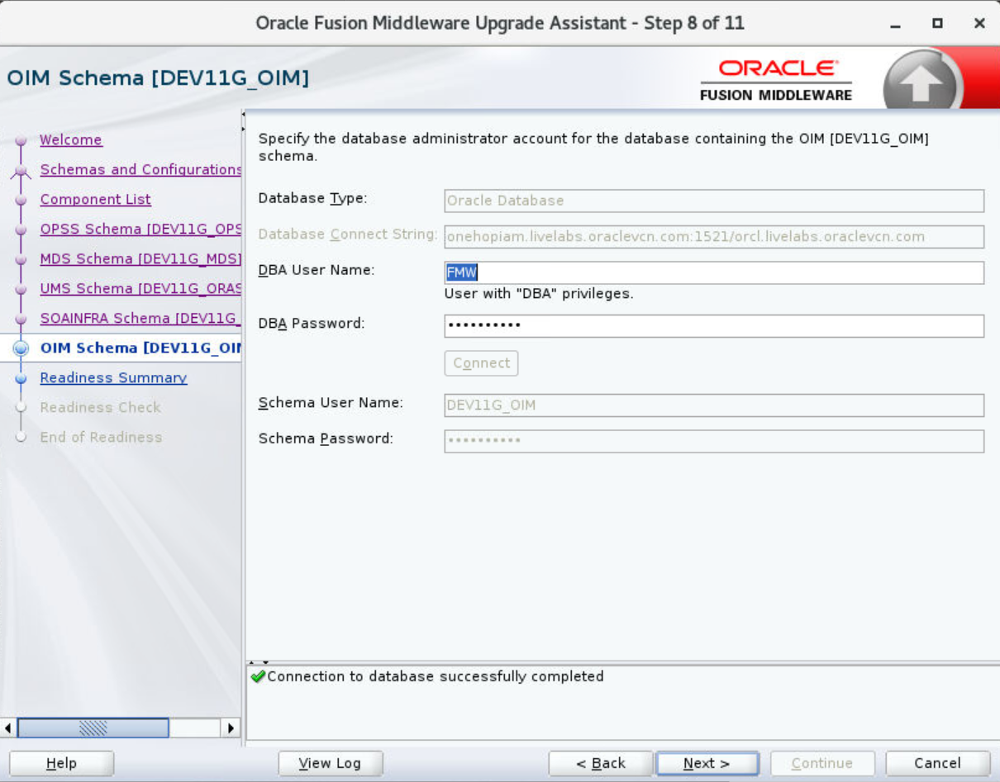
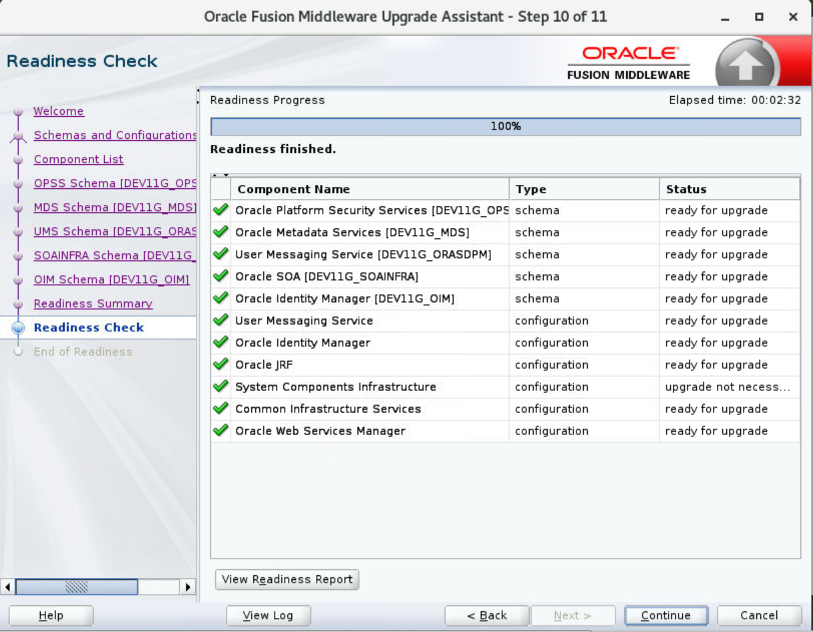
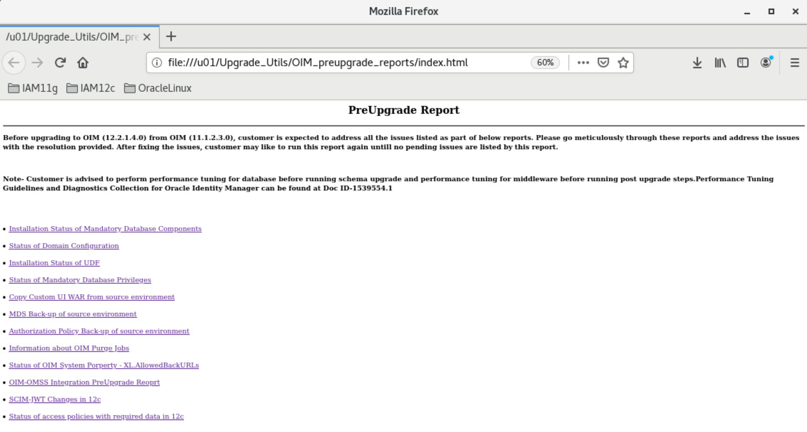

# Pre-Upgrade Requirements

## Introduction

This lab walks you through the pre-upgrade tasks to be performed before upgrading to Oracle Identity Manager 12c such as backing up, cloning your current environment, analyzing Pre-Upgrade Report and verifying that your system meets certified requirements.

*Estimated Lab Time*: 30 minutes

### Objectives

In this lab, you will:
* Create a Non-SYSDBA User to Run the Upgrade Assistant
* Export OPSS Encryption keys
* Run the Upgrade Assistant to perform Pre-Upgrade readiness check

### Prerequisites
This lab assumes you have:
- A Free Tier, Paid or LiveLabs Oracle Cloud account
- You have completed:
    - Lab: Prepare Setup (*Free-tier* and *Paid Tenants* only)
    - Lab: Environment Setup
    - Lab: Initialize Environment

## Task 1: Create a non-SYSDBA user

Oracle recommends that you create a non-SYSDBA user called *FMW* to run the Upgrade Assistant. This user has the privileges required to modify schemas, but does not have full administrator privileges.

1. Login to the database and run the *fmw.sql* script

    ```
    <copy>sqlplus / as sysdba</copy>
    ```
    ```
    SQL> <copy>@/u01/scripts/FMW.sql</copy>
    ```
    ```
    SQL> <copy>exit</copy>
    ```

## Task 2: Export and Copy the OPSS Encryption Keys

Export the OPSS encryption key from the Oracle Identity Manager 11g (11.1.2.3) setup.The following steps are performed to ensure that the encrypted data from 11g (11.1.2.3) OIG is read correctly after the upgrade to 12c (12.2.1.4) OIG. The exported keys will be required by the oneHopUpgrade tool to complete the upgrade process.

1. Navigate to the *<11g_(11.1.2.3_ORACLE_HOME>/oracle_common/common/bin* location

    ```
    <copy>cd /u01/oracle/middleware11g/oracle_common/common/bin</copy>
    ```

2. Launch the *wlst.sh* script
    ```
    <copy>./wlst.sh</copy>
    ```

3. Execute the *exportEncryptionKey* WLST command in the offline mode

    ```
    <copy>exportEncryptionKey('/u01/oracle/middleware11g/user_projects/domains/iam11g_domain/config/fmwconfig/jps-config.xml', '/u01/OPSS_EncryptKey', 'Welcom@123')</copy>
    ```

4. Exit from the WLST
    ```
    <copy>exit ()</copy>      
    ```

    

5. Navigate to the */u01/OPSS_EncryptKey* directory and Verify that the exported encryption key files are created

    ```
    <copy>cd /u01/OPSS_EncryptKey</copy>
    ```
    ```
    <copy>ls -latr</copy>
    ```

6. Copy the .xldatabasekey from the 11g (11.1.2.3) setup location to */u01/OPSS_EncryptKey* directory

    ```
    <copy>cp /u01/oracle/middleware11g/user_projects/domains/iam11g_domain/config/fmwconfig/.xldatabasekey /u01/OPSS_EncryptKey</copy>
    ```

## Task 3: Pre-Upgrade readiness check

1. Run the Upgrade Assistant in readiness mode to perform a pre-upgrade readiness check

    ```
    <copy>cd /u01/oracle/middleware12c/oracle_common/upgrade/bin</copy>
    ```

    ```
    <copy>./ua -readiness</copy>
    ```

    The Upgrade Assistant is launched in readiness mode:

2. Welcome - Click *Next*

    

3. Readiness check type - *Domain based*. Browse to the 11g OIM home: *`/u01/oracle/middleware11g/user_projects/domains/iam11g_domain/`*

    

4. Component List - Click *Next*

    

5. OPSS Schema - Enter the appropriate credentials and click on *Connect* to test the connection to the database

    ```
    DBA Username: <copy>FMW</copy>
    ```
    ```
    DBA Password: <copy>Welcom#123</copy>
    ```

    

6. MDS Schema - The same Username and Password is updated automatically - Click *Next*

    

7. UMS Schema - The same Username and Password is updated automatically - Click *Next*

    

8. SOAINFRA schema - The same Username and Password is updated automatically - Click *Next*

    

9. OIM Schema - The same Username and Password is updated automatically - Click *Next*

    

10. Readiness Summary - Click *Next*

11. Click on *Finish* and then *Close* the UA once the Readiness check is complete

    

## Task 4: Analyzing Pre-Upgrade Report for Oracle Identity Manager (Optional)

1. The pre-upgrade report utility analyzes your existing Oracle Identity Manager environment, and provides information about the mandatory prerequisites that you must complete before you begin the upgrade. It is important to address all of the issues listed in the pre-upgrade report before you proceed with the upgrade, as the upgrade might fail if the issues are not resolved.
Sample Pre-upgrade reports have already been generated as part of this lab. They can be viewed and analyzed at the *`/u01/Upgrade_Utils/OIM_preupgrade_reports`* directory.

    ```
    <copy>cd /u01/Upgrade_Utils/OIM_preupgrade_reports</copy>
    ```

2. Open the *index.html* page and navigate through the different reports to analyze them.

    ```
    <copy>firefox index.html</copy>
    ```

    

## Task 5: Stop 11g servers and processes

Before you run the Upgrade Assistant to upgrade the schemas, you must shut down all the processes and servers in the 11g OIG domain, including the Administration Server, Node Manager (if you have configured Node Manager), and all Managed Servers.

1. Run the *stopDomain11g.sh* script to stop all 11g servers

    ```
    <copy>cd /u01/scripts</copy>
    ```

    ```
    <copy>./stopDomain11g.sh</copy>
    ```

This completes all the pre-upgrade tasks to be performed.

You may now [proceed to the next lab](#next).

## Acknowledgements
* **Author** - Keerti R, Brijith TG, Anuj Tripathi, NATD Solution Engineering
* **Contributors** -  Keerti R, Brijith TG, Anuj Tripathi
* **Last Updated By/Date** - Keerti R, NATD Solution Engineering, June 2021
