# Deploy OIRI in the local Kubernetes node

## Introduction

This lab walks you through the steps required in configuring Oracle Identity Role Intelligence which involves setting up the configuration files, creating the wallet and installing the Helm chart.

*Estimated Lab Time*: 40 minutes

### Objectives

In this lab, you will:
* Load the OIRI docker images
* Set up the Kubernetes configuration files
* Create OIRI and ding Wallets
* Create and Seed the Database schema
* Install the OIRI Helm chart

### Prerequisites
This lab assumes you have:
- A Free Tier, Paid or LiveLabs Oracle Cloud account
- You have completed:
    - Lab: Prepare Setup (*Free-tier* and *Paid Tenants* only)
    - Lab: Environment Setup
    - Lab: Initialize Environment
    - Lab: Deploy Kubernetes Cluster and Start OIG Server

## Task 1: Load the OIRI docker images

The OIRI service comprises of four images as follows:

  - oiri: OIRI service
  - oiri-cli: OIRI command line interface
  - oiri-ding: For data import
  - oiri-ui: Identity Role Intelligence user interface

Follow the steps below to load these docker images.

1. Open a terminal session and load the OIRI docker images.

    ```
    <copy>cd /u01/setup/oiri/oiri-12.2.1.4.210423</copy>
    ```
    ```
    <copy>docker load --input oiri-12.2.1.4.210423.tar</copy>
    ```
    ```
    <copy>docker load --input oiri-ui-12.2.1.4.210423.tar</copy>
    ```
    ```
    <copy>docker load --input oiri-cli-12.2.1.4.210423.tar</copy>
    ```
    ```
    <copy>docker load --input oiri-ding-12.2.1.4.210423.tar</copy>
    ```

    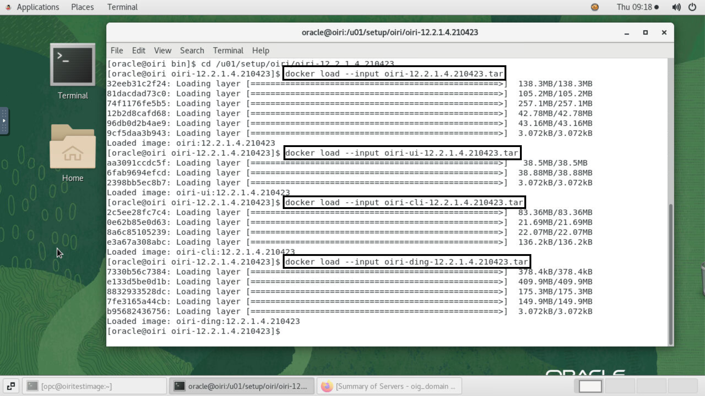


    *Note*:

    You can load the Docker images in any one of the following ways:
    * [Using the OIRI Docker Images from the Shared Zip File](https://docs.oracle.com/en/middleware/idm/identity-role-intelligence/amiri/installing-oracle-identity-role-intelligence.html#GUID-174D3A93-752E-4E5A-AF3F-0648E87BC0F0)
    * [Using the Docker Images from the Container Registry] (https://docs.oracle.com/en/middleware/idm/identity-role-intelligence/amiri/installing-oracle-identity-role-intelligence.html#GUID-B23F0B59-AF19-4C7F-A268-8B6F3B5FC6B0)


2. Verify the images.

    ```
    <copy>docker images | grep 12.2.1.4.210423</copy>
    ```

    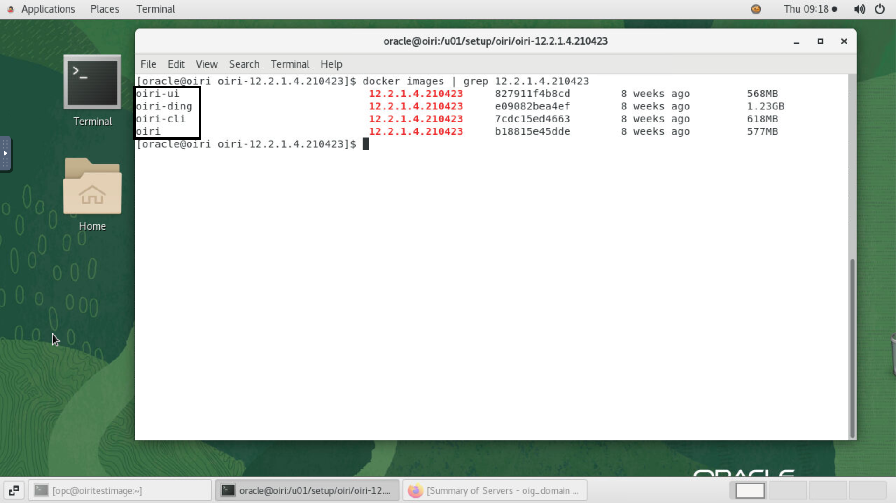

## Task 2: Set up the configuration files

Set up the files required for configuring data import (or data ingestion) and Helm chart.

1. Create the directories on NFS. NFS is a prerequiste and it is used to create persistent volumes for using across the nodes.

    ```
    <copy>mkdir /nfs/ding</copy>
    ```
    ```
    <copy>mkdir /nfs/oiri</copy>
    ```

    Create the following directory for generating the values.yaml file to be used by the Helm chart. This directory need not be present on the NFS because it is used only to store the values.yaml file, which is not required to be shared in the cluster.

    ```
    <copy>mkdir /u01/k8s/</copy>
    ```

    Ensure write permissions on the directories created.

    ```
    <copy>chmod -R 775 /nfs/ding/</copy>
    ```
    ```
    <copy>chmod -R 775 /nfs/oiri/</copy>
    ```
    ```
    <copy>chmod -R 775 /u01/k8s/</copy>
    ```

2. Note down the private IP of your instance as mentioned in the hosts file.

    ```
    <copy>vi /etc/hosts</copy>
    ```
  For example:

    


3. Run *oiri-cli* container.

    ```
    <copy>docker run -d --name oiri-cli \
  -v /nfs/ding/:/app/ \
  -v /nfs/oiri/:/app/oiri \
  -v /u01/k8s/:/app/k8s \
  --group-add 54321 \
  oiri-cli:12.2.1.4.210423 \
  tail -f /dev/null</copy>
    ```

    Notice *--group-add 54321* where, 54321 is the `GROUP_ID`.
    `GROUP_ID` is the ID of the group having access to the volumes.


4. Copy the Kube config content from the Kubernetes cluster. Copy the contents of the */home/oracle/.kube/config* file into a notepad or clipboard. Make sure to zoom out and copy all the lines in the file.

    ```
    <copy>vi /home/oracle/.kube/config</copy>
    ```

    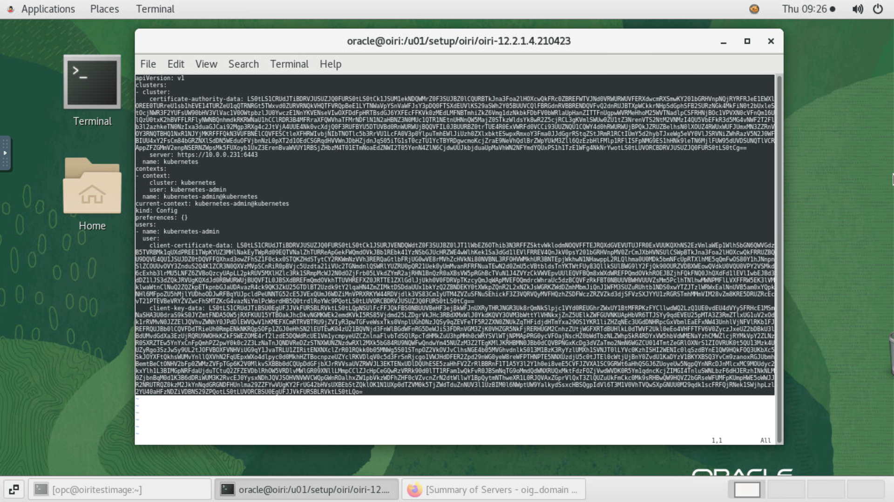

5. Go to *oiri-cli* container.

    ```
    <copy>docker exec -it oiri-cli /bin/bash</copy>
    ```

6. Create the Kube config file. Insert the content copied from the */home/oracle/.kube/config* file and save the file.

    ```
    <copy>vi /app/k8s/config</copy>
    ```

    ```
    <copy>chmod 400 /app/k8s/config</copy>
    ```

    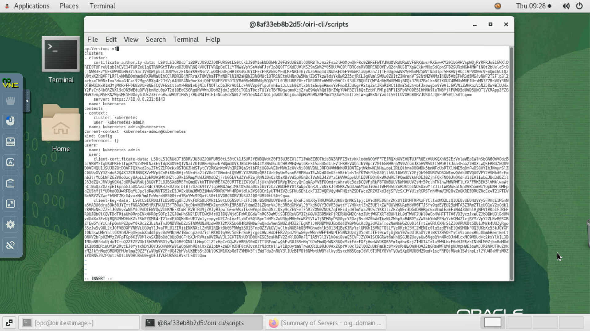


7. Verify the kubectl and helm version. Ensure that the *helm version* and *kubectl version* commands run successfully without any warning or error, and display the version.

    ```
    <copy>kubectl version</copy>
    ```
    ```
    <copy>helm version</copy>
    ```

    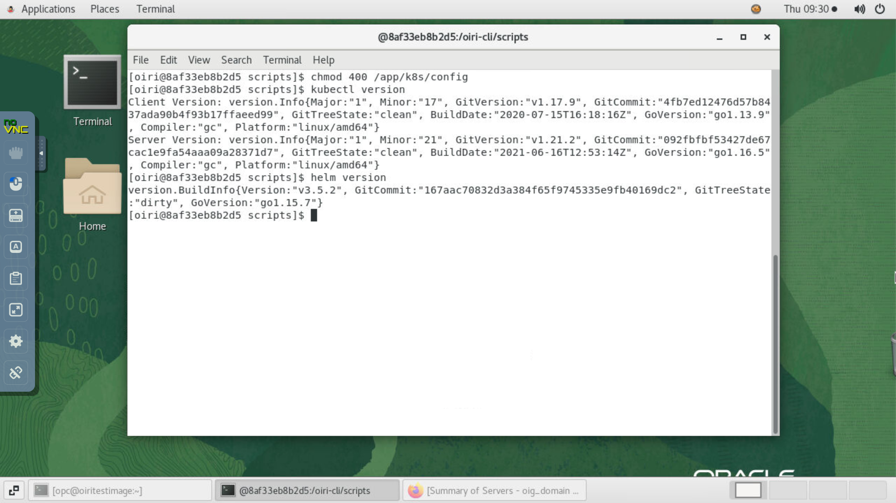


  *Note: If there is an error, it could mean that the Kube config file content is not copied correctly. Copy and paste the kube config file content as per the previous steps 4-6 and try again*

8. Set up configuration files. Replace the `<VM IP>` parameter with the instance private IP address noted from the */etc/hosts* file in step 2.

    ```
    <copy>./setupConfFiles.sh -m prod \
  --oigdbhost <VM IP> \
  --oigdbport 1521 \
  --oigdbsname oiri.livelabs.oraclevcn.com \
  --oiridbhost <VM IP> \
  --oiridbport 1521 \
  --oiridbsname oiri.livelabs.oraclevcn.com \
  --sparkmode k8s \
  --dingnamespace ding \
  --dingimage oiri-ding:12.2.1.4.210423 \
  --k8scertificatefilename ca.crt \
  --sparkk8smasterurl k8s://https://<VM IP>:6443 \
  --oigserverurl http://<VM IP>:14000</copy>
    ```

  For example:

    ```
  ./setupConfFiles.sh -m prod \
  --oigdbhost 10.0.0.231 \
  --oigdbport 1521 \
  --oigdbsname oiri.livelabs.oraclevcn.com \
  --oiridbhost 10.0.0.231 \
  --oiridbport 1521 \
  --oiridbsname oiri.livelabs.oraclevcn.com \
  --sparkmode k8s \
  --dingnamespace ding \
  --dingimage oiri-ding:12.2.1.4.210423 \
  --k8scertificatefilename ca.crt \
  --sparkk8smasterurl k8s://https://10.0.0.231:6443 \
  --oigserverurl http://10.0.0.231:14000
    ```

    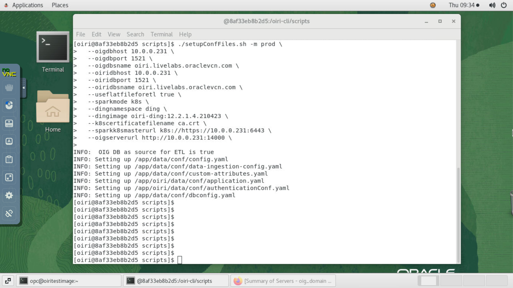

9. Verify that the configuration files have been generated.

    ```
    <copy>ls /app/data/conf/</copy>
    ```
    ```
    <copy>ls /app/oiri/data/conf</copy>
    ```

    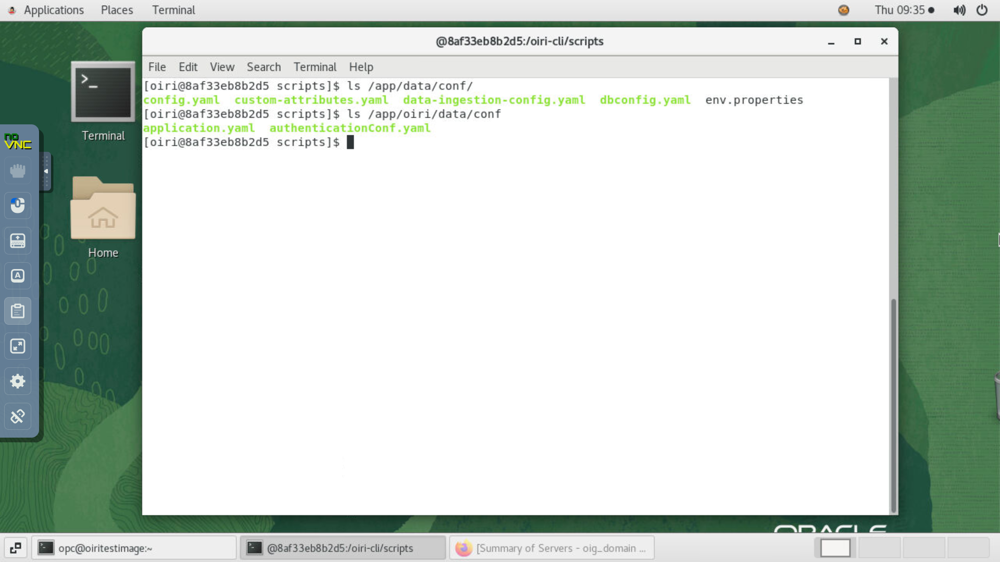

10.	Set up the values.yaml file to be used for Helm chart. Replace the `<VM IP>` parameter with the instance private IP address noted from the */etc/hosts* file in step 2.

    ```
    <copy>./setupValuesYaml.sh \
   --oiriapiimage oiri:12.2.1.4.210423 \
   --oirinfsserver <VM IP> \
   --oirinfsstoragepath /nfs/oiri \
   --oirinfsstoragecapacity 10Gi \
   --oiriuiimage oiri-ui:12.2.1.4.210423 \
   --dingimage oiri-ding:12.2.1.4.210423 \
   --dingnfsserver <VM IP> \
   --dingnfsstoragepath /nfs/ding \
   --dingnfsstoragecapacity 10Gi \
   --ingresshostname oiri \
   --sslsecretname "oiri-tls-cert"</copy>
    ```

  For example:

    ```
  ./setupValuesYaml.sh \
   --oiriapiimage oiri:12.2.1.4.210423 \
   --oirinfsserver 10.0.0.231 \
   --oirinfsstoragepath /nfs/oiri \
   --oirinfsstoragecapacity 10Gi \
   --oiriuiimage oiri-ui:12.2.1.4.210423 \
   --dingimage oiri-ding:12.2.1.4.210423 \
   --dingnfsserver 10.0.0.231 \
   --dingnfsstoragepath /nfs/ding \
   --dingnfsstoragecapacity 10Gi \
   --ingresshostname oiri \
   --sslsecretname "oiri-tls-cert"
    ```

11.	Verify that values.yaml has been generated and exit from the container.

    ```
    <copy>ls /app/k8s/</copy>
    ```
    ```
    <copy>exit</copy>
    ```

    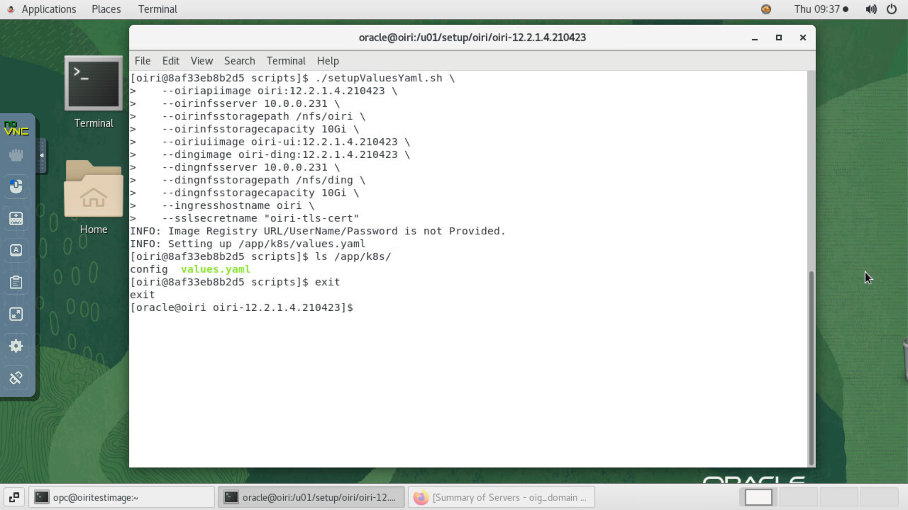


## Task 3: Update entity parameters for data import

1. Run the following command to be able to update entity parameters for data import.

    ```
    <copy>docker run -d --name ding-cli \
  -v /nfs/ding/:/app/ \
  -v /nfs/oiri/:/app/oiri \
  -v /u01/k8s/:/app/k8s \
  oiri-ding:12.2.1.4.210423 \
  tail -f /dev/null</copy>
    ```

## Task 4: Wallet creation

1. Import the OIG certificate in the keystore. To do so, Export OIG certificate for signature verification.

    ```
    <copy>cd /u01/oracle/config/domains/oig_domain/config/fmwconfig/</copy>
    ```
    ```
    <copy>keytool -export -rfc -alias xell -file xell.pem -keystore default-keystore.jks</copy>
    ```

  Enter the keystore password when prompted.
      ```
      Password: <copy>Welcome1</copy>
      ```

  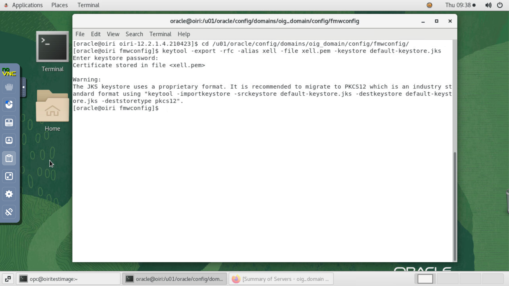

  The *default-keystore.jks* is located at *DOMAIN_HOME/config/fmwconfig*. The certificate you are exporting here protects the OIG REST API. It is not the same as the OIG server certificate.

2. Copy the *xell.pem* file exported from the OIG keystore to the */nfs/oiri/data/keystore/* directory.

    ```
    <copy>sudo cp /u01/oracle/config/domains/oig_domain/config/fmwconfig/xell.pem /nfs/oiri/data/keystore/</copy>
    ```
    ```
    <copy>sudo chown opc:users /nfs/oiri/data/keystore/xell.pem</copy>
    ```
    ```
    <copy>sudo ls -latr /nfs/oiri/data/keystore</copy>
    ```

    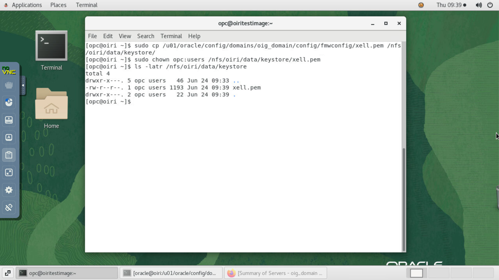


3. Generate a keystore inside the *oiri-cli* container.

    ```
    <copy>docker exec -it oiri-cli /bin/bash</copy>
    ```
    ```
    <copy>keytool -genkeypair \
  -alias oirikey \
  -keypass Welcome1 \
  -keyalg RSA \
  -keystore /app/oiri/data/keystore/keystore.jks \
  -storetype pkcs12 \
  -storepass Welcome1</copy>
    ```

  The output is:

    ```
    What is your first and last name?
    [Unknown]:
    What is the name of your organizational unit?
    [Unknown]:
    What is the name of your organization?
    [Unknown]:
    What is the name of your City or Locality?
    [Unknown]:
    What is the name of your State or Province?
    [Unknown]:
    What is the two-letter country code for this unit?
    [Unknown]:
    Is CN=Unknown, OU=Unknown, O=Unknown, L=Unknown, ST=Unknown, C=Unknown correct?
    [no]:  yes
    ```

    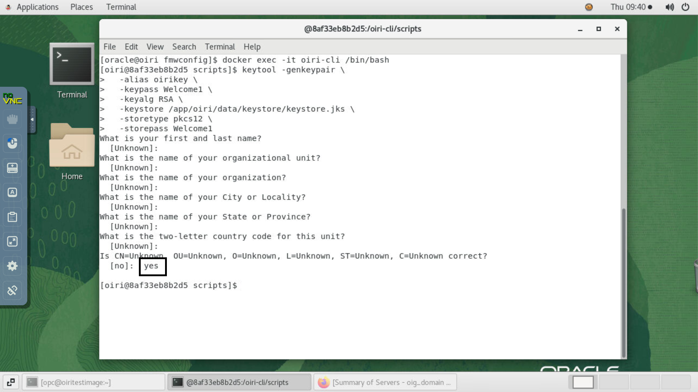

4. Import the certificate into OIRI keystore.

    ```
    <copy>keytool -import \
   -alias xell \
   -file /app/oiri/data/keystore/xell.pem \
   -keystore /app/oiri/data/keystore/keystore.jks</copy>
    ```

    Enter the keystore password when prompted.

    ```
    Password: <copy>Welcome1</copy>
    ```

    The output is:

    ```
    Trust this certificate? [no]: yes
    ```

    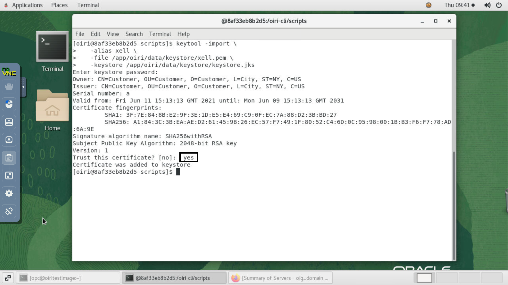

5. Create the wallet.

    ```
    <copy>oiri-cli --config=/app/data/conf/config.yaml wallet create</copy>
    ```

    Enter the following information when prompted:

    - OIRI DB UserName Prefix. Ex: dev,test,prod. Schema name will be <prefix> _OIRI: **DEV**
    - OIRI DB password: **Welcome1**
    - OIG DB UserName: **DEV_OIM**
    - OIG DB password: **Welcome1**
    - OIG Service Account UserName: **xelsysadm**
    - OIG Service Account password: **Welcome1**
    - OIRI KeyStore password: **Welcome1**
    - OIRI JWT Key Alias: **oirikey**
    - OIRI JWT Key password: **Welcome1**

    


6. Verify that the OIRI and Ding wallets have been created.

    ```
    <copy>ls /app/data/wallet</copy>
    ```
    ```
    <copy>ls /app/oiri/data/wallet</copy>
    ```

    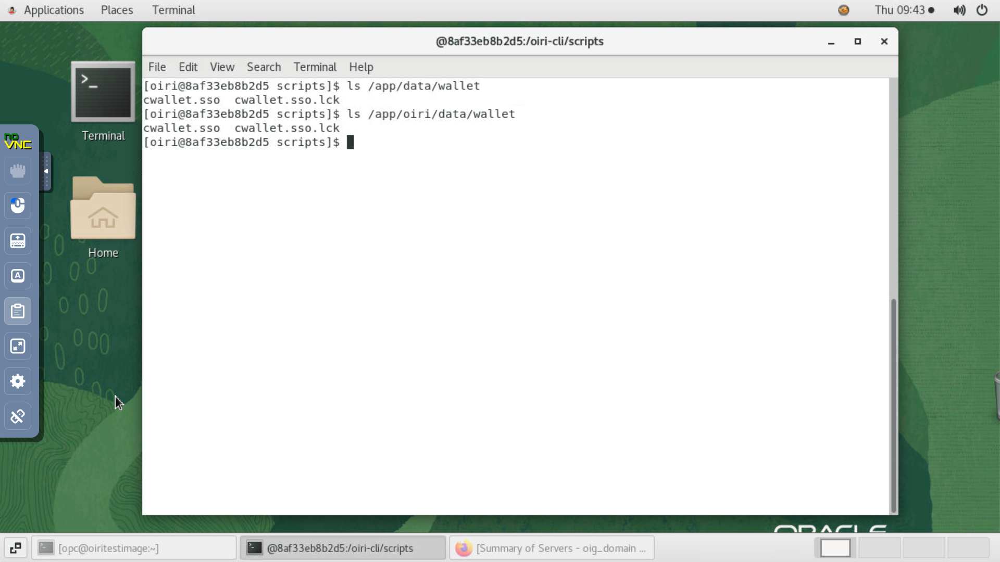


## Task 5: Create and Seed OIRI Database Schema

1. Create the database user schema.

    ```
    <copy>oiri-cli --config=/app/data/conf/config.yaml schema create /app/data/conf/dbconfig.yaml</copy>
    ```
  Enter the SYS User password when prompted.

    ```
    Password: <copy>Welcome1</copy>
    ```

    

2. Seed the database schema.

    ```
    <copy>oiri-cli --config=/app/data/conf/config.yaml schema migrate /app/data/conf/dbconfig.yaml</copy>
    ```

3. Verify the wallet.

    ```
    <copy>./verifyWallet.sh</copy>
    ```

    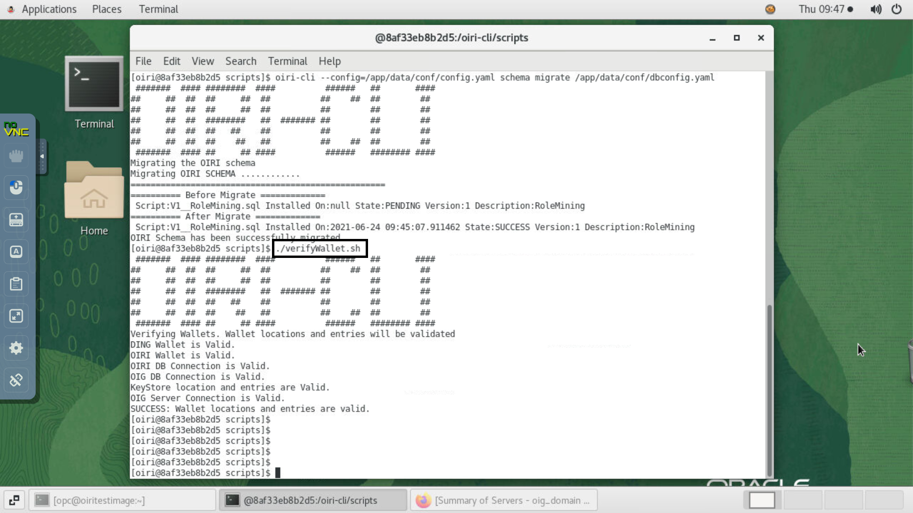

    Note: If the verification of wallet fails, use *oiri-cli --config=/app/data/conf/config.yaml wallet update* command to fix the entry reported having an issue

## Task 6: Install the OIRI Helm chart

1. Create the following namespaces.

    ```
    <copy>kubectl create namespace oiri</copy>
    ```
    ```
    <copy>kubectl create namespace ding</copy>
    ```
    ```
    <copy>exit</copy>
    ```

2. Enable SSL from a Docker container host machine that is outside the oiri-cli container.

    ```
    <copy>cd ~</copy>
    ```
    ```
    <copy>openssl req -x509 -nodes -days 365 -newkey rsa:2048 -keyout tls.key -out tls.crt -subj "/CN=oiri"</copy>
    ```
    ```
    <copy>kubectl create secret tls oiri-tls-cert --key="tls.key" --cert="tls.crt"</copy>
    ```

3. Install the helm chart.

    ```
    <copy>docker exec -it oiri-cli /bin/bash</copy>
    ```
    ```
    <copy>helm install oiri /helm/oiri -f /app/k8s/values.yaml</copy>
    ```

    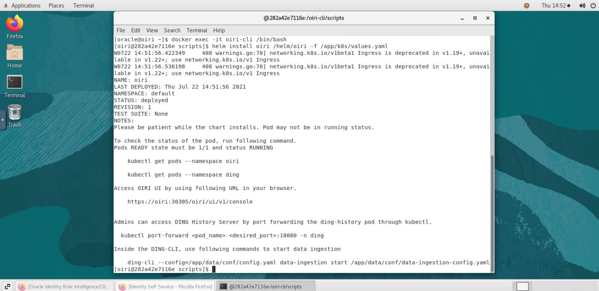

4. List the pods and ensure that all the pods are running. Additionally, check if the pods under the namespace ding and oiri are RUNNING and READY 1/1 state.

    ```
    <copy>kubectl get pods --all-namespaces</copy>
    ```

    ```
    <copy>kubectl get pods -n ding</copy>
    ```

    ```
    <copy>kubectl get pods -n oiri</copy>
    ```

    ```
    <copy>exit</copy>
    ```

    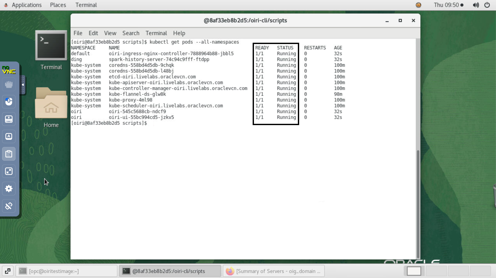

    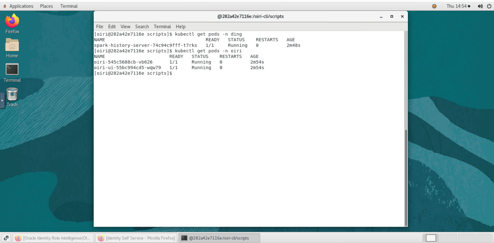


You may now [proceed to the next lab](#next).

## Acknowledgements
* **Author** - Keerti R, Brijith TG, Anuj Tripathi, NATD Solution Engineering
* **Contributors** -  Keerti R, Brijith TG, Anuj Tripathi
* **Last Updated By/Date** - Keerti R, NATD Solution Engineering, June 2021
